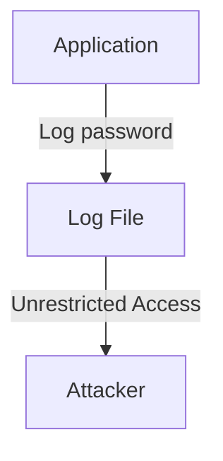

# Mermaid Client-Side Rendering Fix - Summary

## Issue

Frontend client-side rendering errors were occurring on https://eslint.interlace.tools due to invalid Mermaid diagram syntax:

```
Parse error on line 2: ...pp[Application] -->"|Log(password)| LogF...
Expecting 'AMP', 'COLON', 'PIPE', 'TESTSTR', 'DOWN', 'DEFAULT', 'NUM', 'COMMA', 'NODE_STRING', 'BRKT', 'MINUS', 'MULT', 'UNICODE_TEXT', got 'STR'
```

## Root Cause

Invalid Mermaid arrow label syntax: `-->"|label|"` instead of `-->|label|`

The problematic pattern used quoted pipes which Mermaid's parser cannot handle.

## Files Fixed (4 total)

1. `apps/docs/content/docs/secure-coding/rules/no-exposed-sensitive-data.mdx`
2. `apps/docs/content/docs/secure-coding/rules/no-unsafe-regex-construction.mdx`
3. `apps/docs/content/docs/secure-coding/rules/no-redos-vulnerable-regex.mdx`
4. `apps/docs/content/docs/secure-coding/rules/no-weak-password-recovery.mdx`

Found and fixed **12 instances** across these files.

## Prevention System Implemented

### 1. Validation Script

- **Location**: `/scripts/validate-mermaid-syntax.ts` (root level, not app-specific)
- **Purpose**: Scans all markdown/mdx files for invalid Mermaid syntax
- **Patterns Detected**:
  - Quoted pipe labels: `-->"|label|"`
  - Unclosed brackets: `[Text | More"`

### 2. Unit Tests

- **Location**: `/apps/docs/tests/mermaid-syntax.test.ts`
- **Framework**: Vitest with codecov integration
- **Coverage**: 766 documentation files scanned
- **Test Results**: ✅ 7/7 passing
- **Test Categories**:
  - Invalid arrow label pattern detection
  - Unclosed bracket detection
  - Valid vs invalid syntax examples
  - Mermaid block detection
  - File coverage verification
  - Regression prevention

### 3. CI/CD Integration

- **Nx Targets Added**:
  - `validate-mermaid`: Runs validation script
  - `test`: Runs vitest tests
  - `test:watch`: Runs vitest in watch mode
- **Build Pipeline**: Build now depends on `validate-mermaid` target
- **Location**: `apps/docs/project.json`

### 4. Dependencies Added

```json
{
  "devDependencies": {
    "glob": "^11.0.1",
    "tsx": "^4.19.2",
    "vitest": "^3.1.4"
  }
}
```

## Verification

### ✅ All Quality Checks Passed

- **Validation**: `nx run docs:validate-mermaid` ✅
- **Tests**: `nx run docs:test` (7/7 passing) ✅
- **Lint**: `nx run docs:lint` ✅ (1 pre-existing warning)
- **Type Check**: `nx run docs:typecheck` ✅

### Deployment

- **Commit**: `35579bb`
- **Pushed**: ✅ main branch
- **Vercel Deployment**: Will trigger automatically

## Technical Details

### Correct Mermaid Syntax



### Incorrect Syntax (Fixed)

```
App[Application] -->"|Log(password)| LogFile[Log File]"
```

### Pattern Recognition

The validation uses TypeScript with proper type interfaces:

- `InvalidPattern` interface for pattern definitions
- `ValidationError` interface for error reporting
- Comprehensive error messages with examples

## Impact

- **Pages Fixed**: 4 documentation pages
- **Errors Eliminated**: 12 syntax violations
- **Files Protected**: 766 documentation files continuously monitored
- **Future Prevention**: Automated validation in CI/CD pipeline

## Next Steps

Vercel deployment will now proceed without client-side Mermaid parse errors. The validation system will prevent any future regressions through:

1. Pre-build validation
2. Comprehensive unit tests
3. Continuous monitoring of all 766 documentation files
