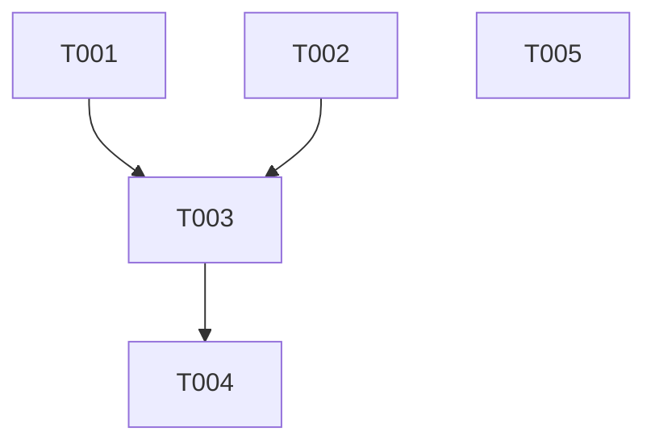

# Breakdown Pipeline Orchestrator

Take a design/plan and decompose it into small, executable tasks.

## Usage

```
/pipeline breakdown: [paste design doc or reference artifact]
```

Or reference a design artifact:

```
/pipeline breakdown: design-oauth-social-login.md
```

---

## Decomposition Rules

### Task Size Guidelines

| Size   | Description                      | Typical Duration |
| ------ | -------------------------------- | ---------------- |
| **XS** | Single file change, <20 lines    | 5-15 min         |
| **S**  | 1-2 files, straightforward logic | 15-30 min        |
| **M**  | 2-4 files, some complexity       | 30-60 min        |
| **L**  | Multiple files, needs research   | 1-2 hours        |

> **Goal**: Break everything into **XS-S** tasks. If a task is **M+**, break it further.

### Dependency Mapping

Identify which tasks can run in parallel:

```
[Task A] ──┬──> [Task C] ──> [Task E]
           │
[Task B] ──┘

[Task D] (independent, can run parallel to all)
```

### Task Structure

Each task should specify:

- **ID**: Unique identifier (e.g., `T001`)
- **Title**: Clear action verb + target
- **Dependencies**: Task IDs that must complete first
- **Files**: Expected files to create/modify
- **Acceptance**: How to verify completion

---

## Output Format

Creates artifact: `tasks-<project-slug>.md`

````markdown
# Task Breakdown: <Project Name>

## Overview

- Total Tasks: X
- Parallelizable: Y
- Sequential: Z
- Estimated Total: N hours

## Dependency Graph


````

## Tasks

### T001: Create database schema for users [XS]

- **Deps**: None (can start immediately)
- **Files**: `migrations/001_users.sql`
- **Accept**: Migration runs successfully

### T002: Add User model [XS]

- **Deps**: None
- **Files**: `src/models/user.ts`
- **Accept**: TypeScript compiles

### T003: Implement user registration endpoint [S]

- **Deps**: T001, T002
- **Files**: `src/routes/auth.ts`, `src/services/user.ts`
- **Accept**: POST /register returns 201

...

## Execution Order

### Wave 1 (Parallel)

- [ ] T001: Create database schema
- [ ] T002: Add User model
- [ ] T005: Setup test fixtures

### Wave 2 (After Wave 1)

- [ ] T003: Implement registration

### Wave 3 (After Wave 2)

- [ ] T004: Add validation

```

---

## Breakdown Strategies

### By Layer
```

Database → Models → Services → Routes → Tests

```

### By Feature Slice
```

Feature A (all layers) → Feature B (all layers)

```

### By Risk
```

High-risk/unknown first → Routine tasks last

```

---

## Example

**Input**:
```

/pipeline breakdown: Add pagination to user list API

````

**Output**:
```markdown
## Tasks

### T001: Add offset/limit params to repository [XS]
- Deps: None
- Files: `src/repositories/user.ts`

### T002: Add pagination types [XS]
- Deps: None
- Files: `src/types/pagination.ts`

### T003: Update route handler [S]
- Deps: T001, T002
- Files: `src/routes/users.ts`

### T004: Add pagination tests [S]
- Deps: T003
- Files: `src/routes/users.test.ts`

## Execution Order
Wave 1: T001, T002 (parallel)
Wave 2: T003
Wave 3: T004
````
