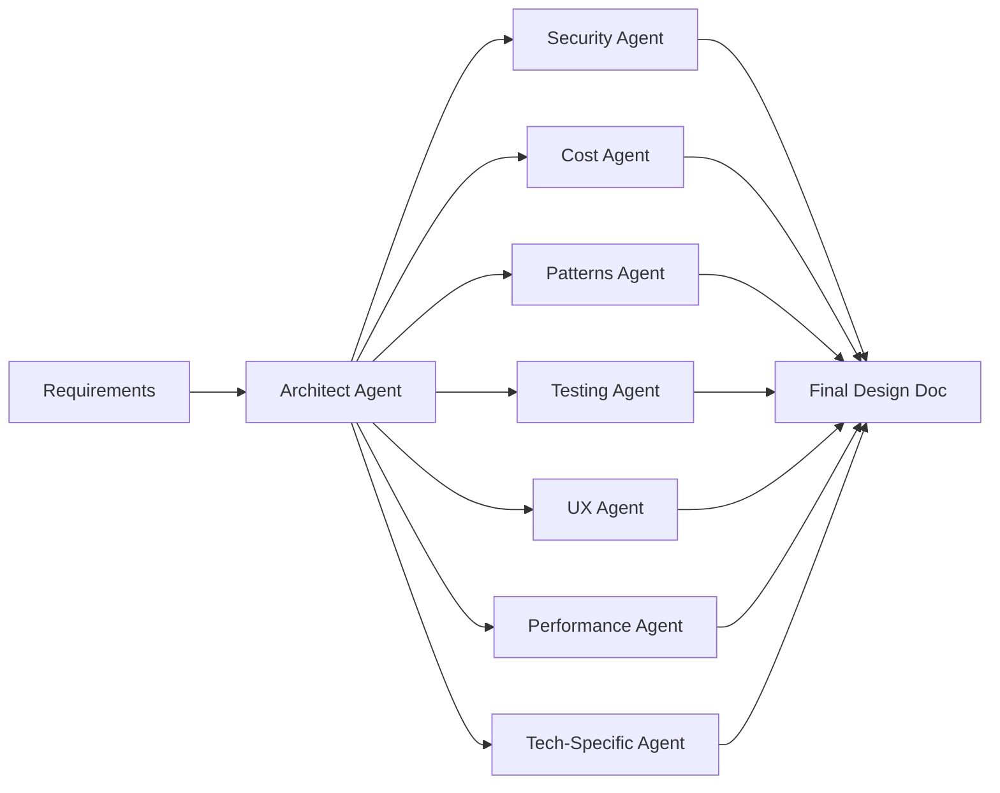

# Design Pipeline Orchestrator

Transform requirements into reviewed technical architecture through multi-agent consultation.

## Usage

```
/pipeline design: Build a real-time notification system for mobile apps
```

## Pipeline Flow



---

## Agent Review Rounds

### Round 1: Architecture Agent

**Focus**: System design, components, data flow

**Outputs**:

- Component diagram
- Data flow diagram
- API contracts
- Technology recommendations

### Round 2: Parallel Specialist Reviews

Each specialist reviews the architecture and provides:

| Agent             | Reviews For                                                                           |
| ----------------- | ------------------------------------------------------------------------------------- |
| **Security**      | Authentication, authorization, data protection, OWASP compliance                      |
| **Cost**          | Infrastructure costs, scaling costs, build vs buy decisions                           |
| **Patterns**      | Design patterns, anti-patterns, maintainability                                       |
| **Testing**       | Testability, test strategy, coverage requirements                                     |
| **UX**            | User flows, performance impact, error handling UX                                     |
| **Performance**   | Algorithmic complexity, caching strategy, query optimization, memory usage            |
| **Tech-Specific** | Domain expertise (e.g., ESLint AST patterns, React best practices, PostgreSQL tuning) |

### Round 3: Synthesis

Combine all feedback into final design document with:

- Approved architecture
- Risk mitigations from each specialist
- Outstanding questions for human review

---

## Output Format

Creates artifact: `design-<task-slug>.md`

```markdown
# Design: <Task Name>

## Requirements Summary

- [User's original requirements]

## Architecture

### Components

- Component A: [description]
- Component B: [description]

### Data Flow

[Mermaid diagram]

## Specialist Reviews

### Security Review

- ✅ [Approved item]
- ⚠️ [Concern with mitigation]
- ❌ [Blocker requiring resolution]

### Cost Review

[Estimates and recommendations]

### Design Patterns Review

[Pattern recommendations]

### Testing Strategy

[Test approach]

### UX Considerations

[User experience notes]

## Open Questions

1. [Question for human review]

## Recommended Next Step

Ready for `/pipeline breakdown:` to create task list
```

---

## Example

**Input**:

```
/pipeline design: Add OAuth2 social login to existing auth system
```

**Agent Sequence**:

1. **Architect**: Designs OAuth2 flow, session management, provider abstraction
2. **Security**: Reviews token storage, PKCE, session hijacking prevention
3. **Cost**: Evaluates provider costs (Google, GitHub), rate limits
4. **Patterns**: Suggests strategy pattern for multi-provider support
5. **Testing**: Plans mock providers, integration test strategy
6. **UX**: Reviews login flow, error messages, loading states
