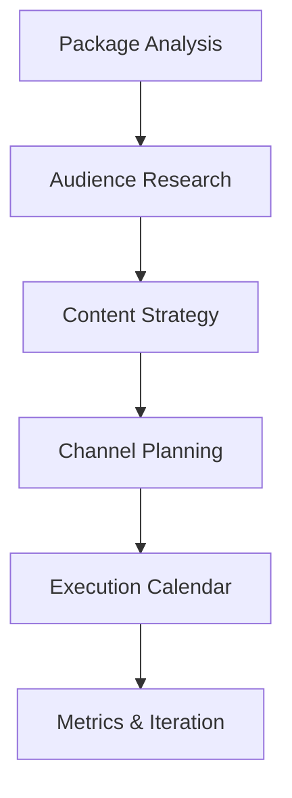

# Distribution Pipeline Orchestrator

Develop and execute marketing strategy to promote your npm packages.

## Usage

```
/pipeline distribute: eslint-plugin-secure-coding
/pipeline distribute: Launch campaign for eslint-plugin-pg v1.0
```

---

## Pipeline Phases



---

## Phase 1: Package Analysis

Understand what makes your package valuable:

| Aspect              | Questions                                      |
| ------------------- | ---------------------------------------------- |
| **Value Prop**      | What problem does it solve? Who benefits most? |
| **Differentiators** | How is it better than alternatives?            |
| **Proof Points**    | Benchmarks, rule counts, coverage stats        |
| **Current State**   | Downloads, stars, existing mentions            |

**For eslint-plugin-secure-coding**:

- 89 rules across 8 OWASP categories
- Full-stack coverage (frontend + backend)
- AI-IDE optimized with `formatLLMMessage`
- Benchmarks: [benchmark/README.md](file:///Users/ofri/repos/ofriperetz.dev/eslint/packages/eslint-plugin-secure-coding/benchmark/README.md)

---

## Phase 2: Audience Segmentation

| Audience               | Pain Point                       | Message                          |
| ---------------------- | -------------------------------- | -------------------------------- |
| **Security Engineers** | Manual code review doesn't scale | "Automate security at lint time" |
| **DevOps/Platform**    | SOC2/compliance evidence         | "Continuous compliance checks"   |
| **Engineering Leads**  | Shift-left security              | "Catch vulns before PR review"   |
| **Solo Developers**    | Don't know security patterns     | "89 rules learned from OWASP"    |

---

## Phase 3: Content Strategy

### Content Types

| Type                    | Platform            | Frequency   | Goal                |
| ----------------------- | ------------------- | ----------- | ------------------- |
| **Technical deep-dive** | DEV.to, Medium      | 2/month     | Establish expertise |
| **Quick tips**          | Twitter/X, LinkedIn | 3/week      | Engagement          |
| **Tutorials**           | YouTube, Blog       | 1/month     | Discoverability     |
| **Changelogs**          | GitHub, npm         | Per release | Retention           |
| **Comparisons**         | Blog                | 1/quarter   | Conversion          |

### Article Ideas

```
/pipeline article: "How to Pass SOC2 Audits with ESLint"
/pipeline article: "89 Security Rules Your Team Isn't Using"
/pipeline article: "Why AI Coding Assistants Need Security Guardrails"
/pipeline article: "ESLint vs SAST: When Static Analysis at Lint Time Wins"
```

---

## Phase 4: Channel Strategy

### Primary Channels

| Channel         | Action                              | Expected Impact |
| --------------- | ----------------------------------- | --------------- |
| **npm**         | Optimize README, keywords           | Discoverability |
| **GitHub**      | Topics, README badges, discussions  | Community       |
| **DEV.to**      | Weekly articles, #security tag      | Traffic         |
| **Reddit**      | r/javascript, r/node, r/netsec      | Awareness       |
| **Twitter/X**   | Thread launches, tip series         | Engagement      |
| **LinkedIn**    | Professional posts, security groups | B2B leads       |
| **Hacker News** | Launch posts, Show HN               | Spike traffic   |

### npm README Optimization

```markdown
<!-- Badges that build trust -->


<!-- Clear value prop in first line -->

> 89 ESLint rules to catch security vulnerabilities before code review
```

---

## Phase 5: Launch Campaigns

### New Package Launch

```
Week -1: Teaser content ("Something's coming")
Day 0:   npm publish + GitHub release + announcement posts
Day 1:   DEV.to article + Reddit posts
Day 2:   Twitter thread with examples
Day 3:   LinkedIn post for B2B
Week 1:  Hacker News "Show HN" post
Week 2:  Follow-up article with early feedback
```

### Major Version Launch

```
Day 0:  Changelog blog post + tweets
Day 1:  Migration guide article
Day 3:  "What's new" video/demo
Week 2: User testimonials roundup
```

---

## Phase 6: Metrics & Iteration

### KPIs to Track

| Metric           | Tool                          | Target        |
| ---------------- | ----------------------------- | ------------- |
| npm downloads    | npm stats                     | +20%/month    |
| GitHub stars     | GitHub                        | +10/week      |
| Article views    | DEV.to analytics              | 1000+/article |
| Referral traffic | GitHub insights               | Track sources |
| Mentions         | Twitter search, Google alerts | Monitor       |

### Feedback Loop

```
Metrics → Insights → Adjust Strategy → Execute → Metrics
```

---

## Quick Actions

### Immediate Wins

// turbo

```bash
# Check current npm stats
npm info eslint-plugin-secure-coding
```

### Content Generation

```
/pipeline article: Write announcement for eslint-plugin-pg launch
/pipeline article: Create comparison vs eslint-plugin-security
```

---

## Package-Specific Assets

### eslint-plugin-secure-coding

- **npm**: https://www.npmjs.com/package/eslint-plugin-secure-coding
- **GitHub**: (your repo)
- **Key stats**: 89 rules, 8 OWASP categories
- **Benchmark**: [results](file:///Users/ofri/repos/ofriperetz.dev/eslint/packages/eslint-plugin-secure-coding/benchmark/README.md)

### eslint-plugin-pg

- **npm**: https://www.npmjs.com/package/eslint-plugin-pg
- **Key stats**: 13 rules for PostgreSQL security
- **Benchmark**: [results](file:///Users/ofri/repos/ofriperetz.dev/eslint/packages/eslint-plugin-pg/benchmark/README.md)

### eslint-plugin-vercel-ai-security

- **npm**: https://www.npmjs.com/package/eslint-plugin-vercel-ai-security
- **Key stats**: AI/LLM security rules
