# Execute Pipeline Orchestrator

Execute a series of tasks from a breakdown, optimizing for parallelism.

## Usage

```
/pipeline execute: tasks-oauth-social-login.md
```

Or specify a wave:

```
/pipeline execute: tasks-oauth-social-login.md wave:2
```

---

## Execution Strategy

### Wave-Based Execution

```
┌─────────────────────────────────────────────────────┐
│ Wave 1: Independent tasks (parallel)                │
│ ┌─────────┐ ┌─────────┐ ┌─────────┐                │
│ │  T001   │ │  T002   │ │  T005   │                │
│ └─────────┘ └─────────┘ └─────────┘                │
└─────────────────────────────────────────────────────┘
                      ↓
┌─────────────────────────────────────────────────────┐
│ Wave 2: Next tier (after deps satisfied)           │
│ ┌─────────┐ ┌─────────┐                            │
│ │  T003   │ │  T006   │                            │
│ └─────────┘ └─────────┘                            │
└─────────────────────────────────────────────────────┘
                      ↓
┌─────────────────────────────────────────────────────┐
│ Wave 3: Final tasks                                │
│ ┌─────────┐                                        │
│ │  T004   │                                        │
│ └─────────┘                                        │
└─────────────────────────────────────────────────────┘
```

### Parallel Execution Rules

1. **File Conflict Detection**: Don't parallelize tasks that modify the same file
2. **Dependency Respect**: Wait for all deps before starting
3. **Failure Handling**: If a task fails, skip dependent tasks
4. **Progress Tracking**: Update task status in real-time

---

## Execution Modes

### Mode: `sequential` (default for safety)

Execute one task at a time, in dependency order.

```
/pipeline execute: tasks.md mode:sequential
```

### Mode: `parallel`

Execute independent tasks simultaneously using parallel tool calls.

```
/pipeline execute: tasks.md mode:parallel
```

### Mode: `wave`

Execute one wave, stop for review, continue.

```
/pipeline execute: tasks.md mode:wave
```

---

## Task Execution Flow

For each task:

```mermaid
graph TD
    A[Read Task Spec] --> B{Dependencies Met?}
    B -->|No| C[Wait/Skip]
    B -->|Yes| D[Execute Task]
    D --> E{Success?}
    E -->|Yes| F[Mark Complete ✅]
    E -->|No| G[Mark Failed ❌]
    F --> H[Update Progress]
    G --> H
    H --> I[Next Task]
```



### Per-Task Actions

1. **Read** task specification
2. **Verify** dependencies completed
3. **Execute** implementation
   - Create/modify files
   - Run commands if needed
4. **Validate** acceptance criteria
   - Run tests
   - Check build
5. **Update** task status

---

## Progress Tracking

Updates the task artifact in real-time:

```markdown
## Tasks

### T001: Create database schema [XS] ✅

- Status: Complete
- Duration: 3 min
- Files modified: `migrations/001_users.sql`

### T002: Add User model [XS] ✅

- Status: Complete
- Duration: 5 min
- Files modified: `src/models/user.ts`

### T003: Implement registration [S] 🔄

- Status: In Progress
- Started: 14:23

### T004: Add validation [S] ⏳

- Status: Waiting on T003
```

---

## Verification After Each Wave

After completing a wave:

// turbo

```bash
npm run lint
npm run test
npm run build
```

If any fail, stop and report before continuing.

---

## Example Session

```
/pipeline execute: tasks-pagination.md

Executing Wave 1 (2 tasks parallel):
  ✅ T001: Add offset/limit params (2 min)
  ✅ T002: Add pagination types (1 min)

Running wave verification... ✅ All tests pass

Executing Wave 2:
  🔄 T003: Update route handler (in progress)
```
