# Orchestrator Pipeline

**End-to-end autonomous execution**: Takes any prompt from design through task breakdown to execution.

## Usage

```
/pipeline orchestrate: Build a notification system with WebSocket support
/pipeline orchestrate: Add rate limiting to the API endpoints
/pipeline orchestrate: Refactor the auth module to use JWT
```

---

## Pipeline Flow

```mermaid
graph TD
    P[User Prompt] --> D[Design Phase]
    D --> R{Review?}
    R -->|Approved| B[Breakdown Phase]
    R -->|Changes| D
    B --> E[Execute Phase]
    E --> V[Verification]
    V -->|Pass| C[Complete ✅]
    V -->|Fail| F[Fix & Retry]
```



---

## Three-Phase Automation

### Phase 1: Design

Automatically runs the full [design-pipeline](file:///Users/ofri/repos/ofriperetz.dev/eslint/.agent/orchestrators/design-pipeline.md):

- Architect agent creates system design
- 7 specialist agents review in parallel
- Synthesizes into `design-<slug>.md`

**Checkpoint**: Pauses for user approval before proceeding.

---

### Phase 2: Breakdown

After design approval, runs [breakdown-pipeline](file:///Users/ofri/repos/ofriperetz.dev/eslint/.agent/orchestrators/breakdown-pipeline.md):

- Decomposes design into XS-S tasks
- Maps dependencies
- Groups into parallel waves
- Creates `tasks-<slug>.md`

**Checkpoint**: Pauses for task review before execution.

---

### Phase 3: Execute

Runs [execute-pipeline](file:///Users/ofri/repos/ofriperetz.dev/eslint/.agent/orchestrators/execute-pipeline.md):

- Executes tasks wave-by-wave
- Validates after each wave
- Tracks progress in real-time

---

## Execution Modes

| Mode       | Behavior                                        | Use When              |
| ---------- | ----------------------------------------------- | --------------------- |
| `full`     | Design → Breakdown → Execute (with checkpoints) | Default, recommended  |
| `auto`     | Minimal checkpoints, maximum autonomy           | Trusted routine tasks |
| `stepwise` | Pause after every wave                          | Learning new codebase |

```
/pipeline orchestrate: Add caching layer          # full mode (default)
/pipeline orchestrate: Fix typo in docs auto      # auto mode
/pipeline orchestrate: Migrate database stepwise  # stepwise mode
```

---

## Checkpoints

Orchestrator pauses at key decision points:

| Checkpoint          | When                      | Action                                          |
| ------------------- | ------------------------- | ----------------------------------------------- |
| **Design Review**   | After design synthesis    | Review architecture, approve or request changes |
| **Task Review**     | After breakdown           | Verify task granularity and dependencies        |
| **Wave Completion** | After each execution wave | Verify progress, approve next wave              |

---

## Output Artifacts

The orchestrator creates a chain of artifacts:

```
artifacts/
├── design-<slug>.md      # Phase 1 output
├── tasks-<slug>.md       # Phase 2 output
└── walkthrough-<slug>.md # Phase 3 output (verification proof)
```

---

## Example Session

**Input**:

```
/pipeline orchestrate: Add OAuth2 login with Google and GitHub providers
```

**Orchestrator Flow**:

```
📋 Starting Orchestrator Pipeline
   Task: OAuth2 login with Google and GitHub

──────────────────────────────────────────────

🎨 PHASE 1: DESIGN
   Running multi-agent architectural review...

   ✅ Architect: Designed OAuth2 flow with provider abstraction
   ✅ Security: PKCE, token storage recommendations
   ✅ Cost: Provider pricing comparison
   ✅ Patterns: Strategy pattern for multi-provider
   ✅ Testing: Mock provider strategy
   ✅ UX: Login flow wireframes

   📄 Created: design-oauth2-login.md

   ⏸️  CHECKPOINT: Please review the design
   [Approve to continue / Request changes]

──────────────────────────────────────────────

📝 PHASE 2: BREAKDOWN
   Decomposing design into tasks...

   Generated 8 tasks in 3 waves:
   - Wave 1: 3 tasks (parallel)
   - Wave 2: 3 tasks (after deps)
   - Wave 3: 2 tasks (final)

   📄 Created: tasks-oauth2-login.md

   ⏸️  CHECKPOINT: Please review task breakdown
   [Approve to execute / Adjust tasks]

──────────────────────────────────────────────

⚡ PHASE 3: EXECUTE

   Wave 1 (parallel):
   ✅ T001: Add OAuth types (2 min)
   ✅ T002: Create provider interface (3 min)
   ✅ T003: Setup test fixtures (2 min)

   🔍 Verification: ✅ Tests pass, ✅ Build OK

   Wave 2:
   ✅ T004: Implement Google provider (5 min)
   ✅ T005: Implement GitHub provider (5 min)
   ✅ T006: Add session management (4 min)

   🔍 Verification: ✅ Tests pass, ✅ Build OK

   Wave 3:
   ✅ T007: Add login routes (3 min)
   ✅ T008: Integration tests (4 min)

   🔍 Verification: ✅ All tests pass, ✅ Build OK

──────────────────────────────────────────────

✅ COMPLETE

   Total time: 28 min
   Tasks completed: 8/8
   Artifacts created:
   - design-oauth2-login.md
   - tasks-oauth2-login.md
   - walkthrough-oauth2-login.md
```

---

## Quick Start

```
# Simple feature
/pipeline orchestrate: Add dark mode toggle

# Complex system
/pipeline orchestrate: Build real-time collaboration with WebSocket

# Migration
/pipeline orchestrate: Migrate from REST to GraphQL

# Refactor
/pipeline orchestrate: Refactor authentication to use Passport.js
```

---

## Comparison with Individual Pipelines

| Approach                 | When to Use                                      |
| ------------------------ | ------------------------------------------------ |
| `/pipeline orchestrate:` | End-to-end automated flow with checkpoints       |
| `/pipeline design:`      | Just need design review, will implement manually |
| `/pipeline breakdown:`   | Have a design, need task decomposition           |
| `/pipeline execute:`     | Have tasks, just need execution                  |
