# Interlace ESLint Plugin Classification Graph

> **Authoritative reference for plugin scope boundaries, rule placement logic, and publication status.**

---

## 🗺️ Plugin Ecosystem Overview

```mermaid
graph TB
    subgraph "🔐 SECURITY SUITE"
        direction TB
        SC["🎯 secure-coding<br/>(28 rules)<br/>✅ PUBLISHED"]
        NS["🖥️ node-security<br/>(36 rules)<br/>✅ PUBLISHED"]
        BS["🌐 browser-security<br/>(45 rules)<br/>✅ PUBLISHED"]
        JWT["🔑 jwt<br/>(13 rules)<br/>✅ PUBLISHED"]
        AI["🤖 vercel-ai-security<br/>(19 rules)<br/>✅ PUBLISHED"]
        LS["⚡ lambda-security<br/>(14 rules)<br/>✅ PUBLISHED"]
        ES["🚂 express-security<br/>(10 rules)<br/>✅ PUBLISHED"]
        NJS["🦅 nestjs-security<br/>(6 rules)<br/>✅ PUBLISHED"]
        MDB["🍃 mongodb-security<br/>(16 rules)<br/>✅ PUBLISHED"]
        PG["🐘 pg<br/>(13 rules)<br/>✅ PUBLISHED"]
    end

    subgraph "🏗️ QUALITY & GOVERNANCE SUITE"
        direction TB
        MOD["📐 modularity<br/>(5 rules)<br/>🚧 NOT PUBLISHED"]
        MODERN["🚀 modernization<br/>(3 rules)<br/>🚧 NOT PUBLISHED"]
        MA["🧹 maintainability<br/>(8 rules)<br/>✅ PUBLISHED"]
        RE["🛡️ reliability<br/>(8 rules)<br/>✅ PUBLISHED"]
        OP["⚙️ operability<br/>(6 rules)<br/>✅ PUBLISHED"]
        CO["📋 conventions<br/>(9 rules)<br/>✅ PUBLISHED"]
        IN["📦 import-next<br/>(56 rules)<br/>✅ PUBLISHED"]
        RF["⚛️ react-features<br/>(90 rules)<br/>✅ PUBLISHED"]
        RA["♿ react-a11y<br/>(37 rules)<br/>✅ PUBLISHED"]
    end

    subgraph "⚠️ DEPRECATED"
        direction TB
        CR["💀 crypto<br/>(24 rules)<br/>⛔ DEPRECATED"]
    end

    CR -.->|"18 rules"| NS
    CR -.->|"1 rule"| BS
    CR -.->|"5 rules"| SC

    style CR fill:#ff6b6b,stroke:#c92a2a
    style MOD fill:#ffd43b,stroke:#fab005
    style MODERN fill:#ffd43b,stroke:#fab005
```

---

## 📊 Publication Status Matrix

| Plugin                         | NPM Package                        |        Status        |     Rule Count     |
| :----------------------------- | :--------------------------------- | :------------------: | :----------------: |
| **Security Suite**             |                                    |                      |                    |
| `secure-coding`                | `eslint-plugin-secure-coding`      |     ✅ Published     |         28         |
| `node-security`                | `eslint-plugin-node-security`      |     ✅ Published     |         36         |
| `browser-security`             | `eslint-plugin-browser-security`   |     ✅ Published     |         45         |
| `jwt`                          | `eslint-plugin-jwt`                |     ✅ Published     |         13         |
| `vercel-ai-security`           | `eslint-plugin-vercel-ai-security` |     ✅ Published     |         19         |
| `lambda-security`              | `eslint-plugin-lambda-security`    |     ✅ Published     |         14         |
| `express-security`             | `eslint-plugin-express-security`   |     ✅ Published     |         10         |
| `nestjs-security`              | `eslint-plugin-nestjs-security`    |     ✅ Published     |         6          |
| `mongodb-security`             | `eslint-plugin-mongodb-security`   |     ✅ Published     |         16         |
| `pg`                           | `eslint-plugin-pg`                 |     ✅ Published     |         13         |
| **Quality & Governance Suite** |                                    |                      |                    |
| `maintainability`              | `eslint-plugin-maintainability`    |     ✅ Published     |         8          |
| `reliability`                  | `eslint-plugin-reliability`        |     ✅ Published     |         8          |
| `operability`                  | `eslint-plugin-operability`        |     ✅ Published     |         6          |
| `conventions`                  | `eslint-plugin-conventions`        |     ✅ Published     |         9          |
| `import-next`                  | `eslint-plugin-import-next`        |     ✅ Published     |         56         |
| `react-features`               | `eslint-plugin-react-features`     |     ✅ Published     |         90         |
| `react-a11y`                   | `eslint-plugin-react-a11y`         |     ✅ Published     |         37         |
| `modularity`                   | _(internal only)_                  | 🚧 **Not Published** |         5          |
| `modernization`                | _(internal only)_                  | 🚧 **Not Published** |         3          |
| **Deprecated**                 |                                    |                      |                    |
| `crypto`                       | `eslint-plugin-crypto`             |  ⛔ **Deprecated**   | 24 → Redistributed |

> **Note**: Only internal packages like `@interlace/eslint-devkit` use the `@interlace` scope. All published plugins use unscoped package names for simplicity.

---

## 🎯 Rule Placement Decision Tree

```mermaid
flowchart TD
    START[/"🆕 New Rule"/] --> FW{{"Is it<br/>Framework-Specific?"}}

    FW -->|"React UI"| RF["⚛️ react-features"]
    FW -->|"React A11y"| RA["♿ react-a11y"]
    FW -->|"Express"| ES["🚂 express-security"]
    FW -->|"NestJS"| NJS["🦅 nestjs-security"]
    FW -->|"No"| DOM{{"Is it<br/>Domain-Specific?"}}

    DOM -->|"JWT/Auth Tokens"| JWT["🔑 jwt"]
    DOM -->|"MongoDB"| MDB["🍃 mongodb-security"]
    DOM -->|"PostgreSQL"| PG["🐘 pg"]
    DOM -->|"AI/LLM"| AI["🤖 vercel-ai-security"]
    DOM -->|"No"| ENV{{"Which Host<br/>Environment?"}}

    ENV -->|"fs, child_process,<br/>node:crypto"| NS["🖥️ node-security"]
    ENV -->|"window, document,<br/>Web Crypto API"| BS["🌐 browser-security"]
    ENV -->|"Lambda, IAM,<br/>API Gateway"| LS["⚡ lambda-security"]
    ENV -->|"Universal/Any"| PURE{{"Is it a<br/>Security Flaw?"}}

    PURE -->|"Yes: Injection,<br/>Logic, Credentials"| SC["🎯 secure-coding"]
    PURE -->|"No"| QUAL{{"What Quality<br/>Dimension?"}}

    QUAL -->|"Design Patterns,<br/>DDD, Isolation"| MOD["📐 modularity"]
    QUAL -->|"ES2022+ Adoption,<br/>Modern Syntax"| MODERN["🚀 modernization"]
    QUAL -->|"Complexity,<br/>Clean Code"| MA["🧹 maintainability"]
    QUAL -->|"Error Handling,<br/>Type Safety"| RE["🛡️ reliability"]
    QUAL -->|"Prod Readiness,<br/>Resource Limits"| OP["⚙️ operability"]
    QUAL -->|"Naming, Styles,<br/>Team Habits"| CO["📋 conventions"]
    QUAL -->|"Import Paths,<br/>Circularity, ESM"| IN["📦 import-next"]

    style RF fill:#61dafb,stroke:#21a0c9
    style RA fill:#9b59b6,stroke:#8e44ad
    style SC fill:#e74c3c,stroke:#c0392b
    style NS fill:#27ae60,stroke:#1e8449
    style BS fill:#3498db,stroke:#2980b9
    style JWT fill:#f39c12,stroke:#d68910
    style MOD fill:#ffd43b,stroke:#fab005
    style MODERN fill:#ffd43b,stroke:#fab005
```

---

## 🔒 Security Suite Scope Definitions

### 🎯 `secure-coding` (Pure Logic)

**Scope**: Platform-agnostic security flaws that affect ANY JavaScript environment (Node, Browser, Bun, Deno).

| ✅ SHOULD Contain         | ❌ Should NOT Contain             |
| :------------------------ | :-------------------------------- |
| Object Injection          | Environment APIs (`fs`, `window`) |
| ReDoS (Regex DoS)         | Framework-specific patterns       |
| Hardcoded Credentials     | UI/DOM manipulation               |
| XPath/GraphQL Injection   | Protocol-level security           |
| Weak PRNG (`Math.random`) | Database queries                  |
| Hardcoded Crypto Keys     |                                   |

#### 🚫 Anti-Pattern Examples (Rules That Do NOT Belong)

| ❌ Rule Concept           | Why It Does NOT Belong                                                                                                                                                       | Correct Plugin                                      |
| :------------------------ | :--------------------------------------------------------------------------------------------------------------------------------------------------------------------------- | :-------------------------------------------------- |
| `prevent-sql-injection`   | Cannot know which DB/driver (pg, mysql2, better-sqlite3) the consumer uses. We can't detect SQL without knowing the query API surface.                                       | `pg`, `mongodb-security`, or new DB-specific plugin |
| `prevent-nosql-injection` | MongoDB/Mongoose-specific syntax. We can't generically detect NoSQL without Mongoose AST patterns.                                                                           | `mongodb-security`                                  |
| `no-fs-write`             | Requires `fs` module detection — Node.js specific.                                                                                                                           | `node-security`                                     |
| `no-eval`                 | While `eval` is universal, XSS via `eval` is browser context, and `eval` for code loading is Node context. We handle `detect-eval-with-expression` for pure logic injection. | Browser: `browser-security`, Node: `node-security`  |
| `no-dom-xss`              | `innerHTML`, `document.write` are browser DOM APIs.                                                                                                                          | `browser-security`                                  |
| `require-helmet`          | Express.js framework-specific middleware.                                                                                                                                    | `express-security`                                  |

**The Litmus Test**: _"Would this rule fire correctly in a CLI tool, a React app, AND a NestJS server without false positives?"_ If **NO**, it doesn't belong in `secure-coding`.

---

### 🖥️ `node-security` (Server Runtime)

**Scope**: Node.js-specific APIs, file system, process control, and `node:crypto`.

| ✅ SHOULD Contain        | ❌ Should NOT Contain                  |
| :----------------------- | :------------------------------------- |
| `fs` module security     | Browser/DOM APIs                       |
| `child_process` safety   | React/Frontend code                    |
| `node:crypto` hardening  | Web Crypto API                         |
| Path traversal           | AWS Lambda-specific patterns           |
| Supply chain (lockfiles) | Framework middleware (Express, NestJS) |
| Dynamic `require()`      | Database-specific queries              |

#### 🚫 Anti-Pattern Examples (Rules That Do NOT Belong)

| ❌ Rule Concept          | Why It Does NOT Belong                                                                                 | Correct Plugin     |
| :----------------------- | :----------------------------------------------------------------------------------------------------- | :----------------- |
| `no-mongoose-injection`  | MongoDB/Mongoose-specific. Node-security is runtime-generic, not library-specific.                     | `mongodb-security` |
| `require-express-helmet` | Express.js framework-specific. Node runs many frameworks.                                              | `express-security` |
| `require-nestjs-guard`   | NestJS framework-specific.                                                                             | `nestjs-security`  |
| `no-window-access`       | `window` is browser-only. If this appears in Node code, it's a platform mismatch, not a security flaw. | `browser-security` |
| `no-lambda-env-secrets`  | Lambda has specific secret injection patterns tied to AWS SDK.                                         | `lambda-security`  |
| `no-web-crypto-export`   | Web Crypto API (`window.crypto.subtle`) is browser-only.                                               | `browser-security` |

**The Litmus Test**: _"Does this rule require detecting `fs`, `child_process`, `path`, `crypto`, or `process` module usage?"_ If **NO**, it probably doesn't belong in `node-security`.

#### ⚙️ Technical Requirements

| Requirement                     | Description                                                                                                                                                                                                                                          |
| :------------------------------ | :--------------------------------------------------------------------------------------------------------------------------------------------------------------------------------------------------------------------------------------------------- |
| **Node Protocol Compatibility** | All rules MUST detect both `node:` protocol and non-protocol imports. E.g., both `import fs from 'node:fs'` AND `import fs from 'fs'` must be detected. This ensures compatibility across Node.js versions (protocol introduced in Node 14.18/16.0). |
| **Module Detection Pattern**    | Rules should check for: `require('fs')`, `require('node:fs')`, `import ... from 'fs'`, `import ... from 'node:fs'`                                                                                                                                   |

**Crypto Rules Absorbed**: 18 rules from deprecated `crypto` plugin for `node:crypto` hardening.

---

### 🌐 `browser-security` (Web Client)

**Scope**: Browser-specific security: XSS, CORS, CSP, Web APIs.

| ✅ SHOULD Contain                              | ❌ Should NOT Contain                |
| :--------------------------------------------- | :----------------------------------- |
| XSS prevention (`innerHTML`, `document.write`) | Server file manipulation             |
| CORS misconfiguration                          | Node.js APIs (`fs`, `child_process`) |
| CSP headers                                    | Backend crypto (`node:crypto`)       |
| `localStorage`/`sessionStorage` leaks          | Database queries                     |
| `postMessage` origin validation                | Express/NestJS middleware            |
| Web Crypto API (`window.crypto`)               | JWT token logic (library-specific)   |

#### 🚫 Anti-Pattern Examples (Rules That Do NOT Belong)

| ❌ Rule Concept            | Why It Does NOT Belong                                                                                 | Correct Plugin                       |
| :------------------------- | :----------------------------------------------------------------------------------------------------- | :----------------------------------- |
| `no-path-traversal`        | `path.join` and file path attacks are Node.js runtime concerns.                                        | `node-security`                      |
| `no-child-process-exec`    | `child_process` is Node.js-only.                                                                       | `node-security`                      |
| `require-jwt-verification` | JWT library-specific (`jsonwebtoken`, `jose`). Browser may decode JWTs but rarely verifies signatures. | `jwt`                                |
| `no-react-dangerously-set` | React framework-specific. Browser-security is framework-agnostic.                                      | `react-a11y` or new `react-security` |
| `require-express-cors`     | Express.js middleware.                                                                                 | `express-security`                   |
| `no-hardcoded-api-key`     | Universal logic flaw (could be Node CLI or browser).                                                   | `secure-coding`                      |

**The Litmus Test**: _"Does this rule require detecting browser globals (`window`, `document`, `navigator`, `fetch` to external origins)?"_ If **NO**, it doesn't belong in `browser-security`.

**Crypto Rules Absorbed**: 1 rule (`no-web-crypto-export`) from deprecated `crypto` plugin.

---

### ⚡ `lambda-security` (Serverless)

**Scope**: AWS Lambda, API Gateway, serverless-specific patterns.

| ✅ SHOULD Contain                          | ❌ Should NOT Contain        |
| :----------------------------------------- | :--------------------------- |
| IAM permission validation                  | Express middleware patterns  |
| API Gateway event validation               | Long-running server concerns |
| Lambda-specific CORS                       | Database connection pooling  |
| Execution log security (PII in CloudWatch) | Frontend/browser code        |
| Handler timeout validation                 | Generic Node.js file system  |
| Environment variable security              |                              |

#### 🚫 Anti-Pattern Examples (Rules That Do NOT Belong)

| ❌ Rule Concept           | Why It Does NOT Belong                                                          | Correct Plugin           |
| :------------------------ | :------------------------------------------------------------------------------ | :----------------------- |
| `require-helmet`          | Lambda doesn't use Express middleware directly; API Gateway handles headers.    | `express-security`       |
| `no-fs-write`             | Lambda has ephemeral `/tmp`, but this is generic Node.js concern.               | `node-security`          |
| `require-connection-pool` | Lambda handlers are invocation-scoped; connection pooling is database-specific. | `pg`, `mongodb-security` |
| `no-console-log`          | Generic operability concern, not Lambda-specific.                               | `operability`            |
| `no-long-timeout`         | Lambda has max 15min timeout, but timeout configuration is generic.             | `operability`            |

**The Litmus Test**: _"Does this rule specifically involve AWS Lambda handler signatures, API Gateway event objects, or CloudWatch/IAM patterns?"_ If **NO**, it doesn't belong in `lambda-security`.

---

### 🔑 `jwt` (Authentication Tokens)

**Scope**: RFC 8725 compliance, token security for `jsonwebtoken`, `jose`, and similar libraries.

| ✅ SHOULD Contain                      | ❌ Should NOT Contain          |
| :------------------------------------- | :----------------------------- |
| Algorithm safety (`none` attack)       | Session cookies                |
| Claim validation (`exp`, `aud`, `iss`) | Database-based auth            |
| `verify()` vs `decode()` enforcement   | OAuth authorization code flows |
| Secret/key strength                    | Password hashing (bcrypt)      |
| Token expiration validation            | API key validation             |

#### 🚫 Anti-Pattern Examples (Rules That Do NOT Belong)

| ❌ Rule Concept           | Why It Does NOT Belong                                                                                                         | Correct Plugin                             |
| :------------------------ | :----------------------------------------------------------------------------------------------------------------------------- | :----------------------------------------- |
| `require-bcrypt-rounds`   | Password hashing is not JWT-related.                                                                                           | `node-security` or `secure-coding`         |
| `no-session-fixation`     | Session-based auth, not token-based.                                                                                           | `express-security` or `browser-security`   |
| `require-oauth-state`     | OAuth CSRF protection is protocol-specific, not JWT.                                                                           | New `oauth-security` or `browser-security` |
| `validate-api-key-header` | API keys are not JWTs; different validation patterns.                                                                          | `express-security` or `node-security`      |
| `no-jwt-in-url`           | This is valid! But if it's about query string leakage generically, it might go to `browser-security`. JWT-specific stays here. | ✅ This one DOES belong                    |

**The Litmus Test**: _"Does this rule specifically detect JWT library calls (`jwt.sign`, `jwt.verify`, `jwt.decode`) or JWT structural patterns?"_ If **NO**, it doesn't belong in `jwt`.

---

### 🤖 `vercel-ai-security` (AI/LLM)

**Scope**: Prompt injection, LLM output handling, agentic tool safety for Vercel AI SDK and similar.

| ✅ SHOULD Contain                | ❌ Should NOT Contain             |
| :------------------------------- | :-------------------------------- |
| Prompt injection prevention      | General input validation          |
| LLM output sanitization          | Non-AI APIs                       |
| Tool/function call authorization | Database queries                  |
| Model response handling          | Generic XSS (unless AI-generated) |
| Streaming response security      | JWT/auth tokens                   |

#### 🚫 Anti-Pattern Examples (Rules That Do NOT Belong)

| ❌ Rule Concept      | Why It Does NOT Belong                                                                   | Correct Plugin                        |
| :------------------- | :--------------------------------------------------------------------------------------- | :------------------------------------ |
| `sanitize-input`     | Generic input validation applies everywhere. AI-specific is about _prompt_ sanitization. | `secure-coding`                       |
| `no-eval`            | Generic code injection. AI-specific would be detecting `eval(llmResponse)`.              | `secure-coding`                       |
| `require-rate-limit` | Generic operability concern unless specifically about AI token/request quotas.           | `operability`                         |
| `validate-webhook`   | Generic webhook validation. Unless it's AI model webhook responses.                      | `express-security` or `node-security` |

**The Litmus Test**: _"Does this rule specifically involve AI/LLM libraries (`@ai-sdk/_`, `openai`, `anthropic`), prompt strings, or model response handling?"* If **NO**, it doesn't belong in `vercel-ai-security`.

---

### 🚂 `express-security` (Express.js Framework)

**Scope**: Express.js middleware, Helmet, body-parser, session management.

| ✅ SHOULD Contain        | ❌ Should NOT Contain |
| :----------------------- | :-------------------- |
| Helmet configuration     | NestJS decorators     |
| body-parser limits       | Generic Node.js `fs`  |
| CORS middleware          | Browser DOM APIs      |
| Session configuration    | Database queries      |
| Rate limiting middleware | Lambda handlers       |

#### 🚫 Anti-Pattern Examples (Rules That Do NOT Belong)

| ❌ Rule Concept                  | Why It Does NOT Belong             | Correct Plugin     |
| :------------------------------- | :--------------------------------- | :----------------- |
| `require-nestjs-validation-pipe` | NestJS-specific decorator pattern. | `nestjs-security`  |
| `no-fs-write`                    | Generic Node.js concern.           | `node-security`    |
| `require-mongoose-validation`    | Database library-specific.         | `mongodb-security` |
| `no-child-process`               | Generic Node.js concern.           | `node-security`    |

---

### 🦅 `nestjs-security` (NestJS Framework)

**Scope**: NestJS-specific: guards, pipes, decorators, modules.

| ✅ SHOULD Contain                | ❌ Should NOT Contain    |
| :------------------------------- | :----------------------- |
| Guard enforcement (`@UseGuards`) | Express middleware       |
| Validation pipes (`@UsePipes`)   | Generic Node.js concerns |
| Throttler configuration          | Browser APIs             |
| DTO validation requirements      | React patterns           |

#### 🚫 Anti-Pattern Examples (Rules That Do NOT Belong)

| ❌ Rule Concept     | Why It Does NOT Belong                                    | Correct Plugin           |
| :------------------ | :-------------------------------------------------------- | :----------------------- |
| `require-helmet`    | Express-specific middleware (though NestJS uses Express). | `express-security`       |
| `no-sql-injection`  | Database-specific, not NestJS-specific.                   | `pg`, `mongodb-security` |
| `no-path-traversal` | Generic Node.js concern.                                  | `node-security`          |

---

### Database Plugins

| Plugin             | Library                  | ✅ SHOULD Contain                                                              | ❌ Should NOT Contain                            |
| :----------------- | :----------------------- | :----------------------------------------------------------------------------- | :----------------------------------------------- |
| `mongodb-security` | Mongoose, MongoDB driver | NoSQL injection via `$where`, Mongoose schema validation, `allowDiskUse` risks | SQL queries, Express middleware, generic Node.js |
| `pg`               | node-postgres            | SQL injection, parameterized queries, SSL config, transaction isolation        | NoSQL patterns, MongoDB, generic auth            |

---

### ♿ `react-a11y` (Accessibility)

**Scope**: WCAG 2.1 compliance, ARIA patterns, focus management in React.

| ✅ SHOULD Contain         | ❌ Should NOT Contain      |
| :------------------------ | :------------------------- |
| ARIA attribute validation | React performance patterns |
| Focus management          | Hook usage rules           |
| Alt text requirements     | State management           |
| Keyboard navigation       | API calls                  |

#### 🚫 Anti-Pattern Examples (Rules That Do NOT Belong)

| ❌ Rule Concept                | Why It Does NOT Belong                     | Correct Plugin                         |
| :----------------------------- | :----------------------------------------- | :------------------------------------- | --- |
| `no-unnecessary-rerender`      | Performance, not accessibility.            | `react-features`                       |
| `require-use-callback`         | Hook optimization, not a11y.               | `react-features`                       |
| `no-dangerously-set-innerhtml` | Security concern (XSS), not accessibility. | `browser-security` or `react-features` |     |

---

## 🏗️ Quality & Governance Suite Scope Definitions

### 📐 `modularity` (Design Layer) 🚧

**Status**: Not yet published  
**Scope**: High-stakes architectural patterns, DDD enforcement.

| ✅ In Scope              | ❌ Out of Scope   |
| :----------------------- | :---------------- |
| DDD pattern enforcement  | Style conventions |
| Utils vs API separation  | Import paths      |
| Layer isolation          | Security flaws    |
| REST/GraphQL conventions |                   |

---

### 🚀 `modernization` (Evolution) 🚧

**Status**: Not yet published  
**Scope**: ES2022+ adoption, legacy pattern replacement.

| ✅ In Scope                | ❌ Out of Scope        |
| :------------------------- | :--------------------- |
| `prefer-at` (array access) | Architectural patterns |
| `prefer-event-target`      | Security logic         |
| Modern native replacements | Import structure       |

---

### 🧹 `maintainability` (Clean Code)

**Scope**: Cognitive load, complexity, readability.

| ✅ In Scope         | ❌ Out of Scope        |
| :------------------ | :--------------------- |
| Function complexity | Production performance |
| Consistent scoping  | Security               |
| Readable IIFEs      | Runtime behavior       |

---

### 🛡️ `reliability` (Stability)

**Scope**: Error handling, type safety at boundaries.

| ✅ In Scope             | ❌ Out of Scope |
| :---------------------- | :-------------- |
| `try/catch` enforcement | Business logic  |
| Promise/async health    | UI aesthetics   |
| Null safety             | Styling         |

---

### ⚙️ `operability` (Production Readiness)

**Scope**: Logging, resource limits, observability.

| ✅ In Scope             | ❌ Out of Scope |
| :---------------------- | :-------------- |
| Production-safe logging | Development DX  |
| Resource limits         | Linting styles  |
| Network timeouts        |                 |

---

### 📋 `conventions` (Team Habits)

**Scope**: Naming, styles, organizational patterns.

| ✅ In Scope                   | ❌ Out of Scope |
| :---------------------------- | :-------------- |
| File naming (`filename-case`) | Architecture    |
| Index file patterns           | Security        |
| Team-specific styles          |                 |

---

### 📦 `import-next` (Logistics Layer)

**Scope**: Static dependency graph, module resolution.

| ✅ In Scope               | ❌ Out of Scope       |
| :------------------------ | :-------------------- |
| Circular dependencies     | Internal logic design |
| ESM/CJS compatibility     | Runtime behavior      |
| Tree-shaking optimization |                       |
| Import ordering           |                       |

---

### ⚛️ `react-features` (UI Performance)

**Scope**: React-specific patterns, hooks, re-render optimization.

| ✅ In Scope            | ❌ Out of Scope                |
| :--------------------- | :----------------------------- |
| Unnecessary re-renders | Accessibility (→ `react-a11y`) |
| Hook rules and safety  | Server-side React              |
| Memoization patterns   |                                |

---

## ⛔ Deprecated: `eslint-plugin-crypto`

**Status**: Decommissioned as of January 2026  
**Reason**: Rules redistributed based on host environment for simplified configuration.

### Redistribution Map

```mermaid
flowchart LR
    CRYPTO["💀 eslint-plugin-crypto<br/>(24 rules)"]

    CRYPTO -->|"18 rules<br/>node:crypto hardening"| NS["🖥️ node-security"]
    CRYPTO -->|"1 rule<br/>Web Crypto API"| BS["🌐 browser-security"]
    CRYPTO -->|"5 rules<br/>Universal logic flaws"| SC["🎯 secure-coding"]

    style CRYPTO fill:#ff6b6b,stroke:#c92a2a
```

| Target Plugin      | Rules Received | Focus                                                    |
| :----------------- | :------------- | :------------------------------------------------------- |
| `node-security`    | 18 rules       | `node:crypto` module hardening, backend crypto           |
| `browser-security` | 1 rule         | `no-web-crypto-export`                                   |
| `secure-coding`    | 5 rules        | `no-hardcoded-crypto-key`, `no-math-random-crypto`, etc. |

**Migration**: Package remains as a placeholder with redirect README pointing to new hosts.

---

## 🧠 Encapsulation Philosophy

### 1. **Full Isolation Policy**

Each plugin owns a specific **domain** or **environment**. Rules never overlap between plugins.

### 2. **Priority Queue for Placement**

1. **Framework-Specific** → Library Plugin (React, Express, NestJS)
2. **Domain-Specific** → Technical Plugin (JWT, MongoDB, AI)
3. **Environment-Specific** → Runtime Plugin (Node, Browser, Lambda)
4. **Pure Logic** → `secure-coding` (if security) or Quality (if not)
5. **Security vs Quality** → "How it's attacked" vs "How it's built"

### 3. **Logistics vs Design Separation**

- `import-next` = **Packaging** (WHERE code comes from)
- `modularity` = **Substance** (HOW logic is designed)
- `modernization` = **Evolution** (WHAT syntax is used)

---

## 📈 Total Fleet Summary

| Suite                | Plugins |    Total Rules    |
| :------------------- | :-----: | :---------------: |
| Security             |   10    |      **200**      |
| Quality & Governance |    9    |      **222**      |
| **Total Active**     | **19**  |      **422**      |
| Deprecated           |    1    | _(redistributed)_ |

---

_Last Updated: January 2026_
