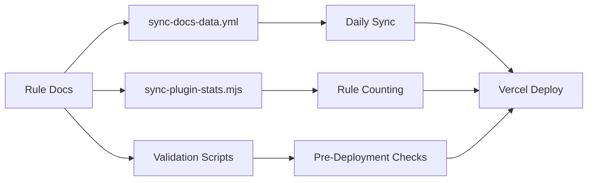

# Rule Documentation Compliance Audit Standard

**Version:** 1.0  
**Date:** January 2026  
**Purpose:** Standardize rule documentation across all Interlace ESLint plugins

---

## 📋 Table of Contents

1. [Automation Integration](#automation-integration)
2. [Mandatory Structure](#mandatory-structure)
3. [Section Requirements](#section-requirements)
4. [Style & Formatting](#style--formatting)
5. [Quality Criteria](#quality-criteria)
6. [Validation Checklist](#validation-checklist)
7. [Common Issues](#common-issues)
8. [Real-World Examples](#real-world-examples)

---

## Automation Integration

> **Context**: Rule documentation compliance is integrated with our automated synchronization and validation infrastructure.

### How It Works Together



### Integration Points

#### 1. **GitHub Workflow**: [`sync-docs-data.yml`](../.github/workflows/sync-docs-data.yml)

**What it does:**

- Runs daily at midnight UTC (cron: `0 0 * * *`)
- Syncs plugin stats and README rules tables
- Auto-commits changes to `apps/docs/src/data/`
- Triggers Vercel rebuild on changes

**Key steps:**

```yaml
- name: Sync plugin stats
  run: node apps/docs/scripts/sync-plugin-stats.mjs

- name: Sync README rules tables
  run: node apps/docs/scripts/sync-readme-rules.mjs
```

**Why this matters for rule docs:**
If your rule documentation is missing or malformed, the sync scripts will fail to extract metadata, resulting in incomplete stats on the docs site.

---

#### 2. **Rule Counting Script**: [`sync-plugin-stats.mjs`](../apps/docs/scripts/sync-plugin-stats.mjs)

**What it does:**

- Scans all `eslint-plugin-*` packages in `packages/`
- Counts rules by parsing `src/index.ts` exports
- Generates `plugin-stats.json` for the docs site
- Categorizes plugins (security, framework, architecture, etc.)

**How it finds rules:**

```javascript
// Matches rule entries like "'rule-name': ruleName,"
const ruleMatches = content.match(/^\s+'[a-z-]+'\s*:/gm);
return ruleMatches ? ruleMatches.length : 0;
```

**Example output:**

```json
{
  "plugins": [
    {
      "name": "eslint-plugin-vercel-ai-security",
      "rules": 12,
      "description": "Security-first ESLint rules for Vercel AI SDK",
      "category": "security",
      "version": "1.2.0"
    }
  ],
  "totalRules": 299,
  "totalPlugins": 15
}
```

**Why this matters for rule docs:**

- Rule doc filenames **MUST** match the rule name in `src/index.ts`
- Example: If your rule is exported as `'no-weak-secret': noWeakSecret`, the doc must be `docs/rules/no-weak-secret.md`

---

#### 3. **Validation Scripts**: [`.agent/markdown-content-sync-checks.md`](./markdown-content-sync-checks.md)

**Available validation scripts:**

| Script                            | Purpose                                   | When to Run                  | Example                                                       |
| --------------------------------- | ----------------------------------------- | ---------------------------- | ------------------------------------------------------------- |
| `scripts/check-markdown-links.ts` | Validates all internal links in markdown  | Pre-commit / CI              | Catches broken rule links like `[related](./missing-rule.md)` |
| `scripts/sync-readme-rules.ts`    | Updates "Rules" tables in package READMEs | After adding/modifying rules | Automatically injects rule metadata into README tables        |
| `scripts/sync-rule-docs.ts`       | Synchronizes rule docs with source code   | After rule implementation    | Ensures docs exist for all exported rules                     |
| `scripts/validate-docs.ts`        | General documentation integrity checks    | Pre-deployment               | Validates frontmatter, structure, metadata                    |

**Run these before committing rule docs:**

```bash
# 1. Validate all markdown links
npx tsx scripts/check-markdown-links.ts

# 2. Sync README rules tables
npx tsx scripts/sync-readme-rules.ts

# 3. Validate documentation integrity
npx tsx scripts/validate-docs.ts
```

---

### Compliance Checklist (Automation-Aware)

Before committing rule documentation, ensure:

- [ ] **File naming**: Doc filename matches rule export name exactly
  - ✅ `'no-weak-secret'` → `docs/rules/no-weak-secret.md`
  - ❌ `'no-weak-secret'` → `docs/rules/noWeakSecret.md`

- [ ] **Rule counted**: Run `sync-plugin-stats.mjs` and verify rule count increments

  ```bash
  node apps/docs/scripts/sync-plugin-stats.mjs
  # Check output: "✓ eslint-plugin-jwt: 8 rules" (was 7)
  ```

- [ ] **Links valid**: Run `check-markdown-links.ts` and fix any 404s

  ```bash
  npx tsx scripts/check-markdown-links.ts
  # ✅ All internal links resolved
  ```

- [ ] **README synced**: Run `sync-readme-rules.ts` to update tables

  ```bash
  npx tsx scripts/sync-readme-rules.ts
  # Check packages/eslint-plugin-*/README.md for updated tables
  ```

- [ ] **Workflow passes**: Manually trigger `sync-docs-data.yml` and verify no errors
  ```bash
  # Or wait for daily cron, then check Actions tab
  ```

---

### Common Automation Failures

#### ❌ **Failure 1**: Rule not counted

**Symptom:** `sync-plugin-stats.mjs` reports same rule count after adding new rule

**Cause:** Rule export doesn't match regex pattern `'rule-name':`

**Example (broken):**

```typescript
export default {
  rules: {
    noWeakSecret, // ❌ Missing quotes and colon
  },
};
```

**Fix:**

```typescript
export default {
  rules: {
    'no-weak-secret': noWeakSecret, // ✅ Matches regex
  },
};
```

---

#### ❌ **Failure 2**: Broken internal links

**Symptom:** `check-markdown-links.ts` reports 404s

**Cause:** Related rule link uses wrong path or filename

**Example (broken):**

```markdown
## 🔗 Related Rules

- [no-system-prompt-leak](./no-system-prompt-leak.md) <!-- ❌ File doesn't exist -->
```

**Fix:**

```markdown
## 🔗 Related Rules

- [`no-dynamic-system-prompt`](./no-dynamic-system-prompt.md) <!-- ✅ Correct filename -->
```

---

#### ❌ **Failure 3**: README table out of sync

**Symptom:** README shows old rule count or missing rules

**Cause:** Forgot to run `sync-readme-rules.ts` after adding rule

**Example (broken README):**

```markdown
## Rules (7)

<!-- Missing newly added rule -->
```

**Fix:**

```bash
npx tsx scripts/sync-readme-rules.ts
# README now shows: ## Rules (8)
```

---

## Mandatory Structure

All rule documentation files **MUST** follow this exact section order:

```markdown
# rule-name

> Short description (1 sentence)

**Severity:** 🔴 CRITICAL | 🟠 HIGH | 🟡 MEDIUM | 🟢 LOW  
**CWE:** [CWE-XXX](link)  
**OWASP:** [Category](link) (optional)  
**CVSS:** X.X (optional)

## Rule Details | 📊 Rule Details | Error Message Format

## ❌ Incorrect | ❌ Incorrect Code

## ✅ Correct | ✅ Correct Code

## Options | ⚙️ Options | Configuration (optional)

## 🛡️ Why This Matters | Why This Matters (optional)

## Known False Negatives

## 🔗 Related Rules | Related Rules (optional)

## 📚 References | Further Reading (optional)
```

---

## Section Requirements

### 1. Title & Description

**✅ Required:**

- H1 heading with rule name (kebab-case)
- Blockquote description (1 sentence, under 100 characters)
- Severity badge with emoji
- At least one security standard (CWE, OWASP, or CVSS)

**Examples:**

```markdown
# no-weak-secret

> Require strong secrets (256+ bits) for HMAC-based JWT signing

**Severity:** 🟠 HIGH  
**CWE:** [CWE-326](https://cwe.mitre.org/data/definitions/326.html)
```

```markdown
# no-dynamic-system-prompt

> Prevents dynamic content in system prompts to avoid agent confusion attacks.

## 📊 Rule Details

| Property          | Value                                                                             |
| ----------------- | --------------------------------------------------------------------------------- |
| **Type**          | problem                                                                           |
| **Severity**      | 🔴 HIGH                                                                           |
| **OWASP Agentic** | [ASI01: Agent Confusion](https://owasp.org)                                       |
| **CWE**           | [CWE-74: Improper Neutralization](https://cwe.mitre.org/data/definitions/74.html) |
| **CVSS**          | 8.0                                                                               |
```

**❌ Invalid:**

- Missing severity emoji
- Generic description (e.g., "Detects security issues")
- No security standard references
- Description longer than 2 sentences

---

### 2. Rule Details / What This Rule Detects

**✅ Required:**

- Clear explanation of what the rule detects and why it matters
- **Format options:**
  - **Option A: Prose format** (most common) - Explain detection logic in 2-3 paragraphs
  - **Option B: Table format** (for complex rules) - Include Type, Severity, CWE, CVSS, Config Default
- Optional: Mermaid diagram for complex flows
- Optional: "Why This Matters" subsection (can be separate H3 or part of Rule Details)

**Examples:**

**Option A - Prose (Preferred for most rules):**

```markdown
## Rule Details

This rule detects when sensitive user data (email, SSN, credit card, password, phone, address) is passed to analytics tracking calls like `analytics.track()`. Analytics platforms may not provide adequate security for sensitive data.

### Why This Matters

Analytics platforms are third-party services. Sending PII violates GDPR Article 6 and creates regulatory risks.
```

**Option B - Table (For rules with many metadata fields):**

```markdown
## 📊 Rule Details

| Property          | Value                                                                             |
| ----------------- | --------------------------------------------------------------------------------- |
| **Type**          | problem                                                                           |
| **Severity**      | 🔴 HIGH                                                                           |
| **OWASP Agentic** | [ASI01: Agent Confusion](https://owasp.org)                                       |
| **CWE**           | [CWE-74: Improper Neutralization](https://cwe.mitre.org/data/definitions/74.html) |
| **CVSS**          | 8.0                                                                               |
```

**❌ Invalid:**

- Vague or generic descriptions
- Missing context about security impact
- No explanation of attack vectors

---

### 3. Code Examples

**✅ Required:**

- Both `❌ Incorrect` and `✅ Correct` sections **MUST have real, concrete examples**
- At least 2 examples per section
- TypeScript/JavaScript code blocks
- Inline comments explaining the issue/fix
- **NO TODO placeholders** - examples must be based on actual rule implementation
- **NO generic placeholders** like `// Insecure pattern` or `// Secure pattern`

**Formatting Standards:**

````markdown
## ❌ Incorrect

```typescript
// Template literal with expression
await generateText({
  system: `You are a ${role} assistant.`,
  prompt: userInput,
});

// String concatenation
await generateText({
  system: 'You are a ' + role + ' assistant.',
  prompt: userInput,
});
```
````

## ✅ Correct

```typescript
// Static string literal
await generateText({
  system: 'You are a helpful assistant.',
  prompt: userInput,
});

// Static constant
const SYSTEM = 'You are a helpful coding assistant.';
await generateText({
  system: SYSTEM,
  prompt: userInput,
});
```

````

**❌ Invalid:**
- Only one example per section
- Examples without comments
- JavaScript-only (should prefer TypeScript)
- Missing security context
- **TODO placeholders** (`// TODO: Add examples`)
- **Generic placeholders** (`// Insecure pattern`, `// Secure pattern`)

---

### 4. Known False Negatives

**✅ Required (Mandatory for ALL rules):**
- At least 3 concrete examples of undetected patterns
- Each example MUST include:
  - H3 subheading describing the pattern
  - "Why" explanation
  - Code example with `❌ NOT DETECTED` comment
  - "Mitigation" guidance

**Standard Format:**

```markdown
## Known False Negatives

The following patterns are **not detected** due to static analysis limitations:

### Variable References

**Why**: Only literal string secrets are analyzed for length/weakness.

```typescript
// ❌ NOT DETECTED - Secret from variable
const weakSecret = 'abc';
jwt.sign(payload, weakSecret); // Variable not analyzed
````

**Mitigation**: Use environment variables. Apply TypeScript branded types for validated secrets.

### Dynamic Query Variables

**Why**: When the query is stored in a variable, we can't analyze its construction.

```typescript
// ❌ NOT DETECTED
const unsafeQuery = buildQuery(userInput);
await client.query(unsafeQuery);
```

**Mitigation**: Always use parameterized queries directly in literals.

````

**Common Patterns to Document:**
- Values from variables
- Imported constants
- Dynamic/computed property access
- Wrapper functions
- Conditional logic
- Environment variables (content unknown)

**❌ Invalid:**
- Generic "static analysis has limitations" without examples
- Fewer than 3 examples
- Examples without mitigation guidance
- Missing "Why" explanations

---

### 5. Options (If Configurable)

**✅ Required (if rule has options):**
- Configuration example in JSON
- Table of all options with types, defaults, descriptions

**Format:**

```markdown
## ⚙️ Options

```json
{
  "jwt/no-weak-secret": ["error", {
    "minSecretLength": 32
  }]
}
````

| Option            | Type    | Default | Description                   |
| ----------------- | ------- | ------- | ----------------------------- |
| `minSecretLength` | integer | 32      | Minimum secret length (chars) |

````

**❌ Invalid:**
- Missing default values
- No type information
- Configuration examples that don't work

---

### 6. Related Rules & References

**✅ Optional but recommended:**
- Links to related rules in same or other plugins
- External references (OWASP, CWE, RFCs, standards)

**Format:**

```markdown
## 🔗 Related Rules

- [`no-system-prompt-leak`](./no-system-prompt-leak.md) - Prevent system prompt exposure
- [`require-validated-prompt`](./require-validated-prompt.md) - Validate user prompts

## 📚 References

- [OWASP ASI01: Agent Confusion](https://owasp.org)
- [CWE-74: Improper Neutralization](https://cwe.mitre.org/data/definitions/74.html)
- [RFC 8725 - JWT Best Practices](https://tools.ietf.org/html/rfc8725)
````

---

## Style & Formatting

### Emoji Usage

**Standard Emojis:**

- 🔴 CRITICAL (CVSS 9.0-10.0)
- 🟠 HIGH (CVSS 7.0-8.9)
- 🟡 MEDIUM (CVSS 4.0-6.9)
- 🟢 LOW (CVSS 0.1-3.9)
- 📊 Rule Details
- ❌ Incorrect
- ✅ Correct
- ⚙️ Options
- 🛡️ Why This Matters
- 🔗 Related Rules
- 📚 References
- 🔍 What This Rule Detects

### Code Block Standards

- Always use TypeScript syntax highlighting: ` ```typescript `
- Include inline comments for every example
- Prefer async/await over callbacks
- Use realistic variable names (not `foo`, `bar`)

### Link Standards

- CWE links: `https://cwe.mitre.org/data/definitions/XXX.html`
- OWASP links: Official OWASP URLs
- Internal rule links: Relative paths `./rule-name.md`

---

## Quality Criteria

### ✅ High Quality Rule Doc

- [ ] Title matches exact rule name from source code
- [ ] Description is concise (<100 chars) and specific
- [ ] Includes at least one security standard (CWE/OWASP/CVSS)
- [ ] "Rule Details" section explains the "why"
- [ ] At least 2 incorrect and 2 correct examples
- [ ] All code examples have inline comments
- [ ] Known False Negatives section has 3+ examples with mitigations
- [ ] No duplicate sections (e.g., two "Configuration" sections)
- [ ] No broken internal links
- [ ] Consistent emoji usage
- [ ] TypeScript code blocks (not JavaScript)

### ❌ Low Quality Rule Doc

- Missing or incomplete "Known False Negatives"
- Generic descriptions
- Examples without comments
- Duplicate or inconsistent sections
- Missing security context
- No mitigation guidance

---

## Validation Checklist

Use this checklist when auditing rule documentation:

### Structure

- [ ] H1 title matches rule name
- [ ] Blockquote description present
- [ ] Severity with emoji
- [ ] At least one security standard (CWE/OWASP/CVSS)
- [ ] Sections in correct order

### Content

- [ ] Rule Details explains what is detected and why
- [ ] At least 2 incorrect examples
- [ ] At least 2 correct examples
- [ ] All code blocks have comments
- [ ] Known False Negatives section present
- [ ] At least 3 false negative examples
- [ ] Each false negative has "Why" and "Mitigation"

### Formatting

- [ ] Code blocks use TypeScript syntax
- [ ] Consistent emoji usage
- [ ] Valid markdown (no syntax errors)
- [ ] All links are valid (no 404s)
- [ ] Relative links for internal rules

### Quality

- [ ] No duplicate sections
- [ ] No generic/vague language
- [ ] Security impact clearly explained
- [ ] Realistic code examples
- [ ] Actionable mitigation guidance

---

## Common Issues

### Issue 1: Duplicate Sections

**❌ Problem:**

```markdown
## Configuration

## Options

## Configuration
```

**✅ Fix:**
Consolidate into single "Options" or "Configuration" section.

---

### Issue 2: Missing False Negatives Context

**❌ Problem:**

```markdown
## Known False Negatives

This rule may not detect all patterns due to static analysis limitations.
```

**✅ Fix:**
Add specific examples with "Why" explanations and mitigations.

---

### Issue 3: Generic Descriptions

**❌ Problem:**

```markdown
> Detects security issues
```

**✅ Fix:**

```markdown
> Prevents SQL injection by detecting string concatenation in query calls
```

---

### Issue 4: JavaScript Instead of TypeScript

**❌ Problem:**

````markdown
```javascript
const result = client.query(`SELECT * FROM users WHERE id = ${id}`);
```
````

````

**✅ Fix:**
```markdown
```typescript
const result = await client.query(`SELECT * FROM users WHERE id = ${id}`);
````

````

---

### Issue 5: Examples Without Comments

**❌ Problem:**
```typescript
jwt.sign(payload, 'secret');
jwt.sign(payload, process.env.JWT_SECRET);
````

**✅ Fix:**

```typescript
// ❌ Hardcoded weak secret
jwt.sign(payload, 'secret');

// ✅ Secret from environment variable
jwt.sign(payload, process.env.JWT_SECRET);
```

---

## Audit Process

### Step 1: Automated Checks

Run these scripts in order:

```bash
# 1. Verify rule counting works
node apps/docs/scripts/sync-plugin-stats.mjs
# Expected: Rule count matches number of exported rules

# 2. Check for broken markdown links
npx tsx scripts/check-markdown-links.ts
# Expected: "✅ All internal links resolved"

# 3. Sync README rules tables
npx tsx scripts/sync-readme-rules.ts
# Expected: README tables updated with new rules

# 4. Validate documentation integrity
npx tsx scripts/validate-docs.ts
# Expected: No structural or metadata errors

# 5. Run ESLint on markdown files
pnpm nx lint
# Expected: No changelog format violations
```

**What each script validates:**

| Script                    | Checks                 | Failures Indicate               |
| ------------------------- | ---------------------- | ------------------------------- |
| `sync-plugin-stats.mjs`   | Rule export naming     | Filename or export mismatch     |
| `check-markdown-links.ts` | Internal link validity | Broken related rule links       |
| `sync-readme-rules.ts`    | README table sync      | Missing or outdated metadata    |
| `validate-docs.ts`        | Structure & metadata   | Missing sections or frontmatter |
| ESLint                    | Changelog format       | Non-standard version headers    |

---

### Step 2: Manual Review

Review for:

- [ ] **Quality of examples**: Are they realistic? Do they reflect actual usage?
- [ ] **Completeness of false negatives**: Are there 3+ examples with mitigations?
- [ ] **Clarity of security context**: Is the threat model explained?
- [ ] **Accuracy of severity ratings**: Does the CVSS score match the threat?
- [ ] **TypeScript syntax**: All code blocks use `typescript` not `javascript`
- [ ] **Inline comments**: Every example has explanatory comments

**Manual review checklist per rule:**

```markdown
✅ File: packages/eslint-plugin-\*/docs/rules/rule-name.md

- [ ] Title matches export name exactly
- [ ] Description is <100 chars, specific
- [ ] At least one security standard (CWE/OWASP/CVSS)
- [ ] 2+ incorrect examples with comments
- [ ] 2+ correct examples with comments
- [ ] 3+ false negative examples with "Why" and "Mitigation"
- [ ] Related rules links valid (run check-markdown-links.ts)
- [ ] No duplicate sections
- [ ] TypeScript code blocks only
```

---

### Step 3: Remediation

When issues are found:

1. **Document in audit log**: Add entry to `.agent/rules-compliance-audit-log.md` (create if missing)

   ```markdown
   ## 2026-01-12: no-weak-secret (eslint-plugin-jwt)

   **Issues:**

   - Missing false negative for variable references
   - Code examples use `javascript` instead of `typescript`
   - No "Why This Matters" section

   **Actions:**

   - Added 3 false negative examples
   - Converted all code blocks to TypeScript
   - Added security context section
   ```

2. **Create standardized examples**: Use real-world patterns from your codebase
   - Bad: `const x = foo(bar);`
   - Good: `const token = jwt.sign(payload, userSecret);`

3. **Update false negatives sections**: Always include "Why" and "Mitigation"

   ```markdown
   ### Variable References

   **Why**: Static analysis can't track variable values across scopes.

   **Mitigation**: Use TypeScript branded types or runtime validation.
   ```

4. **Verify all links**: Run `check-markdown-links.ts` after fixes

   ```bash
   npx tsx scripts/check-markdown-links.ts
   ```

5. **Re-run automation**: Ensure all scripts pass
   ```bash
   node apps/docs/scripts/sync-plugin-stats.mjs && \
   npx tsx scripts/sync-readme-rules.ts && \
   npx tsx scripts/validate-docs.ts
   ```

---

## Plugin-Specific Notes

### `eslint-plugin-vercel-ai-security`

- Must reference OWASP Agentic LLM risks where applicable
- Include AI-specific attack vectors
- Document model/SDK limitations

### `eslint-plugin-pg` / `eslint-plugin-mongodb-security`

- Must include database-specific injection examples
- Reference `pg`/`mongodb` library APIs
- Document parameterized query alternatives

### `eslint-plugin-jwt` / `eslint-plugin-crypto`

- Must reference relevant RFCs (8725 for JWT)
- Include cryptographic standards (NIST, FIPS)
- Document algorithm-specific risks

### `eslint-plugin-express-security` / `eslint-plugin-nestjs-security`

- Must reference framework-specific APIs
- Include middleware examples
- Document framework version compatibility

---

## Examples of Excellent Documentation

### Example 1: `no-dynamic-system-prompt`

✅ Clear security context  
✅ Comprehensive false negatives (3+ with mitigations)  
✅ Table format for rule details  
✅ Related rules section

### Example 2: `no-unsafe-query`

✅ LLM-optimized error message format documented  
✅ Specific false negative examples (tagged templates, nested calls)  
✅ "When Not To Use It" section  
✅ Compliance frameworks referenced (SOC2, PCI-DSS)

### Example 3: `no-weak-secret`

✅ Configurable options documented  
✅ Multiple false negative categories  
✅ Runtime validation suggestions  
✅ RFC references

---

## Real-World Examples

> **Note**: These examples show actual patterns from the Interlace ESLint ecosystem.

### Example 1: Excellent Documentation - `no-dynamic-system-prompt`

**File**: `packages/eslint-plugin-vercel-ai-security/docs/rules/no-dynamic-system-prompt.md`

**Why it's excellent:**

✅ **Clear Title & Description**

```markdown
# no-dynamic-system-prompt

> Prevents dynamic content in system prompts to avoid agent confusion attacks.
```

✅ **Comprehensive Metadata Table**

```markdown
## 📊 Rule Details

| Property          | Value                                                                             |
| ----------------- | --------------------------------------------------------------------------------- |
| **Type**          | problem                                                                           |
| **Severity**      | 🔴 HIGH                                                                           |
| **OWASP Agentic** | [ASI01: Agent Confusion](https://owasp.org/...)                                   |
| **CWE**           | [CWE-74: Improper Neutralization](https://cwe.mitre.org/data/definitions/74.html) |
| **CVSS**          | 8.0                                                                               |
```

✅ **Realistic Examples with Comments**

```typescript
// ❌ Template literal with expression
await generateText({
  system: `You are a ${role} assistant.`, // User controls 'role'
  prompt: userInput,
});
```

✅ **3+ False Negatives with Mitigations**

```markdown
### Imported Constants

**Why**: When the system prompt value comes from an import, we can't analyze its content.

**Mitigation**: Use a whitelist pattern and validate at runtime.
```

**Full file reference**: [View no-dynamic-system-prompt.md](../packages/eslint-plugin-vercel-ai-security/docs/rules/no-dynamic-system-prompt.md)

---

### Example 2: Good Documentation - `no-unsafe-query` (PostgreSQL)

**File**: `packages/eslint-plugin-pg/docs/rules/no-unsafe-query.md`

**Why it's good:**

✅ **Database-Specific Examples**

```typescript
// ❌ String concatenation (SQL injection risk)
const query = `SELECT * FROM users WHERE id = ${userId}`;
await client.query(query);

// ✅ Parameterized query (safe)
await client.query('SELECT * FROM users WHERE id = $1', [userId]);
```

✅ **Compliance Frameworks Referenced**

```markdown
## 🛡️ Why This Matters

SQL injection is ranked #3 in OWASP Top 10. This rule helps maintain:

- SOC2 compliance (data access controls)
- PCI-DSS requirement 6.5.1 (injection flaws)
```

✅ **LLM-Optimized Error Messages**

```markdown
## Error Message Format

The error message includes:

1. What was detected (e.g., "template literal")
2. Why it's unsafe ("allows SQL injection")
3. How to fix ("use parameterized queries")
```

**Full file reference**: [View no-unsafe-query.md](../packages/eslint-plugin-pg/docs/rules/no-unsafe-query.md)

---

### Example 3: Documentation That Needs Improvement

**Before (needs work):**

````markdown
# detect-prompt-injection

> Detects security issues

**Severity:** HIGH

## What This Rule Does

This rule detects security issues in your code.

## Examples

```javascript
const bad = foo(bar);
```
````

## Known False Negatives

This rule may not detect all patterns.

````

**Issues:**
- ❌ No emoji on severity
- ❌ Generic description
- ❌ No CWE/OWASP references
- ❌ Example uses `javascript` not `typescript`
- ❌ No inline comments
- ❌ False negatives section is vague
- ❌ No "Why" or "Mitigation" guidance

**After (improved):**

```markdown
# detect-prompt-injection

> Prevents user input from being directly concatenated into LLM prompts without validation

**Severity:** 🔴 HIGH
**CWE:** [CWE-74: Improper Neutralization](https://cwe.mitre.org/data/definitions/74.html)
**OWASP Agentic:** [ASI02: Prompt Injection](https://owasp.org/...)

## 📊 Rule Details

This rule detects patterns where user-controlled input is directly inserted into LLM prompts without sanitization or validation. This can lead to prompt injection attacks where attackers manipulate the AI's behavior.

## ❌ Incorrect

```typescript
// Direct string concatenation
const prompt = "Summarize: " + userInput; // ❌ User can inject instructions
await generateText({ prompt });

// Template literal with unsanitized input
const prompt = `Analyze this text: ${userInput}`; // ❌ No validation
await generateText({ prompt });
````

## ✅ Correct

```typescript
// Input validation before concatenation
const sanitized = sanitizePromptInput(userInput);
const prompt = `Analyze this text: ${sanitized}`; // ✅ Validated input
await generateText({ prompt });

// Structured API with separate fields
await generateText({
  system: 'You are a text analyzer.',
  prompt: userInput, // ✅ SDK handles escaping
});
```

## Known False Negatives

### Variable References

**Why**: When user input is stored in a variable before concatenation, we can't trace its origin.

```typescript
// ❌ NOT DETECTED
const text = getUserInput();
const prompt = `Analyze: ${text}`; // Variable origin not tracked
```

**Mitigation**: Always validate at the point of input collection. Use TypeScript branded types:

```typescript
type SanitizedInput = string & { __brand: 'sanitized' };

function sanitize(input: string): SanitizedInput {
  // ... validation logic
  return input as SanitizedInput;
}
```

### Imported Utilities

**Why**: When concatenation happens inside imported functions, static analysis can't see the implementation.

```typescript
// ❌ NOT DETECTED
import { buildPrompt } from './utils';
const prompt = buildPrompt(userInput); // Function body not analyzed
```

**Mitigation**: Document and test utility functions. Add JSDoc annotations:

```typescript
/**
 * @security Sanitizes user input for LLM prompts
 * @throws {Error} If input contains injection attempts
 */
export function buildPrompt(input: string): string { ... }
```

### Dynamic Property Access

**Why**: When prompts are constructed via property access, we can't determine which properties are user-controlled.

```typescript
// ❌ NOT DETECTED
const config = { userText: unsafeInput };
const prompt = `Process: ${config['userText']}`; // Dynamic access
```

**Mitigation**: Use explicit property access and validator decorators:

```typescript
class PromptConfig {
  @ValidateInput()
  userText: string;
}
```

## 🔗 Related Rules

- [`no-dynamic-system-prompt`](./no-dynamic-system-prompt.md) - Prevent dynamic system prompts
- [`require-validated-prompt`](./require-validated-prompt.md) - Enforce validation

## 📚 References

- [OWASP LLM Top 10: Prompt Injection](https://owasp.org/...)
- [CWE-74: Improper Neutralization](https://cwe.mitre.org/data/definitions/74.html)

````

**Improvements made:**
- ✅ Added emoji to severity
- ✅ Specific description (<100 chars)
- ✅ Added CWE and OWASP references
- ✅ Converted to TypeScript with inline comments
- ✅ Added 3 false negatives with "Why" and "Mitigation"
- ✅ Added Related Rules and References sections
- ✅ Realistic examples (LLM prompts, not generic `foo`/`bar`)

---

## Quick Start: Adding a New Rule

### Step-by-Step Workflow

**1. Implement the rule**
```typescript
// packages/eslint-plugin-*/src/rules/my-new-rule.ts
export default createRule({ ... });
````

**2. Export the rule**

```typescript
// packages/eslint-plugin-*/src/index.ts
export default {
  rules: {
    'my-new-rule': myNewRule, // ✅ Matches sync-plugin-stats.mjs regex
  },
};
```

**3. Create documentation**

```bash
# File: packages/eslint-plugin-*/docs/rules/my-new-rule.md
# Use this compliance audit as your template
```

**4. Run automation**

```bash
# Count rules (should increment)
node apps/docs/scripts/sync-plugin-stats.mjs

# Sync README tables
npx tsx scripts/sync-readme-rules.ts

# Validate links
npx tsx scripts/check-markdown-links.ts

# Lint markdown
pnpm nx lint
```

**5. Verify changes**

```bash
# Check that rule appears in:
# - packages/eslint-plugin-*/README.md (Rules table)
# - apps/docs/src/data/plugin-stats.json (rule count)
# - No broken links in docs/rules/my-new-rule.md
```

**6. Commit**

```bash
git add .
git commit -m "feat(plugin-name): add my-new-rule

- Detects [security issue]
- Includes 3 false negative examples
- Updates README and plugin-stats.json"
```

**7. Automated sync (daily)**

```yaml
# .github/workflows/sync-docs-data.yml runs at midnight UTC
# Triggers Vercel rebuild if changes detected
```

---

## Maintenance

- **Review Frequency**: Before each major release
- **Update Triggers**:
  - New rule added → Run sync scripts immediately
  - Rule behavior changed → Update examples and false negatives
  - New attack vectors identified → Add to "Why This Matters" section
  - Security standards updated → Update CWE/OWASP references
- **Ownership**: Plugin maintainers
- **Automation**:
  - Daily sync via GitHub Actions (`.github/workflows/sync-docs-data.yml`)
  - Pre-commit validation (link checking, markdown linting)
  - CI/CD integration (all scripts run in CI pipeline)

### Monthly Checklist

```bash
# 1. Verify all automation is working
gh workflow view sync-docs-data.yml --log

# 2. Audit random sample of 10 rule docs
# Use "Validation Checklist" section above

# 3. Check for orphaned docs (docs without rules)
find packages/*/docs/rules -name '*.md' | while read doc; do
  rule=$(basename "$doc" .md)
  grep -q "'$rule':" packages/*/src/index.ts || echo "Orphaned: $doc"
done

# 4. Update this compliance audit if patterns emerge
# Add new "Common Issues" or "Real-World Examples"
```
