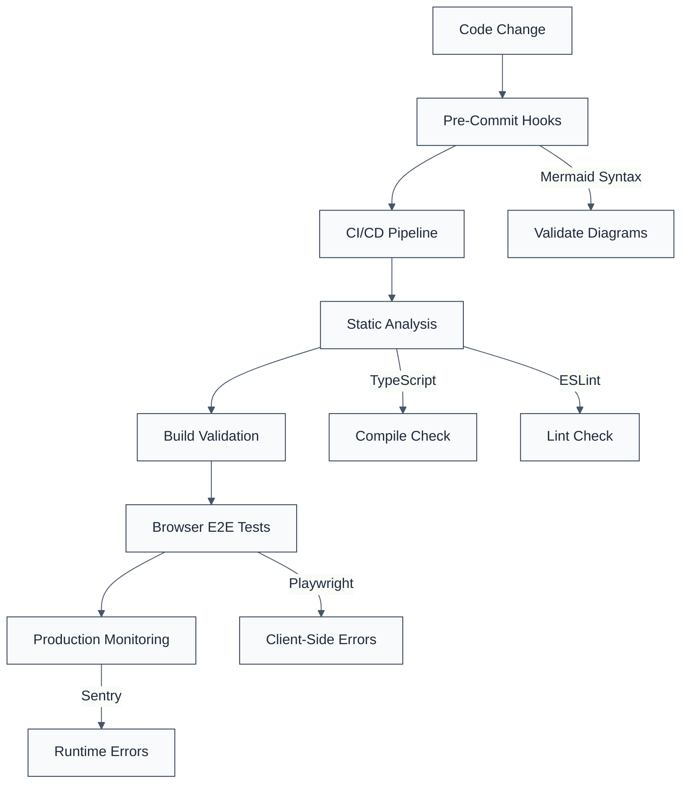

# Client-Side Error Detection & Prevention Guide

**Created:** January 12, 2026  
**Purpose:** Document learnings from client-side error detection audit  
**Audience:** Future developers, AI agents, DevOps engineers

---

## Problem Statement

**The Challenge**: HTTP status codes alone are insufficient for validating modern web applications. A page can return `HTTP 200 OK` but still be completely unusable due to client-side JavaScript exceptions.

**Real-World Impact**:

- 2 documentation pages returned HTTP 200 but showed "Application error" to users
- Pages were completely unusable (not graceful degradation)
- Standard monitoring tools (cURL, Pingdom, etc.) reported "healthy" status
- SEO impact: Search engines may de-index pages with JavaScript errors

---

## What We Learned

### 1. HTTP Status ≠ Page Health

Traditional monitoring checks only HTTP response codes:

```bash
curl -I https://example.com/page
# Returns: HTTP/2 200 OK
# ✅ Monitoring tool: "Page is healthy"
# ❌ Reality: Page crashes with JavaScript exception
```

**Why This Happens**:

- Server-side rendering (SSR) succeeds → HTTP 200
- Client-side hydration fails → JavaScript exception
- User sees: "Application error" white screen

### 2. Component Failures Can Crash Entire Pages

In React/Next.js applications, a single component error can unmount the entire tree:

```
Mermaid Component (syntax error)
  ↓ throws exception
Next.js Error Boundary
  ↓ catches error
Unmounts entire page
  ↓ shows generic error
"Application error: a client-side exception has occurred"
```

**No Graceful Degradation**: When error boundaries catch exceptions, they often show a generic error screen rather than just hiding the failed component.

### 3. Static Analysis Has Blind Spots

Our validation strategy before this audit:

- ✅ TypeScript compilation
- ✅ ESLint checks
- ✅ HTTP status validation
- ❌ No runtime JavaScript validation
- ❌ No browser-based testing

**The Gap**: Mermaid diagrams are processed at runtime, not compile time. Syntax errors only appear when the browser tries to render them.

---

## Detection Strategies

### ❌ Insufficient (What We Had Before)

```bash
# HTTP status check only
curl -I https://eslint.interlace.tools/docs/some-page
# Returns 200, but page might still crash
```

**Limitations**:

- No JavaScript execution
- No error detection
- False sense of security

### ✅ Effective (What We Implemented)

#### Strategy 1: Browser Automation

```javascript
// Pseudocode for browser-based validation
pages.forEach(async (url) => {
  await browser.goto(url);
  await page.waitForLoad();

  const errors = await page.evaluate(() => {
    return window.errors; // Collect console errors
  });

  if (errors.length > 0) {
    report(`❌ ${url} has client-side errors`);
  }
});
```

**Tools Used**:

- Antigravity browser subagent
- Playwright/Puppeteer for automation
- Console log capture

**What This Catches**:

- JavaScript exceptions
- React/Vue component errors
- Runtime parsing errors (Mermaid, KaTeX, etc.)
- Network request failures
- Missing resources

#### Strategy 2: Static Syntax Validation

For known content types (Mermaid, Markdown, etc.):

```bash
# Validate Mermaid syntax before deployment
find . -name "*.md" -exec grep -l 'mermaid' {} \; | while read file; do
  # Extract Mermaid blocks
  # Validate syntax
  # Report errors
done
```

**Benefits**:

- Catch errors pre-deployment
- No browser required
- Fast and automatable

---

## Prevention Framework

### 1. Multi-Layer Validation



### 2. CI/CD Integration

**GitHub Actions Workflow** (`.github/workflows/validate-client-side.yml`):

```yaml
name: Client-Side Validation

on: [push, pull_request]

jobs:
  validate-static:
    runs-on: ubuntu-latest
    steps:
      - uses: actions/checkout@v4
      - name: Validate Mermaid Syntax
        run: ./scripts/validate-mermaid.sh

      - name: Validate Markdown
        run: npx markdownlint '**/*.md'

  validate-runtime:
    runs-on: ubuntu-latest
    steps:
      - uses: actions/checkout@v4
      - name: Build Application
        run: npm run build

      - name: Start Server
        run: npm start &

      - name: Run E2E Tests
        run: npx playwright test
```

### 3. Production Monitoring

**Sentry Integration** (for runtime error tracking):

```javascript
// apps/docs/src/app/layout.tsx
import * as Sentry from '@sentry/nextjs';

Sentry.init({
  dsn: process.env.SENTRY_DSN,
  environment: process.env.NODE_ENV,

  beforeSend(event, hint) {
    // Filter out known non-critical errors
    if (event.exception?.values?.[0]?.value?.includes('Mermaid')) {
      // Alert DevOps about Mermaid errors
      notifyDevOps(event);
    }
    return event;
  },
});
```

---

## Validation Checklist

### Pre-Deployment

- [ ] **Static Analysis**
  - [ ] TypeScript compilation passes
  - [ ] ESLint checks pass
  - [ ] Mermaid syntax validated
  - [ ] Markdown linting passes

- [ ] **Build Validation**
  - [ ] Production build succeeds
  - [ ] No build warnings
  - [ ] Bundle size within limits

- [ ] **Browser Testing**
  - [ ] Sample pages tested in browser
  - [ ] No console errors
  - [ ] No "Application error" screens
  - [ ] All interactive elements work

### Post-Deployment

- [ ] **Smoke Tests**
  - [ ] Homepage loads
  - [ ] Key documentation pages load
  - [ ] Search functionality works
  - [ ] Navigation works

- [ ] **Error Monitoring**
  - [ ] Sentry shows no new errors
  - [ ] CloudWatch/Vercel logs clean
  - [ ] No user-reported issues

---

## Tools & Scripts

### 1. Mermaid Validation Script

**Location**: `scripts/validate-mermaid.sh`

**Usage**:

```bash
./scripts/validate-mermaid.sh
# Returns: exit 0 if all diagrams valid, exit 1 if errors found
```

### 2. Browser Validation Script

**Location**: `scripts/validate-browser.sh`

**Usage**:

```bash
# Test specific URLs for client-side errors
./scripts/validate-browser.sh https://example.com/page1 https://example.com/page2
```

### 3. Sitemap Crawler

**Location**: `scripts/crawl-sitemap.sh`

**Usage**:

```bash
# Crawl all URLs in sitemap and test for errors
./scripts/crawl-sitemap.sh https://example.com/sitemap.xml
```

---

## Error Categorization

### Critical (Page Unusable)

**Symptoms**:

- White screen with error message
- "Application error" displayed
- Page doesn't render at all

**Examples**:

- React component crash
- Mermaid syntax error
- Missing critical dependency

**Response**: Immediate fix required, consider rollback

### High (Feature Broken)

**Symptoms**:

- Page renders but feature doesn't work
- Console shows errors
- User interaction fails

**Examples**:

- Search not working
- Form submission fails
- Interactive diagram broken

**Response**: Fix within 24 hours

### Medium (Degraded Experience)

**Symptoms**:

- Page works but with issues
- Warnings in console
- Minor visual glitches

**Examples**:

- Images not loading
- Slow performance
- Non-critical warnings

**Response**: Fix in next release

### Low (Technical Debt)

**Symptoms**:

- Console warnings
- Deprecation notices
- Best practice violations

**Examples**:

- Deprecated API usage
- Accessibility warnings
- Performance suggestions

**Response**: Track and fix when convenient

---

## Case Study: Mermaid Syntax Errors

### The Problem

Two documentation pages crashed with "Application error":

- `/docs/secure-coding/rules/no-redos-vulnerable-regex`
- `/docs/secure-coding/rules/detect-eval-with-expression`

### The Investigation

1. **HTTP Check**: Both returned `HTTP 200 OK` ✓
2. **Build Check**: Both built successfully ✓
3. **Browser Test**: Both showed "Application error" ❌

### The Root Cause

```mermaid
# BROKEN (unquoted parentheses)
A[Detect eval() Call] --> B

# Mermaid v11.12.2 parser throws:
# Error: Syntax error in text
# Expected: quoted label for special characters
```

### The Fix

```mermaid
# FIXED (quoted label)
A["Detect eval() Call"] --> B
```

### The Impact

- **Before**: 2 pages completely broken
- **Detection Method**: Browser automation (not HTTP checks)
- **Fix Complexity**: Simple (add quotes)
- **Prevention**: Static syntax validation in CI/CD

### The Lesson

**Multi-layer validation is essential**:

1. Static validation catches syntax errors before deployment
2. Browser testing catches runtime errors before production
3. Production monitoring catches errors that slip through

---

## Best Practices

### 1. Always Test in Browser

```bash
# Not enough
curl -I https://example.com/page

# Better
npx playwright test
```

### 2. Monitor Client-Side Errors

```javascript
// Add to all production apps
window.addEventListener('error', (event) => {
  logErrorToMonitoring(event);
});
```

### 3. Validate Generated Content

If your app processes user content or generated content (Mermaid, Markdown, LaTeX):

- Validate syntax before rendering
- Implement error boundaries
- Show graceful fallback on errors

### 4. Test the Happy Path AND Error Cases

```javascript
describe('Documentation Page', () => {
  it('should render successfully', async () => {
    await page.goto('/docs/some-rule');
    expect(await page.title()).not.toContain('Application error');
  });

  it('should handle Mermaid diagram errors gracefully', async () => {
    // Test with intentionally broken diagram
    // Ensure it doesn't crash the page
  });
});
```

### 5. Document Your Validation Strategy

Create a validation checklist that answers:

- What gets tested?
- When does it get tested?
- How are errors reported?
- Who gets notified?
- What's the response SLA?

---

## Future Improvements

### Short-Term

- [ ] Add Mermaid validation to pre-commit hooks
- [ ] Create browser E2E test suite
- [ ] Set up Sentry for error monitoring
- [ ] Document error response procedures

### Medium-Term

- [ ] Implement component-level error boundaries
- [ ] Add visual regression testing
- [ ] Create automated accessibility tests
- [ ] Build dashboard for monitoring trends

### Long-Term

- [ ] AI-powered error prediction
- [ ] Automated error triage
- [ ] Self-healing deployments
- [ ] Proactive monitoring alerts

---

## Related Documentation

- [Mermaid Syntax Audit](./mermaid-syntax-audit.md)
- [Error Mapping Report](./error-mapping-report.md)
- [Deployment Debug Log](./deployment-debug.md)

---

**Key Takeaway**: Modern web applications require modern validation strategies. HTTP status codes are necessary but not sufficient. Browser-based testing and client-side error monitoring are essential for ensuring true application health.
