> **Keywords:** security-standard, documentation, premium-aesthetics, technical-truth, LLM-optimized
> **Affiliation:** Antigravity Orchestration System

This standard codifies the engineering requirements for documenting security rules within the Forge-JS ecosystem.

## Quick Summary

| Aspect         | Details                                 |
| -------------- | --------------------------------------- |
| **Severity**   | Critical (System Governance)            |
| **Auto-Fix**   | ✅ Yes (via script synchronization)     |
| **Category**   | Meta-Documentation                      |
| **ESLint MCP** | ✅ Optimized for ESLint MCP integration |
| **Best For**   | Rule developers and automated sync bots |

## Vulnerability and Risk

**Vulnerability:** Inconsistent or shallow documentation for security rules. Traditional documentation often lacks visual detection logic and actionable LLM guidance, making it difficult for both humans and agents to remediate issues correctly.

**Risk:** Without high-fidelity documentation, developers may misinterpret security findings (leading to false negatives or ignored warnings), and LLMs may provide generic, incorrect remediation steps that do not account for the specific AST patterns involved.

## Error Message Format

Standardized rules must return messages formatted via `formatLLMMessage`:

```text
🔒 CWE-[ID] OWASP:[Code] | [Short Description] | [SEVERITY] [[Constraint]]
   Fix: [Actionable Instruction] | [Documentation Link]
```

### Message Components

| Component                 | Purpose                    | Requirement                                                 |
| :------------------------ | :------------------------- | :---------------------------------------------------------- |
| **Risk Standards**        | Compliance mapping         | Must include valid CWE and OWASP Top 10 references          |
| **Issue Description**     | Quick identification       | Clear, noun-focused description of the violation            |
| **Severity & Compliance** | Prioritization             | CRITICAL / HIGH / MEDIUM / LOW + Technical Constraint Tag   |
| **Fix Instruction**       | Actionable remediation     | Direct imperative guidance (e.g., "Use crypto.randomBytes") |
| **Technical Truth**       | Official verification link | Direct link to MITRE CWE or OWASP reference page            |

## Rule Details

Documentation files must follow a predictable hierarchy to ensure compatibility with the Fumadocs synchronization engine.

```mermaid
%%{init: {
  'theme': 'base',
  'themeVariables': {
    'primaryColor': '#f8fafc',
    'primaryTextColor': '#1e293b',
    'primaryBorderColor': '#334155',
    'lineColor': '#475569',
    'c0': '#f8fafc',
    'c1': '#f1f5f9',
    'c2': '#e2e8f0',
    'c3': '#cbd5e1'
  }
}}%%
flowchart TD
    A[Markdown File] --> B{Has YAML Frontmatter?}
    B -->|Yes| C[Metadata Extraction]
    B -->|No| D[🚨 REJECT]
    C --> E[Section Hierarchy Check]
    E --> F[1. Header & Keywords]
    E --> G[2. Quick Summary Table]
    E --> H[3. Vulnerability Context]
    E --> I[4. Mermaid Logic Diagram]
    E --> J[5. Examples ❌/✅]
    E --> K[6. False Negatives]
```



### Section Mandates

| Section                | Requirement                                                                |
| ---------------------- | -------------------------------------------------------------------------- |
| 🛡️ **Risk Summary**    | Detailed "Vulnerability" and "Risk" paragraphs explaining the _mechanics_. |
| 🚀 **Visual Logic**    | A **Mermaid JS** flowchart visualizing the detection logic (AST steps).    |
| 🔒 **Code Examples**   | At least one `❌ Incorrect` and one `✅ Correct` block per rule.           |
| 📉 **False Negatives** | Mandatory list of what the rule _misses_ due to static analysis limits.    |

## Configuration

Place documentation in the package's `docs/rules/` directory:

```javascript
// Example directory structure
packages / eslint -
  plugin -
  crypto / docs / rules / no -
  hardcoded -
  crypto -
  key.md;
```

## Examples

### ❌ Incorrect

```markdown
# My Rule

This rule is good.
Use better code.
```

### ✅ Correct

```markdown
---
title: my-secure-rule
description: 'CWE: [CWE-XXX](...)'
---

> **Keywords:** crypto, security...

## Quick Summary

| Aspect | Details |
| ------ | ------- |

...
```

## Known False Negatives

The documentation parser handles static Markdown; dynamic React components within Markdown are currently **not supported** in the sync process.

## References

- [MITRE CWE List](https://cwe.mitre.org/data/index.html)
- [OWASP Top 10 2021](https://owasp.org/www-project-top-ten/)
- [Fumadocs Structure Guide](https://fumadocs.vercel.app/docs/mdx)
