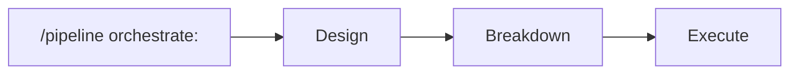

# Pipeline Mode

Route tasks to specialized pipelines using this format:

```
/pipeline <mode>: <task description>
```

## Pipeline Modes

### End-to-End (Recommended)

| Command                  | Purpose                                 |
| ------------------------ | --------------------------------------- |
| `/pipeline orchestrate:` | Full flow: design → breakdown → execute |



**See**: [orchestrator-pipeline.md](file:///Users/ofri/repos/ofriperetz.dev/eslint/.agent/orchestrators/orchestrator-pipeline.md)

### Individual Phases

| Phase         | Command                | Purpose                          |
| ------------- | ---------------------- | -------------------------------- |
| **Design**    | `/pipeline design:`    | Multi-agent architectural review |
| **Breakdown** | `/pipeline breakdown:` | Decompose plan into tasks        |
| **Execute**   | `/pipeline execute:`   | Run tasks with parallelism       |

---

## Phase 1: Design

Multi-agent review with 8 specialist agents.

```
/pipeline design: Build a real-time notification system
```

**Agents consulted**:

- Architect → Security → Cost → Patterns → Testing → UX → Performance → Tech-Specific

**Output**: `design-<slug>.md` artifact

**See**: [design-pipeline.md](file:///Users/ofri/repos/ofriperetz.dev/eslint/.agent/orchestrators/design-pipeline.md)

---

## Phase 2: Breakdown

Decompose approved design into small executable tasks.

```
/pipeline breakdown: design-notifications.md
```

**Rules**:

- Tasks sized XS-S (5-30 min each)
- Dependencies mapped
- Grouped into parallel waves

**Output**: `tasks-<slug>.md` artifact

**See**: [breakdown-pipeline.md](file:///Users/ofri/repos/ofriperetz.dev/eslint/.agent/orchestrators/breakdown-pipeline.md)

---

## Phase 3: Execute

Run task breakdown with wave-based parallel execution.

```
/pipeline execute: tasks-notifications.md
```

**Modes**:

- `mode:sequential` — One at a time (safe)
- `mode:parallel` — Independent tasks together
- `mode:wave` — Stop after each wave for review

**See**: [execute-pipeline.md](file:///Users/ofri/repos/ofriperetz.dev/eslint/.agent/orchestrators/execute-pipeline.md)

---

## Quick Commands

These shortcuts bypass the full pipeline:

| Command                  | Description                       |
| ------------------------ | --------------------------------- |
| `/pipeline orchestrate:` | End-to-end flow (design→execute)  |
| `/pipeline eslint:`      | ESLint dev agent directly         |
| `/pipeline security:`    | Security research agent           |
| `/pipeline release:`     | Package release flow              |
| `/pipeline article:`     | Content writing agent             |
| `/pipeline distribute:`  | Marketing & distribution strategy |

---

## Release Pipeline

**Trigger**: Manual only (`workflow_dispatch`)

### Architecture

```
┌──────────────────────────────────────────────────────────────────┐
│                      release.yml (Unified)                        │
│  ┌─────────────────────────────────────────────────────────────┐ │
│  │  📦 Package Selector                                        │ │
│  │  ├── all-affected (default) - releases all changed pkgs    │ │
│  │  ├── eslint-devkit (released FIRST - dependency order)     │ │
│  │  └── [14 more packages...]                                  │ │
│  └─────────────────────────────────────────────────────────────┘ │
│                              ↓                                    │
│  ┌─────────────────────────────────────────────────────────────┐ │
│  │  🔍 Detect Affected                                         │ │
│  │  Uses Nx --affected to find changed packages               │ │
│  └─────────────────────────────────────────────────────────────┘ │
│                              ↓                                    │
│  ┌─────────────────────────────────────────────────────────────┐ │
│  │  🚀 Sequential Release Loop                                 │ │
│  │  For each package (devkit first):                          │ │
│  │   → Tag Reconciliation (deadlock prevention)               │ │
│  │   → CI Validation (optional)                               │ │
│  │   → Version Bump (conventional commits + fallback)         │ │
│  │   → Build                                                  │ │
│  │   → Git Push (source of truth)                            │ │
│  │   → NPM Publish (with provenance)                         │ │
│  └─────────────────────────────────────────────────────────────┘ │
└──────────────────────────────────────────────────────────────────┘
```

### Workflow File

| File          | Purpose                                 |
| ------------- | --------------------------------------- |
| `release.yml` | Unified release workflow with all logic |

### Available Packages

| Package                          | npm Name                           |
| -------------------------------- | ---------------------------------- |
| eslint-plugin-secure-coding      | `eslint-plugin-secure-coding`      |
| eslint-plugin-import-next        | `eslint-plugin-import-next`        |
| eslint-plugin-express-security   | `eslint-plugin-express-security`   |
| eslint-plugin-nestjs-security    | `eslint-plugin-nestjs-security`    |
| eslint-plugin-browser-security   | `eslint-plugin-browser-security`   |
| eslint-plugin-crypto             | `eslint-plugin-crypto`             |
| eslint-plugin-jwt                | `eslint-plugin-jwt`                |
| eslint-plugin-pg                 | `eslint-plugin-pg`                 |
| eslint-plugin-lambda-security    | `eslint-plugin-lambda-security`    |
| eslint-plugin-vercel-ai-security | `eslint-plugin-vercel-ai-security` |
| eslint-plugin-architecture       | `eslint-plugin-architecture`       |
| eslint-plugin-quality            | `eslint-plugin-quality`            |
| eslint-plugin-react-a11y         | `eslint-plugin-react-a11y`         |
| eslint-plugin-react-features     | `eslint-plugin-react-features`     |
| eslint-devkit                    | `@interlace/eslint-devkit`         |
| cli                              | `@interlace/cli`                   |

### Usage

1. Go to **Actions** → **Release Package** → **Run workflow**
2. Select **package** from dropdown
3. Configure options:
   - **version-specifier**: `auto` (conventional commits), `patch`, `minor`, `major`, etc.
   - **dist-tag**: `latest`, `next`, `beta`, `rc`, `alpha`
   - **run-ci**: Enable/disable pre-publish validation
   - **dry-run**: Preview changes without publishing
   - **force-version**: Override with specific version (e.g., `2.1.0`)
   - **generate-changelog**: Create GitHub release

### Deadlock Prevention

The release workflow handles these failure modes automatically:

| Failure        | Symptom                            | Resolution                   |
| -------------- | ---------------------------------- | ---------------------------- |
| Orphaned Tag   | Git tag exists, npm publish failed | Auto-cleanup of orphaned tag |
| NPM Ahead      | Package on npm but no git tag      | Skip with warning            |
| Race Condition | Concurrent releases                | Blocked by concurrency group |
| No Changes     | Conventional commits yield nothing | Fallback to patch            |

### Trusted Publishers (Future)

Workflows are configured with `id-token: write` for future migration to npm Trusted Publishers (OIDC). See `.gemini/design-release-pipeline.md` for setup checklist.

---

## Full Example Session

### With Orchestrator (Recommended)

```
# End-to-end with checkpoints
/pipeline orchestrate: Add rate limiting to the ESLint plugin metrics API
```

### Manual Phase Control

```
# Step 1: Design with multi-agent review
/pipeline design: Add rate limiting to the ESLint plugin metrics API

# Step 2: Break down the approved design
/pipeline breakdown: design-rate-limiting.md

# Step 3: Execute with parallelism
/pipeline execute: tasks-rate-limiting.md mode:wave
```

---

## References

This pipeline system is inspired by industry-leading agentic frameworks:

| Framework                                                 | Inspiration                                                            |
| --------------------------------------------------------- | ---------------------------------------------------------------------- |
| [wshobson/agents](https://github.com/wshobson/agents)     | Plugin architecture, progressive disclosure, multi-agent orchestration |
| [Microsoft AutoGen](https://github.com/microsoft/autogen) | Role-based agents, human-in-loop review                                |
| [LangGraph](https://github.com/langchain-ai/langgraph)    | Graph-based workflows, wave execution                                  |
| [CrewAI](https://github.com/crewAIInc/crewAI)             | Agent specialization, goal-oriented design                             |
| [OpenAI Swarm](https://github.com/openai/swarm)           | Lightweight handoffs                                                   |

**Full references**: [REFERENCES.md](file:///Users/ofri/repos/ofriperetz.dev/eslint/.agent/REFERENCES.md)
