# CI/CD Pipeline Architecture

**Status**: ✅ Production Ready  
**Last Verified**: 2025-12-30

---

## Executive Summary

This document describes the complete CI/CD pipeline for the Interlace ESLint monorepo. The pipeline is designed for **zero deadlocks** and **maximum resilience** — individual package failures never block other packages.

---

## ⚡ TL;DR Quick Start

> **Read this section first!** Everything below is reference material for when you need details.

### The Pipeline in 30 Seconds

```mermaid
flowchart LR
    subgraph "PR Phase"
        A[Push PR] --> B{Lint + Test + Build}
        B -->|Pass| C[✅ Merge]
        B -->|Fail| D[❌ Fix & Push]
    end

    subgraph "Release Phase"
        C -.->|Manual Trigger| E[release.yml]
        E --> F[For each package]
        F --> G{Already released?}
        G -->|Yes| H[⏭️ Skip]
        G -->|No| I[📦 Publish to NPM]
        I --> J[✅ Done]
    end
```



### Essential Commands

| Task                  | Command                                       |
| --------------------- | --------------------------------------------- |
| **Run tests locally** | `pnpm nx test <package>`                      |
| **Run lint locally**  | `pnpm nx lint <package>`                      |
| **Build package**     | `pnpm nx build <package>`                     |
| **Dry-run release**   | `pnpm nx release --dry-run`                   |
| **Trigger release**   | GitHub Actions → `release.yml` → Run workflow |

### Commit Message Format

```
<type>(<scope>): <subject>

Examples:
  feat(crypto): add AES-256 detection     → minor bump (0.x.0)
  fix(jwt): validate token expiry         → patch bump (0.0.x)
  docs: update README                     → patch bump (0.0.x)
```

### Something Broke? Quick Fixes

| Problem                  | Solution                                                                                           |
| ------------------------ | -------------------------------------------------------------------------------------------------- |
| **PR blocked**           | Fix lint/test/build errors locally, push                                                           |
| **Release failed**       | Just re-run the workflow (it auto-recovers)                                                        |
| **"Already released"**   | Normal - package was already published                                                             |
| **"Orphaned tag"**       | Automatic cleanup - just re-run                                                                    |
| **Auth error (401/403)** | Configure [Trusted Publishers](#method-1-npm-trusted-publishers-recommended) or update `NPM_TOKEN` |
| **First release**        | Needs `NPM_TOKEN`, then configure Trusted Publishers                                               |

### Key Principle

> **You can always just re-run the release workflow.** The pipeline auto-skips completed packages and auto-cleans partial failures.

---

## � Table of Contents

- [🗺️ Pipeline Overview](#️-pipeline-overview)
- [📁 Workflow Files](#-workflow-files)
- [⚙️ Key Configuration Files](#️-key-configuration-files)
  - [Quick Reference](#quick-reference)
  - [`nx.json` Release Configuration](#nxjson-release-configuration)
  - [Conventional Commit → Version Mapping](#conventional-commit--version-mapping)
  - [Nx Release Documentation Deep Dive](#nx-release-documentation-deep-dive)
    - [1. Automatic Versioning with Conventional Commits](#1-automatic-versioning-with-conventional-commits)
    - [2. Customizing Conventional Commit Types](#2-customizing-conventional-commit-types)
    - [3. Automating GitHub Releases](#3-automating-github-releases)
  - [Package Dependencies](#package-dependencies)
  - [Pre-commit Hooks](#pre-commit-hooks-husky)
- [🔒 PR Gates (lint-pr.yml + ci-pr.yml)](#-pr-gates-lint-pryml--ci-pryml)
- [🚀 Release Pipeline (release.yml)](#-release-pipeline-releaseyml)
  - [Inputs](#inputs)
  - [Dependency Order (Nx Graph)](#dependency-order-nx-graph)
- [🛡️ Failure Scenario Catalog](#️-failure-scenario-catalog)
  - [Phase 1: CI Validation (PR Gates)](#phase-1-ci-validation-pr-gates)
    - [CI-01 to CI-05](#ci-01-lint-failure-lint-pryml)
  - [Phase 2: Release Pipeline](#phase-2-release-pipeline-releaseyml)
    - [📋 Release Scenario Master List](#-release-scenario-master-list)
    - [R01: Clean State](#r01-clean-state)
    - [R02: Already Released](#r02-already-released)
    - [R03: Orphaned Tag](#r03-orphaned-tag)
    - [R04: NPM Ahead](#r04-npm-ahead)
    - [R05: Publish Conflict (403)](#r05-publish-conflict-403)
    - [R06: No Conventional Commits](#r06-no-conventional-commits)
    - [R07: Git Push Conflict](#r07-git-push-conflict)
    - [R08: Concurrent Release](#r08-concurrent-release)
    - [R09: Dependency Failed](#r09-dependency-failed)
    - [R10: Test Failure](#r10-test-failure-release)
    - [R11: Build Failure](#r11-build-failure-release)
    - [R12: NPM Auth Failure](#r12-npm-auth-failure)
    - [R13: Network Failure](#r13-network-failure)
    - [R14: Workflow Timeout](#r14-workflow-timeout)
    - [R15: Manual Cancellation](#r15-manual-cancellation)
    - [R16: First Release](#r16-first-release)
- [🔄 Recovery Matrix](#-recovery-matrix)
- [🚨 Deadlock Prevention Summary](#-deadlock-prevention-summary)
- [🔄 Release Flow Diagram](#-release-flow-diagram)
- [✅ Verification Checklist](#-verification-checklist)
- [🔐 Security & NPM Authentication](#-security--npm-authentication)
  - [NPM Authentication Strategy (2025+)](#npm-authentication-strategy-2025)
  - [Method 1: NPM Trusted Publishers](#method-1-npm-trusted-publishers-recommended)
  - [Method 2: NPM_TOKEN](#method-2-npm_token-legacyfirst-release)
- [📊 Expected Outcomes](#-expected-outcomes)
- [📋 Actionable Error Diagnostics](#-actionable-error-diagnostics)
- [🔧 Pre-commit Hooks](#-pre-commit-hooks)
- [🔗 Related Files](#-related-files)

---

## �🗺️ Pipeline Overview

```mermaid
flowchart TB
    subgraph "PR Phase (Every Pull Request)"
        PR[Pull Request Opened] --> LINT[lint-pr.yml]
        PR --> CI[ci-pr.yml]

        LINT --> L1{Docs Only?}
        L1 -->|Yes| L2[✅ Skip]
        L1 -->|No| L3[ESLint + Reviewdog]
        L3 --> L4{Pass?}
        L4 -->|Yes| L5[✅ PR Approved]
        L4 -->|No| L6[❌ Block Merge]

        CI --> C1{Docs Only?}
        C1 -->|Yes| C2[✅ Skip]
        C1 -->|No| C3[Test + Build + Typecheck]
        C3 --> C4[Release Dry-Run]
        C4 --> C5{All Pass?}
        C5 -->|Yes| C6[✅ PR Approved]
        C5 -->|No| C7[❌ Block Merge]
    end

    L5 --> MERGE[Merge to Main]
    C6 --> MERGE

    subgraph "Release Phase (Manual Trigger Only)"
        MERGE -.-> RELEASE[release.yml]
        MANUAL[Manual Dispatch] --> RELEASE

        RELEASE --> R1[Detect Affected Packages]
        R1 --> R2{Packages Found?}
        R2 -->|No| R3[✅ Nothing to Release]
        R2 -->|Yes| R4[Order by Nx Dependency Graph]

        R4 --> R5[For Each Package<br>Dependencies First]
        R5 --> R6{Check Dependencies}
        R6 -->|All deps OK| R7[Process This Package]
        R6 -->|Dep Failed| R8[⏭️ Skip - Dependency Failed]

        %% TAG RECONCILIATION - Handles orphaned tags
        R7 --> R9{Git Tag Exists?}
        R9 -->|No| R10{NPM Version?}
        R9 -->|Yes| R11{NPM Version?}

        R10 -->|No| R12[✅ Clean State - Proceed]
        R10 -->|Yes| R13[⚠️ NPM Ahead - Bump Version]

        R11 -->|Yes| R14[⏭️ Skip - Already Released]
        R11 -->|No| R15[🧹 ORPHANED TAG<br>Delete tag, retry release]

        R12 --> R16[Version Bump]
        R13 --> R16
        R15 --> R16

        R16 --> R17[Test + Build]
        R17 --> R18[Git Push + Tags]
        R18 --> R19[NPM Publish]

        R19 --> R20{Publish Result?}
        R20 -->|Success| R21[✅ Released]
        R20 -->|403/Already Exists| R22[⏭️ Skipped]
        R20 -->|Other Error| R23[❌ Failed]

        R8 --> R24[Next Package]
        R14 --> R24
        R21 --> R24
        R22 --> R24
        R23 --> R24
    end
```



---

## 📁 Workflow Files

| File          | Trigger         | Purpose                                    | Blocking?    |
| ------------- | --------------- | ------------------------------------------ | ------------ |
| `lint-pr.yml` | PR opened/sync  | ESLint with Reviewdog                      | ✅ Yes       |
| `ci-pr.yml`   | PR opened/sync  | Test + Build + Typecheck + Release dry-run | ✅ Yes       |
| `release.yml` | Manual dispatch | Publish to NPM                             | N/A (manual) |

---

## ⚙️ Key Configuration Files

These files directly impact CI/CD behavior. If releases fail, check these files for misconfiguration.

### Quick Reference

| File                   | Purpose                                           | Common Issues                                                    |
| ---------------------- | ------------------------------------------------- | ---------------------------------------------------------------- |
| `nx.json`              | Release config, build order, conventional commits | Package not in `release.projects`, wrong `manifestRootsToUpdate` |
| `pnpm-lock.yaml`       | Dependency versions                               | Out of sync with package.json (run `pnpm install`)               |
| `tsconfig.base.json`   | TypeScript paths                                  | Path aliases not matching package structure                      |
| `.npmrc`               | NPM registry settings                             | Wrong registry URL, auth issues                                  |
| `commitlint.config.js` | Commit message rules                              | Commit type not triggering expected version bump                 |

### `nx.json` Release Configuration

The `release` section in `nx.json` controls **all** release behavior:

```json
{
  "release": {
    "projects": [
      "eslint-devkit", // ⚠️ MUST list ALL packages to release
      "eslint-plugin-*", // Or use patterns
      "cli"
    ],
    "conventionalCommits": {
      "types": {
        "feat": { "semverBump": "minor" },
        "fix": { "semverBump": "patch" },
        "docs": { "semverBump": "patch" }, // ⚠️ docs triggers patch!
        "refactor": { "semverBump": "patch" },
        "chore": { "semverBump": "patch" }
      }
    },
    "manifestRootsToUpdate": [
      "{projectRoot}" // ⚠️ Don't include dist/ here
    ]
  }
}
```

#### Common Errors & Fixes

| Error Message                              | Root Cause                                                  | Fix                                                      |
| ------------------------------------------ | ----------------------------------------------------------- | -------------------------------------------------------- |
| `No projects are set to be processed`      | Package not in `release.projects`                           | Add package to `nx.json` → `release.projects` array      |
| `package.json file not available in dist/` | `manifestRootsToUpdate` includes `dist/` but dist not built | Remove `dist/{projectRoot}` from `manifestRootsToUpdate` |
| `No changes detected`                      | No conventional commits since last release                  | Use `--version-specifier=patch` to force bump            |

### Conventional Commit → Version Mapping

| Commit Type        | Version Bump  | Example                                |
| ------------------ | ------------- | -------------------------------------- |
| `feat:`            | Minor (0.x.0) | `feat(crypto): add AES-256 support`    |
| `fix:`             | Patch (0.0.x) | `fix(jwt): validate expiry correctly`  |
| `docs:`            | Patch (0.0.x) | `docs(readme): update examples`        |
| `refactor:`        | Patch (0.0.x) | `refactor(core): simplify parser`      |
| `perf:`            | Patch (0.0.x) | `perf(lint): cache AST traversal`      |
| `style:`           | Patch (0.0.x) | `style: format code`                   |
| `test:`            | Patch (0.0.x) | `test: add edge cases`                 |
| `build:`           | Patch (0.0.x) | `build: update dependencies`           |
| `ci:`              | Patch (0.0.x) | `ci: fix workflow`                     |
| `chore:`           | Patch (0.0.x) | `chore: update gitignore`              |
| `BREAKING CHANGE:` | Major (x.0.0) | Footer: `BREAKING CHANGE: removed API` |

---

### Nx Release Documentation Deep Dive

This section provides in-depth explanations of Nx Release features. For the most up-to-date information, refer to the official documentation:

- [**Customize Conventional Commit Types**](https://nx.dev/docs/guides/nx-release/customize-conventional-commit-types)
- [**Automatically Version with Conventional Commits**](https://nx.dev/docs/guides/nx-release/automatically-version-with-conventional-commits)
- [**Automate GitHub Releases**](https://nx.dev/docs/guides/nx-release/automate-github-releases)

---

#### 1. Automatic Versioning with Conventional Commits

**Purpose:** Enable fully automated version bumps based on commit messages—perfect for CI/CD pipelines.

**Enable in `nx.json`:**

```json
{
  "release": {
    "version": {
      "conventionalCommits": true
    }
  }
}
```

**How Nx Determines the Version Bump:**

Nx Release analyzes commit messages since the last release and selects the **highest** applicable bump:

| Commit Type | Version Bump |
| ----------- | ------------ |
| `feat`      | **minor**    |
| `fix`       | **patch**    |

**Example Git History:**

```
- fix(pkg-1): fix something
- feat(pkg-2): add a new feature
- chore(pkg-3): update docs
- chore(release): 1.0.0
```

**Result:** `1.1.0` (minor bump selected because a `feat` commit exists since the last release)

**"No Changes Detected" Behavior:**

If Nx Release doesn't find any relevant commits since the last release, it will **skip releasing** that project. This works seamlessly with independent releases—only projects with changes are released.

> **Note:** Our pipeline uses R06 (Forced Patch Fallback) to override this behavior when needed, ensuring a release always happens even for non-code changes.

---

#### 2. Customizing Conventional Commit Types

**Purpose:** Fine-tune which commit types trigger version bumps and how they appear in changelogs.

**Full Configuration Example:**

```json
{
  "release": {
    "conventionalCommits": {
      "types": {
        // Standard types with custom bumps
        "feat": { "semverBump": "minor" },
        "fix": { "semverBump": "patch" },
        "perf": { "semverBump": "patch" },

        // Documentation triggers patches in this repo
        "docs": {
          "semverBump": "patch",
          "changelog": { "title": "Documentation" }
        },

        // Disable versioning but keep in changelog
        "style": {
          "semverBump": "none"
        },

        // Hide from changelog entirely
        "chore": {
          "changelog": false
        },

        // Completely disable (no version, no changelog)
        "wip": false,

        // Custom non-standard type
        "security": {
          "semverBump": "patch",
          "changelog": { "title": "🔒 Security" }
        }
      }
    }
  }
}
```

**Configuration Options:**

| Option                            | Effect                                             |
| --------------------------------- | -------------------------------------------------- |
| `"type": false`                   | Disable completely (no version bump, no changelog) |
| `"semverBump": "none"`            | No version bump, but still appears in changelog    |
| `"semverBump": "patch/minor"`     | Trigger specific version bump                      |
| `"changelog": false`              | Trigger version bump but hide from changelog       |
| `"changelog": { "hidden": true }` | Same as `"changelog": false`                       |
| `"changelog": { "title": "X" }`   | Custom changelog section title                     |

**This Repo's Configuration (from `nx.json`):**

All commit types (`feat`, `fix`, `perf`, `docs`, `refactor`, `style`, `test`, `build`, `ci`, `chore`) trigger **patch** bumps, except:

- `feat` → **minor** bump

This ensures any change to a package results in a version bump, preventing "stale" packages.

---

#### 3. Automating GitHub Releases

**Purpose:** Automatically create GitHub Releases with changelogs generated from conventional commits.

**Authentication:**

Nx Release supports two authentication methods (in priority order):

1. **Environment Variable:** `GITHUB_TOKEN` or `GH_TOKEN`
2. **GitHub CLI:** Falls back to authenticated `gh` CLI if installed

In GitHub Actions, the `GITHUB_TOKEN` is automatically available and configured in our workflow.

**Enable GitHub Release Creation:**

```json
{
  "release": {
    "changelog": {
      "workspaceChangelog": {
        "createRelease": "github",
        "file": "CHANGELOG.md"
      }
    }
  }
}
```

**GitHub Release Contents:**

When a release is created, Nx generates a changelog with:

- `feat` commits in "Features" section
- `fix` commits in "Bug Fixes" section
- Other enabled types in their respective sections

**Project-Level Changelogs (for independent releases):**

Since this repo uses `projectsRelationship: "independent"`, we enable project-level changelogs:

```json
{
  "release": {
    "changelog": {
      "projectChangelogs": true
    }
  }
}
```

This creates separate changelogs and GitHub releases per package (e.g., `eslint-plugin-jwt@1.0.5`).

**Disable Local CHANGELOG.md File:**

If you only want GitHub Releases without local files:

```json
{
  "release": {
    "changelog": {
      "workspaceChangelog": {
        "file": false,
        "createRelease": "github"
      }
    }
  }
}
```

> **Note:** Nx won't delete existing changelog files—it just stops updating them.

**Preview Before Releasing:**

```bash
nx release --dry-run
```

This shows exactly what the GitHub release would look like without publishing anything.

---

#### Quick Reference: This Repo's Configuration

Our `nx.json` implements all three concepts:

| Feature                    | Configuration                                                  |
| -------------------------- | -------------------------------------------------------------- |
| **Automatic Versioning**   | `release.version.specifierSource: "conventional-commits"`      |
| **Custom Commit Types**    | `release.conventionalCommits.types: { ... }`                   |
| **GitHub Releases**        | `release.changelog.workspaceChangelog.createRelease: "github"` |
| **Independent Releases**   | `release.projectsRelationship: "independent"`                  |
| **Per-Project Changelogs** | `release.changelog.projectChangelogs: true`                    |
| **Release Tag Pattern**    | `release.releaseTagPattern: "{projectName}@{version}"`         |

---

### Package Dependencies

Each package must have correct dependencies in its `project.json` or inferred by Nx:

```
┌─────────────────────────────────────────────────────────────────┐
│  If package A imports from package B:                          │
│    → A depends on B                                            │
│    → B must be released BEFORE A                               │
│    → If B fails, A is automatically SKIPPED                    │
└─────────────────────────────────────────────────────────────────┘
```

### Pre-commit Hooks (`.husky/`)

Pre-commit hooks run before every commit to catch issues early:

| Hook         | Purpose                             | Bypass                   |
| ------------ | ----------------------------------- | ------------------------ |
| `pre-commit` | Lint staged files                   | `git commit --no-verify` |
| `commit-msg` | Validate conventional commit format | `git commit --no-verify` |

## 🔒 PR Gates (lint-pr.yml + ci-pr.yml)

### What Gets Validated Before Merge

| Check               | Workflow    | Blocking?       | Command                        |
| ------------------- | ----------- | --------------- | ------------------------------ |
| **ESLint**          | lint-pr.yml | ✅ Yes          | `nx affected -t lint`          |
| **Tests**           | ci-pr.yml   | ✅ Yes          | `nx affected -t test -c ci`    |
| **Build**           | ci-pr.yml   | ✅ Yes          | `nx affected -t build`         |
| **Typecheck**       | ci-pr.yml   | ✅ Yes          | `nx affected -t typecheck`     |
| **Release Dry-Run** | ci-pr.yml   | ⚠️ Warning only | `nx release version --dry-run` |

### Docs-Only Optimization

Both workflows detect docs-only changes and skip heavy processing:

```
Pattern matches for skip:
- docs/**
- *.md (except README.md)
- CHANGELOG files
- .github/ISSUE_TEMPLATE/**
- .github/PULL_REQUEST_TEMPLATE/**
```

---

## 🚀 Release Pipeline (release.yml)

### Inputs

| Input                | Default        | Description                               |
| -------------------- | -------------- | ----------------------------------------- |
| `package`            | `all-affected` | Package to release or all changed         |
| `version-specifier`  | `auto`         | Version bump strategy                     |
| `dist-tag`           | `latest`       | NPM tag (latest, next, beta, etc.)        |
| `run-ci`             | `false`        | Re-run CI validation (usually not needed) |
| `dry-run`            | `false`        | Preview changes without publishing        |
| `force-version`      | `""`           | Override with specific version            |
| `generate-changelog` | `true`         | Create GitHub release                     |

### Dependency Order (Nx Graph)

When `all-affected` is selected, packages are released **in dependency order determined by the Nx project graph**:

```
┌────────────────────────────────────────────────────────────┐
│  PRINCIPLE: Dependencies are released BEFORE dependents  │
│                                                          │
│  If Package A depends on Package B:                      │
│    → Package B is released FIRST                        │
│    → Then Package A is released                         │
│                                                          │
│  Order is determined by: `nx graph`                      │
└────────────────────────────────────────────────────────────┘
```

Before each package release, the workflow checks if any of its **dependencies** (from Nx graph) have failed. If so, the package is skipped.

---

## 🛡️ Failure Scenario Catalog

Every possible failure scenario is named, documented, and mapped to the code that handles it.  
**Key Principle:** No scenario should result in a deadlock. Every failure has a defined recovery path.

---

## Phase 1: CI Validation (PR Gates)

> These scenarios occur during `lint-pr.yml` and `ci-pr.yml` runs on Pull Requests.  
> **Impact:** Block PR merge until fixed. No state changes occur.

### CI-01: Lint Failure (lint-pr.yml)

| Aspect               | Value                                           |
| -------------------- | ----------------------------------------------- |
| **When**             | ESLint finds errors in changed files            |
| **Detection**        | `nx affected -t lint` returns non-zero          |
| **Impact**           | PR cannot merge                                 |
| **State Changed?**   | ❌ No (PR only)                                 |
| **Recovery**         | Fix lint errors locally, push new commit        |
| **Rollback Needed?** | ❌ No (nothing was published)                   |
| **Best Practice**    | Run `pnpm nx lint <pkg>` locally before pushing |
| **Deadlock Risk**    | None - CI is stateless                          |

---

### CI-02: Test Failure (ci-pr.yml)

| Aspect               | Value                                           |
| -------------------- | ----------------------------------------------- |
| **When**             | Tests fail for affected packages                |
| **Detection**        | `nx affected -t test -c ci` returns non-zero    |
| **Impact**           | PR cannot merge                                 |
| **State Changed?**   | ❌ No (PR only)                                 |
| **Recovery**         | Fix failing tests locally, push new commit      |
| **Rollback Needed?** | ❌ No (nothing was published)                   |
| **Best Practice**    | Run `pnpm nx test <pkg>` locally before pushing |
| **Deadlock Risk**    | None - CI is stateless                          |

---

### CI-03: Build Failure (ci-pr.yml)

| Aspect               | Value                                            |
| -------------------- | ------------------------------------------------ |
| **When**             | Build fails for affected packages                |
| **Detection**        | `nx affected -t build` returns non-zero          |
| **Impact**           | PR cannot merge                                  |
| **State Changed?**   | ❌ No (PR only)                                  |
| **Recovery**         | Fix build errors locally, push new commit        |
| **Rollback Needed?** | ❌ No (nothing was published)                    |
| **Best Practice**    | Run `pnpm nx build <pkg>` locally before pushing |
| **Deadlock Risk**    | None - CI is stateless                           |

---

### CI-04: Typecheck Failure (ci-pr.yml)

| Aspect               | Value                                                |
| -------------------- | ---------------------------------------------------- |
| **When**             | TypeScript errors in affected packages               |
| **Detection**        | `nx affected -t typecheck` returns non-zero          |
| **Impact**           | PR cannot merge                                      |
| **State Changed?**   | ❌ No (PR only)                                      |
| **Recovery**         | Fix TypeScript errors locally, push new commit       |
| **Rollback Needed?** | ❌ No (nothing was published)                        |
| **Best Practice**    | Run `pnpm nx typecheck <pkg>` locally before pushing |
| **Deadlock Risk**    | None - CI is stateless                               |

---

### CI-05: Release Dry-Run Warning (ci-pr.yml)

| Aspect               | Value                                                                     |
| -------------------- | ------------------------------------------------------------------------- |
| **When**             | `nx release version --dry-run` detects issues                             |
| **Detection**        | Dry-run command outputs warnings                                          |
| **Impact**           | ⚠️ Warning only - PR CAN still merge                                      |
| **State Changed?**   | ❌ No (PR only)                                                           |
| **Recovery**         | Review warning, fix if needed before release                              |
| **Rollback Needed?** | ❌ No (nothing was published)                                             |
| **Best Practice**    | Treat warnings as early indicators, investigate before triggering release |
| **Deadlock Risk**    | None - dry-run is non-blocking                                            |

---

## Phase 2: Release Pipeline (release.yml)

> These scenarios occur during the manual release workflow.  
> **Impact:** May affect git tags, npm registry, or both. Recovery paths are critical.

### 📋 Release Scenario Master List

| ID  | Scenario Name                                           | Explanation                          | Auto-Recovery?       | Deadlock Risk |
| --- | ------------------------------------------------------- | ------------------------------------ | -------------------- | ------------- |
| R01 | [Clean State](#r01-clean-state)                         | Normal first-time release            | N/A                  | None          |
| R02 | [Already Released](#r02-already-released)               | Both git tag and npm version exist   | ✅ Auto-skip         | None          |
| R03 | [Orphaned Tag](#r03-orphaned-tag)                       | Git tag exists, npm publish failed   | ✅ Auto-cleanup      | **Mitigated** |
| R04 | [NPM Ahead](#r04-npm-ahead)                             | npm has version, git tag missing     | ✅ Auto-bump         | None          |
| R05 | [Publish Conflict (403)](#r05-publish-conflict-403)     | npm rejects - version already exists | ✅ Treat as skip     | None          |
| R06 | [No Conventional Commits](#r06-no-conventional-commits) | `auto` can't determine version       | ✅ Fallback to patch | None          |
| R07 | [Git Push Conflict](#r07-git-push-conflict)             | Someone pushed to main first         | ⚠️ Requires rebase   | Low           |
| R08 | [Concurrent Release](#r08-concurrent-release)           | Two releases triggered at once       | ✅ Queued            | None          |
| R09 | [Dependency Failed](#r09-dependency-failed)             | Package's dependency failed earlier  | ✅ Skip dependents   | None          |
| R10 | [Test Failure (Release)](#r10-test-failure-release)     | Tests failed during release          | ⚠️ Manual retry      | Low           |
| R11 | [Build Failure (Release)](#r11-build-failure-release)   | Build failed during release          | ⚠️ Manual retry      | Low           |
| R12 | [NPM Auth Failure](#r12-npm-auth-failure)               | NPM_TOKEN missing/expired            | ❌ Requires fix      | **High**      |
| R13 | [Network Failure](#r13-network-failure)                 | npm registry unreachable             | ⚠️ May need R03      | **Mitigated** |
| R14 | [Workflow Timeout](#r14-workflow-timeout)               | 60-min GitHub Actions limit hit      | ⚠️ May need R03      | **Mitigated** |
| R15 | [Manual Cancellation](#r15-manual-cancellation)         | User cancelled workflow mid-run      | ⚠️ May need R03      | **Mitigated** |
| R16 | [First Release](#r16-first-release)                     | Package doesn't exist on npm yet     | ✅ Auto-detect       | None          |

---

### R01: Clean State

**Category:** Happy Path  
**When:** Normal release flow, no prior attempts

| Aspect                  | Value                                     |
| ----------------------- | ----------------------------------------- |
| **Git Tag**             | ❌ Does not exist                         |
| **NPM Version**         | ❌ Does not exist                         |
| **Detection**           | Both checks return false                  |
| **State Changed?**      | ✅ Yes (git tag + npm version created)    |
| **Resolution**          | Proceed with normal release               |
| **Outcome**             | ✅ Released                               |
| **Rollback Needed?**    | N/A                                       |
| **Best Practice**       | This is the happy path - no action needed |
| **Deadlock Prevention** | N/A                                       |
| **Code Reference**      | `release.yml` lines 396-411               |

---

### R02: Already Released

**Category:** Tag Reconciliation  
**When:** Package was already successfully released with this version

| Aspect                  | Value                                         |
| ----------------------- | --------------------------------------------- |
| **Git Tag**             | ✅ Exists                                     |
| **NPM Version**         | ✅ Exists                                     |
| **Detection**           | `git rev-parse` + `npm view` both succeed     |
| **State Changed?**      | ❌ No (both already exist)                    |
| **Resolution**          | Skip this package automatically               |
| **Outcome**             | ⏭️ Skipped                                    |
| **Rollback Needed?**    | ❌ No                                         |
| **Best Practice**       | This is normal for re-runs - no action needed |
| **Deadlock Prevention** | Auto-skip prevents duplicate attempts         |
| **Code Reference**      | `release.yml` lines 396-399                   |

```bash
# Detection logic
if [ "$TAG_EXISTS" = "true" ] && [ "$NPM_EXISTS" = "true" ]; then
  echo "✅ Already released - skipping"
  SKIPPED_PACKAGES="$SKIPPED_PACKAGES $PACKAGE"
  continue
fi
```

---

### R03: Orphaned Tag

**Category:** Tag Reconciliation  
**When:** Previous release failed AFTER git push but BEFORE npm publish

| Aspect                  | Value                                                                 |
| ----------------------- | --------------------------------------------------------------------- |
| **Git Tag**             | ✅ Exists                                                             |
| **NPM Version**         | ❌ Does not exist                                                     |
| **Detection**           | `git rev-parse` succeeds, `npm view` fails                            |
| **State Changed?**      | ✅ Partially (git tag exists, npm doesn't)                            |
| **Resolution**          | Delete git tag (local + remote), then retry release                   |
| **Outcome**             | ✅ Released (after cleanup)                                           |
| **Rollback Needed?**    | ✅ Automatic (tag deletion)                                           |
| **Best Practice**       | Just re-run the workflow - it will auto-cleanup                       |
| **Deadlock Prevention** | **CRITICAL** - This prevents the "tag exists, can't release" deadlock |
| **Code Reference**      | `release.yml` lines 400-408                                           |

```bash
# Cleanup logic
elif [ "$TAG_EXISTS" = "true" ] && [ "$NPM_EXISTS" = "false" ]; then
  echo "⚠️ Orphaned tag detected - cleaning up..."
  git tag -d "$EXPECTED_TAG" 2>/dev/null || true
  git push origin ":refs/tags/$EXPECTED_TAG" 2>/dev/null || true
  echo "✅ Orphaned tag cleaned"
fi
```

**Root Cause Examples:**

- Workflow timeout after git push
- NPM registry outage
- Network failure during publish
- Manual workflow cancellation

**⚠️ This is the most critical deadlock prevention!**  
Without this, a failed release would leave the repo in a state where:

- Git thinks version X is released (tag exists)
- NPM doesn't have version X
- Re-running would skip (tag exists) → **DEADLOCK**

Our solution: Delete the orphaned tag and retry.

---

### R04: NPM Ahead

**Category:** Tag Reconciliation  
**When:** Package was published to npm but git tag was never created

| Aspect                  | Value                                                  |
| ----------------------- | ------------------------------------------------------ |
| **Git Tag**             | ❌ Does not exist                                      |
| **NPM Version**         | ✅ Exists                                              |
| **Detection**           | `git rev-parse` fails, `npm view` succeeds             |
| **State Changed?**      | ✅ Partially (npm has it, git doesn't)                 |
| **Resolution**          | Version bump will create NEW version (higher than npm) |
| **Outcome**             | ✅ Released (new incremented version)                  |
| **Rollback Needed?**    | ❌ No (we just bump to next version)                   |
| **Best Practice**       | Re-run workflow - it will bump past the npm version    |
| **Deadlock Prevention** | Increment version avoids conflict with npm             |
| **Code Reference**      | `release.yml` lines 409-411                            |

**Root Cause Examples:**

- Manual npm publish outside of workflow
- Git push failed after npm publish
- Tag was accidentally deleted

---

### R05: Publish Conflict (403)

**Category:** NPM Publish  
**When:** npm returns 403 because version already exists (race condition)

| Aspect                  | Value                                                                                         |
| ----------------------- | --------------------------------------------------------------------------------------------- |
| **Detection**           | Publish output contains `403`, `EPUBLISHCONFLICT`, `cannot publish over`, or `already exists` |
| **State Changed?**      | ✅ Yes (git tag exists, npm already has version)                                              |
| **Resolution**          | Treat as "skipped" (not failure)                                                              |
| **Outcome**             | ⏭️ Skipped                                                                                    |
| **Rollback Needed?**    | ❌ No (npm already has the version)                                                           |
| **Best Practice**       | This is handled automatically - no action needed                                              |
| **Deadlock Prevention** | Convert 403 to skip prevents marking as "failed"                                              |
| **Code Reference**      | `release.yml` lines 584-588                                                                   |

```bash
# 403 detection logic
if echo "$PUBLISH_OUTPUT" | grep -qiE "(403|EPUBLISHCONFLICT|cannot publish over|already exists)"; then
  echo "⚠️ Version already on npm - marking as skipped"
  SKIPPED_PACKAGES="$SKIPPED_PACKAGES $PACKAGE"
  continue
fi
```

**Root Cause Examples:**

- Pre-publish check passed but concurrent publish happened
- npm registry replication lag
- Version was published manually between check and publish

---

### R06: No Conventional Commits

**Category:** Version Bump  
**When:** `auto` versioning finds no conventional commits since last release

| Aspect                  | Value                                                          |
| ----------------------- | -------------------------------------------------------------- |
| **Detection**           | `nx release version` output contains "No changes detected"     |
| **State Changed?**      | ❌ No (version bump failed)                                    |
| **Resolution**          | Fallback to `patch` version bump                               |
| **Outcome**             | ✅ Released (as patch)                                         |
| **Rollback Needed?**    | ❌ No                                                          |
| **Best Practice**       | This is expected when commits don't follow conventional format |
| **Deadlock Prevention** | Fallback to patch ensures release can proceed                  |
| **Code Reference**      | `release.yml` lines 489-497                                    |

```bash
# Fallback logic
if [ "$VERSION_FAILED" = "true" ] && echo "$OUTPUT" | grep -q "No changes detected"; then
  echo "ℹ️ No conventional commits, falling back to patch..."
  pnpm nx release version patch --projects=$PACKAGE
  VERSION_FAILED=false
fi
```

---

### R07: Git Push Conflict

**Category:** Git Operations  
**When:** Someone pushed to main between our checkout and push

| Aspect                  | Value                                                        |
| ----------------------- | ------------------------------------------------------------ |
| **Detection**           | `git push` fails                                             |
| **State Changed?**      | ✅ Locally (version bumped, built)                           |
| **Resolution**          | `git pull --rebase` before push                              |
| **Outcome**             | ✅ Released (after rebase) or ❌ Failed                      |
| **Rollback Needed?**    | ⚠️ If rebase fails, manual intervention needed               |
| **Best Practice**       | Workflow auto-rebases. If conflict, pull locally and resolve |
| **Deadlock Prevention** | Pre-push rebase prevents push rejection                      |
| **Code Reference**      | `release.yml` lines 548-552                                  |

```bash
# Rebase before push
git pull --rebase origin main || {
  echo "❌ FAILED: $PACKAGE"
  echo "   └─ Stage: Git pull --rebase"
  echo "   └─ Cause: Merge conflict or upstream changes"
  exit 1
}
```

**If rebase fails:**

1. Pull main locally
2. Resolve conflicts
3. Re-run release workflow

---

### R08: Concurrent Release

**Category:** Workflow  
**When:** Two release workflows triggered simultaneously

| Aspect                  | Value                                                                       |
| ----------------------- | --------------------------------------------------------------------------- |
| **Detection**           | GitHub Actions concurrency group                                            |
| **State Changed?**      | ❌ No (queued, not running)                                                 |
| **Resolution**          | Second workflow is queued (not cancelled)                                   |
| **Outcome**             | 🔒 Queued (runs after first completes)                                      |
| **Rollback Needed?**    | ❌ No                                                                       |
| **Best Practice**       | Wait for first to complete. Second will auto-skip already-released packages |
| **Deadlock Prevention** | Queue prevents race conditions between workflows                            |
| **Code Reference**      | `release.yml` lines 99-101                                                  |

```yaml
concurrency:
  group: release-workflow
  cancel-in-progress: false # Queue, don't cancel
```

---

### R09: Dependency Failed

**Category:** Nx Graph  
**When:** A package's dependency (from Nx graph) failed earlier in the release

| Aspect                  | Value                                                                          |
| ----------------------- | ------------------------------------------------------------------------------ |
| **Detection**           | `nx show project --json` returns dependencies, check against `FAILED_PACKAGES` |
| **State Changed?**      | ❌ No (package not processed)                                                  |
| **Resolution**          | Skip this package                                                              |
| **Outcome**             | ⏭️ Skipped (dep:failed-pkg)                                                    |
| **Rollback Needed?**    | ❌ No (nothing was published for this package)                                 |
| **Best Practice**       | Fix the failed dependency first, then re-run to release remaining packages     |
| **Deadlock Prevention** | Skip prevents publishing packages with unpublished dependencies                |
| **Code Reference**      | `release.yml` lines 332-352                                                    |

```bash
# Dynamic dependency check
DEPS=$(pnpm nx show project $PACKAGE --json 2>/dev/null | jq -r '.implicitDependencies // [] | .[]')
for dep in $DEPS; do
  if echo "$FAILED_PACKAGES" | grep -q "$dep"; then
    FAILED_DEP="$dep"
    break
  fi
done

if [ -n "$FAILED_DEP" ]; then
  echo "⏭️ SKIPPED: $PACKAGE"
  echo "   └─ Reason: Dependency '$FAILED_DEP' failed to release"
  SKIPPED_PACKAGES="$SKIPPED_PACKAGES $PACKAGE(dep:$FAILED_DEP)"
  continue
fi
```

---

### R10: Test Failure (Release)

**Category:** CI Validation (during release)  
**When:** `nx test` fails for a package during release

| Aspect                  | Value                                                            |
| ----------------------- | ---------------------------------------------------------------- |
| **Detection**           | Non-zero exit code from `pnpm nx test`                           |
| **State Changed?**      | ❌ No (test runs before any publishing)                          |
| **Resolution**          | Add to FAILED_PACKAGES, continue to next package                 |
| **Outcome**             | ❌ Failed (this package only)                                    |
| **Rollback Needed?**    | ❌ No (nothing was published)                                    |
| **Best Practice**       | Fix tests locally with `pnpm nx test <pkg>`, then re-run release |
| **Deadlock Prevention** | N/A - no state changed                                           |
| **Blocks Others?**      | Only dependents (via R09)                                        |
| **Code Reference**      | `release.yml` lines 516-522                                      |

---

### R11: Build Failure (Release)

**Category:** CI Validation (during release)  
**When:** `nx build` fails for a package during release

| Aspect                  | Value                                                             |
| ----------------------- | ----------------------------------------------------------------- |
| **Detection**           | Non-zero exit code from `pnpm nx build`                           |
| **State Changed?**      | ✅ Possibly (version may have been bumped)                        |
| **Resolution**          | Add to FAILED_PACKAGES, continue to next package                  |
| **Outcome**             | ❌ Failed (this package only)                                     |
| **Rollback Needed?**    | ⚠️ May create Orphaned Tag (R03 will handle on re-run)            |
| **Best Practice**       | Fix build locally with `pnpm nx build <pkg>`, then re-run release |
| **Deadlock Prevention** | R03 (Orphaned Tag) handles if git push happened before failure    |
| **Blocks Others?**      | Only dependents (via R09)                                         |
| **Code Reference**      | `release.yml` lines 525-532                                       |

---

### R12: NPM Auth Failure

**Category:** Authentication  
**When:** NPM authentication fails (token invalid, expired, or missing permissions)

| Aspect                  | Value                                            |
| ----------------------- | ------------------------------------------------ |
| **Detection**           | `npm whoami` fails OR publish returns 401/403    |
| **State Changed?**      | ❌ No (fails before any publishing)              |
| **Resolution**          | Configure Trusted Publishers OR update NPM_TOKEN |
| **Outcome**             | ❌ Workflow fails with actionable error box      |
| **Rollback Needed?**    | ❌ No (nothing was published)                    |
| **Best Practice**       | Use Trusted Publishers for existing packages     |
| **Deadlock Prevention** | Early failure prevents partial releases          |
| **Blocks Others?**      | ⚠️ Yes - ALL packages (workflow stops)           |
| **Code Reference**      | `release.yml` lines 295-340                      |

**Actionable Error Output:**

```
┌─────────────────────────────────────────────────────────────────┐
│ ❌ NPM PUBLISH FAILED: 401 UNAUTHORIZED                         │
├─────────────────────────────────────────────────────────────────┤
│ 📦 Package: eslint-plugin-xyz                                   │
│                                                                 │
│ 🔍 ROOT CAUSE: Authentication credentials invalid or expired    │
│                                                                 │
│ 📋 FIX OPTIONS:                                                 │
│                                                                 │
│ OPTION A - Trusted Publishers (Recommended for existing pkgs): │
│    1. Go to: npmjs.com → Package 'eslint-plugin-xyz' → Settings │
│    2. Click: 'Publishing access' → 'Add trusted publisher'     │
│    3. Configure: GitHub repo + workflow file + environment     │
│    4. Re-run this workflow (no token needed!)                  │
│                                                                 │
│ OPTION B - NPM Token (Required for first release):             │
│    1. Go to: npmjs.com → Avatar → Access Tokens                │
│    2. Generate: Granular Access Token                          │
│    3. Scopes: Read and write for 'eslint-plugin-xyz'           │
│    4. Add to: GitHub → Repo Settings → Secrets → NPM_TOKEN     │
│                                                                 │
└─────────────────────────────────────────────────────────────────┘
```

**To fix (two options):**

**Option A: Trusted Publishers (RECOMMENDED)**

1. Go to npmjs.com → Package → Settings
2. Click "Publishing access" → "Add trusted publisher"
3. Configure: Repository `ofri-peretz/eslint`, Workflow `release.yml`, Environment `production`
4. Re-run workflow (no token needed!)

**Option B: NPM Token (for first release)**

1. Go to npm → Access Tokens → Create Granular Token
2. Grant read & write for specific packages
3. Update GitHub secret: Settings → Secrets → Actions → `NPM_TOKEN`

---

### R13: Network Failure

**Category:** Infrastructure  
**When:** Network issues during npm publish (not 403)

| Aspect                  | Value                                            |
| ----------------------- | ------------------------------------------------ |
| **Detection**           | Publish fails with non-403 error                 |
| **State Changed?**      | ✅ Yes (git tag created, npm publish failed)     |
| **Resolution**          | Add to FAILED_PACKAGES, continue to next package |
| **Outcome**             | ❌ Failed (this package only)                    |
| **Rollback Needed?**    | ⚠️ R03 (Orphaned Tag) will handle on re-run      |
| **Best Practice**       | Just re-run the workflow - it will auto-cleanup  |
| **Deadlock Prevention** | R03 handles orphaned tags automatically          |
| **Blocks Others?**      | Only dependents (via R09)                        |
| **Code Reference**      | `release.yml` lines 590-596                      |

---

### R14: Workflow Timeout

**Category:** Infrastructure  
**When:** GitHub Actions 60-minute timeout reached

| Aspect                  | Value                                                                                        |
| ----------------------- | -------------------------------------------------------------------------------------------- |
| **Detection**           | GitHub terminates workflow                                                                   |
| **State Changed?**      | ⚠️ Depends on when timeout occurred                                                          |
| **Resolution**          | Re-run workflow                                                                              |
| **Outcome**             | ❌ Workflow fails                                                                            |
| **Rollback Needed?**    | ⚠️ R03 (Orphaned Tag) will handle any partial releases                                       |
| **Best Practice**       | Re-run workflow - R02 (Already Released) skips completed packages, R03 handles orphaned tags |
| **Deadlock Prevention** | R02 + R03 together ensure recovery                                                           |
| **Blocks Others?**      | Yes (workflow stopped)                                                                       |

**Possible states on timeout:**

- Package A: Released (git + npm) → R02 will skip on re-run
- Package B: Git pushed, npm failed → R03 will cleanup
- Package C: Not started → Will be processed normally

---

### R15: Manual Cancellation

**Category:** User Action  
**When:** User cancels workflow from GitHub Actions UI

| Aspect                  | Value                                                                |
| ----------------------- | -------------------------------------------------------------------- |
| **Detection**           | User action                                                          |
| **State Changed?**      | ⚠️ Depends on when cancelled                                         |
| **Resolution**          | Re-run workflow                                                      |
| **Outcome**             | ❌ Workflow fails                                                    |
| **Rollback Needed?**    | ⚠️ R03 (Orphaned Tag) will handle any partial releases               |
| **Best Practice**       | Avoid cancelling during npm publish. If you must, re-run to clean up |
| **Deadlock Prevention** | R02 + R03 together ensure recovery                                   |
| **Blocks Others?**      | Yes (workflow stopped)                                               |

---

### R16: First Release

**Category:** New Package  
**When:** Publishing a package to npm for the first time (package doesn't exist yet)

| Aspect                  | Value                                                    |
| ----------------------- | -------------------------------------------------------- |
| **Detection**           | `npm view <pkg>` returns 404                             |
| **State Changed?**      | ✅ Yes (package created on npm)                          |
| **Resolution**          | Auto-detect and use `--first-release` flag               |
| **Outcome**             | ✅ Released + guidance to configure Trusted Publishers   |
| **Rollback Needed?**    | ❌ No                                                    |
| **Best Practice**       | After success, configure Trusted Publishers on npmjs.com |
| **Deadlock Prevention** | N/A - happy path                                         |
| **Blocks Others?**      | ❌ No                                                    |
| **Code Reference**      | `release.yml` lines 631-667                              |

**Post-First-Release Guidance:**

```
┌─────────────────────────────────────────────────────────────────┐
│ 🎉 FIRST RELEASE SUCCESSFUL!                                    │
├─────────────────────────────────────────────────────────────────┤
│ 📦 Package: eslint-plugin-xyz@1.0.0                             │
│                                                                 │
│ 📋 NEXT STEP - Configure Trusted Publishers:                   │
│    1. Go to: npmjs.com → 'eslint-plugin-xyz' → Settings        │
│    2. Click: 'Publishing access' → 'Add trusted publisher'     │
│    3. Select: GitHub Actions                                   │
│    4. Enter:                                                   │
│       • Repository: ofri-peretz/eslint                         │
│       • Workflow: .github/workflows/release.yml                │
│       • Environment: production                                │
│                                                                 │
│ 💡 After setup, future releases won't need NPM_TOKEN!          │
└─────────────────────────────────────────────────────────────────┘
```

**First Release Flow:**

1. Workflow detects package doesn't exist on npm (404 response)
2. Adds `--first-release` flag to publish command
3. Uses `NPM_TOKEN` for authentication (Trusted Publishers not yet configured)
4. After success, displays guidance to configure Trusted Publishers
5. Future releases use OIDC (no token needed)

---

## 🔄 Recovery Matrix

| If you see...                                    | Scenario | Deadlock Risk | Action to Take                                |
| ------------------------------------------------ | -------- | ------------- | --------------------------------------------- |
| "Already released - skipping"                    | R02      | None          | None needed - automatic                       |
| "Orphaned tag detected - cleaning up"            | R03      | **Mitigated** | Automatic recovery                            |
| "NPM ahead of git"                               | R04      | None          | Automatic (new version)                       |
| "Version already on npm"                         | R05      | None          | None needed - automatic                       |
| "No conventional commits, falling back to patch" | R06      | None          | Automatic                                     |
| "Failed to pull latest changes"                  | R07      | Low           | Pull locally, resolve conflicts, re-run       |
| Workflow queued                                  | R08      | None          | Wait for first to complete                    |
| "Skipping - dependency failed"                   | R09      | None          | Fix dependency first, then re-run             |
| Test/Build failed                                | R10-R11  | Low           | Run locally: `pnpm nx <target> <pkg>`, re-run |
| 401/403 auth error (with error box)              | R12      | **High**      | Use Trusted Publishers OR update NPM_TOKEN    |
| NPM publish failed (network)                     | R13      | **Mitigated** | Just re-run workflow                          |
| Workflow timed out                               | R14      | **Mitigated** | Re-run workflow                               |
| Workflow cancelled                               | R15      | **Mitigated** | Re-run workflow                               |
| "First release detected"                         | R16      | None          | Automatic - then configure Trusted Publishers |

---

## 🚨 Deadlock Prevention Summary

| Threat                              | Prevention Mechanism             | Scenario |
| ----------------------------------- | -------------------------------- | -------- |
| Git tag exists, npm doesn't         | Auto-delete orphaned tag         | R03      |
| npm version exists, git tag doesn't | Bump to next version             | R04      |
| 403 during publish                  | Treat as skip, not failure       | R05      |
| No conventional commits             | Fallback to patch                | R06      |
| Concurrent releases                 | Queue, don't cancel              | R08      |
| Dependency failed                   | Skip dependents                  | R09      |
| Auth token expired                  | Fail fast, before any publishing | R12      |

**Key Guarantee:** Any failure that creates partial state (R03, R13, R14, R15) is automatically handled on re-run. You can always just re-run the workflow.

---

### Dependency Failure Handling (Dynamic via Nx Graph)

| Scenario                                   | Behavior                                                     |
| ------------------------------------------ | ------------------------------------------------------------ |
| **Dependency succeeds**                    | Dependent packages continue normally                         |
| **Dependency skipped** (already published) | Dependent packages continue (use existing published version) |
| **Dependency fails** (real failure)        | Dependent packages are skipped with `(dep:<failed-pkg>)`     |
| **Sibling fails** (no dependency relation) | Other packages continue (siblings don't block each other)    |

> **How it works:** Before processing each package, the workflow uses `nx show project <pkg> --json` to get its dependencies and checks if any are in the failed list.

---

## 🔄 Release Flow Diagram


---

## ✅ Verification Checklist

### PR Phase

- [x] `lint-pr.yml` runs ESLint on affected packages
- [x] `lint-pr.yml` uses Reviewdog for inline PR comments
- [x] `lint-pr.yml` skips docs-only changes
- [x] `ci-pr.yml` runs test, build, typecheck on affected
- [x] `ci-pr.yml` skips docs-only changes
- [x] `ci-pr.yml` includes release dry-run (non-blocking warning)
- [x] Both workflows have concurrency groups to prevent parallel runs

### Release Phase

- [x] `release.yml` is manual-only (workflow_dispatch)
- [x] `release.yml` detects affected packages using Nx
- [x] `release.yml` orders packages by Nx dependency graph (dependencies first)
- [x] `release.yml` dynamically checks dependencies using `nx show project`
- [x] `release.yml` handles orphaned tags (git tag + no npm)
- [x] `release.yml` handles npm ahead (npm version + no git tag)
- [x] `release.yml` handles already released (tag + npm both exist)
- [x] `release.yml` handles 403/EPUBLISHCONFLICT gracefully
- [x] `release.yml` falls back to patch if no conventional commits
- [x] `release.yml` uses `git pull --rebase` to avoid push conflicts
- [x] `release.yml` uses `continue` so one failure doesn't block others
- [x] `release.yml` has `id-token: write` for Trusted Publishers
- [x] `release.yml` generates GitHub release summary

### NPM Authentication (2025+)

- [x] Two-tier auth: Trusted Publishers (OIDC) > NPM_TOKEN fallback
- [x] First-release auto-detection (`npm view` returns 404)
- [x] `--first-release` flag added automatically for new packages
- [x] Actionable error boxes for 401/403/404 failures
- [x] Post-first-release guidance (configure Trusted Publishers)
- [x] Enhanced `npm whoami` verification with detailed error messages

---

## 🔐 Security & NPM Authentication

### NPM Authentication Strategy (2025+)

```
┌────────────────────────────────────────────────────────────────────┐
│  TWO-TIER AUTHENTICATION STRATEGY                                 │
├────────────────────────────────────────────────────────────────────┤
│                                                                    │
│  🥇 PRIORITY 1: NPM Trusted Publishers (OIDC)                      │
│     • Uses GitHub OIDC to mint short-lived tokens                 │
│     • No secrets needed after initial setup                       │
│     • Publishes with provenance attestation                       │
│     • Recommended for existing packages                           │
│                                                                    │
│  🥈 PRIORITY 2: NPM_TOKEN (Legacy)                                 │
│     • Required ONLY for first-time releases                       │
│     • After first publish, switch to Trusted Publishers           │
│     • Uses Granular Access Token with minimal scopes              │
│                                                                    │
└────────────────────────────────────────────────────────────────────┘
```

**First Release Flow:**



```mermaid
flowchart LR
    A[New Package] --> B{Exists on npm?}
    B -->|No / 404| C[Use NPM_TOKEN + --first-release]
    B -->|Yes| D[Use Trusted Publishers / OIDC]
    C --> E[✅ Published]
    D --> E
    E --> F[Configure Trusted Publishers]
    F --> G[Future releases: No token needed!]
```

**Setup Trusted Publishers (after first release):**

1. Go to: `npmjs.com` → Package → Settings
2. Click: "Publishing access" → "Add trusted publisher"
3. Configure:
   - **Repository**: `ofri-peretz/eslint`
   - **Workflow**: `.github/workflows/release.yml`
   - **Environment**: `production`
4. Future releases will use OIDC (no `NPM_TOKEN` needed!)

### Security Features

| Feature                       | Status                         | Notes                            |
| ----------------------------- | ------------------------------ | -------------------------------- |
| NPM Trusted Publishers (OIDC) | ✅ Supported                   | Preferred for existing packages  |
| NPM_TOKEN (Granular Access)   | ✅ Fallback                    | Required for first-release only  |
| `id-token: write` permission  | ✅ Configured                  | Required for OIDC/provenance     |
| `environment: production`     | ✅ Configured                  | GitHub environment protection    |
| `NPM_CONFIG_PROVENANCE: true` | ✅ Enabled                     | npm provenance attestation       |
| Concurrency locking           | ✅ `cancel-in-progress: false` | Queue concurrent releases        |
| Actionable error messages     | ✅ Enabled                     | Clear 401/403/404 diagnosis      |
| First-release auto-detection  | ✅ Enabled                     | Auto-adds `--first-release` flag |

---

## 📊 Expected Outcomes

### Scenario: Release 3 Packages (devkit, jwt, pg)

| Package | Tag? | NPM? | Action       | Result                              |
| ------- | ---- | ---- | ------------ | ----------------------------------- |
| devkit  | No   | No   | Full release | ✅ `@interlace/eslint-devkit@2.0.6` |
| jwt     | No   | No   | Full release | ✅ `eslint-plugin-jwt@1.0.5`        |
| pg      | Yes  | Yes  | Skip         | ⏭️ Skipped (already released)       |

**Summary Output:**

```
✅ Released: eslint-devkit@2.0.6 eslint-plugin-jwt@1.0.5
⏭️ Skipped: eslint-plugin-pg
❌ Failed: (none)
```

### Scenario: Dependency Fails, Dependents Skipped

| Package | Depends On | Action               | Result                 |
| ------- | ---------- | -------------------- | ---------------------- |
| pkg-A   | (none)     | Build fails          | ❌ Failed              |
| pkg-B   | pkg-A      | Skipped (dep failed) | ⏭️ Skipped (dep:pkg-A) |
| pkg-C   | pkg-A      | Skipped (dep failed) | ⏭️ Skipped (dep:pkg-A) |

**Summary Output:**

```
✅ Released: (none)
⏭️ Skipped: pkg-B(dep:pkg-A) pkg-C(dep:pkg-A)
❌ Failed: pkg-A
```

### Scenario: jwt Fails, pg Unaffected

| Package | Action                      | Result                              |
| ------- | --------------------------- | ----------------------------------- |
| devkit  | Full release                | ✅ `@interlace/eslint-devkit@2.0.6` |
| jwt     | NPM publish fails (network) | ❌ Failed                           |
| pg      | Full release                | ✅ `eslint-plugin-pg@1.0.6`         |

**Summary Output:**

```
✅ Released: eslint-devkit@2.0.6 eslint-plugin-pg@1.0.6
⏭️ Skipped: (none)
❌ Failed: eslint-plugin-jwt
```

---

## 🔐 NPM Authentication Strategy (2025+)

The release workflow supports two authentication methods, automatically selecting the appropriate one.

### Authentication Priority

```mermaid
flowchart TD
    START[Publish Package] --> CHECK{Package exists<br>on npm?}

    CHECK -->|No - 404| FIRST[🆕 First Release Mode]
    CHECK -->|Yes| TRUSTED{Trusted Publishers<br>configured?}

    FIRST --> TOKEN[Use NPM_TOKEN]
    TOKEN --> PUBLISH1[Publish with --first-release]
    PUBLISH1 --> SETUP[📋 Configure Trusted Publishers]

    TRUSTED -->|Yes| OIDC[Use GitHub OIDC]
    TRUSTED -->|No| TOKEN2[Use NPM_TOKEN]

    OIDC --> PUBLISH2[Publish with provenance]
    TOKEN2 --> PUBLISH3[Publish normally]
```



### Method 1: NPM Trusted Publishers (Recommended)

**For packages that already exist on npm.**

| Aspect         | Value                                        |
| -------------- | -------------------------------------------- |
| **Security**   | ✅ No secrets needed - uses GitHub OIDC      |
| **Provenance** | ✅ Cryptographic attestation of build origin |
| **Setup**      | One-time configuration per package           |

**Setup steps:**

1. Go to: `npmjs.com` → Package → Settings → Publishing access
2. Click: "Add trusted publisher"
3. Select: GitHub Actions
4. Configure:
   - Repository: `ofri-peretz/eslint`
   - Workflow: `.github/workflows/release.yml`
   - Environment: `production`

### Method 2: NPM_TOKEN (Legacy/First-Release)

**Required for NEW packages that don't exist on npm yet.**

| Aspect         | Value                              |
| -------------- | ---------------------------------- |
| **When**       | First-time publish only            |
| **Token Type** | Granular Access Token              |
| **Scopes**     | Read and write for target packages |

**After first publish:** Configure Trusted Publishers and the token is no longer needed.

### First-Release Detection

The workflow automatically detects first releases:

```bash
# Check if package exists
PACKAGE_EXISTS=$(npm view "$NPM_NAME" name 2>&1) || true

if echo "$PACKAGE_EXISTS" | grep -qiE "(404|not found)"; then
  IS_FIRST_RELEASE=true
  # Use --first-release flag
  pnpm nx release publish --projects=$PACKAGE --first-release
fi
```

**After first release, you'll see guidance:**

```
┌─────────────────────────────────────────────────────────────────┐
│ 🎉 FIRST RELEASE SUCCESSFUL!                                    │
├─────────────────────────────────────────────────────────────────┤
│ 📋 NEXT STEP - Configure Trusted Publishers:                   │
│    1. Go to: npmjs.com → 'package-name' → Settings              │
│    2. Click: 'Publishing access' → 'Add trusted publisher'      │
│    3. Select: GitHub Actions                                    │
│    4. Enter:                                                    │
│       • Repository: ofri-peretz/eslint                          │
│       • Workflow: .github/workflows/release.yml                 │
│       • Environment: production                                 │
│                                                                 │
│ 💡 After setup, future releases won't need NPM_TOKEN!           │
└─────────────────────────────────────────────────────────────────┘
```

---

## 📋 Actionable Error Diagnostics

All NPM publish errors now include detailed diagnostic boxes with root cause analysis:

### 401 Unauthorized

```
┌─────────────────────────────────────────────────────────────────┐
│ ❌ NPM PUBLISH FAILED: 401 UNAUTHORIZED                         │
├─────────────────────────────────────────────────────────────────┤
│ 🔍 ROOT CAUSE: Authentication credentials invalid or expired    │
│                                                                 │
│ 📋 FIX OPTIONS:                                                 │
│   OPTION A - Trusted Publishers (Recommended):                  │
│      Configure at npmjs.com → Package → Settings                │
│   OPTION B - NPM Token:                                         │
│      Generate new token and update NPM_TOKEN secret             │
└─────────────────────────────────────────────────────────────────┘
```

### 403 Forbidden

```
┌─────────────────────────────────────────────────────────────────┐
│ ❌ NPM PUBLISH FAILED: 403 FORBIDDEN                            │
├─────────────────────────────────────────────────────────────────┤
│ 🔍 ROOT CAUSE: Token lacks permission for this package          │
│                                                                 │
│ 📋 CHECKLIST:                                                   │
│    □ Token has 'Read and write' scope for this package?         │
│    □ Package name is not taken by another user?                 │
│    □ You are a maintainer/owner of this package on npm?         │
│    □ 2FA is not blocking automated publishes?                   │
└─────────────────────────────────────────────────────────────────┘
```

### Network Error

```
┌─────────────────────────────────────────────────────────────────┐
│ ❌ NPM PUBLISH FAILED: NETWORK ERROR                            │
├─────────────────────────────────────────────────────────────────┤
│ 🔍 ROOT CAUSE: Cannot reach npm registry                        │
│                                                                 │
│ 💡 ACTION: Wait a few minutes and re-run the workflow           │
│    Check: https://status.npmjs.org/                             │
└─────────────────────────────────────────────────────────────────┘
```

---

## 🔧 Pre-commit Hooks

The repository includes a pre-commit hook that runs lint and test on affected packages.

### Location

```
.husky/pre-commit
```

### Behavior

```mermaid
flowchart TD
    COMMIT[git commit] --> CHECK{Changes in<br>packages/?}
    CHECK -->|No| SKIP[✅ Skip silently]
    CHECK -->|Yes| LINT[Run nx affected -t lint]
    LINT --> LRESULT{Pass?}
    LRESULT -->|No| FAIL1[❌ Show last 50 lines + tip]
    LRESULT -->|Yes| TEST[Run nx affected -t test]
    TEST --> TRESULT{Pass?}
    TRESULT -->|No| FAIL2[❌ Show last 100 lines + tip]
    TRESULT -->|Yes| PASS[✅ All checks passed!]
```



### Features

| Feature           | Description                                                     |
| ----------------- | --------------------------------------------------------------- |
| **Nx Cache**      | Uses cached results - instant for unchanged files               |
| **Affected Only** | Only checks packages changed in commit                          |
| **Static Output** | Uses `--output-style=static` to prevent VS Code terminal issues |
| **Parallel**      | Runs with `--parallel=4` for speed                              |
| **Helpful Tips**  | Shows command to run locally on failure                         |

### Example Output

**On success:**

```
🚀 Running pre-commit checks...
📝 Running lint...
 NX   Successfully ran target lint for 16 projects
🧪 Running tests...
 NX   Successfully ran target test for 16 projects
✅ All checks passed!
```

**On failure:**

```
🚀 Running pre-commit checks...
📝 Running lint...
━━━━━━━━━━━━━━━━━━━━━━━━━━━━━━━━━━━━━━━━━━━━━━━━━━━━━━━━━━━━━━━━━━━
📋 Affected projects detected:
eslint-devkit
eslint-plugin-secure-coding
━━━━━━━━━━━━━━━━━━━━━━━━━━━━━━━━━━━━━━━━━━━━━━━━━━━━━━━━━━━━━━━━━━━
[error output]
❌ Lint failed

💡 Tip: Run 'pnpm nx affected -t lint --uncommitted' to see full output
```

---

## 🔗 Related Files

- `.github/workflows/lint-pr.yml` - ESLint with Reviewdog
- `.github/workflows/ci-pr.yml` - Test, Build, Typecheck
- `.github/workflows/release.yml` - Unified release pipeline
- `.github/TRUSTED_PUBLISHING_SETUP.md` - NPM Trusted Publishers setup guide
- `.husky/pre-commit` - Pre-commit validation hook
- `.gemini/design-release-pipeline.md` - Original design document
