# CI/CD Pipeline Architecture

**Status**: ✅ Production Ready  
**Last Verified**: 2026-01-05

---

## Executive Summary

This document describes the complete CI/CD pipeline for the Interlace ESLint monorepo. The pipeline is designed for **zero deadlocks** and **maximum resilience** — individual package failures never block other packages.

---

## ⚡ TL;DR Quick Start

> **Read this section first!** Everything below is reference material for when you need details.

### The Pipeline in 30 Seconds

```mermaid
flowchart LR
    subgraph "PR Phase"
        A[Push PR] --> B{Lint + Test + Build}
        B -->|Pass| C[✅ Merge]
        B -->|Fail| D[❌ Fix & Push]
    end

    subgraph "Release Phase"
        C -.->|Manual Trigger| E[release.yml]
        E --> F[For each package]
        F --> G{Already released?}
        G -->|Yes| H[⏭️ Skip]
        G -->|No| I[📦 Publish to NPM]
        I --> J[✅ Done]
    end
```



### Essential Commands

| Task                  | Command                                       |
| --------------------- | --------------------------------------------- |
| **Run tests locally** | `pnpm nx test <package>`                      |
| **Run lint locally**  | `pnpm nx lint <package>`                      |
| **Build package**     | `pnpm nx build <package>`                     |
| **Dry-run release**   | `pnpm nx release --dry-run`                   |
| **Trigger release**   | GitHub Actions → `release.yml` → Run workflow |

### Commit Message Format

```
<type>(<scope>): <subject>

Examples:
  feat(crypto): add AES-256 detection     → minor bump (0.x.0)
  fix(jwt): validate token expiry         → patch bump (0.0.x)
  docs: update README                     → patch bump (0.0.x)
```

### Something Broke? Quick Fixes

| Problem                  | Solution                                                     |
| ------------------------ | ------------------------------------------------------------ |
| **PR blocked**           | Fix lint/test/build errors locally, push                     |
| **Release failed**       | Just re-run the workflow (it auto-recovers)                  |
| **"Already released"**   | Normal - package was already published                       |
| **"Orphaned tag"**       | Automatic cleanup - just re-run                              |
| **Auth error (401/403)** | See [NPM Authentication Guide](./docs/NPM_AUTHENTICATION.md) |
| **First release**        | Needs `NPM_TOKEN`, then configure Trusted Publishers         |

### Key Principle

> **You can always just re-run the release workflow.** The pipeline auto-skips completed packages and auto-cleans partial failures.

---

## 📚 Documentation

| Document                                               | Description                                                |
| ------------------------------------------------------ | ---------------------------------------------------------- |
| **This file**                                          | Overview, workflows, configuration                         |
| [**Failure Scenarios**](./docs/FAILURE_SCENARIOS.md)   | All 24 failure scenarios (R01-R23 + R02b), recovery matrix |
| [**Nx Release Guide**](./docs/NX_RELEASE_GUIDE.md)     | Conventional commits, versioning, changelogs               |
| [**NPM Authentication**](./docs/NPM_AUTHENTICATION.md) | Trusted Publishers, tokens, error diagnostics              |

---

## 🗺️ Pipeline Overview

```mermaid
flowchart TB
    subgraph "PR Phase (Every Pull Request)"
        PR[Pull Request Opened] --> LINT[lint-pr.yml]
        PR --> CI[ci-pr.yml]

        LINT --> L1{Docs Only?}
        L1 -->|Yes| L2[✅ Skip]
        L1 -->|No| L3[ESLint + Reviewdog]
        L3 --> L4{Pass?}
        L4 -->|Yes| L5[✅ PR Approved]
        L4 -->|No| L6[❌ Block Merge]

        CI --> C1{Docs Only?}
        C1 -->|Yes| C2[✅ Skip]
        C1 -->|No| C3[Test + Build + Typecheck]
        C3 --> C4[Release Dry-Run]
        C4 --> C5{All Pass?}
        C5 -->|Yes| C6[✅ PR Approved]
        C5 -->|No| C7[❌ Block Merge]
    end

    L5 --> MERGE[Merge to Main]
    C6 --> MERGE

    subgraph "Release Phase (Manual Trigger Only)"
        MERGE -.-> RELEASE[release.yml]
        MANUAL[Manual Dispatch] --> RELEASE

        RELEASE --> R1[Detect Affected Packages]
        R1 --> R2{Packages Found?}
        R2 -->|No| R3[✅ Nothing to Release]
        R2 -->|Yes| R4[Order by Nx Dependency Graph]

        R4 --> R5[For Each Package]
        R5 --> R6{Tag + NPM exist?}
        R6 -->|Both| R7[⏭️ Skip]
        R6 -->|Tag only| R8[🧹 Delete orphan, retry]
        R6 -->|Neither| R9[📦 Release]

        R9 --> R10[Version → Build → Push → Publish]
        R10 --> R11{Success?}
        R11 -->|Yes| R12[✅ Released]
        R11 -->|No| R13[❌ Failed, continue]
    end
```



---

## 📁 Workflow Files

| File          | Trigger         | Purpose                                    | Blocking?    |
| ------------- | --------------- | ------------------------------------------ | ------------ |
| `lint-pr.yml` | PR opened/sync  | ESLint with Reviewdog                      | ✅ Yes       |
| `ci-pr.yml`   | PR opened/sync  | Test + Build + Typecheck + Release dry-run | ✅ Yes       |
| `release.yml` | Manual dispatch | Publish to NPM                             | N/A (manual) |

### External Release Script

The release logic is extracted to `.github/scripts/release-packages.sh` to avoid GitHub Actions' 21KB expression limit (see [R17](./docs/FAILURE_SCENARIOS.md#r17-workflow-expression-limit)).

| File                                  | Purpose                                                                           |
| ------------------------------------- | --------------------------------------------------------------------------------- |
| `.github/scripts/release-packages.sh` | Sequential release loop with tag reconciliation, version bumping, and npm publish |

**Key Features:**

- Processes packages in Nx dependency order
- Handles first releases with direct `npm publish` + NPM_TOKEN
- Uses OIDC/Trusted Publishers for existing packages
- Auto-cleans orphaned git tags
- Validates `NPM_TOKEN` before first-release publishes
- **Creates GitHub Releases** with changelog for successfully published packages

---

## ⚙️ Key Configuration Files

| File                   | Purpose                     | Common Issues                     |
| ---------------------- | --------------------------- | --------------------------------- |
| `nx.json`              | Release config, build order | Package not in `release.projects` |
| `pnpm-lock.yaml`       | Dependency versions         | Out of sync (run `pnpm install`)  |
| `tsconfig.base.json`   | TypeScript paths            | Path aliases not matching         |
| `.npmrc`               | NPM registry settings       | Wrong registry, auth issues       |
| `commitlint.config.js` | Commit message rules        | Type not triggering expected bump |

### `nx.json` Release Configuration

```json
{
  "release": {
    "projects": ["eslint-devkit", "eslint-plugin-*"],
    "conventionalCommits": {
      "types": {
        "feat": { "semverBump": "minor" },
        "fix": { "semverBump": "patch" },
        "docs": { "semverBump": "patch" }
      }
    }
  }
}
```

> **📖 Full details:** [Nx Release Guide](./docs/NX_RELEASE_GUIDE.md)

### Conventional Commit → Version Mapping

| Commit Type                          | Version Bump  | Example                                |
| ------------------------------------ | ------------- | -------------------------------------- |
| `feat:`                              | Minor (0.x.0) | `feat(crypto): add AES-256 support`    |
| `fix:`                               | Patch (0.0.x) | `fix(jwt): validate expiry correctly`  |
| `docs:`, `refactor:`, `chore:`, etc. | Patch (0.0.x) | `docs: update README`                  |
| `BREAKING CHANGE:`                   | Major (x.0.0) | Footer: `BREAKING CHANGE: removed API` |

---

## 🔒 PR Gates

### What Gets Validated Before Merge

| Check               | Workflow    | Blocking?       | Command                        |
| ------------------- | ----------- | --------------- | ------------------------------ |
| **ESLint**          | lint-pr.yml | ✅ Yes          | `nx affected -t lint`          |
| **Tests**           | ci-pr.yml   | ✅ Yes          | `nx affected -t test -c ci`    |
| **Build**           | ci-pr.yml   | ✅ Yes          | `nx affected -t build`         |
| **Typecheck**       | ci-pr.yml   | ✅ Yes          | `nx affected -t typecheck`     |
| **Release Dry-Run** | ci-pr.yml   | ⚠️ Warning only | `nx release version --dry-run` |

### Docs-Only Optimization

Both workflows skip heavy processing for docs-only changes:

- `docs/**`, `*.md`, `CHANGELOG`, `.github/ISSUE_TEMPLATE/**`

---

## 🚀 Release Pipeline

### Inputs

| Input               | Default        | Description                       |
| ------------------- | -------------- | --------------------------------- |
| `package`           | `all-affected` | Package to release or all changed |
| `version-specifier` | `auto`         | Version bump strategy             |
| `dry-run`           | `false`        | Preview without publishing        |

### Dependency Order

```
┌────────────────────────────────────────────────────────────┐
│  If Package A depends on Package B:                       │
│    → Package B is released FIRST                          │
│    → If B fails, A is SKIPPED                             │
└────────────────────────────────────────────────────────────┘
```

### Release Flow

```mermaid
sequenceDiagram
    participant User
    participant GHA as GitHub Actions
    participant Git
    participant NPM

    User->>GHA: Trigger release.yml
    GHA->>GHA: Detect affected packages
    GHA->>GHA: Order by Nx dependency graph

    loop For each package
        GHA->>Git: Check if tag exists
        GHA->>NPM: Check if version exists

        alt Both exist
            GHA->>GHA: ⏭️ Skip
        else Tag only (orphaned)
            GHA->>Git: Delete orphaned tag
            GHA->>GHA: Retry release
        else Clean
            GHA->>GHA: Bump → Build → Push
            GHA->>NPM: Publish
        end
    end

    GHA->>User: Summary (Released, Skipped, Failed)
```



---

## 🛡️ Failure Handling

> **📖 Full details:** [Failure Scenarios](./docs/FAILURE_SCENARIOS.md)

### Quick Reference

| If you see...                  | What it means           | Action                                             |
| ------------------------------ | ----------------------- | -------------------------------------------------- |
| "Already released - skipping"  | Package published       | None needed                                        |
| "Orphaned tag detected"        | Tag exists, npm doesn't | Automatic cleanup                                  |
| "No conventional commits"      | Can't determine version | Falls back to patch                                |
| "Skipping - dependency failed" | Upstream failed         | Fix upstream first                                 |
| 401/403 auth error             | Token issue             | See [NPM Auth Guide](./docs/NPM_AUTHENTICATION.md) |

### Deadlock Prevention

| Threat                      | Prevention               |
| --------------------------- | ------------------------ |
| Git tag exists, npm doesn't | Auto-delete orphaned tag |
| npm exists, git tag doesn't | Bump to next version     |

### Orphaned Tag Cleanup (Audit Logging)

The workflow automatically detects and cleans orphaned tags **before** affected detection. Every deleted tag is logged for audit:

```
🗑️ ORPHANED TAG FOUND: eslint-plugin-example@1.2.3
   └─ Git tag exists but npm version eslint-plugin-example@1.2.3 does not exist
   └─ Deleting local and remote tag...
   ✅ Deleted orphaned tag: eslint-plugin-example@1.2.3
```

This prevents deadlocks where previous failed releases left git tags without corresponding npm packages.
| 403 during publish | Treat as skip, not failure |
| Concurrent releases | Queue, don't cancel |
| Dependency failed | Skip dependents |

**Key Guarantee:** You can always just re-run the workflow.

---

## 🔐 NPM Authentication

> **📖 Full details:** [NPM Authentication](./docs/NPM_AUTHENTICATION.md)


| Method                        | When to Use                     |
| ----------------------------- | ------------------------------- |
| **Trusted Publishers (OIDC)** | Existing packages (recommended) |
| **NPM_TOKEN**                 | First-time releases only        |

---

## 🔧 Pre-commit Hooks

```mermaid
flowchart LR
    A[git commit] --> B{Package changes?}
    B -->|No| C[✅ Skip]
    B -->|Yes| D[Lint → Test]
    D --> E{Pass?}
    E -->|Yes| F[✅ Commit]
    E -->|No| G[❌ Block]
```



| Hook         | Purpose                | Bypass                   |
| ------------ | ---------------------- | ------------------------ |
| `pre-commit` | Lint staged files      | `git commit --no-verify` |
| `commit-msg` | Validate commit format | `git commit --no-verify` |

---

## ✅ Verification Checklist

### PR Phase

- [x] ESLint with Reviewdog inline comments
- [x] Test, build, typecheck on affected packages
- [x] Docs-only optimization
- [x] Release dry-run (non-blocking)

### Release Phase

- [x] Manual-only trigger
- [x] Nx dependency graph ordering
- [x] Orphaned tag cleanup (R03)
- [x] 403 handled gracefully (R05)
- [x] Patch fallback for no commits (R06)
- [x] First-release auto-detection (R16)
- [x] Trusted Publishers support

---

## 🔗 Related Files

| File                                 | Purpose                  |
| ------------------------------------ | ------------------------ |
| `.github/workflows/lint-pr.yml`      | ESLint with Reviewdog    |
| `.github/workflows/ci-pr.yml`        | Test, Build, Typecheck   |
| `.github/workflows/release.yml`      | Release pipeline         |
| `.github/docs/FAILURE_SCENARIOS.md`  | All failure scenarios    |
| `.github/docs/NX_RELEASE_GUIDE.md`   | Nx Release configuration |
| `.github/docs/NPM_AUTHENTICATION.md` | NPM auth strategy        |
| `.husky/pre-commit`                  | Pre-commit hooks         |
