# Failure Scenario Catalog

> **📚 Part of [CI/CD Pipeline Documentation](../CICD_PIPELINE.md)**
>
> Related docs: [Nx Release Guide](./NX_RELEASE_GUIDE.md) • [NPM Authentication](./NPM_AUTHENTICATION.md)

---

Every possible failure scenario is named, documented, and mapped to the code that handles it.  
**Key Principle:** No scenario should result in a deadlock. Every failure has a defined recovery path.

---

## 📑 Table of Contents

- [Phase 1: CI Validation (PR Gates)](#phase-1-ci-validation-pr-gates)
- [Phase 2: Release Pipeline](#phase-2-release-pipeline-releaseyml)
- [Recovery Matrix](#-recovery-matrix)
- [Deadlock Prevention Summary](#-deadlock-prevention-summary)

---

## Phase 1: CI Validation (PR Gates)

> These scenarios occur during `lint-pr.yml` and `ci-pr.yml` runs on Pull Requests.  
> **Impact:** Block PR merge until fixed. No state changes occur.

### CI-01: Lint Failure

| Aspect            | Value                                           |
| ----------------- | ----------------------------------------------- |
| **When**          | ESLint finds errors in changed files            |
| **Detection**     | `nx affected -t lint` returns non-zero          |
| **Impact**        | PR cannot merge                                 |
| **Recovery**      | Fix lint errors locally, push new commit        |
| **Best Practice** | Run `pnpm nx lint <pkg>` locally before pushing |

### CI-02: Test Failure

| Aspect            | Value                                           |
| ----------------- | ----------------------------------------------- |
| **When**          | Tests fail for affected packages                |
| **Detection**     | `nx affected -t test -c ci` returns non-zero    |
| **Impact**        | PR cannot merge                                 |
| **Recovery**      | Fix failing tests locally, push new commit      |
| **Best Practice** | Run `pnpm nx test <pkg>` locally before pushing |

### CI-03: Build Failure

| Aspect            | Value                                            |
| ----------------- | ------------------------------------------------ |
| **When**          | Build fails for affected packages                |
| **Detection**     | `nx affected -t build` returns non-zero          |
| **Impact**        | PR cannot merge                                  |
| **Recovery**      | Fix build errors locally, push new commit        |
| **Best Practice** | Run `pnpm nx build <pkg>` locally before pushing |

### CI-04: Typecheck Failure

| Aspect            | Value                                                |
| ----------------- | ---------------------------------------------------- |
| **When**          | TypeScript errors in affected packages               |
| **Detection**     | `nx affected -t typecheck` returns non-zero          |
| **Impact**        | PR cannot merge                                      |
| **Recovery**      | Fix TypeScript errors locally, push new commit       |
| **Best Practice** | Run `pnpm nx typecheck <pkg>` locally before pushing |

### CI-05: Release Dry-Run Warning

| Aspect            | Value                                         |
| ----------------- | --------------------------------------------- |
| **When**          | `nx release version --dry-run` detects issues |
| **Impact**        | ⚠️ Warning only - PR CAN still merge          |
| **Recovery**      | Review warning, fix if needed before release  |
| **Best Practice** | Treat warnings as early indicators            |

---

## Phase 2: Release Pipeline (release.yml)

> These scenarios occur during the manual release workflow.  
> **Impact:** May affect git tags, npm registry, or both.

### 📋 Release Scenario Master List

| ID  | Scenario                                                    | Auto-Recovery?       | Deadlock Risk |
| --- | ----------------------------------------------------------- | -------------------- | ------------- |
| R01 | [Clean State](#r01-clean-state)                             | N/A                  | None          |
| R02 | [Already Released](#r02-already-released)                   | ✅ Auto-skip         | None          |
| R03 | [Orphaned Tag](#r03-orphaned-tag)                           | ✅ Auto-cleanup      | **Mitigated** |
| R04 | [NPM Ahead](#r04-npm-ahead)                                 | ✅ Auto-bump         | None          |
| R05 | [Publish Conflict (403)](#r05-publish-conflict-403)         | ✅ Treat as skip     | None          |
| R06 | [No Conventional Commits](#r06-no-conventional-commits)     | ✅ Fallback to patch | None          |
| R07 | [Git Push Conflict](#r07-git-push-conflict)                 | ⚠️ Requires rebase   | Low           |
| R08 | [Concurrent Release](#r08-concurrent-release)               | ✅ Queued            | None          |
| R09 | [Dependency Failed](#r09-dependency-failed)                 | ✅ Skip dependents   | None          |
| R10 | [Test Failure](#r10-test-failure)                           | ⚠️ Manual retry      | Low           |
| R11 | [Build Failure](#r11-build-failure)                         | ⚠️ Manual retry      | Low           |
| R12 | [NPM Auth Failure](#r12-npm-auth-failure)                   | ❌ Requires fix      | **High**      |
| R13 | [Network Failure](#r13-network-failure)                     | ⚠️ May need R03      | **Mitigated** |
| R14 | [Workflow Timeout](#r14-workflow-timeout)                   | ⚠️ May need R03      | **Mitigated** |
| R15 | [Manual Cancellation](#r15-manual-cancellation)             | ⚠️ May need R03      | **Mitigated** |
| R16 | [First Release](#r16-first-release)                         | ✅ Auto-detect       | None          |
| R17 | [Workflow Expression Limit](#r17-workflow-expression-limit) | ✅ Mitigated         | None          |

---

### R01: Clean State

**Category:** Happy Path  
**When:** Normal release flow, no prior attempts

| Aspect          | Value                       |
| --------------- | --------------------------- |
| **Git Tag**     | ❌ Does not exist           |
| **NPM Version** | ❌ Does not exist           |
| **Resolution**  | Proceed with normal release |
| **Outcome**     | ✅ Released                 |

---

### R02: Already Released

**Category:** Tag Reconciliation  
**When:** Package was already successfully released AND version-specifier is `auto`

| Aspect                | Value                           |
| --------------------- | ------------------------------- |
| **Git Tag**           | ✅ Exists                       |
| **NPM Version**       | ✅ Exists                       |
| **Version Specifier** | `auto` (default)                |
| **Resolution**        | Skip this package automatically |
| **Outcome**           | ⏭️ Skipped                      |

```bash
# Detection logic - only skip if version-specifier is auto
if [ "$TAG_EXISTS" = "true" ] && [ "$NPM_EXISTS" = "true" ] && [ "$VERSION_SPEC" = "auto" ]; then
  echo "✅ Already released - skipping"
  continue
fi
```

> **Note:** If you explicitly select `minor`, `patch`, or `major` as version-specifier, the workflow will proceed with a version bump even if the current version is released. See R02b below.

---

### R02b: Explicit Version Bump Override

**Category:** Tag Reconciliation  
**When:** Package's current version is released, but user explicitly requests a version bump

| Aspect                | Value                                     |
| --------------------- | ----------------------------------------- |
| **Git Tag**           | ✅ Exists                                 |
| **NPM Version**       | ✅ Exists                                 |
| **Version Specifier** | `minor`, `patch`, or `major` (explicit)   |
| **Resolution**        | Proceed with version bump (override skip) |
| **Outcome**           | ✅ Released (new version)                 |

```mermaid
flowchart TD
    A[Package detected as affected] --> B{Current version released?}
    B -->|Yes| C{Version specifier?}
    C -->|auto| D[⏭️ Skip R02]
    C -->|minor/patch/major| E[📦 Bump version R02b]
    B -->|No| F[📦 Normal release R01]
```



**Use Case:** When you have unreleased commits but the current package.json version already exists on npm. This happens when:

1. Previous release succeeded but package.json wasn't updated
2. You want to force a new release with specific version bump

**Example:**

```bash
# Current version 1.1.3 is on npm, but you have feat commits since then
gh workflow run release.yml -f package=eslint-plugin-pg -f version-specifier=minor
# Result: Releases 1.2.0 instead of skipping
```

---

### R03: Orphaned Tag

**Category:** Tag Reconciliation  
**When:** Previous release failed AFTER git push but BEFORE npm publish

| Aspect          | Value                                       |
| --------------- | ------------------------------------------- |
| **Git Tag**     | ✅ Exists                                   |
| **NPM Version** | ❌ Does not exist                           |
| **Resolution**  | Delete git tag (local + remote), then retry |
| **Outcome**     | ✅ Released (after cleanup)                 |

```bash
# Cleanup logic
elif [ "$TAG_EXISTS" = "true" ] && [ "$NPM_EXISTS" = "false" ]; then
  echo "⚠️ Orphaned tag detected - cleaning up..."
  git tag -d "$EXPECTED_TAG" 2>/dev/null || true
  git push origin ":refs/tags/$EXPECTED_TAG" 2>/dev/null || true
fi
```

**⚠️ This is the most critical deadlock prevention!**  
Without this, a failed release would leave the repo in a state where:

- Git thinks version X is released (tag exists)
- NPM doesn't have version X
- Re-running would skip (tag exists) → **DEADLOCK**

---

### R04: NPM Ahead

**Category:** Tag Reconciliation  
**When:** Package was published to npm but git tag was never created

| Aspect          | Value                                              |
| --------------- | -------------------------------------------------- |
| **Git Tag**     | ❌ Does not exist                                  |
| **NPM Version** | ✅ Exists                                          |
| **Resolution**  | Version bump creates NEW version (higher than npm) |
| **Outcome**     | ✅ Released (incremented version)                  |

---

### R05: Publish Conflict (403)

**Category:** NPM Publish  
**When:** npm returns 403 because version already exists

| Aspect         | Value                                                                  |
| -------------- | ---------------------------------------------------------------------- |
| **Detection**  | Publish output contains `403`, `EPUBLISHCONFLICT`, or `already exists` |
| **Resolution** | Treat as "skipped" (not failure)                                       |
| **Outcome**    | ⏭️ Skipped                                                             |

```bash
if echo "$PUBLISH_OUTPUT" | grep -qiE "(403|EPUBLISHCONFLICT|cannot publish over|already exists)"; then
  echo "⚠️ Version already on npm - marking as skipped"
  continue
fi
```

---

### R06: No Conventional Commits

**Category:** Version Bump  
**When:** `auto` versioning finds no conventional commits since last release

| Aspect         | Value                                                      |
| -------------- | ---------------------------------------------------------- |
| **Detection**  | `nx release version` output contains "No changes detected" |
| **Resolution** | Fallback to `patch` version bump                           |
| **Outcome**    | ✅ Released (as patch)                                     |

```bash
if [ "$VERSION_FAILED" = "true" ] && echo "$OUTPUT" | grep -q "No changes detected"; then
  echo "ℹ️ No conventional commits, falling back to patch..."
  pnpm nx release version patch --projects=$PACKAGE
fi
```

---

### R07: Git Push Conflict

**Category:** Git Operations  
**When:** Someone pushed to main between checkout and push

| Aspect         | Value                                   |
| -------------- | --------------------------------------- |
| **Detection**  | `git push` fails                        |
| **Resolution** | `git pull --rebase` before push         |
| **Outcome**    | ✅ Released (after rebase) or ❌ Failed |

```bash
git pull --rebase origin main || {
  echo "❌ FAILED: Merge conflict or upstream changes"
  exit 1
}
```

---

### R08: Concurrent Release

**Category:** Workflow  
**When:** Two release workflows triggered simultaneously

| Aspect         | Value                                     |
| -------------- | ----------------------------------------- |
| **Detection**  | GitHub Actions concurrency group          |
| **Resolution** | Second workflow is queued (not cancelled) |
| **Outcome**    | 🔒 Queued                                 |

```yaml
concurrency:
  group: release-workflow
  cancel-in-progress: false # Queue, don't cancel
```

---

### R09: Dependency Failed

**Category:** Nx Graph  
**When:** A package's dependency failed earlier in the release

| Aspect         | Value                                             |
| -------------- | ------------------------------------------------- |
| **Detection**  | Check `FAILED_PACKAGES` list against dependencies |
| **Resolution** | Skip this package                                 |
| **Outcome**    | ⏭️ Skipped (dep:failed-pkg)                       |

```bash
DEPS=$(pnpm nx show project $PACKAGE --json | jq -r '.implicitDependencies // [] | .[]')
for dep in $DEPS; do
  if echo "$FAILED_PACKAGES" | grep -q "$dep"; then
    echo "⏭️ Skipping - dependency '$dep' failed"
    continue
  fi
done
```

---

### R10: Test Failure

**Category:** CI Validation  
**When:** `nx test` fails during release

| Aspect             | Value                               |
| ------------------ | ----------------------------------- |
| **State Changed?** | ❌ No (test runs before publishing) |
| **Resolution**     | Fix tests locally, re-run release   |
| **Blocks Others?** | Only dependents (via R09)           |

---

### R11: Build Failure

**Category:** CI Validation  
**When:** `nx build` fails during release

| Aspect             | Value                                 |
| ------------------ | ------------------------------------- |
| **State Changed?** | ✅ Possibly (version may have bumped) |
| **Resolution**     | Fix build locally, re-run release     |
| **Rollback**       | R03 handles orphaned tags on re-run   |

---

### R12: NPM Auth Failure

**Category:** Authentication  
**When:** NPM authentication fails

| Aspect             | Value                                            |
| ------------------ | ------------------------------------------------ |
| **Detection**      | `npm whoami` fails or publish returns 401/403    |
| **Resolution**     | Configure Trusted Publishers OR update NPM_TOKEN |
| **Blocks Others?** | ⚠️ Yes - ALL packages                            |

See [NPM Authentication Guide](./NPM_AUTHENTICATION.md) for fix instructions.

---

### R13: Network Failure

**Category:** Infrastructure  
**When:** Network issues during npm publish

| Aspect             | Value                           |
| ------------------ | ------------------------------- |
| **State Changed?** | ✅ Git tag created, npm failed  |
| **Resolution**     | Re-run workflow (R03 cleans up) |

---

### R14: Workflow Timeout

**Category:** Infrastructure  
**When:** GitHub Actions 60-minute timeout reached

| Aspect         | Value                                   |
| -------------- | --------------------------------------- |
| **Resolution** | Re-run workflow                         |
| **Recovery**   | R02 skips completed, R03 cleans partial |

---

### R15: Manual Cancellation

**Category:** User Action  
**When:** User cancels workflow from UI

| Aspect            | Value                               |
| ----------------- | ----------------------------------- |
| **Resolution**    | Re-run workflow                     |
| **Best Practice** | Avoid cancelling during npm publish |

---

### R16: First Release

**Category:** New Package  
**When:** Package doesn't exist on npm yet

| Aspect         | Value                                      |
| -------------- | ------------------------------------------ |
| **Detection**  | `npm view <pkg>` returns 404               |
| **Resolution** | Auto-detect and use `--first-release` flag |
| **Next Step**  | Configure Trusted Publishers after success |

See [NPM Authentication Guide](./NPM_AUTHENTICATION.md#first-release-flow) for setup.

---

### R17: Workflow Expression Limit

**Category:** Infrastructure  
**When:** GitHub Actions workflow `run:` block exceeds 21,000 characters

| Aspect         | Value                                                                             |
| -------------- | --------------------------------------------------------------------------------- |
| **Detection**  | HTTP 422: "Exceeded max expression length 21000" when triggering workflow via CLI |
| **Symptom**    | `gh workflow run` fails, GitHub UI shows parsing error                            |
| **Resolution** | Release logic extracted to `.github/scripts/release-packages.sh`                  |
| **Outcome**    | ✅ Mitigated (permanent fix)                                                      |

```bash
# This error appears when workflow file is too large:
HTTP 422: Invalid Argument - failed to parse workflow:
(Line: 500, Col: 14): Exceeded max expression length 21000
```

**Root Cause:** GitHub Actions limits inline shell scripts to ~21KB. Our release loop grew to ~25KB with comprehensive error handling and actionable diagnostics.

**Solution:** The release logic was extracted to an external bash script:

```yaml
# Before (inline - exceeded limit)
- name: Release
  run: |
    # ~25KB of shell script

# After (external script - no limit)
- name: Release
  run: .github/scripts/release-packages.sh
  env:
    PACKAGES: ${{ needs.detect-affected.outputs.packages }}
    # ... other env vars
```

**Files:**

- `.github/scripts/release-packages.sh` - Contains the full release logic
- `.github/workflows/release.yml` - Calls the external script

---

## 🔄 Recovery Matrix

| If you see...                                    | Scenario | Action                                         |
| ------------------------------------------------ | -------- | ---------------------------------------------- |
| "Already released - skipping"                    | R02      | None needed (use explicit version to override) |
| "Explicit version bump requested"                | R02b     | Automatic - proceeds with bump                 |
| "Orphaned tag detected - cleaning up"            | R03      | Automatic                                      |
| "NPM ahead of git"                               | R04      | Automatic                                      |
| "Version already on npm"                         | R05      | None needed                                    |
| "No conventional commits, falling back to patch" | R06      | Automatic                                      |
| "Failed to pull latest changes"                  | R07      | Pull locally, resolve, re-run                  |
| Workflow queued                                  | R08      | Wait                                           |
| "Skipping - dependency failed"                   | R09      | Fix dependency first                           |
| Test/Build failed                                | R10-R11  | Fix locally, re-run                            |
| 401/403 auth error                               | R12      | See [NPM Auth Guide](./NPM_AUTHENTICATION.md)  |
| NPM publish failed (network)                     | R13      | Re-run workflow                                |
| Workflow timed out/cancelled                     | R14-R15  | Re-run workflow                                |
| "First release detected"                         | R16      | Automatic, then configure Trusted Publishers   |
| "Exceeded max expression length 21000"           | R17      | Already mitigated (external script)            |

---

## 🚨 Deadlock Prevention Summary

| Threat                      | Prevention               | Scenario |
| --------------------------- | ------------------------ | -------- |
| Git tag exists, npm doesn't | Auto-delete orphaned tag | R03      |
| npm exists, git tag doesn't | Bump to next version     | R04      |
| 403 during publish          | Treat as skip            | R05      |
| No conventional commits     | Fallback to patch        | R06      |
| Concurrent releases         | Queue, don't cancel      | R08      |
| Dependency failed           | Skip dependents          | R09      |
| Auth token expired          | Fail fast                | R12      |

**Key Guarantee:** Any failure that creates partial state (R03, R13, R14, R15) is automatically handled on re-run.

---

### Dependency Failure Handling

```mermaid
flowchart TD
    A[Package A fails] --> B{Package B depends on A?}
    B -->|Yes| C[⏭️ Skip B]
    B -->|No| D[✅ Continue with B]

    C --> E{Package C depends on A?}
    E -->|Yes| F[⏭️ Skip C]
    E -->|No| G[✅ Continue with C]
```



| Scenario                                   | Behavior                     |
| ------------------------------------------ | ---------------------------- |
| **Dependency succeeds**                    | Dependents continue normally |
| **Dependency skipped** (already published) | Dependents continue          |
| **Dependency fails**                       | Dependents are skipped       |
| **Sibling fails** (no relation)            | Other packages continue      |

---

> **[← Back to Main CI/CD Documentation](../CICD_PIPELINE.md)**
