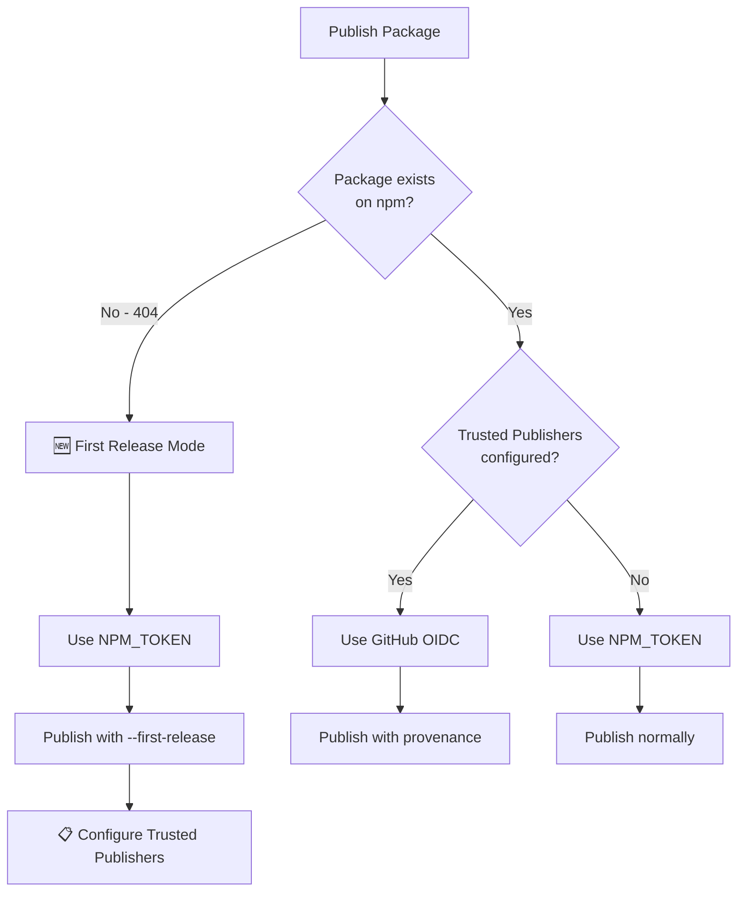
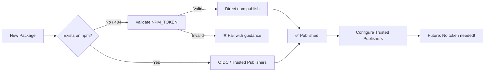

# NPM Authentication Strategy (2025+)

> **📚 Part of [CI/CD Pipeline Documentation](../CICD_PIPELINE.md)**
>
> Related docs: [Failure Scenarios](./FAILURE_SCENARIOS.md) • [Versioning & Releases section in CONTRIBUTING.md](../CONTRIBUTING.md#-versioning--releases-changesets)

---

## 📑 Table of Contents

- [Two-Tier Strategy Overview](#two-tier-authentication-strategy)
- [Method 1: Trusted Publishers (Recommended)](#method-1-npm-trusted-publishers-recommended)
- [Method 2: NPM_TOKEN (Legacy)](#method-2-npm_token-legacyfirst-release)
- [First Release Flow](#first-release-flow)
- [Error Diagnostics](#actionable-error-diagnostics)
- [Security Features](#security-features)

---

## Two-Tier Authentication Strategy


```mermaid
flowchart TD
    START[Publish Package] --> CHECK{Package exists<br>on npm?}

    CHECK -->|No - 404| FIRST[🆕 First Release Mode]
    CHECK -->|Yes| TRUSTED{Trusted Publishers<br>configured?}

    FIRST --> TOKEN[Use NPM_TOKEN]
    TOKEN --> PUBLISH1[Publish with --first-release]
    PUBLISH1 --> SETUP[📋 Configure Trusted Publishers]

    TRUSTED -->|Yes| OIDC[Use GitHub OIDC]
    TRUSTED -->|No| TOKEN2[Use NPM_TOKEN]

    OIDC --> PUBLISH2[Publish with provenance]
    TOKEN2 --> PUBLISH3[Publish normally]
```

```
┌────────────────────────────────────────────────────────────────────┐
│  TWO-TIER AUTHENTICATION STRATEGY                                 │
├────────────────────────────────────────────────────────────────────┤
│                                                                    │
│  🥇 PRIORITY 1: NPM Trusted Publishers (OIDC)                      │
│     • Uses GitHub OIDC to mint short-lived tokens                 │
│     • No secrets needed after initial setup                       │
│     • Publishes with provenance attestation                       │
│     • Recommended for existing packages                           │
│                                                                    │
│  🥈 PRIORITY 2: NPM_TOKEN (Legacy)                                 │
│     • Required ONLY for first-time releases                       │
│     • After first publish, switch to Trusted Publishers           │
│     • Uses Granular Access Token with minimal scopes              │
│                                                                    │
└────────────────────────────────────────────────────────────────────┘
```

---

## Method 1: NPM Trusted Publishers (Recommended)

**For packages that already exist on npm.**

| Aspect         | Value                                        |
| -------------- | -------------------------------------------- |
| **Security**   | ✅ No secrets needed - uses GitHub OIDC      |
| **Provenance** | ✅ Cryptographic attestation of build origin |
| **Setup**      | One-time configuration per package           |

### Setup Steps

1. Go to: `npmjs.com` → Package → Settings → Publishing access
2. Click: "Add trusted publisher"
3. Select: GitHub Actions
4. Configure:

| Field           | Value                           |
| --------------- | ------------------------------- |
| **Repository**  | `ofri-peretz/eslint`            |
| **Workflow**    | `.github/workflows/release.yml` |
| **Environment** | `production`                    |

5. Future releases will use OIDC (no `NPM_TOKEN` needed!)

---

## Method 2: NPM_TOKEN (Legacy/First-Release)

**Required for NEW packages that don't exist on npm yet.**

| Aspect         | Value                              |
| -------------- | ---------------------------------- |
| **When**       | First-time publish only            |
| **Token Type** | Granular Access Token              |
| **Scopes**     | Read and write for target packages |

### How to Create

1. Go to: `npmjs.com` → Avatar → Access Tokens
2. Generate: Granular Access Token
3. Scopes: Read and write for target packages
4. Add to: GitHub → Repo Settings → Secrets → `NPM_TOKEN`

**After first publish:** Configure Trusted Publishers and the token is no longer needed.

---

## First Release Flow

The workflow automatically detects and handles first releases using **direct npm publish**:


```mermaid
flowchart LR
    A[New Package] --> B{Exists on npm?}
    B -->|No / 404| C[Validate NPM_TOKEN]
    C -->|Valid| D[Direct npm publish]
    C -->|Invalid| E[❌ Fail with guidance]
    B -->|Yes| F[OIDC / Trusted Publishers]
    D --> G[✅ Published]
    F --> G
    G --> H[Configure Trusted Publishers]
    H --> I[Future: No token needed!]
```

### Why First Releases Are Different

**OIDC Trusted Publishers cannot create new packages on npm.** The package must already exist before OIDC can be used. Therefore, first releases require a valid `NPM_TOKEN`.

### How the Pipeline Handles It

```bash
# 1. Detect first release
npm view "$NPM_NAME" name  # Returns 404 for new packages

# 2. Validate NPM_TOKEN is available and valid
npm whoami --registry=https://registry.npmjs.org/
# ✅ Token valid - authenticated as: your-npm-username

# 3. Configure token auth in dist directory
echo "//registry.npmjs.org/:_authToken=\${NPM_TOKEN}" > dist/packages/$PACKAGE/.npmrc

# 4. Publish directly with npm (not pnpm/nx)
cd dist/packages/$PACKAGE
npm publish --access public --tag latest

# 5. Clean up .npmrc
rm -f .npmrc
```

### Key Behaviors

| Aspect               | First Release          | Existing Package                |
| -------------------- | ---------------------- | ------------------------------- |
| **Detection**        | `npm view` returns 404 | `npm view` returns package info |
| **Auth Method**      | NPM_TOKEN (Granular)   | OIDC (Trusted Publishers)       |
| **Publish Command**  | Direct `npm publish`   | `gh workflow run release.yml`       |
| **Provenance**       | Not available          | ✅ Enabled                      |
| **Token Validation** | ✅ Pre-flight check    | Not needed                      |

### Pre-Flight Token Validation

Before attempting first publish, the pipeline validates the token:

```bash
🔍 Validating NPM_TOKEN...
   ✅ Token valid - authenticated as: ofri-peretz
```

If the token is invalid:

```bash
❌ FAILED: eslint-plugin-mongodb-security
   └─ NPM_TOKEN is invalid or expired
   └─ Fix: Generate new token at npmjs.com → Access Tokens
```

### Post-First-Release Guidance

After a successful first release, you'll see:

```
🎉 First release success!
   └─ Next step: Configure Trusted Publishers for future releases
   └─ Go to: npmjs.com → eslint-plugin-xyz → Settings → Publishing access
   └─ Add: GitHub Actions (repo: ofri-peretz/eslint, workflow: release.yml)
```

---

## Actionable Error Diagnostics

All NPM publish errors include detailed diagnostic boxes:

### 401 Unauthorized

```
┌─────────────────────────────────────────────────────────────────┐
│ ❌ NPM PUBLISH FAILED: 401 UNAUTHORIZED                         │
├─────────────────────────────────────────────────────────────────┤
│ 🔍 ROOT CAUSE: Authentication credentials invalid or expired    │
│                                                                 │
│ 📋 FIX OPTIONS:                                                 │
│   OPTION A - Trusted Publishers (Recommended):                  │
│      Configure at npmjs.com → Package → Settings                │
│   OPTION B - NPM Token:                                         │
│      Generate new token and update NPM_TOKEN secret             │
└─────────────────────────────────────────────────────────────────┘
```

### 403 Forbidden

```
┌─────────────────────────────────────────────────────────────────┐
│ ❌ NPM PUBLISH FAILED: 403 FORBIDDEN                            │
├─────────────────────────────────────────────────────────────────┤
│ 🔍 ROOT CAUSE: Token lacks permission for this package          │
│                                                                 │
│ 📋 CHECKLIST:                                                   │
│    □ Token has 'Read and write' scope for this package?         │
│    □ Package name is not taken by another user?                 │
│    □ You are a maintainer/owner of this package on npm?         │
│    □ 2FA is not blocking automated publishes?                   │
└─────────────────────────────────────────────────────────────────┘
```

### Network Error

```
┌─────────────────────────────────────────────────────────────────┐
│ ❌ NPM PUBLISH FAILED: NETWORK ERROR                            │
├─────────────────────────────────────────────────────────────────┤
│ 🔍 ROOT CAUSE: Cannot reach npm registry                        │
│                                                                 │
│ 💡 ACTION: Wait a few minutes and re-run the workflow           │
│    Check: https://status.npmjs.org/                             │
└─────────────────────────────────────────────────────────────────┘
```

---

## Security Features

| Feature                       | Status                         | Notes                            |
| ----------------------------- | ------------------------------ | -------------------------------- |
| NPM Trusted Publishers (OIDC) | ✅ Supported                   | Preferred for existing packages  |
| NPM_TOKEN (Granular Access)   | ✅ Fallback                    | Required for first-release only  |
| `id-token: write` permission  | ✅ Configured                  | Required for OIDC/provenance     |
| `environment: production`     | ✅ Configured                  | GitHub environment protection    |
| `NPM_CONFIG_PROVENANCE: true` | ✅ Enabled                     | npm provenance attestation       |
| Concurrency locking           | ✅ `cancel-in-progress: false` | Queue concurrent releases        |
| Actionable error messages     | ✅ Enabled                     | Clear 401/403/404 diagnosis      |
| First-release auto-detection  | ✅ Enabled                     | Auto-adds `--first-release` flag |

---

## Quick Fix Reference

| Problem              | Solution                                                          |
| -------------------- | ----------------------------------------------------------------- |
| **401 Unauthorized** | Regenerate NPM_TOKEN or configure Trusted Publishers              |
| **403 Forbidden**    | Check token scopes, package ownership, 2FA settings               |
| **404 Not Found**    | Normal for first release - uses `--first-release` flag            |
| **Network Error**    | Check https://status.npmjs.org/, re-run workflow                  |
| **First release**    | Workflow handles automatically, then configure Trusted Publishers |

---

> **[← Back to Main CI/CD Documentation](../CICD_PIPELINE.md)**
