# Nx Release Guide

> **📚 Part of [CI/CD Pipeline Documentation](../CICD_PIPELINE.md)**
>
> Related docs: [Failure Scenarios](./FAILURE_SCENARIOS.md) • [NPM Authentication](./NPM_AUTHENTICATION.md)

---

This guide explains how Nx Release works in this repository. For official documentation, see:

- [Customize Conventional Commit Types](https://nx.dev/docs/guides/nx-release/customize-conventional-commit-types)
- [Automatically Version with Conventional Commits](https://nx.dev/docs/guides/nx-release/automatically-version-with-conventional-commits)
- [Automate GitHub Releases](https://nx.dev/docs/guides/nx-release/automate-github-releases)

---

## 📑 Table of Contents

- [Automatic Versioning](#1-automatic-versioning-with-conventional-commits)
- [Customizing Commit Types](#2-customizing-conventional-commit-types)
- [GitHub Releases](#3-automating-github-releases)
- [This Repo's Configuration](#quick-reference-this-repos-configuration)
- [Common Errors](#common-errors--fixes)

---

## 1. Automatic Versioning with Conventional Commits

**Purpose:** Automated version bumps based on commit messages—perfect for CI/CD.

### Enable in `nx.json`

```json
{
  "release": {
    "version": {
      "conventionalCommits": true
    }
  }
}
```

### How Nx Determines the Version Bump


| Commit Type        | Version Bump      |
| ------------------ | ----------------- |
| `feat`             | **minor** (0.x.0) |
| `fix`              | **patch** (0.0.x) |
| `BREAKING CHANGE:` | **major** (x.0.0) |

### Example Git History

```
- fix(pkg-1): fix something
- feat(pkg-2): add a new feature
- chore(pkg-3): update docs
- chore(release): 1.0.0
```

**Result:** `1.1.0` (minor bump because a `feat` commit exists)

### "No Changes Detected" Behavior

If Nx Release doesn't find relevant commits since last release, it will **skip releasing** that project.

> **Note:** Our pipeline uses [R06 (Forced Patch Fallback)](./FAILURE_SCENARIOS.md#r06-no-conventional-commits) to override this when needed.

---

## 2. Customizing Conventional Commit Types

**Purpose:** Fine-tune which commit types trigger version bumps and changelog entries.

### Full Configuration Example

```json
{
  "release": {
    "conventionalCommits": {
      "types": {
        // Standard types with custom bumps
        "feat": { "semverBump": "minor" },
        "fix": { "semverBump": "patch" },
        "perf": { "semverBump": "patch" },

        // Documentation triggers patches in this repo
        "docs": {
          "semverBump": "patch",
          "changelog": { "title": "📚 Documentation" }
        },

        // Disable versioning but keep in changelog
        "style": {
          "semverBump": "none"
        },

        // Hide from changelog entirely
        "chore": {
          "changelog": false
        },

        // Completely disable (no version, no changelog)
        "wip": false,

        // Custom non-standard type
        "security": {
          "semverBump": "patch",
          "changelog": { "title": "🔒 Security" }
        }
      }
    }
  }
}
```

### Configuration Options

| Option                            | Effect                                             |
| --------------------------------- | -------------------------------------------------- |
| `"type": false`                   | Disable completely (no version bump, no changelog) |
| `"semverBump": "none"`            | No version bump, but still appears in changelog    |
| `"semverBump": "patch/minor"`     | Trigger specific version bump                      |
| `"changelog": false`              | Trigger version bump but hide from changelog       |
| `"changelog": { "hidden": true }` | Same as `"changelog": false`                       |
| `"changelog": { "title": "X" }`   | Custom changelog section title                     |

### This Repo's Commit Type Mapping

| Commit Type        | Version Bump  | Example                                |
| ------------------ | ------------- | -------------------------------------- |
| `feat:`            | Minor (0.x.0) | `feat(crypto): add AES-256 support`    |
| `fix:`             | Patch (0.0.x) | `fix(jwt): validate expiry correctly`  |
| `docs:`            | Patch (0.0.x) | `docs(readme): update examples`        |
| `refactor:`        | Patch (0.0.x) | `refactor(core): simplify parser`      |
| `perf:`            | Patch (0.0.x) | `perf(lint): cache AST traversal`      |
| `style:`           | Patch (0.0.x) | `style: format code`                   |
| `test:`            | Patch (0.0.x) | `test: add edge cases`                 |
| `build:`           | Patch (0.0.x) | `build: update dependencies`           |
| `ci:`              | Patch (0.0.x) | `ci: fix workflow`                     |
| `chore:`           | Patch (0.0.x) | `chore: update gitignore`              |
| `BREAKING CHANGE:` | Major (x.0.0) | Footer: `BREAKING CHANGE: removed API` |

> All types trigger **patch** bumps except `feat` → **minor**. This ensures any change results in a version bump.

---

## 3. Automating GitHub Releases

**Purpose:** Automatically create GitHub Releases with changelogs.

### Authentication

```mermaid
flowchart LR
    A[Nx Release] --> B{GITHUB_TOKEN?}
    B -->|Yes| C[Use token]
    B -->|No| D{GH_TOKEN?}
    D -->|Yes| C
    D -->|No| E{gh CLI auth?}
    E -->|Yes| C
    E -->|No| F[❌ Fail]
```



In GitHub Actions, `GITHUB_TOKEN` is automatically available.

### Enable GitHub Release Creation

```json
{
  "release": {
    "changelog": {
      "workspaceChangelog": {
        "createRelease": "github",
        "file": "CHANGELOG.md"
      }
    }
  }
}
```

### GitHub Release Contents

When a release is created, Nx generates a changelog with:

- `feat` commits in "Features" section
- `fix` commits in "Bug Fixes" section
- Other enabled types in their respective sections

### Project-Level Changelogs (Independent Releases)

Since this repo uses `projectsRelationship: "independent"`:

```json
{
  "release": {
    "changelog": {
      "projectChangelogs": true
    }
  }
}
```

This creates separate changelogs and GitHub releases per package (e.g., `eslint-plugin-jwt@1.0.5`).

### Disable Local CHANGELOG.md

If you only want GitHub Releases without local files:

```json
{
  "release": {
    "changelog": {
      "workspaceChangelog": {
        "file": false,
        "createRelease": "github"
      }
    }
  }
}
```

### Preview Before Releasing

```bash
nx release --dry-run
```

---

## Quick Reference: This Repo's Configuration

| Feature                    | Configuration                                                  |
| -------------------------- | -------------------------------------------------------------- |
| **Automatic Versioning**   | `release.version.specifierSource: "conventional-commits"`      |
| **Custom Commit Types**    | `release.conventionalCommits.types: { ... }`                   |
| **GitHub Releases**        | `release.changelog.workspaceChangelog.createRelease: "github"` |
| **Independent Releases**   | `release.projectsRelationship: "independent"`                  |
| **Per-Project Changelogs** | `release.changelog.projectChangelogs: true`                    |
| **Release Tag Pattern**    | `release.releaseTagPattern: "{projectName}@{version}"`         |

---

## Common Errors & Fixes

| Error Message                              | Root Cause                               | Fix                                   |
| ------------------------------------------ | ---------------------------------------- | ------------------------------------- |
| `No projects are set to be processed`      | Package not in `release.projects`        | Add to `nx.json` → `release.projects` |
| `package.json file not available in dist/` | `manifestRootsToUpdate` includes `dist/` | Remove `dist/{projectRoot}`           |
| `No changes detected`                      | No conventional commits                  | Use `--version-specifier=patch`       |

---

## Package Dependencies


Each package must have correct dependencies in `project.json` or inferred by Nx.

---

> **[← Back to Main CI/CD Documentation](../CICD_PIPELINE.md)**
