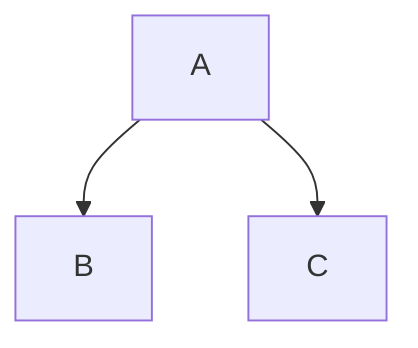

# Fumadocs Markdown Reference

> **Source:** [fumadocs.dev/docs/markdown](https://www.fumadocs.dev/docs/markdown)  
> **Downloaded:** 2026-01-31

---

## Introduction

Fumadocs provides many useful extensions to MDX, a markup language. MDX is a superset of Markdown with JSX syntax—it allows you to import components and use them in the document, or even write JavaScript.

**Supported formats:**

- [MDX Syntax](https://mdxjs.com/docs/what-is-mdx/#mdx-syntax)
- [GFM (GitHub Flavored Markdown)](https://github.github.com/gfm)

---

## Basic MDX Syntax

```mdx
import { Component } from './component';

<Component name="Hello" />

## Heading

### Heading

#### Heading

Hello World, **Bold**, _Italic_, ~~Hidden~~

1. First
2. Second
3. Third

- Item 1
- Item 2

> Quote here


| Table | Description |
| ----- | ----------- |
| Hello | World       |
```

---

## Frontmatter

Fumadocs supports YAML-based frontmatter by default. The `title` represents the page title (h1) in Fumadocs UI.

```mdx
---
title: This is a document
---

...
```

For this reason, `# Heading` (h1) is usually unused when writing Markdown/MDX unless you have custom logic for page title rendering.

**In Fumadocs MDX:** You can use the `schema` option to add frontmatter properties.

---

## Auto Links

- **Internal links** use the `<Link />` component of your React framework (e.g. `next/link`) to allow prefetching and avoid hard-reload.
- **External links** automatically get `rel="noreferrer noopener" target="_blank"` attributes for security.

```mdx
[My Link](https://github.github.com/gfm)
This also works: https://github.github.com/gfm.
```

---

## Cards

Useful for adding links:

```tsx
import { HomeIcon } from 'lucide-react';

<Cards>
  <Card
    href="https://nextjs.org/docs/app/building-your-application/data-fetching/fetching-caching-and-revalidating"
    title="Fetching, Caching, and Revalidating"
  >
    Learn more about caching in Next.js
  </Card>
  <Card title="href is optional">Learn more about `fetch` in Next.js.</Card>
  <Card icon={<HomeIcon />} href="/" title="Home">
    You can include icons too.
  </Card>
</Cards>;
```

### "Further Reading" Section

You can dynamically show peer pages in the same folder:

```tsx
import { getPageTreePeers } from 'fumadocs-core/page-tree';
import { source } from '@/lib/source';

<Cards>
  {getPageTreePeers(source.getPageTree(), '/docs/my-page').map((peer) => (
    <Card key={peer.url} title={peer.name} href={peer.url}>
      {peer.description}
    </Card>
  ))}
</Cards>;
```

---

## Callouts

Useful for adding tips/warnings. You can specify the type of callout:

- `info` (default)
- `warn` / `warning`
- `error`
- `success`
- `idea`

```mdx
<Callout>Hello World</Callout>

<Callout title="Title">Hello World</Callout>

<Callout title="Title" type="error">
  Hello World
</Callout>

<Callout title="Title" type="idea">
  Hello World
</Callout>
```

---

## Headings

An anchor is automatically applied to each heading. It sanitizes invalid characters like spaces (e.g. `Hello World` → `hello-world`).

```mdx
# Hello `World`
```

### TOC Settings

The table of contents (TOC) will be generated based on headings. You can customize heading behavior:

```mdx
# Heading [!toc]

This heading will be hidden from TOC.

# Another Heading [toc]

This heading will **only** be visible in TOC, you can use it to add additional TOC items.
Like headings rendered in a React component:

<MyComp />
```

### Custom Anchor

Add `[#slug]` to customize heading anchors:

```mdx
# heading [#my-heading-id]
```

You can also chain it with TOC settings:

```mdx
# heading [toc] [#my-heading-id]
```

To link people to a specific heading, add the heading id to hash fragment: `/page#my-heading-id`.

---

## Codeblock

Syntax highlighting is supported by default using [Rehype Code](https://www.fumadocs.dev/docs/headless/mdx/rehype-code).

````mdx
```js
console.log('Hello World');
```
````

```js title="My Title"
console.log('Hello World');
```

`````

### Line Numbers

Show line numbers (also works with Twoslash and other transformers):

````mdx
```ts twoslash lineNumbers
const a = 'Hello World';
//    ^?
console.log(a);
`````

`````

Set the initial value of line numbers:

````mdx
```js lineNumbers=4
function main() {
  console.log('starts from 4');
  return 0;
}
```
`````

### Shiki Transformers

Fumadocs supports some [Shiki Transformers](https://shiki.style/packages/transformers) for highlighting/styling specific lines:

````mdx
```tsx
// highlight a line
<div>Hello World</div> // [!code highlight]

// highlight a word
// [!code word:Fumadocs]
<div>Fumadocs</div>

// diff styles
console.log('hewwo'); // [!code --]
console.log('hello'); // [!code ++]

// focus
return new ResizeObserver(() => {}) // [!code focus]
```
````

### Tab Groups

````mdx
```ts tab="Tab 1"
console.log('A');
```

```ts tab="Tab 2"
console.log('B');
```
````

Enable MDX in tab values:

```ts
import { defineConfig } from 'fumadocs-mdx/config';

export default defineConfig({
  mdxOptions: {
    remarkCodeTabOptions: {
      parseMdx: true,
    },
  },
});
```

---

## Include

**Only available in Fumadocs MDX.**

Reference another file (can be a Markdown/MDX document). Specify the target file path relative to the MDX file itself:

```mdx
<include>./another.mdx</include>
```

See [other usages of include](https://www.fumadocs.dev/docs/mdx/include).

---

## NPM Commands

Useful for generating commands for installing packages with different package managers:

````mdx
```npm
npm i next -D
```
````

See [remark-npm](https://www.fumadocs.dev/docs/headless/mdx/remark-npm) for details.

---

## Other Components

You can configure & use the [built-in components](https://www.fumadocs.dev/docs/ui/components) in your MDX document, such as Tabs, Accordions and Zoomable Image.

---

# Mermaid Diagrams

> **Source:** [fumadocs.dev/docs/markdown/mermaid](https://www.fumadocs.dev/docs/markdown/mermaid)

Render diagrams in your documentation with Mermaid.

## Setup

Install the required dependencies (`next-themes` is used with Fumadocs to manage light/dark mode):

```bash
npm install mermaid next-themes
```

Create the Mermaid component:

```tsx
// src/components/mdx/mermaid.tsx
'use client';
import { use, useEffect, useId, useState } from 'react';
import { useTheme } from 'next-themes';

export function Mermaid({ chart }: { chart: string }) {
  const [mounted, setMounted] = useState(false);

  useEffect(() => {
    setMounted(true);
  }, []);

  if (!mounted) return;
  return <MermaidContent chart={chart} />;
}

const cache = new Map<string, Promise<unknown>>();

function cachePromise<T>(
  key: string,
  setPromise: () => Promise<T>,
): Promise<T> {
  const cached = cache.get(key);
  if (cached) return cached as Promise<T>;

  const promise = setPromise();
  cache.set(key, promise);
  return promise;
}

function MermaidContent({ chart }: { chart: string }) {
  const id = useId();
  const { resolvedTheme } = useTheme();

  const { default: mermaid } = use(
    cachePromise('mermaid', () => import('mermaid')),
  );

  mermaid.initialize({
    startOnLoad: false,
    securityLevel: 'loose',
    fontFamily: 'inherit',
    themeCSS: 'margin: 1.5rem auto 0;',
    theme: resolvedTheme === 'dark' ? 'dark' : 'default',
  });

  const { svg, bindFunctions } = use(
    cachePromise(`${chart}-${resolvedTheme}`, () => {
      return mermaid.render(id, chart.replaceAll('\\n', '\n'));
    }),
  );

  return (
    <div
      ref={(container) => {
        if (container) bindFunctions?.(container);
      }}
      dangerouslySetInnerHTML={{ __html: svg }}
    />
  );
}
```

_(Originally inspired by [remark-mermaid](https://github.com/the-guild-org/docs/blob/main/packages/remark-mermaid/src/mermaid.tsx))_

Add the component as an MDX component:

```tsx
// mdx-components.tsx
import defaultMdxComponents from 'fumadocs-ui/mdx';
import { Mermaid } from '@/components/mdx/mermaid';
import type { MDXComponents } from 'mdx/types';

export function getMDXComponents(components?: MDXComponents): MDXComponents {
  return {
    ...defaultMdxComponents,
    Mermaid,
    ...components,
  };
}
```

## Usage

Use it in MDX files:

```mdx
<Mermaid
  chart="
graph TD;
  subgraph AA [Consumers]
    A[Mobile app];
    B[Web app];
    C[Node.js client];
  end
  subgraph BB [Services]
    E[REST API];
    F[GraphQL API];
    G[SOAP API];
  end
  Z[GraphQL API];
  A --> Z;
  B --> Z;
  C --> Z;
  Z --> E;
  Z --> F;
  Z --> G;
"
/>
```

## As CodeBlock

You can convert mermaid codeblocks into the MDX usage with the `remarkMdxMermaid` remark plugin:

```ts
// source.config.ts
import { remarkMdxMermaid } from 'fumadocs-core/mdx-plugins';
import { defineConfig } from 'fumadocs-mdx/config';

export default defineConfig({
  mdxOptions: {
    remarkPlugins: [remarkMdxMermaid],
  },
});
```

Then use standard mermaid codeblocks:

````mdx

````

---

# Twoslash

> **Source:** [fumadocs.dev/docs/markdown/twoslash](https://www.fumadocs.dev/docs/markdown/twoslash)

Use TypeScript Twoslash in your docs for interactive type information.

## Setup

Install the required dependencies:

```bash
npm install fumadocs-twoslash twoslash
```

For Next.js, you need to externalize the following deps:

```ts
// next.config.ts
const config = {
  reactStrictMode: true,
  serverExternalPackages: ['typescript', 'twoslash'],
};
```

Add to your Shiki transformers:

```ts
// source.config.ts
import { defineConfig } from 'fumadocs-mdx/config';
import { transformerTwoslash } from 'fumadocs-twoslash';
import { rehypeCodeDefaultOptions } from 'fumadocs-core/mdx-plugins';

export default defineConfig({
  mdxOptions: {
    rehypeCodeOptions: {
      themes: {
        light: 'github-light',
        dark: 'github-dark',
      },
      transformers: [
        ...(rehypeCodeDefaultOptions.transformers ?? []),
        transformerTwoslash(),
      ],
      // important: Shiki doesn't support lazy loading languages for codeblocks in Twoslash popups
      // make sure to define them first (e.g. the common ones)
      langs: ['js', 'jsx', 'ts', 'tsx'],
    },
  },
});
```

Add styles (**Tailwind CSS v4 is required**):

```css
/* global.css */
@import 'fumadocs-twoslash/twoslash.css';
```

Add MDX components:

```tsx
// mdx-components.tsx
import * as Twoslash from 'fumadocs-twoslash/ui';
import defaultComponents from 'fumadocs-ui/mdx';
import type { MDXComponents } from 'mdx/types';

export function getMDXComponents(components?: MDXComponents): MDXComponents {
  return {
    ...defaultComponents,
    ...Twoslash,
    ...components,
  };
}
```

## Usage

Now you can add `twoslash` meta string to codeblocks:

````mdx
```ts twoslash
console.log('Hello World');
```
````

## Cache

Optionally, enable filesystem cache with the `typesCache` option:

```ts
import { transformerTwoslash } from 'fumadocs-twoslash';
import { createFileSystemTypesCache } from 'fumadocs-twoslash/cache-fs';

transformerTwoslash({
  typesCache: createFileSystemTypesCache(),
});
```

## Example

Learn more about [Twoslash notations](https://twoslash.netlify.app/refs/notations).

````mdx
```ts twoslash
console.g;
//       ^|
```
````

Shows autocomplete suggestions like: `group`, `groupCollapsed`, `groupEnd`

````mdx
```ts twoslash
const player: Player = { name: 'Hello World' };
//    ^?
```
````

Shows type information on hover.

````mdx
```ts twoslash
// @errors: 2588
const a = '123';
a = 132;
```
````

Shows TypeScript errors inline: "Cannot assign to 'a' because it is a constant."

---

# Quick Reference Table

| Feature               | Syntax                          | Notes                                   |
| --------------------- | ------------------------------- | --------------------------------------- |
| **Callout**           | `<Callout type="info">`         | Types: info, warn, error, success, idea |
| **Cards**             | `<Cards><Card>`                 | Link cards with optional icons          |
| **Heading anchor**    | `# Title [#custom-id]`          | Custom anchor slugs                     |
| **Hide from TOC**     | `# Title [!toc]`                | Exclude heading from table of contents  |
| **TOC only**          | `# Title [toc]`                 | Show in TOC only, not in content        |
| **Line highlight**    | `// [!code highlight]`          | Highlight single line                   |
| **Word highlight**    | `// [!code word:term]`          | Highlight specific word                 |
| **Diff add**          | `// [!code ++]`                 | Show as added line                      |
| **Diff remove**       | `// [!code --]`                 | Show as removed line                    |
| **Focus**             | `// [!code focus]`              | Focus on specific line                  |
| **Line numbers**      | ` ```ts lineNumbers`            | Enable line numbers                     |
| **Start line**        | ` ```ts lineNumbers=10`         | Start line count from 10                |
| **Code tabs**         | ` ```ts tab="Tab Name"`         | Group codeblocks into tabs              |
| **Include file**      | `<include>./file.mdx</include>` | Include content from another file       |
| **NPM command**       | ` ```npm npm i pkg`             | Show multi-package-manager commands     |
| **Mermaid inline**    | `<Mermaid chart="...">`         | Inline Mermaid component                |
| **Mermaid codeblock** | ` ```mermaid`                   | Requires remarkMdxMermaid plugin        |
| **Twoslash**          | ` ```ts twoslash`               | TypeScript type annotations             |
