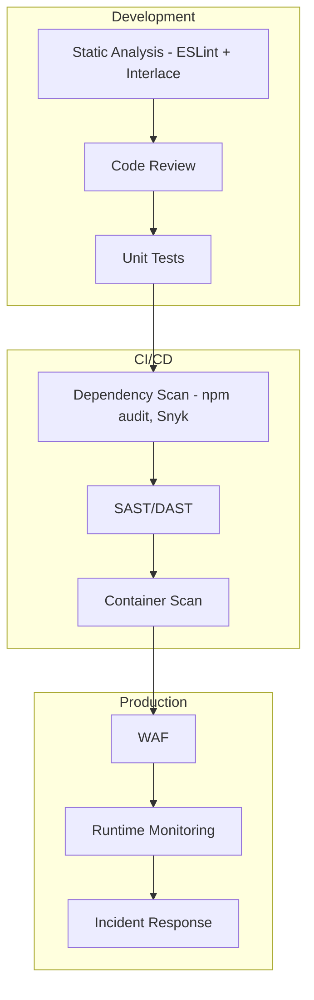

# ESLint Interlace Docs App - Migration Reference

> **Purpose**: This document captures all key concepts, components, and design decisions from the current docs app before starting a fresh Fumadocs installation. Use this as your reference when rebuilding.

---

## Table of Contents

1. [Branding & Identity](#1-branding--identity)
2. [Dynamic Content from GitHub](#2-dynamic-content-from-github)
3. [Mermaid Diagram System](#3-mermaid-diagram-system)
4. [Quality Content Philosophy (FPs, FNs, Coverage)](#4-quality-content-philosophy-fps-fns-coverage)
5. [Advanced Topics Concepts](#5-advanced-topics-concepts)
6. [Theming System](#6-theming-system)
7. [API Layer & Backend Services](#7-api-layer--backend-services)
8. [Key Components Reference](#8-key-components-reference)
9. [Critical Implementation Notes](#9-critical-implementation-notes)

---

## 1. Branding & Identity

### ESLint Interlace Logo

The logo is a modified ESLint hexagon with an "I" (Interlace) in the center made of 5 stacked bars.

**Location**: `public/eslint-interlace-logo.svg`

**Key Features**:

- SVG with embedded CSS for automatic light/dark mode switching
- Uses `prefers-color-scheme: dark` media query
- Brand colors:
  - Light mode: `--eslint-purple: #4B32C3` (outer), `--eslint-light-purple: #8080F2` (inner)
  - Dark mode: `--eslint-white: #FFFFFF` (outer), `--eslint-grey: #999999` (inner)

**Logo Structure**:

```svg
<!-- 5 horizontal bars forming the "I" -->
<g id="interlace-i">
    <rect class="interlace-bar" x="136.4" y="88" width="22" height="12" rx="2" />
    <rect class="interlace-bar" x="136.4" y="104" width="22" height="12" rx="2" />
    <rect class="interlace-bar" x="136.4" y="120" width="22" height="12" rx="2" />
    <rect class="interlace-bar" x="136.4" y="136" width="22" height="12" rx="2" />
    <rect class="interlace-bar" x="136.4" y="152" width="22" height="12" rx="2" />
</g>
```

### Brand Colors (CSS Variables)

```css
:root {
  --fd-primary: 263 80% 45%; /* Purple */
  --fd-primary-foreground: 0 0% 100%;
}

.dark {
  --fd-primary: 270 75% 75%; /* Lighter purple */
  --fd-primary-foreground: 0 0% 5%;
}
```

### SEO & Metadata

Key metadata from `layout.tsx`:

- **Title template**: `%s | ESLint Interlace`
- **Description**: Dynamic (uses plugin-stats.json for rule/plugin counts)
- **Keywords**: eslint, security, owasp, cwe, cvss, static-analysis, llm-optimized, ai-assistant
- **Author**: Ofri Peretz
- **Base URL**: `eslint.interlace.tools`

---

## 2. Dynamic Content from GitHub

### Changelog Generation (GitHubChangelogContent.tsx)

**Concept**: Changelogs are NOT stored locally. They are fetched LIVE from GitHub raw content.

**Implementation**:

```typescript
// API hook fetches from GitHub
const { data: rawText } = useGitHubChangelog(repo, path);

// Example usage in MDX:
<GitHubChangelog
  repo="ofri-peretz/eslint"
  path="packages/eslint-plugin-secure-coding/CHANGELOG.md"
/>
```

**Key Features**:

1. **Markdown parsing**: Parses `## [version] - date` format
2. **Tag extraction**: Auto-tags entries (Breaking, Added, Fixed, Performance)
3. **Pagination**: Built-in with URL param support (`?page=1`)
4. **Anchor links**: Each version has clickable anchor (e.g., `#v4.0.0`)
5. **Timeline UI**: Purple dot timeline with hover effects
6. **Table preprocessing**: Fixes broken markdown tables (empty line handling)

**Important**: The path MUST end with `CHANGELOG.md` for validation.

### Roadmap (GitHubRoadmap.tsx)

```typescript
<GitHubRoadmap repo="ofri-peretz/eslint" path="ROADMAP.md" />
```

Renders the monorepo's root `ROADMAP.md` file.

---

## 3. Mermaid Diagram System

### Architecture

1. **Entry Point**: `Mermaid.tsx` (client wrapper with dynamic import)
2. **Renderer**: `MermaidContent.tsx` (actual rendering logic)
3. **Styling**: `src/app/styles/components/mermaid.css`
4. **MDX Integration**: `source.config.ts` uses `remarkMdxMermaid`

### MDX Components Setup

```typescript
// mdx-components.tsx
if (child.props.className === 'language-mermaid') {
  return <Mermaid>{chart}</Mermaid>;
}
```

### Key Features (MermaidContent.tsx)

1. **Theme-aware rendering**: Full light/dark theme variables
2. **Pan & Zoom**: Uses `panzoom` library
3. **Caching**: `mermaidCache` Map prevents re-renders
4. **Auto-centering**: Fits diagram to 95% of canvas
5. **Error handling**: Shows fallback on parse errors

### Theme Variables (Dark Mode Example)

```typescript
themeVariables: {
  primaryColor: '#a78bfa',
  primaryTextColor: '#f1f5f9',
  primaryBorderColor: '#6366f1',
  mainBkg: '#1e293b',
  nodeTextColor: '#f1f5f9',
  // ... full theme
}
```

### CSS Notes (WCAG Compliance)

```css
/* Light mode text: Near-black */
.mermaid text {
  fill: hsl(0 0% 15%);
}

/* Dark mode text: Near-white */
.dark .mermaid text {
  fill: hsl(0 0% 92%);
}

/* Lines thicker for visibility */
.mermaid .flowchart-link {
  stroke-width: 2px;
}
```

### Mermaid Escaping (sync-rules-docs.mjs)

````javascript
// Fix Mermaid charts: quote labels with special characters (like emojis)
finalContent = finalContent.replace(
  /```mermaid\n([\s\S]*?)```/g,
  (match, chart) => {
    // Auto-quotes lines with emojis or special chars
  },
);
````

---

## 4. Quality Content Philosophy (FPs, FNs, Coverage)

### Core Philosophy

Every security rule documents:

1. **Known False Positives** - Cases that may trigger incorrectly
2. **Known False Negatives** - Cases the rule cannot detect
3. **When Not To Use** - Legitimate exceptions

### Standard Documentation Sections

```markdown
## Known False Positives

This rule may incorrectly flag:

- Sanitized input that's actually safe
- ...

## Known False Negatives

This rule **cannot detect**:

- Dynamic code paths
- Complex data flows
- ...
```

### Interlace's Approach (from static-analysis.mdx)

1. **Conservative Pattern Matching**: Flag potentially dangerous patterns
2. **Sanitizer Awareness**: Recognize common sanitization to reduce FPs
3. **LLM-Optimized Messages**: Error messages help AI understand issues
4. **Documented Limitations**: Every rule explicitly documents what it misses

### Coverage Content Concept

The `/docs/coverage` page (`CoveragePage.tsx`) displays:

- Real-time test coverage metrics
- Per-plugin coverage percentages
- Visual badges from Codecov

---

## 5. Advanced Topics Concepts

### Folder Structure

```
content/docs/(getting-started)/concepts/
├── how-ast-works.mdx        # AST Explorer, ESLint internals
├── mcp-integration.mdx      # Model Context Protocol for AI
├── static-analysis.mdx      # SAST limitations, halting problem
├── security-standards.mdx   # OWASP, CWE, CVSS mapping
├── dto-serialization-security.mdx  # API response security
└── fixable-rules.mdx        # Why some rules can't auto-fix
```

### Key Concept: Static Analysis Limitations

**The Gist**: "Static analysis is like a security guard who checks IDs at the door—great at catching known fakes, but can't follow people around once they're inside."

**What ESLint CAN detect**:

- Direct patterns (`eval()`, `innerHTML`, SQL concat)
- Simple variable tracking
- API misuse
- Configuration issues

**What ESLint CANNOT detect**:

- Runtime values from external sources
- Dynamic code (eval'd strings, dynamic imports)
- Business logic flaws
- Complex async data flows
- Third-party vulnerabilities (need npm audit/Snyk)

### Mermaid Diagram: Security Strategy



---

## 6. Theming System

### CSS Architecture

**Philosophy**: Trust Fumadocs defaults. Only add what's REQUIRED for Tailwind 4.

```css
/* Framework imports */
@import 'tailwindcss';
@import 'fumadocs-ui/css/neutral.css';
@import 'fumadocs-ui/css/preset.css';

/* Required for Fumadocs scanning */
@source "../../node_modules/fumadocs-ui";
```

### Tailwind 4 Compatibility Issues

**Must be provided manually** (Tailwind 4 won't generate from node_modules):

1. Grid area utilities
2. Responsive visibility classes

```css
/* Grid areas */
#nd-toc {
  grid-area: toc;
}
#nd-page {
  grid-area: main;
}
#nd-sidebar {
  grid-area: sidebar;
}

/* Responsive visibility */
@media (max-width: 1279px) {
  #nd-toc {
    display: none !important;
  }
}

@media (min-width: 1280px) {
  .\[grid-area\:toc-popover\] {
    display: none !important;
  }
}
```

### Custom Variants

```css
@custom-variant dark (&:is(.dark *));

@custom-variant layout {
  #nd-docs-layout:has(&),
  #nd-notebook-layout:has(&),
  #nd-home-layout:has(&) {
    @slot;
  }
}
```

### Component Style Imports

```css
@import './styles/components/tables.css';
@import './styles/components/code-blocks.css';
@import './styles/components/mermaid.css';
@import './styles/utilities.css';
```

---

## 7. API Layer & Backend Services

### Architecture Overview

The docs app uses a combination of:

- **Next.js API Routes** (`src/app/api/`) - Backend proxies for external APIs
- **React Query Hooks** (`src/lib/api.ts`) - Client-side data fetching with caching
- **External Services** - GitHub, Dev.to, Codecov

### API Routes (src/app/api/)

#### 1. Dev.to Articles (`/api/devto-articles`)

**Purpose**: Fetches and filters articles from Dev.to with plugin-specific relevance scoring.

**Query Params**:

- `plugin` - Plugin name for tag-based filtering (e.g., `jwt`, `pg`, `express-security`)
- `limit` - Maximum articles to return (default: 6)

**Key Features**:

- Uses `DEVTO_API_KEY` env var for authenticated API (includes `page_views_count`)
- Falls back to public API if auth fails
- Relevance scoring based on tag matching

**Tag Mapping System**:

```typescript
const PLUGIN_TAG_MAPPING: Record<string, TagMapping> = {
  'secure-coding': {
    primaryTags: ['owasp', 'secure-coding', 'cwe'], // Score: +10 per match
    secondaryTags: ['eslint', 'security', 'javascript'], // Score: +2 per match
  },
  pg: {
    primaryTags: ['postgres', 'postgresql', 'pg'],
    secondaryTags: ['sql', 'database', 'security'],
  },
  jwt: {
    primaryTags: ['jwt', 'jsonwebtoken', 'jose'],
    secondaryTags: ['authentication', 'security', 'token'],
  },
  // ... and more for each plugin
};
```

**Scoring Algorithm**:

```typescript
// Primary tag in article tags: +10 points
// Primary tag in title: +5 bonus
// Secondary tag match: +2 points
// Minimum 10 points required for inclusion
```

#### 2. Codecov Stats (`/api/stats`)

**Purpose**: Proxies Codecov API for repository coverage metrics.

```typescript
// Fetches from: https://codecov.io/api/v2/github/ofri-peretz/repos/eslint
// Returns: { totals: { files, lines, hits, misses, coverage }, name }
```

**Fallback**: Returns hardcoded fallback if Codecov is unreachable.

#### 3. Plugin Stats (`/api/plugin-stats`)

**Purpose**: Returns ecosystem-wide plugin statistics.

**Implementation**:

- Development: Uses local `src/data/plugin-stats.json`
- Production: Fetches from GitHub raw content (daily refresh)

```typescript
// Returns: { plugins: [...], totalRules, totalPlugins, allPluginsCount, generatedAt }
```

### Client-Side API Layer (src/lib/api.ts)

#### Core Data Types

```typescript
interface DevToArticle {
  id: number;
  title: string;
  description: string;
  url: string;
  cover_image: string | null;
  social_image: string | null;
  published_at: string;
  reading_time_minutes: number;
  positive_reactions_count: number;
  comments_count: number;
  page_views_count?: number; // Only with auth
  tag_list: string[];
  user: { name; username; profile_image };
}

interface CodecovTotals {
  files: number;
  lines: number;
  hits: number;
  misses: number;
  coverage: number;
}

interface PluginStats {
  plugins: PluginRecord[];
  totalRules: number;
  totalPlugins: number;
  allPluginsCount: number;
  generatedAt: string;
}

type ChangelogPath = `${string}CHANGELOG.md`; // Must end with CHANGELOG.md
```

#### API Service Object

```typescript
export const api = {
  codecov: {
    getRepo: () => fetcher<CodecovRepo>('/api/stats'),
    getComponents: () => fetcher<CodecovComponent[]>('/api/stats/components'),
  },
  devto: {
    getArticles: (plugin, limit) => fetcher<DevToArticle[]>('/api/devto-articles?...'),
    getTags: async () => /* Returns unique tags from all articles */,
  },
  github: {
    getRawFile: (repo, path) => fetcher<string>(`https://raw.githubusercontent.com/${repo}/main/${path}`),
    getChangelog: (repo, path: ChangelogPath) => api.github.getRawFile(repo, path),
  },
  stats: {
    getPluginStats: () => fetcher<PluginStats>('/api/plugin-stats'),
  }
};
```

#### React Query Hooks

```typescript
// Coverage
useCodecovRepo()        // { data: CodecovRepo }
useCodecovComponents()  // { data: CodecovComponent[] }

// Articles
useDevToArticles(plugin?, limit?)  // { data: DevToArticle[] }
useDevToTags()                     // { data: string[] }

// GitHub Content
useGitHubChangelog(repo, path)     // { data: string } - raw markdown
useGitHubRoadmap(repo, path?)      // { data: string }

// Plugin Info
usePluginStats()                   // { data: PluginStats }
usePluginInfo(pluginName)          // { data: PluginRecord | undefined }
```

**Cache Settings**:

```typescript
export const CACHE_STALE_TIME = 1000 * 60 * 60 * 24; // 24 hours for static content
// Codecov/Plugin stats: 1 hour
```

### Articles Page Features

The `/docs/articles` page (`ArticlesPageContent.tsx`) provides:

**Filter Features**:

- Tag-based filtering (AND logic - must match ALL selected tags)
- Text search (title + description)
- Clear all filters button

**Sort Options**:

- Date (default, newest first)
- Views (requires auth API)
- Reactions count
- Comments count
- Reading time

**View Modes**:

- 1 column (mobile)
- 2 columns (tablet)
- 3 columns (desktop)

**Pagination**:

- 6 articles per page
- Previous/Next navigation
- Page number display

### Environment Variables

```bash
# Required for Dev.to authenticated API (includes view counts)
DEVTO_API_KEY=your_devto_api_key

# Base URL for canonical links
NEXT_PUBLIC_BASE_URL=https://eslint.interlace.tools

# App version
NEXT_PUBLIC_APP_VERSION=1.0.0
```

---

## 8. Key Components Reference

### Custom Components (src/components/)

| Component                            | Purpose                       |
| ------------------------------------ | ----------------------------- |
| `GitHubChangelog.tsx`                | Live changelog from GitHub    |
| `GitHubRoadmap.tsx`                  | Live roadmap from GitHub      |
| `Mermaid.tsx` / `MermaidContent.tsx` | Pan/zoom Mermaid diagrams     |
| `BenchmarkCharts.tsx`                | Performance comparison charts |
| `CoveragePage.tsx`                   | Test coverage dashboard       |
| `PluginCard.tsx`                     | Plugin showcase cards         |
| `ReadmeRulesTable.tsx`               | Rules table from README       |
| `ArticlesPage.tsx`                   | Dev.to article integration    |
| `ASTExplorer.tsx`                    | Interactive AST visualization |
| `TechLogos.tsx`                      | Technology logo grid          |
| `EcosystemStats.tsx`                 | Plugin/rule counts            |
| `LLMWorkflowDemo.tsx`                | AI workflow demonstration     |
| `ComparisonSection.tsx`              | Feature comparison table      |
| `CvssDisclaimer.tsx`                 | CVSS score disclaimer         |

### UI Components (src/components/ui/)

22 shadcn/ui-style components including:

- badge, button, card, dialog
- dropdown-menu, tabs, tooltip
- skeleton, separator, etc.

---

## 8. Critical Implementation Notes

### Font

```typescript
import { Space_Grotesk } from 'next/font/google';

const spaceGrotesk = Space_Grotesk({
  subsets: ['latin'],
  variable: '--font-space-grotesk',
});
```

### Providers Structure

```tsx
<html lang="en" className={spaceGrotesk.className} suppressHydrationWarning>
  <body suppressHydrationWarning>
    <Providers>
      <RootProvider>{children}</RootProvider>
    </Providers>
    <Analytics />
  </body>
</html>
```

### Content Organization (Folder Groups)

```
content/docs/
├── (getting-started)/    # root: true, icon: "BookOpen"
├── (security)/           # Security plugins
└── (quality)/            # Quality/architecture plugins
```

### Source Config (source.config.ts)

```typescript
import { remarkMdxMermaid, remarkNpm } from 'fumadocs-core/mdx-plugins';

export default defineConfig({
  mdxOptions: {
    remarkPlugins: [remarkMdxMermaid, remarkNpm],
  },
});
```

### Key External APIs

1. **GitHub Raw Content**: Changelogs, README, Roadmap
2. **Dev.to API**: Article fetching
3. **Codecov**: Coverage badges
4. **Vercel Analytics**: Usage tracking

---

## Files to Archive/Reference

Before starting fresh, these are the key files to keep accessible:

### Components (copy to backup)

```
src/components/
├── GitHubChangelog.tsx
├── GitHubChangelogContent.tsx
├── GitHubRoadmap.tsx
├── Mermaid.tsx
├── MermaidContent.tsx
├── BenchmarkCharts.tsx
├── BenchmarkChartsContent.tsx
├── CoveragePage.tsx
├── CoveragePageContent.tsx
├── PluginCard.tsx
├── ReadmeRulesTable.tsx
├── ASTExplorer.tsx
└── ... (all 38 components)
```

### Styles (copy to backup)

```
src/app/styles/
├── components/
│   ├── mermaid.css
│   ├── tables.css
│   └── code-blocks.css
└── utilities.css
```

### Content (copy to backup)

```
content/docs/(getting-started)/concepts/
├── how-ast-works.mdx
├── mcp-integration.mdx
├── static-analysis.mdx
├── security-standards.mdx
├── dto-serialization-security.mdx
└── fixable-rules.mdx
```

### Assets (copy to backup)

```
public/
├── eslint-interlace-logo.svg
├── eslint-interlace-logo-light.svg
├── eslint-logo.svg
├── favicon.ico
└── manifest.json
```

### Lib/API

```
src/lib/api.ts              # GitHub API hooks
src/lib/utils.ts            # Utility functions
src/data/plugin-stats.json  # Plugin/rule counts
```

---

## Fresh Start Checklist

When creating the new Fumadocs app:

1. [ ] Initialize with `create-fumadocs-app`
2. [ ] Install key dependencies: `mermaid`, `panzoom`, `react-markdown`, `remark-gfm`
3. [ ] Set up `Space_Grotesk` font
4. [ ] Configure `source.config.ts` with `remarkMdxMermaid`
5. [ ] Copy logo assets to `public/`
6. [ ] Set up brand colors in CSS
7. [ ] Add Tailwind 4 compatibility fixes (grid areas, responsive visibility)
8. [ ] Port Mermaid components with theme support
9. [ ] Port GitHub content fetching components
10. [ ] Recreate content structure with folder groups
11. [ ] Add Vercel Analytics

---

_Generated: 2026-01-31_
_For: ESLint Interlace Docs App Fresh Start_
