import { FalseNegativeCTA, WhenNotToUse } from "@/components/RuleComponents";

> **Keywords:** eval, code injection, CWE-94, security, dynamic code execution, Function constructor

Detects dangerous eval() and similar code execution patterns. This rule is part of [`eslint-plugin-frontend-security`](https://www.npmjs.com/package/eslint-plugin-frontend-security).

⚠️ This rule **_errors_** by default in the `recommended` config.

## Quick Summary

| Aspect            | Details                      |
| ----------------- | ---------------------------- |
| **CWE Reference** | CWE-94 (Code Injection)      |
| **Severity**      | 🔴 Critical                  |
| **Auto-Fix**      | ❌ No (requires refactoring) |
| **Category**      | Security                     |
| **Best For**      | All JavaScript applications  |

## Vulnerability and Risk

**Vulnerability:** `eval()` and similar functions execute arbitrary code, allowing attackers to run malicious scripts if they can control the input.

**Risk:** Code injection can lead to:

- Complete application compromise
- Data theft
- Remote code execution
- Cryptocurrency mining

## Dangerous Patterns

```mermaid
%%{init: {
  'theme': 'base',
  'themeVariables': {
    'primaryColor': '#f8fafc',
    'primaryTextColor': '#1e293b',
    'primaryBorderColor': '#334155',
    'lineColor': '#475569'
  }
}}%%
flowchart TD
    A["🔍 CallExpression Found"] --> B{"Is eval?"}
    B -->|Yes| C["🚨 Report Error"]
    B -->|No| D{"Is new Function?"}
    D -->|Yes| E{"Has dynamic args?"}
    E -->|Yes| C
    E -->|No| F["✅ Skip"]
    D -->|No| G{"Is setTimeout/setInterval?"}
    G -->|Yes| H{"String argument?"}
    H -->|Yes| C
    H -->|No| F
    G -->|No| F

    classDef startNode fill:#f0fdf4,stroke:#16a34a,stroke-width:2px
    classDef errorNode fill:#fef2f2,stroke:#dc2626,stroke-width:2px
    classDef processNode fill:#eff6ff,stroke:#2563eb,stroke-width:2px
    classDef skipNode fill:#f1f5f9,stroke:#64748b,stroke-width:2px

    class A startNode
    class C errorNode
    class B,D,E,G,H processNode
    class F skipNode

```




## Examples

### ❌ Incorrect

```javascript
// Direct eval - CRITICAL
eval(userInput);
eval('console.log("' + userData + '")');

// Function constructor - CRITICAL
const fn = new Function(userCode);
const fn = new Function('a', 'b', userExpression);

// setTimeout/setInterval with strings - VULNERABLE
setTimeout('doSomething(' + userId + ')', 1000);
setInterval(userAction, 500);
```

### ✅ Correct

```javascript
// Use JSON.parse for data
const data = JSON.parse(jsonString);

// Use proper function references
setTimeout(() => doSomething(userId), 1000);
setInterval(processQueue, 500);

// Use a safe expression parser for calculators
import { Parser } from 'expr-eval';
const parser = new Parser();
const result = parser.evaluate(expression);
```

## Options

| Option         | Type      | Default | Description              |
| -------------- | --------- | ------- | ------------------------ |
| `allowInTests` | `boolean` | `false` | Allow eval in test files |

```json
{
  "rules": {
    "frontend-security/no-eval": "error"
  }
}
```

## Common Use Cases and Alternatives

| Use Case           | Instead of eval       | Use This                      |
| ------------------ | --------------------- | ----------------------------- |
| JSON parsing       | `eval(jsonStr)`       | `JSON.parse(jsonStr)`         |
| Math expressions   | `eval(expr)`          | `expr-eval` or `mathjs`       |
| Dynamic property   | `eval('obj.' + prop)` | `obj[prop]`                   |
| Template rendering | `eval(template)`      | Template literals, Handlebars |
| Config objects     | `eval(configStr)`     | `JSON.parse()` or YAML parser |

## Related Rules

- [`no-innerhtml`](./no-innerhtml.md) - XSS via innerHTML

<WhenNotToUse />

<FalseNegativeCTA />

## Known False Negatives

The following patterns are **not detected** due to static analysis limitations:

### Aliased eval

**Why**: eval assigned to a variable is not traced.

```typescript
// ❌ NOT DETECTED - Aliased eval
const execute = eval;
execute(userInput);
```

**Mitigation**: Never alias eval. Use strict mode.

### Indirect eval via window

**Why**: Window property access may not be detected.

```typescript
// ❌ NOT DETECTED - Indirect via window
window['eval'](userInput);
```

**Mitigation**: Avoid dynamic eval invocation.

### Dynamic import()

**Why**: Dynamic import with user input is different but still dangerous.

```typescript
// ❌ NOT DETECTED - Dynamic import
import(userControlledPath);
```

**Mitigation**: Validate import paths. Use allowlist.

### Web Workers

**Why**: eval in Worker context may not be recognized.

```typescript
// ❌ NOT DETECTED - Worker eval
new Worker(`data:,${userCode}`);
```

**Mitigation**: Review Worker creation patterns.

## Resources

- [CWE-94: Code Injection](https://cwe.mitre.org/data/definitions/94.html)
- [MDN: eval()](https://developer.mozilla.org/en-US/docs/Web/JavaScript/Reference/Global_Objects/eval#never_use_eval!)
- [OWASP Code Injection](https://owasp.org/www-community/attacks/Code_Injection)

## Error Message Format

The rule provides **LLM-optimized error messages** (Compact 2-line format) with actionable security guidance:

```text
🔒 CWE-94 OWASP:A05 CVSS:9.8 | Code Injection detected | CRITICAL [SOC2,PCI-DSS,ISO27001]
   Fix: Review and apply the recommended fix | https://owasp.org/Top10/A05_2021/
```

### Message Components

| Component | Purpose | Example |
| :--- | :--- | :--- |
| **Risk Standards** | Security benchmarks | [CWE-94](https://cwe.mitre.org/data/definitions/94.html) [OWASP:A05](https://owasp.org/Top10/A05_2021-Injection/) [CVSS:9.8](https://nvd.nist.gov/vuln-metrics/cvss/v3-calculator?vector=AV:N/AC:L/PR:N/UI:N/S:U/C:H/I:H/A:H) |
| **Issue Description** | Specific vulnerability | `Code Injection detected` |
| **Severity & Compliance** | Impact assessment | `CRITICAL [SOC2,PCI-DSS,ISO27001]` |
| **Fix Instruction** | Actionable remediation | `Follow the remediation steps below` |
| **Technical Truth** | Official reference | [OWASP Top 10](https://owasp.org/Top10/A05_2021-Injection/) |