> **Keywords:** localStorage, sessionStorage, tokens, CWE-922, security, XSS, sensitive data
**CWE:** [CWE-359](https://cwe.mitre.org/data/definitions/359.html)  
**OWASP Mobile:** [M9: Insecure Data Storage](https://owasp.org/www-project-mobile-top-10/)

Detects storage of sensitive data (tokens, passwords, PII) in localStorage. This rule is part of [`eslint-plugin-browser-security`](https://www.npmjs.com/package/eslint-plugin-browser-security).

⚠️ This rule **_errors_** by default in the `recommended` config.

## Quick Summary

| Aspect            | Details                                             |
| ----------------- | --------------------------------------------------- |
| **CWE Reference** | CWE-922 (Insecure Storage of Sensitive Information) |
| **Severity**      | 🔴 High                                             |
| **Auto-Fix**      | ❌ No (requires architecture change)                |
| **Category**      | Security                                            |
| **Best For**      | SPAs, frontend apps handling authentication         |

## Vulnerability and Risk

**Vulnerability:** localStorage is accessible to any JavaScript running on the page. If an XSS vulnerability exists, attackers can steal tokens.

**Risk:**

- XSS attacks can steal all localStorage data
- Tokens persist beyond session (unlike cookies)
- No protection against malicious browser extensions
- Shared across tabs (potential for leakage)

## Why localStorage is Dangerous for Tokens

```mermaid
%%{init: {
  'theme': 'base',
  'themeVariables': {
    'primaryColor': '#f8fafc',
    'primaryTextColor': '#1e293b',
    'primaryBorderColor': '#334155',
    'lineColor': '#475569'
  }
}}%%
flowchart TD
    A[🔐 JWT Token Stored] --> B{Storage Location?}
    B -->|localStorage| C[⚠️ Accessible via JS]
    B -->|httpOnly Cookie| D[✅ Not accessible via JS]
    C --> E[XSS Attack Occurs]
    E --> F[🚨 Token Stolen!]
    D --> G[XSS Attack Occurs]
    G --> H[✅ Token Protected]
    F --> I[Attacker has full access]
    H --> J[Attack impact limited]

    classDef dangerNode fill:#fef2f2,stroke:#dc2626,stroke-width:2px
    classDef safeNode fill:#f0fdf4,stroke:#16a34a,stroke-width:2px
    classDef processNode fill:#eff6ff,stroke:#2563eb,stroke-width:2px

    class C,E,F,I dangerNode
    class D,H,J safeNode
    class A,B,G processNode
```



## Examples

### ❌ Incorrect

```javascript
// Storing tokens - VULNERABLE to XSS
localStorage.setItem('token', jwtToken);
localStorage.setItem('accessToken', response.accessToken);
localStorage.setItem('refreshToken', response.refreshToken);

// Storing sensitive user data - VULNERABLE
localStorage.setItem(
  'user',
  JSON.stringify({
    email: 'user@example.com',
    ssn: '123-45-6789',
    password: 'secret',
  }),
);

// Session storage has same issues
sessionStorage.setItem('authToken', token);
```

### ✅ Correct

```javascript
// Use httpOnly cookies for tokens (set by server)
// Server response:
// Set-Cookie: token=xxx; HttpOnly; Secure; SameSite=Strict

// Store only non-sensitive preferences
localStorage.setItem('theme', 'dark');
localStorage.setItem('language', 'en');

// For tokens that must be in JS, use memory-only storage
class TokenStore {
  #token = null; // Private field, not persisted

  setToken(token) {
    this.#token = token;
  }

  getToken() {
    return this.#token;
  }
}

// Or use a closure
const tokenStore = (() => {
  let token = null;
  return {
    set: (t) => {
      token = t;
    },
    get: () => token,
  };
})();
```

## Options

| Option          | Type       | Default                                                                         | Description               |
| --------------- | ---------- | ------------------------------------------------------------------------------- | ------------------------- |
| `allowInTests`  | `boolean`  | `false`                                                                         | Allow in test files       |
| `sensitiveKeys` | `string[]` | `['token', 'password', 'secret', 'key', 'auth', 'credential', 'ssn', 'credit']` | Keys considered sensitive |

```json
{
  "rules": {
    "browser-security/no-sensitive-localstorage": [
      "error",
      {
        "sensitiveKeys": ["token", "password", "apiKey", "secret"]
      }
    ]
  }
}
```

## Best Practices

### 1. Use httpOnly Cookies for Tokens

```javascript
// Backend sets the cookie
res.cookie('accessToken', token, {
  httpOnly: true,
  secure: true,
  sameSite: 'strict',
  maxAge: 3600000,
});

// Frontend just makes requests (cookie sent automatically)
fetch('/api/protected', {
  credentials: 'include',
});
```

### 2. Use In-Memory Storage

```javascript
// Token disappears on page refresh (good for security)
let accessToken = null;

function setToken(token) {
  accessToken = token;
}

function getToken() {
  return accessToken;
}
```

## Comparison: Storage Options

| Method          | XSS Safe? | Persists? | Use For               |
| --------------- | --------- | --------- | --------------------- |
| httpOnly Cookie | ✅ Yes    | ✅ Yes    | Auth tokens           |
| Memory variable | ✅ Yes    | ❌ No     | Temporary tokens      |
| sessionStorage  | ❌ No     | Tab only  | Non-sensitive data    |
| localStorage    | ❌ No     | ✅ Yes    | Only user preferences |

## Related Rules

- [`no-innerhtml`](./no-innerhtml.md) - Prevent XSS that could access localStorage
- [`require-postmessage-origin-check`](./require-postmessage-origin-check.md) - Cross-origin security

## Known False Negatives

The following patterns are **not detected** due to static analysis limitations:

### Dynamic Key Names

**Why**: Computed key names are not analyzed.

```typescript
// ❌ NOT DETECTED - Dynamic key
const key = 'accessToken';
localStorage.setItem(key, value);
```

**Mitigation**: Use consistent naming. Configure sensitiveKeys pattern.

### Nested Sensitive Data

**Why**: Sensitive data inside objects may not be detected.

```typescript
// ❌ NOT DETECTED - Nested sensitive data
localStorage.setItem('user', JSON.stringify({ token: jwt }));
```

**Mitigation**: Never store objects containing tokens.

### Wrapper Functions

**Why**: Custom storage wrappers are not recognized.

```typescript
// ❌ NOT DETECTED - Wrapper function
storageHelper.save('token', jwt); // Uses localStorage internally
```

**Mitigation**: Apply rule to wrapper implementations.

### IndexedDB

**Why**: Different API not covered by this rule.

```typescript
// ❌ NOT DETECTED - IndexedDB
db.put({ token: jwt });
```

**Mitigation**: Use no-sensitive-indexeddb rule.

## Resources

- [CWE-922: Insecure Storage of Sensitive Information](https://cwe.mitre.org/data/definitions/922.html)
- [OWASP: JWT Storage](https://cheatsheetseries.owasp.org/cheatsheets/JSON_Web_Token_for_Java_Cheat_Sheet.html#token-storage-on-client-side)
- [Auth0: Token Storage](https://auth0.com/docs/secure/security-guidance/data-security/token-storage)
