> **Keywords:** no tracking without consent, privacy, GDPR, CCPA, analytics, security, ESLint rule, [CWE-359](https://cwe.mitre.org/data/definitions/359.html)
> **CWE:** [CWE-359: Exposure of Private Information ('Privacy Violation')](https://cwe.mitre.org/data/definitions/359.html)  
> **OWASP Mobile:** [OWASP Mobile Top 10 M6: Insecure Data Storage](https://owasp.org/www-project-mobile-top-10/)

ESLint Rule: no-tracking-without-consent. This rule is part of [`eslint-plugin-browser-security`](https://www.npmjs.com/package/eslint-plugin-browser-security).

## Quick Summary

| Aspect          | Details                                       |
| --------------- | --------------------------------------------- |
| **Severity**    | Medium (Privacy Violation)                    |
| **Auto-Fix**    | ❌ No (requires manual review)                |
| **Category**    | Privacy / Security                            |
| **ESLint MCP**  | ✅ Optimized for ESLint MCP integration       |
| **Best For**    | Frontend applications handling user analytics |
| **Suggestions** | ✅ Advice on implementing consent wrappers    |

## Vulnerability and Risk

**Vulnerability:** Privacy violation occurs when an application tracks user behavior or collects personal data without obtaining explicit consent. This is a direct violation of international privacy laws.

**Risk:** Tracking users without permission can lead to massive legal fines (up to 4% of global turnover for GDPR), loss of user trust, and potential removal from app stores.

## Error Message Format

The rule provides **LLM-optimized error messages** (Compact 2-line format) with actionable security guidance:

```text
🔒 CWE-359 OWASP:M6 | Tracking Without Consent detected | MEDIUM [GDPR,CCPA,ePrivacy]
   Fix: Wrap tracking calls in consent check: if (hasConsent) { analytics.track(...) } | https://cwe.mitre.org/data/definitions/359.html
```

### Message Components

| Component                 | Purpose                | Example                                                                                                             |
| :------------------------ | :--------------------- | :------------------------------------------------------------------------------------------------------------------ |
| **Risk Standards**        | Security benchmarks    | [CWE-359](https://cwe.mitre.org/data/definitions/359.html) [OWASP:M6](https://owasp.org/www-project-mobile-top-10/) |
| **Issue Description**     | Specific vulnerability | `Tracking Without Consent detected`                                                                                 |
| **Severity & Compliance** | Impact assessment      | `MEDIUM [GDPR,CCPA,ePrivacy]`                                                                                       |
| **Fix Instruction**       | Actionable remediation | `Wrap tracking calls in consent check`                                                                              |
| **Technical Truth**       | Official reference     | [Privacy Violation](https://cwe.mitre.org/data/definitions/359.html)                                                |

## Rule Details

Privacy regulations worldwide require that users provide informed consent before their personal data or behavior is tracked. This rule flags calls to common tracking and analytics libraries that are not explicitly wrapped in a conditional block, which is the standard pattern for checking user consent status.

```mermaid
%%{init: {
  'theme': 'base',
  'themeVariables': {
    'primaryColor': '#f8fafc',
    'primaryTextColor': '#1e293b',
    'primaryBorderColor': '#334155',
    'lineColor': '#475569',
    'c0': '#f8fafc',
    'c1': '#f1f5f9',
    'c2': '#e2e8f0',
    'c3': '#cbd5e1'
  }
}}%%
flowchart TD
    A[Analytics Call] --> B{Inside If/Ternary?}
    B -->|Yes| C[✅ Compliance Pattern]
    B -->|No| D[🚨 Potential Privacy Violation]
    D --> E[💡 Suggest Consent Wrap]
```



### Why This Matters

| Issue             | Impact                   | Solution                                     |
| ----------------- | ------------------------ | -------------------------------------------- |
| 🔒 **Compliance** | Massive regulatory fines | Use opt-in consent mechanisms (GDPR/CCPA)    |
| 🤝 **Trust**      | Brand reputation damage  | Be transparent about data collection         |
| ⚖️ **Legal**      | Class action lawsuits    | Implement strictly enforced tracking filters |

## Configuration

This rule has no configuration options in the current version.

## Examples

### ❌ Incorrect

```javascript
// Direct tracking call without consent check
analytics.track('Item Purchased', { price: 9.99 });

// Direct identification call
analytics.identify('user_123', { email: 'user@example.com' });

// Global GA tracking call
gtag('event', 'login');
```

### ✅ Correct

```javascript
// Tracking call wrapped in a consent check
if (userHasConsented) {
  analytics.track('Item Purchased', { price: 9.99 });
}

// Using a ternary for conditional tracking
userConsentGiven
  ? gtag('event', 'conversion')
  : console.log('Tracking skipped');

// Encapsulated tracking function (logic inside)
function trackEvent(name, data) {
  if (getConsentStatus()) {
    analytics.track(name, data);
  }
}
```

## Known False Negatives

The following patterns are **not detected** due to static analysis limitations:

### Abstracted Consent Logic

**Why**: If the consent check is deep within a helper function or a custom library, this rule might flag the call if it's not directly inside a conditional block in the current scope.

```javascript
// This will be flagged even if myTracker handles consent internally
myTracker.track('test'); // ❌ NOT DETECTED (as safe)
```

**Mitigation**: Ensure that tracking calls are either wrapped in a local check or that the custom tracking functions are added to the list of "safe" patterns if the rule is extended.

### Non-Standard Libraries

**Why**: This rule specifically looks for `analytics` and `gtag`. Custom tracking implementations or lesser-known libraries will not be detected.

**Mitigation**: Manually review all third-party scripts and internal tracking code to ensure they respect the user's consent choice.

## References

- [CWE-359: Privacy Violation](https://cwe.mitre.org/data/definitions/359.html)
- [GDPR Articles 6 & 7 (Consent)](https://gdpr-info.eu/art-6-gdpr/)
- [Segment.js - Managing User Consent](https://segment.com/docs/privacy/consent-management/)
- [Google Analytics - User Consent State](https://developers.google.com/analytics/devguides/collection/ga4/consent)
