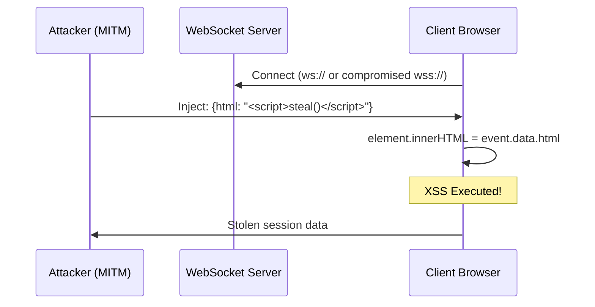

import { FalseNegativeCTA, WhenNotToUse } from "@/components/RuleComponents";

> 🔒 Disallow using innerHTML with WebSocket message data

## Rule Details

This rule prevents using `innerHTML`, `outerHTML`, `insertAdjacentHTML()`, or `document.write()` with data received from WebSocket messages. This pattern enables XSS attacks if the WebSocket connection is compromised.

### Why is this dangerous?



When you use innerHTML with WebSocket data:

1. **MITM attacks** can inject malicious HTML (especially over ws://)
2. **Compromised servers** can send crafted payloads
3. **Scripts execute** in the context of your application

## Examples

### ❌ Incorrect

```javascript
// onmessage handler with innerHTML
ws.onmessage = (event) => {
  chatBox.innerHTML = event.data;
};

// addEventListener pattern
socket.addEventListener('message', (event) => {
  container.innerHTML = event.data.html;
});

// outerHTML
ws.onmessage = (event) => {
  widget.outerHTML = event.data;
};

// insertAdjacentHTML
ws.onmessage = (event) => {
  messageList.insertAdjacentHTML('beforeend', event.data);
};

// Function expression
websocket.onmessage = function (msg) {
  panel.innerHTML = msg.data;
};
```

### ✅ Correct

```javascript
// Use textContent for plain text
ws.onmessage = (event) => {
  messageEl.textContent = event.data;
};

// Sanitize before using innerHTML
ws.onmessage = (event) => {
  const sanitized = DOMPurify.sanitize(event.data);
  chatBox.innerHTML = sanitized;
};

// Parse and validate structured data
ws.onmessage = (event) => {
  const data = JSON.parse(event.data);
  if (typeof data.message === 'string') {
    messageEl.textContent = data.message;
  }
};

// Use DOM APIs for safe rendering
ws.onmessage = (event) => {
  const data = JSON.parse(event.data);
  const li = document.createElement('li');
  li.textContent = data.text;
  messageList.appendChild(li);
};

// Use intermediate sanitized variable
ws.onmessage = (event) => {
  const cleanHtml = DOMPurify.sanitize(event.data);
  container.innerHTML = cleanHtml;
};
```

## Options

```json
{
  "browser-security/no-websocket-innerhtml": [
    "error",
    {
      "allowInTests": true
    }
  ]
}
```

| Option         | Type      | Default | Description                                        |
| -------------- | --------- | ------- | -------------------------------------------------- |
| `allowInTests` | `boolean` | `true`  | Skip checking in test files (_.test.ts, _.spec.ts) |

## Detection Patterns

The rule detects:

1. **`ws.onmessage` handlers** that use innerHTML with event.data
2. **`ws.addEventListener('message', ...)`** handlers with innerHTML
3. **Various DOM methods**: innerHTML, outerHTML, insertAdjacentHTML, document.write

## When Not To Use It

You may disable this rule if:

- You're rendering only non-HTML data (JSON, plain text)
- You have thorough sanitization that the rule can't detect
- The WebSocket connection is to a fully trusted internal service

However, **always sanitize WebSocket data** before rendering as HTML.

## Related Rules

- [`browser-security/require-websocket-wss`](./require-websocket-wss.md) - Require secure wss:// connections
- [`browser-security/no-innerhtml`](./no-innerhtml.md) - General innerHTML prevention


<WhenNotToUse />

## Known False Negatives

<FalseNegativeCTA />

The following patterns are **not detected** due to static analysis limitations:

### Event Data Stored in Variable

**Why**: Data stored in variables not traced.

```typescript
// ❌ NOT DETECTED - Data stored first
ws.onmessage = (event) => {
  const html = event.data;
  container.innerHTML = html;
};
```

**Mitigation**: Always sanitize before any assignment.

### Separate Handler Function

**Why**: Handler internals not analyzed.

```typescript
// ❌ NOT DETECTED - External handler
ws.onmessage = handleWebSocketMessage;
```

**Mitigation**: Apply rule to handler implementations.

### Custom Sanitizer

**Why**: Non-standard sanitizers may not be recognized.

```typescript
// ❌ NOT DETECTED - Custom sanitizer
element.innerHTML = myHtmlCleaner(event.data);
```

**Mitigation**: Configure trusted sanitizer names.

## OWASP Mapping

| Category          | ID                   |
| ----------------- | -------------------- |
| OWASP Top 10 2021 | A03:2021 - Injection |
| CWE               | CWE-79               |
| CVSS              | 8.1 (High)           |
