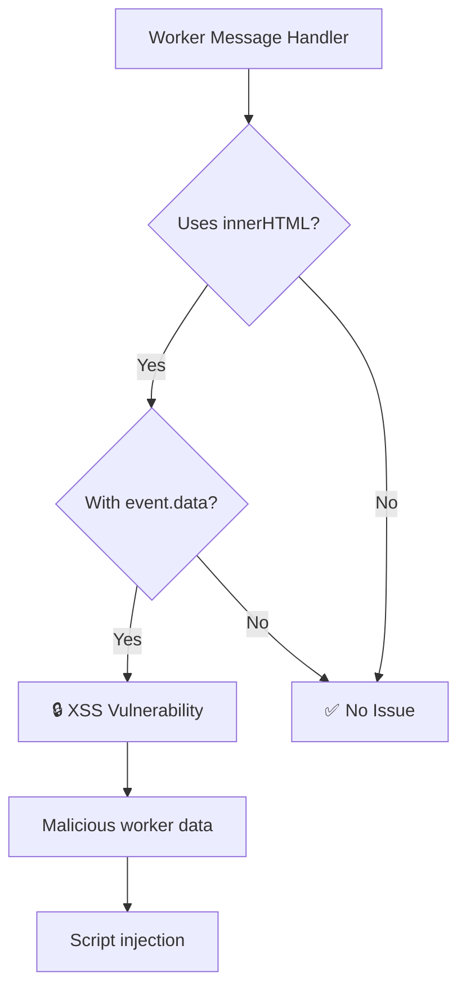

> No Worker Message Innerhtml

Disallow using innerHTML with Web Worker message data.

## ⚠️ Security Issue

| Property     | Value                                                                          |
| ------------ | ------------------------------------------------------------------------------ |
| **CWE**      | [CWE-79: Cross-site Scripting](https://cwe.mitre.org/data/definitions/79.html) |
| **OWASP**    | A03:2021 - Injection                                                           |
| **CVSS**     | 7.5 (High)                                                                     |
| **Severity** | HIGH                                                                           |

## 📋 Description

Web Workers can process untrusted data from various sources. Directly rendering Worker message data via `innerHTML` can lead to XSS if the worker processes malicious content.

## 🔍 What This Rule Detects



## ❌ Incorrect

```javascript
// onmessage handler with innerHTML
worker.onmessage = (e) => {
  element.innerHTML = e.data;
};

// addEventListener pattern
myWorker.addEventListener('message', (event) => {
  container.innerHTML = event.data;
});

// outerHTML
worker.onmessage = (e) => {
  element.outerHTML = e.data;
};

// insertAdjacentHTML
worker.onmessage = (e) => {
  element.insertAdjacentHTML('beforeend', e.data);
};
```

## ✅ Correct

```javascript
// Use textContent for plain text
worker.onmessage = (e) => {
  element.textContent = e.data;
};

// Sanitize before rendering HTML
worker.onmessage = (e) => {
  const sanitized = DOMPurify.sanitize(e.data);
  element.innerHTML = sanitized;
};

// Parse and validate structured data
worker.onmessage = (e) => {
  const data = JSON.parse(e.data);
  if (isValid(data)) {
    renderData(data);
  }
};
```

## 🛠️ Options

```json
{
  "rules": {
    "@interlace/browser-security/no-worker-message-innerhtml": [
      "error",
      {
        "allowInTests": true
      }
    ]
  }
}
```

| Option         | Type      | Default | Description                    |
| -------------- | --------- | ------- | ------------------------------ |
| `allowInTests` | `boolean` | `true`  | Disable the rule in test files |

## 💡 Why This Matters

Workers process data in the background, often from external sources like APIs or uploaded files. If this data contains malicious HTML/JavaScript and is rendered without sanitization, it enables XSS attacks.

### Worker Data Sources to Consider:

1. **API responses**: Validate server data
2. **File processing**: Sanitize file contents
3. **Third-party integrations**: Never trust external data

## Known False Negatives

The following patterns are **not detected** due to static analysis limitations:

### Event Data Stored in Variable

**Why**: Data stored in variables not traced.

```typescript
// ❌ NOT DETECTED - Data stored first
worker.onmessage = (e) => {
  const html = e.data;
  element.innerHTML = html;
};
```

**Mitigation**: Always sanitize before any assignment.

### Handler in External Function

**Why**: External handlers not analyzed.

```typescript
// ❌ NOT DETECTED - External handler
worker.onmessage = processWorkerMessage;
```

**Mitigation**: Apply rule to handler implementations.

### Custom Sanitizer

**Why**: Non-standard sanitizers may not be recognized.

```typescript
// ❌ NOT DETECTED - Custom sanitizer
element.innerHTML = mySanitize(e.data);
```

**Mitigation**: Configure trusted sanitizer names.

## 📚 Related Resources

- [MDN: Web Workers](https://developer.mozilla.org/en-US/docs/Web/API/Worker)
- [DOMPurify](https://github.com/cure53/DOMPurify)
- [OWASP XSS Prevention](https://cheatsheetseries.owasp.org/cheatsheets/Cross_Site_Scripting_Prevention_Cheat_Sheet.html)

## Error Message Format

The rule provides **LLM-optimized error messages** (Compact 2-line format) with actionable security guidance:

```text
⚠️ CWE-79 OWASP:A05 CVSS:6.1 | Cross-site Scripting (XSS) detected | MEDIUM [SOC2,PCI-DSS,GDPR,ISO27001]
   Fix: Review and apply the recommended fix | https://owasp.org/Top10/A05_2021/
```

### Message Components

| Component | Purpose | Example |
| :--- | :--- | :--- |
| **Risk Standards** | Security benchmarks | [CWE-79](https://cwe.mitre.org/data/definitions/79.html) [OWASP:A05](https://owasp.org/Top10/A05_2021-Injection/) [CVSS:6.1](https://nvd.nist.gov/vuln-metrics/cvss/v3-calculator?vector=AV:N/AC:L/PR:N/UI:N/S:U/C:H/I:H/A:H) |
| **Issue Description** | Specific vulnerability | `Cross-site Scripting (XSS) detected` |
| **Severity & Compliance** | Impact assessment | `MEDIUM [SOC2,PCI-DSS,GDPR,ISO27001]` |
| **Fix Instruction** | Actionable remediation | `Follow the remediation steps below` |
| **Technical Truth** | Official reference | [OWASP Top 10](https://owasp.org/Top10/A05_2021-Injection/) |
