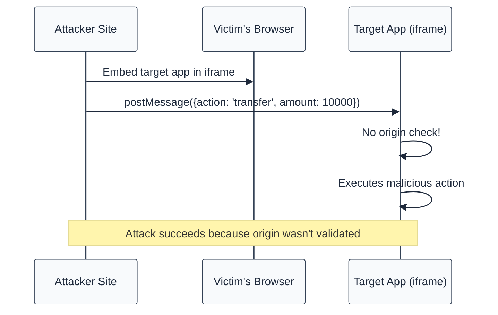

# require-postmessage-origin-check

> **Keywords:** postMessage, cross-origin, CWE-346, security, iframe, message validation

Detects postMessage event handlers without origin validation. This rule is part of [`eslint-plugin-browser-security`](https://www.npmjs.com/package/eslint-plugin-browser-security).

⚠️ This rule **_errors_** by default in the `recommended` config.

## Quick Summary

| Aspect            | Details                                        |
| ----------------- | ---------------------------------------------- |
| **CWE Reference** | CWE-346 (Origin Validation Error)              |
| **Severity**      | 🔴 High                                        |
| **Auto-Fix**      | ✅ Yes (suggests origin check)                 |
| **Category**      | Security                                       |
| **Best For**      | Apps using iframes, cross-window communication |

## Vulnerability and Risk

**Vulnerability:** Accepting postMessage events without validating the origin allows any website to send messages to your application.

**Risk:** Attackers can:

- Inject malicious data/commands
- Trigger unauthorized actions
- Bypass authentication

## PostMessage Attack Flow



## Examples

### ❌ Incorrect

```javascript
// No origin check - VULNERABLE
window.addEventListener('message', (event) => {
  const { action, data } = event.data;
  processAction(action, data); // Anyone can trigger this!
});

// Empty origin check - VULNERABLE
window.addEventListener('message', (event) => {
  if (event.origin) {
    // This is always truthy!
    processAction(event.data);
  }
});
```

### ✅ Correct

```javascript
// Strict origin validation - SAFE
const ALLOWED_ORIGINS = [
  'https://trusted-parent.com',
  'https://admin.example.com',
];

window.addEventListener('message', (event) => {
  if (!ALLOWED_ORIGINS.includes(event.origin)) {
    console.warn('Rejected message from:', event.origin);
    return;
  }

  const { action, data } = event.data;
  processAction(action, data);
});

// Single origin check - SAFE
window.addEventListener('message', (event) => {
  if (event.origin !== 'https://trusted-parent.com') {
    return;
  }

  handleMessage(event.data);
});
```

## Options

| Option         | Type      | Default | Description                              |
| -------------- | --------- | ------- | ---------------------------------------- |
| `allowInTests` | `boolean` | `false` | Allow missing origin check in test files |

```json
{
  "rules": {
    "browser-security/require-postmessage-origin-check": "error"
  }
}
```

## Best Practices

### 1. Use Allowlist Pattern

```javascript
const ALLOWED_ORIGINS = new Set([
  'https://parent.example.com',
  'https://embed.example.com',
]);

function handleMessage(event) {
  if (!ALLOWED_ORIGINS.has(event.origin)) {
    return;
  }
  // Process message
}
```

### 2. Validate Message Structure

```javascript
window.addEventListener('message', (event) => {
  // 1. Check origin
  if (event.origin !== 'https://trusted.com') return;

  // 2. Validate message structure
  if (!event.data || typeof event.data.action !== 'string') {
    console.error('Invalid message structure');
    return;
  }

  // 3. Whitelist allowed actions
  const ALLOWED_ACTIONS = ['resize', 'navigate', 'close'];
  if (!ALLOWED_ACTIONS.includes(event.data.action)) {
    console.error('Unknown action:', event.data.action);
    return;
  }

  processAction(event.data);
});
```

## Related Rules

- [`no-innerhtml`](./no-innerhtml.md) - XSS prevention
- [`no-sensitive-localstorage`](./no-sensitive-localstorage.md) - Storage security

## Known False Negatives

The following patterns are **not detected** due to static analysis limitations:

### Handler in Separate Function

**Why**: Origin check in called function not visible.

```typescript
// ❌ NOT DETECTED - Check in handler
window.addEventListener('message', handleMessage); // validates internally
```

**Mitigation**: Apply rule to handler implementations.

### Dynamic Event Registration

**Why**: Events registered dynamically may not be detected.

```typescript
// ❌ NOT DETECTED - Dynamic registration
const eventType = 'message';
window.addEventListener(eventType, handler);
```

**Mitigation**: Use static event registration.

### Weak Origin Checks

**Why**: Check quality not assessed.

```typescript
// ❌ NOT DETECTED - Weak check
if (event.origin.includes('trusted')) {
  // Insecure!
  processAction(event.data);
}
```

**Mitigation**: Use exact origin comparison.

### Library Abstractions

**Why**: Third-party message handlers not analyzed.

```typescript
// ❌ NOT DETECTED - Library abstraction
messageLib.onMessage((data) => process(data)); // No origin check visible
```

**Mitigation**: Review library security. Configure message handlers.

## Resources

- [CWE-346: Origin Validation Error](https://cwe.mitre.org/data/definitions/346.html)
- [MDN: Window.postMessage()](https://developer.mozilla.org/en-US/docs/Web/API/Window/postMessage#security_concerns)
- [OWASP HTML5 Security](https://cheatsheetseries.owasp.org/cheatsheets/HTML5_Security_Cheat_Sheet.html#postmessage)
