> **Keywords:** require url validation, open redirect, security, ESLint rule, [CWE-601](https://cwe.mitre.org/data/definitions/601.html), window.location, phishing
> **CWE:** [CWE-601: URL Redirection to Untrusted Site ('Open Redirect')](https://cwe.mitre.org/data/definitions/601.html)  
> **OWASP Mobile:** [OWASP Mobile Top 10 M4: Insufficient Input/Output Validation](https://owasp.org/www-project-mobile-top-10/)

ESLint Rule: require-url-validation. This rule is part of [`eslint-plugin-browser-security`](https://www.npmjs.com/package/eslint-plugin-browser-security).

## Quick Summary

| Aspect          | Details                                  |
| --------------- | ---------------------------------------- |
| **Severity**    | High (Phishing Risk)                     |
| **Auto-Fix**    | ❌ No (requires allowlist logic)         |
| **Category**    | Security / Phishing                      |
| **ESLint MCP**  | ✅ Optimized for ESLint MCP integration  |
| **Best For**    | Frontend apps handling dynamic redirects |
| **Suggestions** | ✅ Advice on using hostname allowlists   |

## Vulnerability and Risk

**Vulnerability:** An Open Redirect vulnerability occurs when an application accepts a user-controlled input that specifies a link to an external site and uses that link in a Redirection without validation.

**Risk:** This can be exploited to facilitate phishing attacks. Since the initial URL appears to be from a trusted domain, users are more likely to click it, only to be redirected to a malicious site that looks identical to the original.

## Error Message Format

The rule provides **LLM-optimized error messages** (Compact 2-line format) with actionable security guidance:

```text
🔒 CWE-601 OWASP:M4 | URL Validation Required detected | HIGH [OpenRedirect,Phishing]
   Fix: Validate URLs before using them for navigation | https://cwe.mitre.org/data/definitions/601.html
```

### Message Components

| Component                 | Purpose                | Example                                                                                                             |
| :------------------------ | :--------------------- | :------------------------------------------------------------------------------------------------------------------ |
| **Risk Standards**        | Security benchmarks    | [CWE-601](https://cwe.mitre.org/data/definitions/601.html) [OWASP:M4](https://owasp.org/www-project-mobile-top-10/) |
| **Issue Description**     | Specific vulnerability | `URL Validation Required detected`                                                                                  |
| **Severity & Compliance** | Impact assessment      | `HIGH [OpenRedirect,Phishing]`                                                                                      |
| **Fix Instruction**       | Actionable remediation | `Validate URLs before using them for navigation`                                                                    |
| **Technical Truth**       | Official reference     | [Open Redirect](https://cwe.mitre.org/data/definitions/601.html)                                                    |

## Rule Details

This rule flags direct assignments to `window.location` or `location.href`, and calls to `window.open()` where the URL is a variable, suggesting it might contain unvalidated user input.

```mermaid
%%{init: {
  'theme': 'base',
  'themeVariables': {
    'primaryColor': '#f8fafc',
    'primaryTextColor': '#1e293b',
    'primaryBorderColor': '#334155',
    'lineColor': '#475569',
    'c0': '#f8fafc',
    'c1': '#f1f5f9',
    'c2': '#e2e8f0',
    'c3': '#cbd5e1'
  }
}}%%
flowchart TD
    A[Navigation Sink] --> B{URL is Literal?}
    B -->|Yes| C[✅ Safe Navigation]
    B -->|No| D{Has allowlist check?}
    D -->|Yes| E[✅ Secure Redirect]
    D -->|No| F[🚨 Potential Open Redirect]
```



### Why This Matters

| Issue            | Impact                          | Solution                                           |
| ---------------- | ------------------------------- | -------------------------------------------------- |
| 🎣 **Phishing**  | Users tricked into giving creds | Use strictly enforced allowlists for domains       |
| 🕵️ **Detection** | Bypasses basic security filters | Check protocol (https only) and hostname           |
| 🤝 **Trust**     | Brand integrity damage          | Use relative paths for redirects whenever possible |

## Configuration

This rule has no configuration options in the current version.

## Examples

### ❌ Incorrect

```javascript
// Direct assignment from a URL parameter
const params = new URLSearchParams(window.location.search);
const redirectUrl = params.get('next');

window.location.href = redirectUrl; // ❌ HIGH RISK

// Using window.open with an unvalidated variable
function navigate(target) {
  window.open(target, '_blank'); // ❌ HIGH RISK
}
```

### ✅ Correct

```javascript
// Validating against a known allowlist
const ALLOWED_DOMAINS = ['example.com', 'docs.example.com'];

function safeNavigate(url) {
  const target = new URL(url, window.location.origin);
  if (ALLOWED_DOMAINS.includes(target.hostname)) {
    window.location.href = target.href;
  }
}

// Redirecting to relative paths only
function safeRelativeRedirect(path) {
  if (path.startsWith('/')) {
    window.location.pathname = path;
  }
}
```

## Known False Negatives

The following patterns are **not detected** due to static analysis limitations:

### String Concatenation

**Why**: If the URL is only partially user-controlled, it might not be flagged if the rule only looks for direct variable assignments.

```javascript
window.location.href = 'https://example.com/login?next=' + userInput; // ❌ NOT DETECTED
```

**Mitigation**: Always sanitize and validate any user-provided string.

### Object Properties

**Why**: If the URL is stored in an object property, the rule might miss it.

```javascript
window.location.href = options.redirectUrl; // ❌ NOT DETECTED
```

**Mitigation**: Enforce strict validation at the source of the configuration.

## References

- [CWE-601: URL Redirection to Untrusted Site ('Open Redirect')](https://cwe.mitre.org/data/definitions/601.html)
- [OWASP Unvalidated Redirects and Forwards Cheat Sheet](https://cheatsheetseries.owasp.org/cheatsheets/Unvalidated_Redirects_and_Forwards_Cheat_Sheet.html)
- [MDN - Window.location](https://developer.mozilla.org/en-US/docs/Web/API/Window/location)
