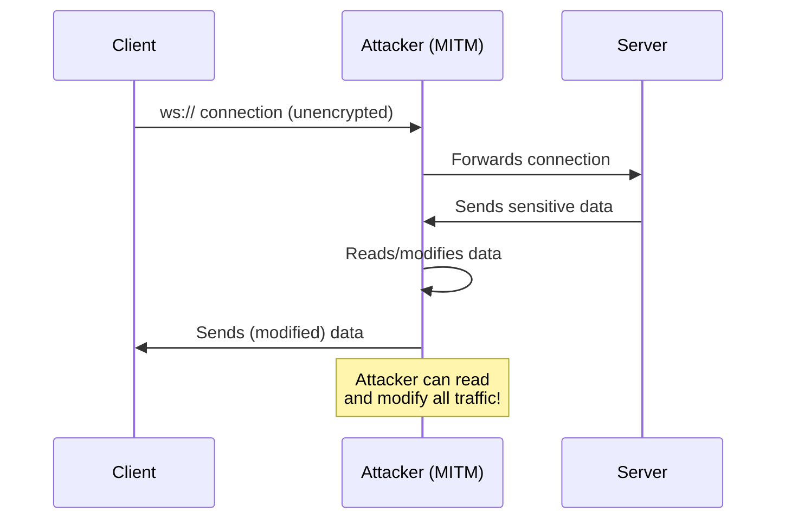

import { FalseNegativeCTA, WhenNotToUse } from "@/components/RuleComponents";

> 🔒 Require secure WebSocket connections (wss://) instead of unencrypted (ws://)

## Rule Details

This rule enforces the use of `wss://` (WebSocket Secure) protocol instead of `ws://` (unencrypted WebSocket). Unencrypted WebSocket connections are vulnerable to Man-in-the-Middle (MITM) attacks and eavesdropping.

### Why is this dangerous?



When you use `ws://`:

1. **All data is transmitted in plaintext** - anyone on the network can read it
2. **No authentication of the server** - you might connect to an attacker
3. **Data can be modified** - MITM can inject malicious content

## Examples

### ❌ Incorrect

```javascript
// Unencrypted WebSocket - vulnerable to MITM
const ws = new WebSocket('ws://api.example.com/socket');

// With port
const ws = new WebSocket('ws://chat.example.com:8080/ws');

// Template literal
const ws = new WebSocket(`ws://api.example.com/user/${userId}`);
```

### ✅ Correct

```javascript
// Secure WebSocket
const ws = new WebSocket('wss://api.example.com/socket');

// With port
const ws = new WebSocket('wss://chat.example.com:8080/ws');

// Template literal with wss
const ws = new WebSocket(`wss://api.example.com/user/${userId}`);

// Localhost is allowed by default (for development)
const ws = new WebSocket('ws://localhost:3000');
const ws = new WebSocket('ws://127.0.0.1:8080');
```

## Options

```json
{
  "browser-security/require-websocket-wss": [
    "error",
    {
      "allowInTests": true,
      "allowLocalhost": true
    }
  ]
}
```

| Option           | Type      | Default | Description                                           |
| ---------------- | --------- | ------- | ----------------------------------------------------- |
| `allowInTests`   | `boolean` | `true`  | Skip checking in test files (_.test.ts, _.spec.ts)    |
| `allowLocalhost` | `boolean` | `true`  | Allow ws:// for localhost/127.0.0.1 (for development) |

## Auto-Fix

This rule provides an **auto-fix** that replaces `ws://` with `wss://`:

```javascript
// Before (auto-fix available)
const ws = new WebSocket('ws://example.com');

// After auto-fix
const ws = new WebSocket('wss://example.com');
```

## When Not To Use It

You may disable this rule if:

- You're running a WebSocket server that explicitly requires unencrypted connections (not recommended for production)
- You're in a controlled internal network with no untrusted parties

However, **always use `wss://` in production**. The performance overhead of TLS is minimal compared to the security benefits.

## Related

- [CWE-319: Cleartext Transmission of Sensitive Information](https://cwe.mitre.org/data/definitions/319.html)
- [MDN: WebSocket API](https://developer.mozilla.org/en-US/docs/Web/API/WebSocket)
- [CVE-2024-37890: WebSocket DoS Vulnerability](https://nvd.nist.gov/vuln/detail/CVE-2024-37890)


<WhenNotToUse />

## Known False Negatives

<FalseNegativeCTA />

The following patterns are **not detected** due to static analysis limitations:

### URL from Variable

**Why**: URLs from variables not analyzed.

```typescript
// ❌ NOT DETECTED - URL from variable
const url = 'ws://insecure.com';
const ws = new WebSocket(url);
```

**Mitigation**: Validate URLs before WebSocket creation.

### Dynamic URL Construction

**Why**: Computed URLs not traced.

```typescript
// ❌ NOT DETECTED - Dynamic URL
const ws = new WebSocket(getWebSocketUrl()); // May return ws://
```

**Mitigation**: Ensure URL builders always return wss://.

### Configuration-Based URLs

**Why**: Config values not visible.

```typescript
// ❌ NOT DETECTED - From config
const ws = new WebSocket(config.wsEndpoint);
```

**Mitigation**: Validate config URLs at startup.

## OWASP Mapping

| Category          | ID                                |
| ----------------- | --------------------------------- |
| OWASP Top 10 2021 | A02:2021 - Cryptographic Failures |
| CWE               | CWE-319                           |
| CVSS              | 7.5 (High)                        |
