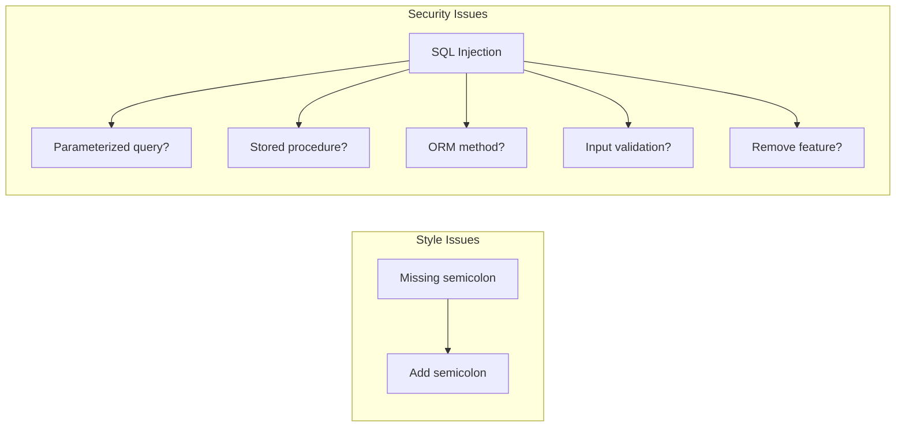
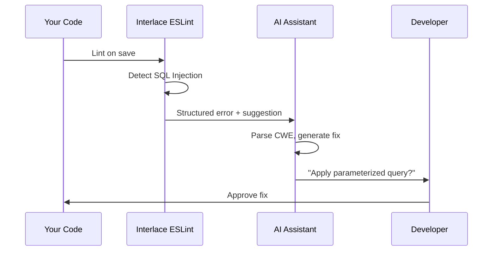

import { Callout } from 'fumadocs-ui/components/callout';
import { Steps, Step } from 'fumadocs-ui/components/steps';
import { Cards, Card } from 'fumadocs-ui/components/card';
import { Tabs, Tab } from 'fumadocs-ui/components/tabs';

# Fixable vs. Non-Fixable Rules

> **The Gist**: A missing semicolon has one fix. A SQL injection has five. That's why security rules suggest fixes for AI assistants instead of auto-applying them.

| Quick Summary |                                                     |
| ------------- | --------------------------------------------------- |
| **🟢 Fixable** | Weak crypto → stronger algo (unambiguous)          |
| **🟡 Suggestible** | SQL injection → parameterized query (context-dependent) |
| **🔴 Non-Fixable** | Auth bypass → business logic (human judgment)  |
| **AI Role** | Parse structured errors → propose fix → human approves |

<Callout type="info">
  **AI-First Thinking**: Interlace rules are designed with LLM assistance in mind. Our error messages are structured to help AI coding assistants understand and fix issues correctly.
</Callout>

## Why Can't All Rules Auto-Fix?

Auto-fixing security issues is fundamentally different from fixing style issues. A missing semicolon has exactly one correct fix. A SQL injection vulnerability has **many possible fixes**, and the right one depends on your specific context.



## The Three Categories

<Tabs items={["🟢 Fixable", "🟡 Suggestible", "🔴 Non-Fixable"]}>
  <Tab value="🟢 Fixable">
    ### Fixable Rules
    
    These have a single, unambiguous correct fix that doesn't change program behavior.
    
    **Examples:**
    - Upgrading deprecated crypto algorithms (`MD5` → `SHA-256`)
    - Adding missing security headers with safe defaults
    - Converting `var` to `const` in secure contexts
    
    ```javascript
    // Before (auto-fixable)
    crypto.createHash('md5');
    
    // After
    crypto.createHash('sha256');
    ```
  </Tab>
  <Tab value="🟡 Suggestible">
    ### Suggestible Rules
    
    We can provide a suggested fix, but it might need adjustment for your specific use case.
    
    **Examples:**
    - SQL injection → suggest parameterized query syntax
    - XSS → suggest encoding function
    - JWT → suggest proper verification options
    
    ```javascript
    // Detected issue
    db.query(`SELECT * FROM users WHERE id = ${userId}`);
    
    // Suggested fix (may need schema adjustment)
    db.query('SELECT * FROM users WHERE id = $1', [userId]);
    ```
    
    <Callout type="warn">
      Suggestions are included in error messages for AI assistants to interpret, not applied automatically.
    </Callout>
  </Tab>
  <Tab value="🔴 Non-Fixable">
    ### Non-Fixable Rules
    
    These require understanding business logic, data flow, or architectural decisions that static analysis cannot determine.
    
    **Examples:**
    - Authorization bypass vulnerabilities
    - Race conditions
    - Business logic flaws
    - Complex data flow issues
    
    ```javascript
    // Non-fixable: Is the admin check intentionally missing?
    async function deleteUser(userId) {
      // Should there be authorization here?
      await db.delete('users', userId);
    }
    ```
  </Tab>
</Tabs>

## How AI Assistants Use Our Messages

Interlace rules are designed to be **LLM-optimized**. Every error message includes structured information that AI coding assistants can parse:

```
error 🔒 CWE-89 OWASP:A03 CVSS:9.8 | SQL Injection | CRITICAL
  → Untrusted input in query string at line 42
  💡 Fix: Use parameterized queries: db.query($1, [value])
  📚 See: https://interlace.dev/docs/pg/rules/no-sql-injection
```

### What Makes It LLM-Optimized?

<div className="grid sm:grid-cols-2 gap-4 my-6">
  <div className="p-4 rounded-lg border border-fd-border bg-violet-500/5">
    <h3 className="text-base font-semibold text-violet-400 mb-2">📋 Structured Metadata</h3>
    <p className="text-sm text-fd-muted-foreground">CWE, OWASP, and CVSS tags help AI understand severity and category.</p>
  </div>
  <div className="p-4 rounded-lg border border-fd-border bg-violet-500/5">
    <h3 className="text-base font-semibold text-violet-400 mb-2">💡 Inline Suggestions</h3>
    <p className="text-sm text-fd-muted-foreground">Fix patterns are embedded in the message for AI to extract and adapt.</p>
  </div>
  <div className="p-4 rounded-lg border border-fd-border bg-violet-500/5">
    <h3 className="text-base font-semibold text-violet-400 mb-2">📚 Documentation Links</h3>
    <p className="text-sm text-fd-muted-foreground">Direct links to detailed explanations and examples.</p>
  </div>
  <div className="p-4 rounded-lg border border-fd-border bg-violet-500/5">
    <h3 className="text-base font-semibold text-violet-400 mb-2">🎯 Context Awareness</h3>
    <p className="text-sm text-fd-muted-foreground">Messages reference the specific API and pattern detected.</p>
  </div>
</div>

## Comparison: Traditional vs. AI-First

<div className="overflow-x-auto my-6">
  <table className="w-full text-sm">
    <thead>
      <tr className="border-b border-fd-border">
        <th className="text-left py-3 px-3 text-fd-muted-foreground">Aspect</th>
        <th className="text-left py-3 px-3 text-fd-muted-foreground">Traditional Plugins</th>
        <th className="text-left py-3 px-3 text-violet-400">Interlace (AI-First)</th>
      </tr>
    </thead>
    <tbody>
      <tr className="border-b border-fd-border">
        <td className="py-2.5 px-3">Error Format</td>
        <td className="py-2.5 px-3 text-fd-muted-foreground">Plain text message</td>
        <td className="py-2.5 px-3">Structured with CWE/OWASP/CVSS</td>
      </tr>
      <tr className="border-b border-fd-border">
        <td className="py-2.5 px-3">Fix Guidance</td>
        <td className="py-2.5 px-3 text-fd-muted-foreground">Generic advice or none</td>
        <td className="py-2.5 px-3">Inline fix patterns</td>
      </tr>
      <tr className="border-b border-fd-border">
        <td className="py-2.5 px-3">AI Compatibility</td>
        <td className="py-2.5 px-3 text-fd-muted-foreground">Requires interpretation</td>
        <td className="py-2.5 px-3">Designed for LLM parsing</td>
      </tr>
      <tr className="border-b border-fd-border">
        <td className="py-2.5 px-3">Severity</td>
        <td className="py-2.5 px-3 text-fd-muted-foreground">warn/error only</td>
        <td className="py-2.5 px-3">CVSS scores for prioritization</td>
      </tr>
    </tbody>
  </table>
</div>

## The Future: AI-Assisted Fixes

With LLM coding assistants (GitHub Copilot, Claude, Cursor), the line between "fixable" and "non-fixable" is blurring:

<Steps>
  <Step>
    ### ESLint Detects Issue
    
    Interlace identifies a potential SQL injection and provides structured error data.
  </Step>
  <Step>
    ### AI Understands Context
    
    The LLM reads the error message, understands it's a CWE-89 SQL Injection with CVSS 9.8.
  </Step>
  <Step>
    ### AI Proposes Fix
    
    Using the inline suggestion pattern and your codebase context, the AI generates an appropriate fix.
  </Step>
  <Step>
    ### Human Reviews
    
    You review and approve the AI-generated fix, maintaining control over your codebase.
  </Step>
</Steps>



## ⚡ Maximizing AI Fix Success

| What To Do | Why |
| ---------- | --- |
| **Use GPT-4/Claude 3+** | Best at parsing structured CWE/CVSS errors |
| **Enable real-time linting** | AI gets context about exact error location |
| **Always review AI fixes** | Verify fit for your specific use case |
| **Report false positives** | Help us improve detection accuracy |

## 🔗 Next Steps

<CTAGrid columns={3}>
  <CTACard
    href="/docs/concepts/static-analysis"
    title="🔍 Static Analysis"
    description="What ESLint can and cannot detect"
    gradient="purple"
  />
  <CTACard
    href="/docs"
    title="🚀 Getting Started"
    description="Set up Interlace in 2 minutes"
    gradient="emerald"
  />
  <CTACard
    href="/docs/benchmarks"
    title="📊 Benchmarks"
    description="Performance comparison with alternatives"
    gradient="blue"
  />
</CTAGrid>

## 📚 Further Reading

- **[ESLint Flat Config](https://eslint.org/docs/latest/use/configure/configuration-files-new)** - Modern ESLint configuration
- **[GitHub Copilot + ESLint](https://github.blog/2023-05-17-how-github-copilot-is-getting-better-at-coding/)** - How AI uses lint feedback
- **[OWASP Top 10 2021](https://owasp.org/www-project-top-ten/)** - Vulnerability categories we detect

