import { Callout } from 'fumadocs-ui/components/callout';
import { Steps, Step } from 'fumadocs-ui/components/steps';
import { Cards, Card } from 'fumadocs-ui/components/card';
import { Tab, Tabs } from 'fumadocs-ui/components/tabs';
import { ASTExplorer } from '@/components/ASTExplorer';

# How AST & Static Analysis Work

> **The Gist**: ESLint reads your code as a tree of nodes, like a family tree for your code. Security rules then walk through this tree looking for dangerous patterns—all without running a single line.

## 🌳 Try It Live

Type JavaScript code below and watch it transform into an AST in real-time. Click nodes to inspect them:

<ASTExplorer />

<Callout type="tip">
  **What just happened?** The parser converted your text into a structured tree. ESLint rules walk this tree looking for patterns like `TemplateLiteral` + SQL keywords = potential injection!
</Callout>

---

## Understanding the Basics

| Concept | Description |
| ------- | ----------- |
| **AST** | Abstract Syntax Tree—a structured representation of your code |
| **Parser** | Converts source code text into an AST |
| **Rule** | Visitor pattern that inspects specific AST node types |
| **Speed** | Microseconds per file—runs on every save |

## What is an Abstract Syntax Tree?

An **Abstract Syntax Tree (AST)** is a tree representation of your source code's structure. Instead of seeing code as text, the AST sees it as a hierarchy of meaningful components.

<Tabs items={['JavaScript Code', 'AST Representation']}>
  <Tab value="JavaScript Code">
```javascript
const message = "Hello, World!";
console.log(message);
```
  </Tab>
  <Tab value="AST Representation">
```json
{
  "type": "Program",
  "body": [
    {
      "type": "VariableDeclaration",
      "declarations": [{
        "type": "VariableDeclarator",
        "id": { "type": "Identifier", "name": "message" },
        "init": { "type": "Literal", "value": "Hello, World!" }
      }],
      "kind": "const"
    },
    {
      "type": "ExpressionStatement",
      "expression": {
        "type": "CallExpression",
        "callee": {
          "type": "MemberExpression",
          "object": { "type": "Identifier", "name": "console" },
          "property": { "type": "Identifier", "name": "log" }
        },
        "arguments": [{ "type": "Identifier", "name": "message" }]
      }
    }
  ]
}
```
  </Tab>
</Tabs>

### The Tree Structure


## How ESLint Uses the AST

ESLint follows a systematic process to analyze your code:

<Steps>
  <Step>
    ### Parsing

    ESLint uses a **parser** (like `@typescript-eslint/parser` for TypeScript) to convert your source code into an AST. This happens file-by-file.

    ```mermaid
    flowchart LR
        A["function foo() { }"] --> B[Parser]
        B --> C[AST Tree]
    ```
  </Step>
  <Step>
    ### Traversal

    ESLint walks through every node in the AST, visiting each one systematically (depth-first). This is called **tree traversal**.

    ```mermaid
    flowchart TD
        A[Start at Root] --> B[Visit Node]
        B --> C{Has Children?}
        C -->|Yes| D[Visit Children]
        D --> B
        C -->|No| E[Move to Sibling]
        E --> F{More Siblings?}
        F -->|Yes| B
        F -->|No| G[Return to Parent]
        G --> H{Done?}
        H -->|No| E
        H -->|Yes| I[End]
    ```
  </Step>
  <Step>
    ### Rule Matching

    Each ESLint rule subscribes to specific **node types** it cares about. When the traverser visits a matching node, the rule's visitor function is called.

    ```javascript
    // A simplified ESLint rule structure
    module.exports = {
      create(context) {
        return {
          // Called for every CallExpression node
          CallExpression(node) {
            if (node.callee.name === 'eval') {
              context.report({
                node,
                message: 'Avoid using eval()'
              });
            }
          }
        };
      }
    };
    ```
  </Step>
  <Step>
    ### Reporting

    When a rule detects a pattern violation, it reports the issue with location information, message, and optional fix suggestions.
  </Step>
</Steps>

## Security Rule Pattern Matching

Interlace security rules look for specific patterns in the AST that indicate vulnerabilities:

### Example: SQL Injection Detection

```javascript
// ❌ Vulnerable - detected by AST pattern matching
const query = `SELECT * FROM users WHERE id = ${userId}`;
```

The rule looks for:

```mermaid
flowchart LR
    A[TemplateLiteral] --> B["Contains SQL keywords?"]
    B -->|Yes| C["Has dynamic expressions?"]
    C -->|Yes| D["🚨 Report: Possible SQL Injection"]
    B -->|No| E[✅ Pass]
    C -->|No| E
```



### What the Rule Sees

| AST Node | Type | Security Signal |
| -------- | ---- | --------------- |
| `` `SELECT...` `` | `TemplateLiteral` | Contains SQL keyword |
| `${userId}` | `TemplateElement` | Dynamic user input |
| Combined | Pattern Match | **SQL Injection Risk** |

## Visitor Pattern Deep Dive

ESLint rules use the **Visitor Pattern**—a design pattern where you declare which node types you want to "visit":

<div className="grid sm:grid-cols-2 gap-4 my-6">
  <div className="p-4 rounded-lg border border-fd-border bg-violet-500/5">
    <h3 className="text-lg font-semibold text-violet-400 mb-2">🎯 Node Selectors</h3>
    <p className="text-sm text-fd-muted-foreground">Rules subscribe to node types like <code>CallExpression</code>, <code>Identifier</code>, or <code>MemberExpression</code>.</p>
  </div>
  <div className="p-4 rounded-lg border border-fd-border bg-violet-500/5">
    <h3 className="text-lg font-semibold text-violet-400 mb-2">🔗 CSS-like Selectors</h3>
    <p className="text-sm text-fd-muted-foreground">ESLint supports advanced selectors like <code>CallExpression[callee.name='eval']</code>.</p>
  </div>
  <div className="p-4 rounded-lg border border-fd-border bg-violet-500/5">
    <h3 className="text-lg font-semibold text-violet-400 mb-2">⬆️ Enter & Exit</h3>
    <p className="text-sm text-fd-muted-foreground">Rules can run code when entering a node (<code>CallExpression</code>) or leaving it (<code>CallExpression:exit</code>).</p>
  </div>
  <div className="p-4 rounded-lg border border-fd-border bg-violet-500/5">
    <h3 className="text-lg font-semibold text-violet-400 mb-2">📍 Context API</h3>
    <p className="text-sm text-fd-muted-foreground">The <code>context</code> object provides source code, scope analysis, and reporting utilities.</p>
  </div>
</div>

### Common Node Types for Security Rules

| Node Type | Example Code | Security Use Case |
| --------- | ------------ | ----------------- |
| `CallExpression` | `eval(x)` | Dangerous function calls |
| `MemberExpression` | `obj.innerHTML` | Dangerous property access |
| `TemplateLiteral` | `` `${x}` `` | String injection points |
| `AssignmentExpression` | `a = b` | Taint tracking origins |
| `NewExpression` | `new Function()` | Dynamic code execution |

## Scope Analysis

ESLint provides **scope analysis** to track variable bindings:

```javascript
// ESLint knows these are different 'x' variables
let x = 1;

function foo() {
  let x = 2;  // Different scope
  return x;
}
```

<Callout type="tip">
  **Security insight**: Scope analysis helps security rules track where dangerous values flow, distinguishing between safe local variables and potentially tainted external inputs.
</Callout>

## Why Static Analysis is Fast

Static analysis is blazingly fast because it **never executes code**:

| Aspect | Static Analysis | Runtime Testing |
| ------ | --------------- | --------------- |
| **Execution** | Never runs code | Must execute code |
| **Speed** | ~50-200ms for entire project | Seconds to minutes |
| **Coverage** | All code paths | Only executed paths |
| **When** | On every save | On test run |

```mermaid
flowchart LR
    subgraph "Static Analysis"
        A["📁 100 files"] --> B["🔍 Parse & Check"]
        B --> C["~150ms total"]
    end
    subgraph "Runtime Testing"
        D["📁 100 files"] --> E["🚀 Start Server"]
        E --> F["Run Tests"]
        F --> G["~30s+ total"]
    end
```



## 🔗 External Resources

<Cards>
  <Card
    title="🌳 AST Explorer"
    description="Full-featured AST exploration tool"
    href="https://astexplorer.net/"
  />
  <Card
    title="📚 ESLint Custom Rules"
    description="Official guide to writing ESLint rules"
    href="https://eslint.org/docs/latest/extend/custom-rules"
  />
  <Card
    title="🔬 TypeScript AST Viewer"
    description="Specialized for TypeScript ASTs"
    href="https://ts-ast-viewer.com/"
  />
</Cards>

## ⚡ Key Takeaways

| Concept | What to Remember |
| ------- | ---------------- |
| **AST** | Code as a tree structure, not text |
| **Parsing** | Source → AST happens once per file |
| **Visitor Pattern** | Rules declare which nodes they care about |
| **Speed** | Analysis is fast because code never runs |
| **Pattern Matching** | Security rules look for dangerous patterns in the tree |

## 🔗 Related Topics

| Topic | What You'll Learn |
| ----- | ----------------- |
| [Static Analysis Limitations](/docs/concepts/static-analysis) | What AST analysis can and cannot detect |
| [ESLint MCP Integration](/docs/concepts/mcp-integration) | How AI agents leverage these rules |
| [Fixable vs. Non-Fixable Rules](/docs/concepts/fixable-rules) | When automated fixes are possible |
