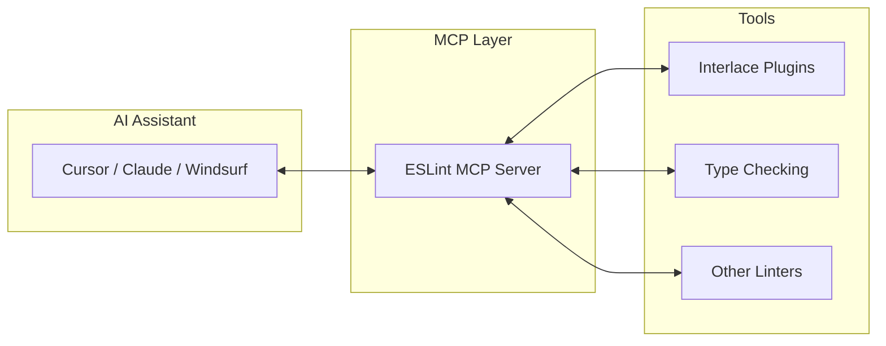
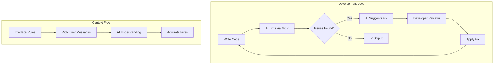

import { Callout } from 'fumadocs-ui/components/callout';
import { Steps, Step } from 'fumadocs-ui/components/steps';
import { Cards, Card } from 'fumadocs-ui/components/card';
import { Tab, Tabs } from 'fumadocs-ui/components/tabs';

# ESLint MCP Integration

> **The Gist**: The [ESLint MCP server](https://github.com/nicholasoxford/eslint-mcp-server) turns ESLint into an AI-accessible tool. When paired with Interlace plugins, AI assistants like Cursor, Windsurf, and Claude can detect and fix security vulnerabilities in real-time.

| Quick Summary |                                                              |
| ------------- | ------------------------------------------------------------ |
| **MCP**       | Model Context Protocol—standard for AI tool integration      |
| **Interlace** | Security-first ESLint plugins with AI-optimized messages     |
| **Result**    | AI sees security issues + context → suggests accurate fixes  |
| **Setup**     | 2 minutes to enable in any MCP-compatible editor             |

<Callout type="info">
  **Why this matters**: AI coding assistants are only as good as the context they receive. Interlace rules are designed from the ground up to provide rich, actionable context that helps AI generate correct security fixes.
</Callout>

## What is the Model Context Protocol?

**MCP (Model Context Protocol)** is an open standard that lets AI assistants interact with external tools. Think of it as a USB port for AI—any tool that speaks MCP can plug into any AI that supports it.



## How It Works

<Steps>
  <Step>
    ### Configure MCP Server

    Add the ESLint MCP server to your AI assistant's configuration. This tells the AI that ESLint is available as a tool.

    ```json
    {
      "mcpServers": {
        "eslint": {
          "command": "npx",
          "args": ["-y", "eslint-mcp-server"]
        }
      }
    }
    ```
  </Step>
  <Step>
    ### AI Requests Linting

    When you ask the AI to review code or fix issues, it can invoke `eslint.lintFiles` or `eslint.lintText` through MCP.

    ```mermaid
    sequenceDiagram
        participant User
        participant AI as AI Assistant
        participant MCP as ESLint MCP
        participant ESLint
        
        User->>AI: "Check this code for security issues"
        AI->>MCP: lintFiles(["src/api.ts"])
        MCP->>ESLint: Run with Interlace rules
        ESLint-->>MCP: Violations found
        MCP-->>AI: Structured results
        AI-->>User: "Found SQL injection risk..."
    ```
  </Step>
  <Step>
    ### Interlace Provides Context

    Unlike generic linters, Interlace rules include **AI-optimized error messages** with:
    - CWE/OWASP references
    - Specific fix guidance
    - Example safe patterns
  </Step>
  <Step>
    ### AI Generates Fix

    With rich context from Interlace, the AI understands **why** something is vulnerable and **how** to fix it correctly.
  </Step>
</Steps>

## Why Interlace + MCP is Powerful

<div className="grid sm:grid-cols-2 gap-4 my-6">
  <div className="p-4 rounded-lg border border-fd-border bg-emerald-500/5">
    <h3 className="text-lg font-semibold text-emerald-400 mb-2">🎯 Precise Detection</h3>
    <p className="text-sm text-fd-muted-foreground">Interlace rules are optimized for low false positives, so AI doesn't waste time on noise.</p>
  </div>
  <div className="p-4 rounded-lg border border-fd-border bg-emerald-500/5">
    <h3 className="text-lg font-semibold text-emerald-400 mb-2">💬 Rich Context</h3>
    <p className="text-sm text-fd-muted-foreground">Error messages include CWE IDs, severity, and fix patterns—everything AI needs to help.</p>
  </div>
  <div className="p-4 rounded-lg border border-fd-border bg-emerald-500/5">
    <h3 className="text-lg font-semibold text-emerald-400 mb-2">⚡ Real-Time</h3>
    <p className="text-sm text-fd-muted-foreground">ESLint runs in milliseconds, so AI can check security on every request without lag.</p>
  </div>
  <div className="p-4 rounded-lg border border-fd-border bg-emerald-500/5">
    <h3 className="text-lg font-semibold text-emerald-400 mb-2">🔧 Actionable Fixes</h3>
    <p className="text-sm text-fd-muted-foreground">Many rules provide auto-fix suggestions that AI can apply directly.</p>
  </div>
</div>

## AI-Optimized Error Messages

Interlace rules follow a **2-line compact format** designed for LLM consumption:

<Tabs items={['Generic Linter', 'Interlace Format']}>
  <Tab value="Generic Linter">
```
Error: Unsafe innerHTML assignment
Line 15, Column 10
```
  </Tab>
  <Tab value="Interlace Format">
```
🚨 [CRITICAL] XSS via innerHTML (CWE-79)
└─ Fix: Use textContent or sanitize with DOMPurify.sanitize()
```
  </Tab>
</Tabs>

### What Makes Messages AI-Friendly

| Element | Purpose | Example |
| ------- | ------- | ------- |
| **Severity emoji** | Quick triage | 🚨 CRITICAL, ⚠️ WARNING |
| **CWE ID** | Standardized vulnerability type | CWE-79 (XSS) |
| **Fix instruction** | Actionable guidance | "Use parameterized queries" |
| **Safe pattern** | Code example | `textContent` instead of `innerHTML` |

## Supported AI Assistants

The ESLint MCP server works with any MCP-compatible AI tool:

<Cards>
  <Card
    title="Cursor"
    description="AI-first code editor with native MCP support"
    href="https://cursor.sh"
  />
  <Card
    title="Claude Desktop"
    description="Anthropic's Claude with MCP tool use"
    href="https://claude.ai"
  />
  <Card
    title="Windsurf"
    description="AI coding assistant with MCP integration"
    href="https://codeium.com/windsurf"
  />
  <Card
    title="Continue"
    description="Open-source AI coding assistant"
    href="https://continue.dev"
  />
</Cards>

## Setup

<Callout type="info">
  **One-time setup**: Configure the ESLint MCP server once, and any Interlace plugins in your project automatically become AI-accessible.
</Callout>

For detailed setup instructions, see the **[ESLint MCP Server documentation](https://github.com/nicholasoxford/eslint-mcp-server)**. The server works with Cursor, Claude Desktop, Windsurf, and any MCP-compatible AI assistant.

### Why Interlace + MCP Works

Once the ESLint MCP server is configured:

1. **Any Interlace plugin** in your `eslint.config.js` becomes available to AI
2. **AI sees rich context** — CWE, OWASP, fix patterns, not just "error at line X"
3. **Fixes are accurate** — AI understands *why* something is vulnerable

<CTAGrid>
  <CTACard
    href="https://github.com/nicholasoxford/eslint-mcp-server"
    title="🔧 ESLint MCP Server"
    description="Official setup guide for Cursor, Claude, and more"
    gradient="purple"
    external
  />
  <CTACard
    href="/docs"
    title="📦 Get Interlace Plugins"
    description="Install security-first ESLint plugins"
    gradient="emerald"
  />
</CTAGrid>

## The Feedback Loop



## Real-World Example

Here's how the full flow works for a SQL injection vulnerability:

<Steps>
  <Step>
    ### Developer Writes Code

    ```javascript
    const getUser = (id) => {
      return db.query(`SELECT * FROM users WHERE id = ${id}`);
    };
    ```
  </Step>
  <Step>
    ### AI Invokes ESLint MCP

    ```json
    {
      "tool": "eslint.lintText",
      "args": { "code": "...", "filePath": "api.js" }
    }
    ```
  </Step>
  <Step>
    ### Interlace Returns Rich Context

    ```json
    {
      "ruleId": "pg/no-sql-injection",
      "message": "🚨 [CRITICAL] SQL Injection (CWE-89)\n└─ Fix: Use parameterized queries: db.query('SELECT...', [id])",
      "severity": 2,
      "line": 2
    }
    ```
  </Step>
  <Step>
    ### AI Generates Correct Fix

    ```javascript
    const getUser = (id) => {
      return db.query('SELECT * FROM users WHERE id = $1', [id]);
    };
    ```
  </Step>
</Steps>

## ⚡ Key Takeaways

| Concept | What to Remember |
| ------- | ---------------- |
| **MCP** | Standard protocol for AI tool integration |
| **ESLint MCP** | Makes ESLint available to AI assistants |
| **Interlace** | Security rules with AI-optimized messages |
| **Result** | AI understands vulnerabilities and fixes them correctly |
| **Setup** | 2 minutes—just add MCP server config |

## 🔗 Next Steps

<CTAGrid columns={3}>
  <CTACard
    href="https://github.com/nicholasoxford/eslint-mcp-server"
    title="🔧 ESLint MCP Server"
    description="Official setup and configuration"
    gradient="purple"
    external
  />
  <CTACard
    href="/docs/concepts/how-ast-works"
    title="🌳 How AST Works"
    description="The technology behind ESLint analysis"
    gradient="blue"
  />
  <CTACard
    href="/docs/concepts/static-analysis"
    title="🔍 Static Analysis"
    description="What MCP + ESLint can detect"
    gradient="emerald"
  />
</CTAGrid>

## 📚 Further Reading

- **[Model Context Protocol](https://modelcontextprotocol.io/)** - Official MCP specification
- **[Cursor Documentation](https://docs.cursor.sh/)** - How to configure MCP in Cursor
- **[Anthropic MCP Blog Post](https://www.anthropic.com/news/model-context-protocol)** - Why MCP matters for AI tooling

