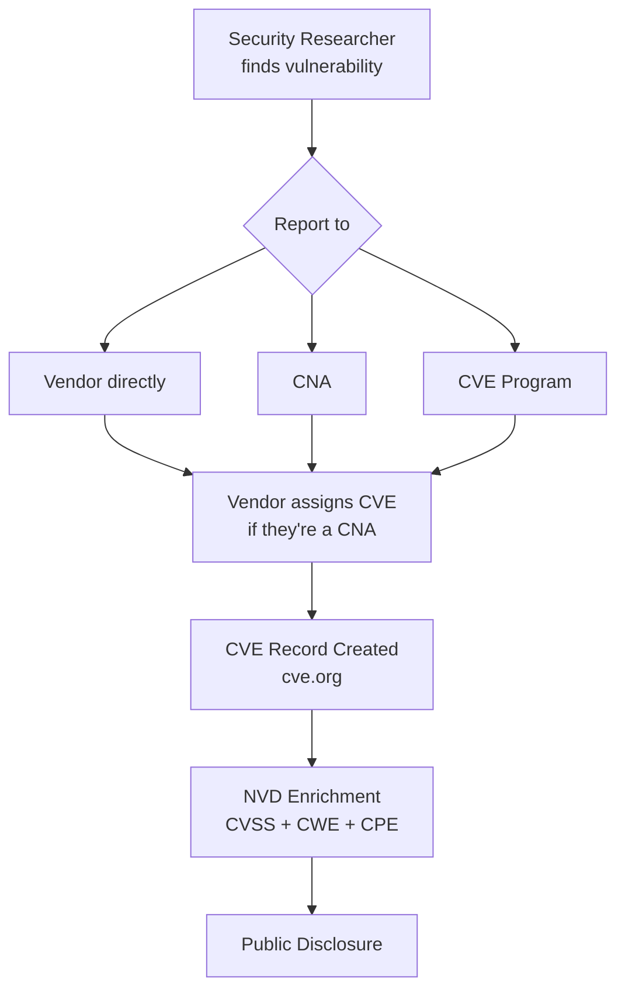
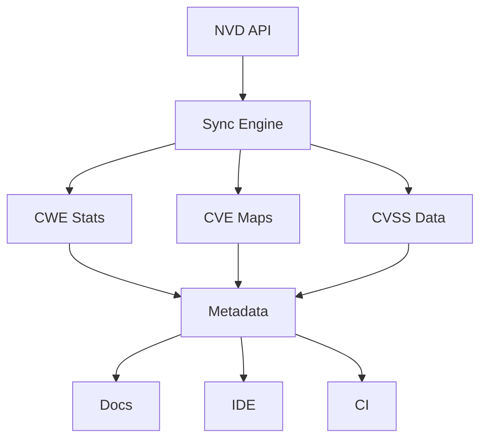

import { Callout } from 'fumadocs-ui/components/callout';
import { Steps, Step } from 'fumadocs-ui/components/steps';
import { Cards, Card } from 'fumadocs-ui/components/card';
import { CVSSSeverityScale } from '@/components/ui/cvss-severity-scale';
import { SecurityStandardsExplorer } from '@/components/ui/security-standards-explorer';

# Security Standards & CVE Ecosystem

> **The Gist**: Security vulnerabilities are catalogued and scored using a global system of standards. Understanding how CWE, CVE, OWASP, and CVSS work together helps you prioritize remediation and communicate risk effectively.

<Callout type="info">
  **Why this matters**: Every Interlace rule is mapped to these standards,
  helping security teams understand exactly what each rule protects against.
</Callout>

## How the Standards Work Together

<SecurityStandardsExplorer />

## CWE: Common Weakness Enumeration

**CWE** is a community-developed dictionary of software and hardware weakness types. Think of it as the _species classification_ for security bugs.

<div className="grid sm:grid-cols-2 gap-4 my-6">
  <div className="p-4 rounded-lg border border-fd-border bg-fd-card">
    <h3 className="text-lg font-semibold mb-2">🏷️ What CWE Does</h3>
    <ul className="text-sm text-fd-muted-foreground space-y-1">
      <li> Classifies **types** of vulnerabilities</li>
      <li> Hierarchical (CWE-74 → CWE-89)</li>
      <li> Language/platform agnostic</li>
      <li> Maintained by MITRE</li>
    </ul>
  </div>
  <div className="p-4 rounded-lg border border-fd-border bg-fd-card">
    <h3 className="text-lg font-semibold mb-2">📊 Common CWEs</h3>
    <ul className="text-sm text-fd-muted-foreground space-y-1">
      <li> **CWE-79**: Cross-site Scripting (XSS)</li>
      <li> **CWE-89**: SQL Injection</li>
      <li> **CWE-22**: Path Traversal</li>
      <li> **CWE-798**: Hardcoded Credentials</li>
    </ul>
  </div>
</div>

**How we use CWE**: Every Interlace rule maps to one or more CWEs, helping you understand the _class_ of vulnerability the rule prevents.

```tsx
// Rule: no-sql-injection
// CWE: CWE-89 (Improper Neutralization of Special Elements in SQL Command)
const query = `SELECT * FROM users WHERE id = ${userId}`; // ❌ Flagged
```

## CVE: Common Vulnerabilities and Exposures

**CVE** is a dictionary of publicly disclosed security vulnerabilities, each with a unique ID. If CWE is the _species_, CVE is a specific _individual animal_ caught in the wild.

<div className="grid sm:grid-cols-2 gap-4 my-6">
  <div className="p-4 rounded-lg border border-fd-border bg-fd-card">
    <h3 className="text-lg font-semibold mb-2">🔍 CVE Anatomy</h3>
    <code className="block bg-fd-muted p-3 rounded text-sm mb-2">
      CVE-2023-46132
    </code>
    <ul className="text-sm text-fd-muted-foreground space-y-1">
      <li> **CVE**: Prefix identifier</li>
      <li> **2023**: Year disclosed</li>
      <li> **46132**: Sequential ID</li>
    </ul>
  </div>
  <div className="p-4 rounded-lg border border-fd-border bg-fd-card">
    <h3 className="text-lg font-semibold mb-2">📋 CVE Contains</h3>
    <ul className="text-sm text-fd-muted-foreground space-y-1">
      <li> Affected product/version</li>
      <li> Vulnerability description</li>
      <li> References & patches</li>
      <li> Related CWE(s)</li>
    </ul>
  </div>
</div>

**How we use CVE**: Where applicable, Interlace rules reference real-world CVEs that demonstrate the vulnerability pattern the rule prevents.

## CVSS: Common Vulnerability Scoring System

**CVSS** is the industry standard for assessing vulnerability severity on a 0-10 scale. Version 3.1 is currently most widely used.

<CVSSSeverityScale />

### CVSS Metrics

CVSS scores are calculated based on three metric groups:

<Steps>
  <Step>
    ### Base Metrics (Primary) Intrinsic characteristics: attack vector,
    complexity, privileges required, user interaction, scope, and impact (CIA
    triad).
  </Step>
  <Step>
    ### Temporal Metrics (Optional) Time-sensitive factors: exploit maturity,
    remediation level, report confidence.
  </Step>
  <Step>
    ### Environmental Metrics (Optional) Organization-specific factors: modified
    base metrics based on your specific environment.
  </Step>
</Steps>

## OWASP Top 10

**OWASP** (Open Web Application Security Project) maintains several "Top 10" lists categorizing the most critical security risks:

<div className="grid sm:grid-cols-3 gap-4 my-6">
  <div className="p-4 rounded-lg border border-fd-border bg-violet-500/5">
    <h3 className="text-lg font-semibold text-violet-400 mb-2">
      🌐 Web Top 10
    </h3>
    <span className="text-sm text-fd-muted-foreground">
      A01-A10 (2021 edition)
      <br />
      e.g., A03:2021 Injection
    </span>
  </div>
  <div className="p-4 rounded-lg border border-fd-border bg-cyan-500/5">
    <h3 className="text-lg font-semibold text-cyan-400 mb-2">
      📱 Mobile Top 10
    </h3>
    <span className="text-sm text-fd-muted-foreground">
      M01-M10 (2024 edition)
      <br />
      e.g., M04 Input Validation
    </span>
  </div>
  <div className="p-4 rounded-lg border border-fd-border bg-emerald-500/5">
    <h3 className="text-lg font-semibold text-emerald-400 mb-2">
      ☁️ Serverless Top 10
    </h3>
    <span className="text-sm text-fd-muted-foreground">
      SAS-1 to SAS-10
      <br />
      e.g., SAS-1 Event Injection
    </span>
  </div>
</div>

## The NVD: National Vulnerability Database

The **NVD** is the U.S. government's repository of vulnerability data, maintained by [NIST](https://www.nist.gov/) (National Institute of Standards and Technology). It enriches CVE data with:

- **CVSS scores** (calculated by NVD analysts)
- **CWE mappings** (vulnerability taxonomy)
- **CPE data** (affected products/versions)
- **References** (patches, advisories)

### How CVEs Get Published

The CVE publication process involves multiple organizations and validation steps:



### CVE Numbering Authorities (CNAs)

**CNAs** are organizations authorized to assign CVE IDs. As of 2024, there are 300+ CNAs worldwide:

<div className="grid sm:grid-cols-2 gap-4 my-6">
  <div className="p-4 rounded-lg border border-fd-border bg-fd-card">
    <h4 className="font-semibold mb-2">🏢 Types of CNAs</h4>
    <ul className="text-sm text-fd-muted-foreground space-y-1">
      <li> **Vendors** (Microsoft, Google, Apple)</li>
      <li> **Open Source Projects** (Apache, Linux)</li>
      <li> **Security Companies** (Rapid7, Tenable)</li>
      <li> **CERTs** (US-CERT, JPCERT)</li>
      <li> **Bug Bounty Platforms** (HackerOne)</li>
    </ul>
  </div>
  <div className="p-4 rounded-lg border border-fd-border bg-fd-card">
    <h4 className="font-semibold mb-2">📋 CNA Responsibilities</h4>
    <ul className="text-sm text-fd-muted-foreground space-y-1">
      <li> Assign CVE IDs within their scope</li>
      <li> Validate vulnerability reports</li>
      <li> Publish CVE records to cve.org</li>
      <li> Update records as needed</li>
    </ul>
  </div>
</div>

### NVD Enrichment Process

When a CVE is published, NVD analysts add critical metadata:

<Steps>
  <Step>
    ### Initial Publication CVE record is published to
    [cve.org](https://www.cve.org/) by a CNA with basic description and
    references.
  </Step>
  <Step>
    ### NVD Ingestion NVD automatically ingests new CVEs within minutes of
    publication.
  </Step>
  <Step>
    ### Analyst Review NVD analysts (human reviewers at NIST) assess the
    vulnerability and calculate CVSS scores, assign CWE mappings, and determine
    affected products (CPE).
  </Step>
  <Step>
    ### Public Availability Enriched data becomes available via [NVD
    website](https://nvd.nist.gov/) and [API](https://nvd.nist.gov/developers/).
  </Step>
</Steps>

<Callout type="info">
  **Timeline**: NVD enrichment typically takes 1-7 days after initial CVE
  publication, though high-profile vulnerabilities may be prioritized.
</Callout>

### NVD API 2.0

The [NVD API 2.0](https://nvd.nist.gov/developers/vulnerabilities) allows programmatic access to vulnerability data:

```bash
# Fetch CVEs for a specific CWE
curl "https://services.nvd.nist.gov/rest/json/cves/2.0?cweId=CWE-89"

# Fetch a specific CVE
curl "https://services.nvd.nist.gov/rest/json/cves/2.0?cveId=CVE-2023-46132"

# Fetch recently modified CVEs
curl "https://services.nvd.nist.gov/rest/json/cves/2.0?lastModStartDate=2024-01-01T00:00:00.000&lastModEndDate=2024-01-31T23:59:59.999"
```

<Callout type="warn">
  **Rate Limits**: Anonymous requests are limited to 5 requests per 30 seconds.
  [Request an API key](https://nvd.nist.gov/developers/request-an-api-key) for
  50 requests per 30 seconds.
</Callout>

### Key NVD API Endpoints

| Endpoint          | Purpose                   | Documentation                                                        |
| ----------------- | ------------------------- | -------------------------------------------------------------------- |
| `/cves/2.0`       | Query CVE records         | [CVE API](https://nvd.nist.gov/developers/vulnerabilities)           |
| `/cpes/2.0`       | Query product identifiers | [CPE API](https://nvd.nist.gov/developers/products)                  |
| `/cvehistory/2.0` | CVE change history        | [History API](https://nvd.nist.gov/developers/vulnerability-changes) |

## How Interlace Uses These Standards

Every Interlace rule is enriched with security metadata:

| Field     | Source        | Purpose                                       |
| --------- | ------------- | --------------------------------------------- |
| **CWE**   | MITRE         | Links rule to weakness taxonomy               |
| **OWASP** | OWASP.org     | Maps to Top 10 risk categories                |
| **CVSS**  | NVD/Estimated | Indicates severity if vulnerability exploited |
| **CVE**   | NVD           | Real-world examples (where applicable)        |

### Current Status: Static CVSS Scores

<Callout type="info" title="Transparency Note">
  Our current CVSS scores are **static estimates** based on typical exploitation
  scenarios for each vulnerability class. They represent the *potential*
  severity if the flagged pattern were exploited.
</Callout>

For example:

- **SQL Injection (CWE-89)**: 9.8 — arbitrary database queries can lead to complete data breach
- **Hardcoded Secrets (CWE-798)**: 9.8 — exposed credentials enable direct system access
- **Missing Auth Check (CWE-862)**: 7.5 — unauthorized access to protected resources

## Coming Soon: @interlace/sync Engine

We're building an automated synchronization engine that will:

<Steps>
  <Step>
    ### Live NVD Integration Automatically fetch and aggregate CVSS scores for
    each CWE from the NVD API, providing real industry averages updated daily.
  </Step>
  <Step>
    ### CVE Tracking Link rules to specific CVEs that match the vulnerability
    pattern, with automatic updates as new CVEs are published.
  </Step>
  <Step>
    ### Trend Analysis Show historical severity trends for each CWE, helping you
    understand how risk levels change over time.
  </Step>
  <Step>
    ### Rule Priority Scoring Dynamic rule prioritization based on current
    threat landscape and CVE activity.
  </Step>
</Steps>



<Callout type="info">
  **Status**: The sync engine is under active development. Current metadata is
  AI-derived and manually curated to provide meaningful context while the
  automated pipeline is built.
</Callout>

## ⚡ Key Takeaways

| Concept   | Remember                                            |
| --------- | --------------------------------------------------- |
| **CWE**   | Weakness _type_ (the DNA)                           |
| **CVE**   | Specific vulnerability _instance_ (individual case) |
| **CVSS**  | Severity _score_ (0-10 scale)                       |
| **OWASP** | Risk _category_ (Top 10 lists)                      |
| **NVD**   | Authoritative _database_ combining all of the above |
| **CNA**   | Organization authorized to assign CVE IDs           |

## 📚 Further Reading

### Official Documentation

<Cards>
  <Card
    title="CWE Database"
    href="https://cwe.mitre.org/"
    description="Browse all 900+ weakness types"
  />
  <Card
    title="CVE.org"
    href="https://www.cve.org/"
    description="Official CVE program & records"
  />
  <Card
    title="NVD"
    href="https://nvd.nist.gov/"
    description="U.S. government vulnerability database"
  />
  <Card
    title="FIRST CVSS"
    href="https://www.first.org/cvss/"
    description="CVSS specification & calculator"
  />
</Cards>

### API & Developer Resources

<Cards>
  <Card
    title="NVD API 2.0 Docs"
    href="https://nvd.nist.gov/developers/vulnerabilities"
    description="Query CVE data programmatically"
  />
  <Card
    title="NVD API Key Request"
    href="https://nvd.nist.gov/developers/request-an-api-key"
    description="Get higher rate limits for API access"
  />
  <Card
    title="CVE JSON Schema"
    href="https://cveproject.github.io/cve-schema/schema/docs/"
    description="CVE 5.0 record format specification"
  />
  <Card
    title="CWE REST API"
    href="https://cwe.mitre.org/data/xml/views/2000.xml"
    description="MITRE CWE data feeds"
  />
</Cards>

### Governance & Process

<Cards>
  <Card
    title="About the CVE Program"
    href="https://www.cve.org/About/Overview"
    description="How CVE IDs are assigned and managed"
  />
  <Card
    title="CNA Rules"
    href="https://www.cve.org/ResourcesSupport/AllResources/CNARules"
    description="Official CNA operating rules"
  />
  <Card
    title="Become a CNA"
    href="https://www.cve.org/PartnerInformation/Partner"
    description="Apply to become a CVE Numbering Authority"
  />
  <Card
    title="NVD Data Feeds"
    href="https://nvd.nist.gov/vuln/data-feeds"
    description="Bulk download vulnerability data"
  />
</Cards>

### OWASP Resources

<Cards>
  <Card
    title="OWASP Top 10"
    href="https://owasp.org/www-project-top-ten/"
    description="Web application security risks"
  />
  <Card
    title="OWASP Mobile Top 10"
    href="https://owasp.org/www-project-mobile-top-10/"
    description="Mobile app security risks (2024)"
  />
  <Card
    title="OWASP Serverless Top 10"
    href="https://owasp.org/www-project-serverless-top-10/"
    description="Serverless application risks"
  />
  <Card
    title="OWASP Cheat Sheets"
    href="https://cheatsheetseries.owasp.org/"
    description="Practical security guidance"
  />
</Cards>

## 🔗 Next Steps

<CTAGrid columns={3}>
  <CTACard
    href="/docs/concepts/static-analysis"
    title="📊 Static Analysis"
    description="Understand detection limitations"
    gradient="purple"
  />
  <CTACard
    href="/docs/secure-coding"
    title="🛡️ Security Rules"
    description="Browse all 416+ security rules"
    gradient="emerald"
  />
  <CTACard
    href="/docs/concepts/how-ast-works"
    title="🌳 How AST Works"
    description="Deep dive into ESLint internals"
    gradient="blue"
  />
</CTAGrid>
