import { FalseNegativeCTA, WhenNotToUse } from '@/components/RuleComponents';

import { Callout } from 'fumadocs-ui/components/callout';
import { Steps, Step } from 'fumadocs-ui/components/steps';
import { Cards, Card } from 'fumadocs-ui/components/card';

# Understanding Static Analysis Limitations

> **The Gist**: Static analysis is like a security guard who checks IDs at the door—great at catching known fakes, but can't follow people around once they're inside.

| Quick Summary    |                                                            |
| ---------------- | ---------------------------------------------------------- |
| **Catches**      | Known patterns (eval, innerHTML, SQL concat), API misuse   |
| **Misses**       | Runtime values, dynamic code, business logic, dependencies |
| **Coverage**     | ~80% of common vulnerabilities (OWASP Top 10)              |
| **Combine With** | DAST, dependency scanning, penetration testing             |

<Callout type="info">
  **Why this matters**: Knowing what static analysis can and cannot do helps you
  build a more robust security strategy that combines automated tools with
  proper security practices.
</Callout>

## What is Static Analysis?

Static analysis examines your code **without executing it**. ESLint reads your source files, parses them into an Abstract Syntax Tree (AST), and applies rules to detect potential issues.

```mermaid
flowchart LR
    A[Source Code] --> B[Parser]
    B --> C[AST]
    C --> D[ESLint Rules]
    D --> E{Match Pattern?}
    E -->|Yes| F[🚨 Report Issue]
    E -->|No| G[✅ Pass]
```



## Where Static Analysis Excels

<div className="grid sm:grid-cols-2 gap-4 my-6">
  <div className="p-4 rounded-lg border border-fd-border bg-emerald-500/5">
    <h3 className="text-lg font-semibold text-emerald-400 mb-2">
      ✅ Pattern Detection
    </h3>
    <span className="text-sm text-fd-muted-foreground block">
      Identifying known vulnerable patterns like `eval()`, `innerHTML`, and SQL
      string concatenation.
    </span>
  </div>
  <div className="p-4 rounded-lg border border-fd-border bg-emerald-500/5">
    <h3 className="text-lg font-semibold text-emerald-400 mb-2">
      ✅ API Misuse
    </h3>
    <span className="text-sm text-fd-muted-foreground block">
      Detecting incorrect usage of security-sensitive APIs like JWT verification
      or crypto functions.
    </span>
  </div>
  <div className="p-4 rounded-lg border border-fd-border bg-emerald-500/5">
    <h3 className="text-lg font-semibold text-emerald-400 mb-2">
      ✅ Configuration Issues
    </h3>
    <span className="text-sm text-fd-muted-foreground block">
      Finding hardcoded secrets, weak crypto algorithms, and insecure
      configurations.
    </span>
  </div>
  <div className="p-4 rounded-lg border border-fd-border bg-emerald-500/5">
    <h3 className="text-lg font-semibold text-emerald-400 mb-2">
      ✅ Consistent Enforcement
    </h3>
    <span className="text-sm text-fd-muted-foreground block">
      Applying the same security standards across your entire codebase
      automatically.
    </span>
  </div>
</div>

## Where Static Analysis Cannot Help

Static analysis has fundamental limitations due to the **halting problem** - it's mathematically impossible to determine all behaviors of a program without running it.

<div className="grid sm:grid-cols-2 gap-4 my-6">
  <div className="p-4 rounded-lg border border-fd-border bg-red-500/5">
    <h3 className="text-lg font-semibold text-red-400 mb-2">
      ❌ Runtime Values
    </h3>
    <span className="text-sm text-fd-muted-foreground block">
      Cannot determine what values variables will hold at runtime, especially
      from external sources.
    </span>
  </div>
  <div className="p-4 rounded-lg border border-fd-border bg-red-500/5">
    <h3 className="text-lg font-semibold text-red-400 mb-2">❌ Dynamic Code</h3>
    <span className="text-sm text-fd-muted-foreground block">
      Code generated at runtime, eval'd strings, and dynamic imports are
      invisible to static analysis.
    </span>
  </div>
  <div className="p-4 rounded-lg border border-fd-border bg-red-500/5">
    <h3 className="text-lg font-semibold text-red-400 mb-2">
      ❌ Business Logic
    </h3>
    <span className="text-sm text-fd-muted-foreground block">
      Authorization flaws, race conditions, and business logic vulnerabilities
      require runtime context.
    </span>
  </div>
  <div className="p-4 rounded-lg border border-fd-border bg-red-500/5">
    <h3 className="text-lg font-semibold text-red-400 mb-2">
      ❌ External Dependencies
    </h3>
    <span className="text-sm text-fd-muted-foreground block">
      Vulnerabilities in third-party libraries require dependency scanning tools
      (npm audit, Snyk).
    </span>
  </div>
</div>

## The Data Flow Challenge

One of the biggest limitations is **tracing data flow** through complex applications.

### What We Can Detect

```javascript
// ✅ Direct pattern - DETECTED
const query = `SELECT * FROM users WHERE id = ${req.params.id}`;

// ✅ Simple variable tracking - DETECTED
const userId = req.params.id;
const query = `SELECT * FROM users WHERE id = ${userId}`;
```

### What We Cannot Reliably Detect

```javascript
// ❌ Sanitized input - FALSE POSITIVE possible
const userId = sanitize(req.params.id);
const query = `SELECT * FROM users WHERE id = ${userId}`;

// ❌ Complex data flow - MISSED
function getQuery(options) {
  return buildDynamicQuery(options);
}
const query = getQuery({ filter: req.body.filter });

// ❌ Async data - MISSED
const data = await fetchFromDatabase(req.params.id);
processUnsafely(data);
```

<Callout type="warn">
  **Known False Negatives**: Every Interlace rule documents its limitations in a
  "Known False Negatives" section. We believe in transparency about what we can
  and cannot detect.
</Callout>

## How Interlace Mitigates These Limitations

<Steps>
  <Step>
    ### Conservative Pattern Matching We flag potentially dangerous patterns
    even when we can't confirm they're exploitable, erring on the side of
    caution.
  </Step>
  <Step>
    ### Sanitizer Awareness Rules recognize common sanitization patterns to
    reduce false positives while still catching genuine issues.
  </Step>
  <Step>
    ### LLM-Optimized Messages Our error messages include context that helps AI
    assistants understand the issue and suggest appropriate fixes.
  </Step>
  <Step>
    ### Documented Limitations Every rule explicitly documents what it cannot
    detect, so you know where additional security measures are needed.
  </Step>
</Steps>

## Building a Robust Security Strategy

Static analysis should be **one layer** of your defense-in-depth strategy:


## ⚡ Key Takeaways

| What To Do                       | Why                                         |
| -------------------------------- | ------------------------------------------- |
| **Enable Interlace in CI**       | Catch ~80% of common vulns automatically    |
| **Add dependency scanning**      | npm audit/Snyk catches supply chain attacks |
| **Read "Known False Negatives"** | Know exactly what each rule misses          |
| **Layer with DAST**              | Runtime testing finds business logic flaws  |

## 🔗 Next Steps

<CTAGrid columns={3}>
  <CTACard
    href="/docs/concepts/fixable-rules"
    title="⚡ Fixable Rules"
    description="Why some issues need human or AI judgment"
    gradient="purple"
  />
  <CTACard
    href="/docs/benchmarks"
    title="📊 Benchmarks"
    description="Performance comparison with alternatives"
    gradient="emerald"
  />
  <CTACard
    href="/docs"
    title="🚀 Getting Started"
    description="Set up Interlace in 2 minutes"
    gradient="blue"
  />
</CTAGrid>

## 📚 Further Reading

- **[OWASP Testing Guide](https://owasp.org/www-project-web-security-testing-guide/)** - Comprehensive security testing methodology
- **[ESLint Architecture](https://eslint.org/docs/latest/extend/custom-rules)** - How ESLint rule traversal works
- **[SAST vs DAST](https://owasp.org/www-community/pages/attacks/Static%20Analysis)** - When to use which approach
