> **Keywords:** no-cryptojs, CryptoJS, unmaintained crypto, side-channel, performance, security, ESLint rule, CWE-1104, vulnerable components
> **CWE:** [CWE-1104: Use of Unmaintained Third Party Components](https://cwe.mitre.org/data/definitions/1104.html)  
> **OWASP:** [OWASP Top 10 A06:2021 - Vulnerable and Outdated Components](https://owasp.org/Top10/A06_2021-Vulnerable_and_Outdated_Components/)

ESLint Rule: no-cryptojs. This rule is part of [`eslint-plugin-crypto`](https://www.npmjs.com/package/eslint-plugin-crypto).

## Quick Summary

| Aspect         | Details                                       |
| -------------- | --------------------------------------------- |
| **Severity**   | High (Unmaintained Dependency)                |
| **Auto-Fix**   | ❌ No (requires manual migration)             |
| **Category**   | Security / Dependencies                       |
| **ESLint MCP** | ✅ Optimized for ESLint MCP integration       |
| **Best For**   | All applications prioritizing security health |

## Vulnerability and Risk

**Vulnerability:** Dependence on the `crypto-js` library. While popular, `crypto-js` is effectively unmaintained and does not benefit from the rigorous security audits and platform-specific optimizations present in native crypto modules.

**Risk:** Using unmaintained cryptographic libraries exposes the application to unpatched vulnerabilities. Native platform APIs (like Node.js `crypto` or `Web Crypto`) are significantly faster, use hardware acceleration (AES-NI), and are regularly updated to mitigate side-channel and timing attacks. Furthermore, `crypto-js` increases bundle size and execution time in browser environments.

## Error Message Format

The rule provides **LLM-optimized error messages** (Compact 2-line format) with actionable security guidance:

```text
⚠️ CWE-1104 OWASP:A06 | Unmaintained Crypto Library (Crypto-JS) detected | HIGH [SupplyChain]
   Fix: Migrate to native Node.js crypto or Web Crypto API for better security and performance | https://nodejs.org/api/crypto.html
```

### Message Components

| Component                 | Purpose                | Example                                                                                                     |
| :------------------------ | :--------------------- | :---------------------------------------------------------------------------------------------------------- |
| **Risk Standards**        | Security benchmarks    | [CWE-1104](https://cwe.mitre.org/data/definitions/1104.html) [OWASP:A06](https://owasp.org/Top10/A06_2021/) |
| **Issue Description**     | Specific vulnerability | `Unmaintained Crypto Library detected`                                                                      |
| **Severity & Compliance** | Impact assessment      | `HIGH [SupplyChain]`                                                                                        |
| **Fix Instruction**       | Actionable remediation | `Migrate to native Node.js/Web Crypto`                                                                      |
| **Technical Truth**       | Official reference     | [Vulnerable and Outdated](https://owasp.org/Top10/A06_2021/)                                                |

## Rule Details

This rule identifies `import` and `require` statements targeting `crypto-js` and its sub-modules (e.g., `crypto-js/aes`).

```mermaid
%%{init: {
  'theme': 'base',
  'themeVariables': {
    'primaryColor': '#f8fafc',
    'primaryTextColor': '#1e293b',
    'primaryBorderColor': '#334155',
    'lineColor': '#475569',
    'c0': '#f8fafc',
    'c1': '#f1f5f9',
    'c2': '#e2e8f0',
    'c3': '#cbd5e1'
  }
}}%%
flowchart TD
    A[Package Import] --> B{Is crypto-js?}
    B -->|Yes| C[🚨 Supply Chain Risk]
    B -->|No| D[✅ Safe Import]
    C --> E[💡 Suggest Node.js Crypto / Web Crypto]
```



### Why This Matters

| Issue                | Impact                               | Solution                                                |
| -------------------- | ------------------------------------ | ------------------------------------------------------- |
| 🛡️ **Zero-Day Risk** | Unpatched vulnerabilities remain     | Use platform APIs with committed maintenance cycles     |
| ⚡ **Performance**   | Slower encryption/decryption         | Leverage native compiled code and hardware acceleration |
| 🔒 **Bundle Size**   | Unnecessary code shipping to browser | Use the built-in `window.crypto` for zero-byte overhead |

## Configuration

This rule has no options.

## Examples

### ❌ Incorrect

```javascript
// Using crypto-js as a dependency
import CryptoJS from 'crypto-js';
import { AES } from 'crypto-js/aes';

const hash = CryptoJS.MD5('message').toString();
```

### ✅ Correct

```javascript
// Using native Node.js module
import crypto from 'node:crypto';
const hash = crypto.createHash('md5').update('message').digest('hex');

// Using modern alternative for web
const hashBuffer = await crypto.subtle.digest('SHA-256', data);
```

## Known False Negatives

The following patterns are **not detected** due to static analysis limitations:

### Proxy Packages

**Why**: If a library depends on `crypto-js` internally but exposes a custom API, this rule will not detect it.

**Mitigation**: Perform recursive dependency audits using `npm list crypto-js`.

### Dynamic Loading

**Why**: Accessing the library via dynamic `require` or runtime introspection.

```javascript
const lib = 'crypto' + '-js';
const cj = require(lib); // ❌ NOT DETECTED
```

**Mitigation**: Standardize on static imports for all core security infrastructure.

## References

- [CWE-1104: Use of Unmaintained Third Party Components](https://cwe.mitre.org/data/definitions/1104.html)
- [Node.js Crypto API](https://nodejs.org/api/crypto.html)
- [Web Crypto API Overview](https://developer.mozilla.org/en-US/docs/Web/API/Web_Crypto_API)
