> **Keywords:** no-deprecated-cipher-method, createCipher, createDecipher, IV, secure key derivation, security, ESLint rule, CWE-327, cryptographic failure
> **CWE:** [CWE-327: Use of a Broken or Risky Cryptographic Algorithm](https://cwe.mitre.org/data/definitions/327.html)  
> **OWASP:** [OWASP Top 10 A02:2021 - Cryptographic Failures](https://owasp.org/Top10/A02_2021-Cryptographic_Failures/)

ESLint Rule: no-deprecated-cipher-method. This rule is part of [`eslint-plugin-crypto`](https://www.npmjs.com/package/eslint-plugin-crypto).

## Quick Summary

| Aspect         | Details                                       |
| -------------- | --------------------------------------------- |
| **Severity**   | High (Broken Cryptography)                    |
| **Auto-Fix**   | ✅ Yes (via suggestion to use IV variant)     |
| **Category**   | Security / Cryptography                       |
| **ESLint MCP** | ✅ Optimized for ESLint MCP integration       |
| **Best For**   | Modernizing legacy Node.js cryptographic code |

## Vulnerability and Risk

**Vulnerability:** Use of deprecated Node.js methods `crypto.createCipher()` and `crypto.createDecipher()`. These methods are legacy APIs that derive a key and Initialization Vector (IV) from a password using an insecure, non-standard implementation (typically an un-salted single MD5 hash).

**Risk:** Because these methods do not use a dedicated, unique IV for every operation, they produce deterministic ciphertext (the same plaintext always encrypts to the same ciphertext with the same password). This allows attackers to perform pattern analysis and known-plaintext attacks. Furthermore, the weak key derivation makes the "password" vulnerable to brute-force or dictionary attacks much faster than modern standards like PBKDF2 or scrypt.

## Error Message Format

The rule provides **LLM-optimized error messages** (Compact 2-line format) with actionable security guidance:

```text
🔒 CWE-327 OWASP:A02 | Deprecated crypto method detected | HIGH [BrokenCrypto]
   Fix: Use crypto.createCipheriv() which requires an explicit, unique IV for secure encryption | https://nodejs.org/api/crypto.html#cryptocreatecipherivalgorithm-key-iv-options
```

### Message Components

| Component                 | Purpose                | Example                                                                                                   |
| :------------------------ | :--------------------- | :-------------------------------------------------------------------------------------------------------- |
| **Risk Standards**        | Security benchmarks    | [CWE-327](https://cwe.mitre.org/data/definitions/327.html) [OWASP:A02](https://owasp.org/Top10/A02_2021/) |
| **Issue Description**     | Specific vulnerability | `Deprecated crypto method detected`                                                                       |
| **Severity & Compliance** | Impact assessment      | `HIGH [BrokenCrypto]`                                                                                     |
| **Fix Instruction**       | Actionable remediation | `Use createCipheriv()`                                                                                    |
| **Technical Truth**       | Official reference     | [Node.js Deprecation](https://nodejs.org/api/crypto.html#cryptocreatecipheralgorithm-password-options)    |

## Rule Details

This rule scans for calls to `crypto.createCipher()` and `crypto.createDecipher()`, highlighting them as dangerous legacy patterns.

```mermaid
%%{init: {
  'theme': 'base',
  'themeVariables': {
    'primaryColor': '#f8fafc',
    'primaryTextColor': '#1e293b',
    'primaryBorderColor': '#334155',
    'lineColor': '#475569',
    'c0': '#f8fafc',
    'c1': '#f1f5f9',
    'c2': '#e2e8f0',
    'c3': '#cbd5e1'
  }
}}%%
flowchart TD
    A[crypto Method Call] --> B{Is createCipher or createDecipher?}
    B -->|Yes| C[🚨 Deprecated / Insecure Risk]
    B -->|No - is iv variant| D[✅ Recommended API]
    C --> E[💡 Suggest createCipheriv / createDecipheriv]
```



### Why This Matters

| Issue                | Impact                              | Solution                                                     |
| -------------------- | ----------------------------------- | ------------------------------------------------------------ |
| 🛡️ **Lack of IV**    | Deterministic, crackable ciphertext | Use `createCipheriv` which enforces unique, random IVs       |
| 🚀 **Weak Salt/Key** | Rapid password brute-forcing        | Derive keys using `PBKDF2` or `scrypt` before encrypting     |
| 🔒 **Compliance**    | Violates modern security baselines  | Decommission all legacy Node.js crypto calls from production |

## Configuration

This rule has no options.

## Examples

### ❌ Incorrect

```javascript
// Using deprecated method with a simple password
const cipher = crypto.createCipher('aes-256-cbc', 'my-weak-password');

// Using deprecated decipher
const decipher = crypto.createDecipher('aes-256-cbc', 'my-weak-password');
```

### ✅ Correct

```javascript
// Using the formal IV variant (BEST PRACTICE)
const key = crypto.scryptSync('password', 'salt', 32);
const iv = crypto.randomBytes(16);
const cipher = crypto.createCipheriv('aes-256-cbc', key, iv);

// Decryption with the explicit IV
const decipher = crypto.createDecipheriv('aes-256-cbc', key, iv);
```

## Known False Negatives

The following patterns are **not detected** due to static analysis limitations:

### Alias Methods

**Why**: If the methods are renamed or accessed via dynamic indexing.

```javascript
const method = 'create' + 'Cipher';
const c = crypto[method](...); // ❌ NOT DETECTED
```

**Mitigation**: Standardize on explicit, static platform API access for all cryptographic operations.

### Wrapped Libraries

**Why**: Third-party libraries that internally use these deprecated methods but expose a different interface are not scanned.

**Mitigation**: Audit your `node_modules` for legacy cryptographic dependencies using security scanning tools like `npm audit`.

## References

- [CWE-327: Use of a Broken or Risky Cryptographic Algorithm](https://cwe.mitre.org/data/definitions/327.html)
- [Node.js Crypto createCipher Deprecation Warning](https://nodejs.org/api/crypto.html#cryptocreatecipheralgorithm-password-options)
- [OpenSSL EVP_BytesToKey documentation (The underlying algorithm)](https://www.openssl.org/docs/man1.1.1/man3/EVP_BytesToKey.html)
