> **Keywords:** no-ecb-mode, ECB, Electronic Codebook, deterministic encryption, security, ESLint rule, CWE-327, pattern leakage
> **CWE:** [CWE-327: Use of a Broken or Risky Cryptographic Algorithm](https://cwe.mitre.org/data/definitions/327.html)  
> **OWASP:** [OWASP Top 10 A02:2021 - Cryptographic Failures](https://owasp.org/Top10/A02_2021-Cryptographic_Failures/)

ESLint Rule: no-ecb-mode. This rule is part of [`eslint-plugin-crypto`](https://www.npmjs.com/package/eslint-plugin-crypto).

## Quick Summary

| Aspect         | Details                                     |
| -------------- | ------------------------------------------- |
| **Severity**   | Critical (Broken Cryptography)              |
| **Auto-Fix**   | ✅ Yes (via suggestion to GCM/CBC)          |
| **Category**   | Security / Cryptography                     |
| **ESLint MCP** | ✅ Optimized for ESLint MCP integration     |
| **Best For**   | All applications encrypting structured data |

## Vulnerability and Risk

**Vulnerability:** Use of Electronic Codebook (ECB) mode for symmetric encryption. ECB divides the plaintext into blocks and encrypts each block independently using the same key.

**Risk:** ECB is deterministic. Identical plaintext blocks result in identical ciphertext blocks. This leaks significant structural information about the data. For example, encrypting a bitmap image with ECB often results in the original image still being clearly visible in the ciphertext patterns. It is also vulnerable to block-shuffling attacks where an attacker can rearrange blocks to change the meaning of the decrypted data.

## Error Message Format

The rule provides **LLM-optimized error messages** (Compact 2-line format) with actionable security guidance:

```text
🔒 CWE-327 OWASP:A02 | Insecure Cipher Mode (ECB) detected | CRITICAL [PatternLeak]
   Fix: Replace ECB mode with GCM or CBC for secure, non-deterministic encryption | https://cwe.mitre.org/data/definitions/327.html
```

### Message Components

| Component                 | Purpose                | Example                                                                                                    |
| :------------------------ | :--------------------- | :--------------------------------------------------------------------------------------------------------- |
| **Risk Standards**        | Security benchmarks    | [CWE-327](https://cwe.mitre.org/data/definitions/327.html) [OWASP:A02](https://owasp.org/Top10/A02_2021/)  |
| **Issue Description**     | Specific vulnerability | `Insecure Cipher Mode (ECB) detected`                                                                      |
| **Severity & Compliance** | Impact assessment      | `CRITICAL [PatternLeak]`                                                                                   |
| **Fix Instruction**       | Actionable remediation | `Replace ECB with GCM or CBC`                                                                              |
| **Technical Truth**       | Official reference     | [ECB Weaknesses](<https://en.wikipedia.org/wiki/Block_cipher_mode_of_operation#Electronic_codebook_(ECB)>) |

## Rule Details

This rule scans for the `-ecb` suffix in the algorithm string passed to `crypto.createCipheriv()` and `crypto.createDecipheriv()`.

```mermaid
%%{init: {
  'theme': 'base',
  'themeVariables': {
    'primaryColor': '#f8fafc',
    'primaryTextColor': '#1e293b',
    'primaryBorderColor': '#334155',
    'lineColor': '#475569',
    'c0': '#f8fafc',
    'c1': '#f1f5f9',
    'c2': '#e2e8f0',
    'c3': '#cbd5e1'
  }
}}%%
flowchart TD
    A[crypto Method Call] --> B{Algorithm ends in -ECB?}
    B -->|Yes| C[🚨 Deterministic Risk]
    B -->|No - is-GCM / -CBC| D[✅ Non-Deterministic Mode]
    C --> E[💡 Suggest AES-256-GCM]
```



### Why This Matters

| Issue                  | Impact                             | Solution                                                  |
| ---------------------- | ---------------------------------- | --------------------------------------------------------- |
| 🛡️ **Data Leakage**    | Visual/structural patterns leak    | Use GCM or CBC which use IVs to ensure unique ciphertexts |
| 🚀 **Block Shuffling** | Data manipulated undetected        | Use GCM (AEAD) to provide cryptographic integrity         |
| 🔒 **Compliance**      | Violates modern security standards | Standardize on AEAD modes for all sensitive data storage  |

## Configuration

This rule has no options.

## Examples

### ❌ Incorrect

```javascript
// Using insecure ECB mode (DANGEROUS)
const cipher = crypto.createCipheriv('aes-256-ecb', key, '');

// Even with an IV, ECB ignores it
const decipher = crypto.createDecipheriv('aes-128-ecb', key, null);
```

### ✅ Correct

```javascript
// Using GCM mode (BEST PRACTICE)
const cipher = crypto.createCipheriv('aes-256-gcm', key, iv);

// Using CBC mode (Secure if IV is unique)
const cipher = crypto.createCipheriv('aes-256-cbc', key, iv);
```

## Known False Negatives

The following patterns are **not detected** due to static analysis limitations:

### Dynamic Algorithm Names

**Why**: If the algorithm string is constructed at runtime or loaded from a variable.

```javascript
const mode = '-ecb';
crypto.createCipheriv('aes-256' + mode, key, iv); // ❌ NOT DETECTED
```

**Mitigation**: Always use string literals for algorithm definitions to ensure auditability.

### Legacy Aliases

**Why**: Some older libraries might use non-standard names for ECB mode that don't match the `-ecb` regex pattern.

**Mitigation**: Standardize on the built-in Node.js `crypto` module.

## References

- [CWE-327: Use of a Broken or Risky Cryptographic Algorithm](https://cwe.mitre.org/data/definitions/327.html)
- [Wikipedia: Block cipher mode of operation (ECB)](<https://en.wikipedia.org/wiki/Block_cipher_mode_of_operation#Electronic_codebook_(ECB)>)
- [Adobe Incident: Example of ECB vulnerability](https://en.wikipedia.org/wiki/Galois/Counter_Mode#Security)
