> **Keywords:** no-insecure-rsa-padding, PKCS1, RSA, OAEP, padding oracle, Marvin attack, security, ESLint rule, CWE-327, side-channel
> **CWE:** [CWE-327: Use of a Broken or Risky Cryptographic Algorithm](https://cwe.mitre.org/data/definitions/327.html)  
> **OWASP:** [OWASP Top 10 A02:2021 - Cryptographic Failures](https://owasp.org/Top10/A02_2021-Cryptographic_Failures/)

ESLint Rule: no-insecure-rsa-padding. This rule is part of [`eslint-plugin-crypto`](https://www.npmjs.com/package/eslint-plugin-crypto).

## Quick Summary

| Aspect         | Details                                    |
| -------------- | ------------------------------------------ |
| **Severity**   | Critical (Asymmetric Risk)                 |
| **Auto-Fix**   | ✅ Yes (switch to OAEP constant)           |
| **Category**   | Security / Asymmetric Crypto               |
| **ESLint MCP** | ✅ Optimized for ESLint MCP integration    |
| **Best For**   | All applications performing RSA operations |

## Vulnerability and Risk

**Vulnerability:** Use of legacy RSA padding schemes, specifically `RSA_PKCS1_PADDING` (PKCS#1 v1.5). This scheme is biologically flawed and susceptible to Padding Oracle attacks.

**Risk:** Attackers can craft malicious ciphertexts and observe the server's response to systematically decrypt RSA-encrypted data without ever having the private key. Recent research like the **Marvin attack** has shown that even modern implementations of PKCS#1 v1.5 are often leaky. RSA-OAEP (Optimal Asymmetric Encryption Padding) is the mandated replacement.

## Error Message Format

The rule provides **LLM-optimized error messages** (Compact 2-line format) with actionable security guidance:

```text
🔒 CWE-327 OWASP:A02 | Insecure RSA Padding detected | CRITICAL [SideChannel]
   Fix: Replace PKCS1 v1.5 padding with RSA_PKCS1_OAEP_PADDING for better security | https://cwe.mitre.org/data/definitions/327.html
```

### Message Components

| Component                 | Purpose                | Example                                                                                                   |
| :------------------------ | :--------------------- | :-------------------------------------------------------------------------------------------------------- |
| **Risk Standards**        | Security benchmarks    | [CWE-327](https://cwe.mitre.org/data/definitions/327.html) [OWASP:A02](https://owasp.org/Top10/A02_2021/) |
| **Issue Description**     | Specific vulnerability | `Insecure RSA Padding detected`                                                                           |
| **Severity & Compliance** | Impact assessment      | `CRITICAL [SideChannel]`                                                                                  |
| **Fix Instruction**       | Actionable remediation | `Use RSA_PKCS1_OAEP_PADDING`                                                                              |
| **Technical Truth**       | Official reference     | [Broken Cryptography](https://cwe.mitre.org/data/definitions/327.html)                                    |

## Rule Details

This rule identifies uses of the built-in Node.js constant `crypto.constants.RSA_PKCS1_PADDING` within `publicEncrypt` and `privateDecrypt` methods.

```mermaid
%%{init: {
  'theme': 'base',
  'themeVariables': {
    'primaryColor': '#f8fafc',
    'primaryTextColor': '#1e293b',
    'primaryBorderColor': '#334155',
    'lineColor': '#475569',
    'c0': '#f8fafc',
    'c1': '#f1f5f9',
    'c2': '#e2e8f0',
    'c3': '#cbd5e1'
  }
}}%%
flowchart TD
    A[RSA Encrypt/Decrypt Call] --> B{Padding is RSA_PKCS1_PADDING?}
    B -->|Yes| C[🚨 Side-Channel Risk]
    B -->|No - is OAEP| D[✅ Secure Padding]
    C --> E[💡 Suggest RSA_PKCS1_OAEP_PADDING]
```



### Why This Matters

| Issue                 | Impact                                | Solution                                                       |
| --------------------- | ------------------------------------- | -------------------------------------------------------------- |
| 🛡️ **Padding Oracle** | Decryption without the private key    | Use OAEP which is mathematically proven secure against oracles |
| 🚀 **Timing Leakage** | Secret bits leaked via execution time | Implement constant-time operations through newer standards     |
| 🔒 **Compliance**     | Failure to meet NIST/SOC2 standards   | Enforce OAEP for all internal and external asymmetric comms    |

## Configuration

This rule has no options.

## Examples

### ❌ Incorrect

```javascript
// Using insecure legacy padding
const encrypted = crypto.publicEncrypt(
  {
    key: publicKey,
    padding: crypto.constants.RSA_PKCS1_PADDING,
  },
  buffer,
);

const decrypted = crypto.privateDecrypt(
  {
    key: privateKey,
    padding: crypto.constants.RSA_PKCS1_PADDING,
  },
  buffer,
);
```

### ✅ Correct

```javascript
// Using secure OAEP padding (BEST PRACTICE)
const encrypted = crypto.publicEncrypt(
  {
    key: publicKey,
    padding: crypto.constants.RSA_PKCS1_OAEP_PADDING,
    oaepHash: 'sha256',
  },
  buffer,
);

const decrypted = crypto.privateDecrypt(
  {
    key: privateKey,
    padding: crypto.constants.RSA_PKCS1_OAEP_PADDING,
    oaepHash: 'sha256',
  },
  buffer,
);
```

## Known False Negatives

The following patterns are **not detected** due to static analysis limitations:

### Alias Variables

**Why**: If the constant is renamed or assigned to another variable before being used, the rule may lose trace.

```javascript
const myPadding = crypto.constants.RSA_PKCS1_PADDING;
crypto.publicEncrypt({ key, padding: myPadding }, buf); // ❌ NOT DETECTED
```

**Mitigation**: Avoid aliasing cryptographic constants; use them directly at the call site for clarity and auditability.

### Third-Party RSA

**Why**: This rule targets the Node.js `crypto` module methods. External RSA libraries (like `node-rsa` or `jsencrypt`) that use different configuration schemas are not scanned.

**Mitigation**: Standardize on the built-in platform APIs for all core cryptographic work.

## References

- [CWE-327: Use of a Broken or Risky Cryptographic Algorithm](https://cwe.mitre.org/data/definitions/327.html)
- [The Marvin Attack](https://marvin-attack.com/)
- [Node.js Crypto RSA Constants](https://nodejs.org/api/crypto.html#cryptoconstants-1)
