> **Keywords:** no-self-signed-certs, TLS validation, MITM attack, rejectUnauthorized, security, ESLint rule, CWE-295, certificate bypass
> **CWE:** [CWE-295: Improper Certificate Validation](https://cwe.mitre.org/data/definitions/295.html)  
> **OWASP:** [OWASP Top 10 A07:2021 - Identification and Authentication Failures](https://owasp.org/Top10/A07_2021/)

ESLint Rule: no-self-signed-certs. This rule is part of [`eslint-plugin-crypto`](https://www.npmjs.com/package/eslint-plugin-crypto).

## Quick Summary

| Aspect         | Details                                 |
| -------------- | --------------------------------------- |
| **Severity**   | Critical (Man-in-the-middle risk)       |
| **Auto-Fix**   | ✅ Yes (switch boolean value)           |
| **Category**   | Security / Network                      |
| **ESLint MCP** | ✅ Optimized for ESLint MCP integration |
| **Best For**   | All production-grade Node.js services   |

## Vulnerability and Risk

**Vulnerability:** Disabling secure certificate validation in TLS/HTTPS requests (typically via `rejectUnauthorized: false`).

**Risk:** By disabling validation, your application will accept _any_ certificate presented by a server, including self-signed, expired, or malicious certificates. This makes the connection vulnerable to Man-in-the-Middle (MITM) attacks, allowing an attacker to intercept, read, and even modify encrypted traffic between your service and its upstream dependencies.

## Error Message Format

The rule provides **LLM-optimized error messages** (Compact 2-line format) with actionable security guidance:

```text
🔒 CWE-295 OWASP:A07 | Insecure TLS validation detected | CRITICAL [MITM]
   Fix: Set rejectUnauthorized: true to enable proper certificate validation | https://cwe.mitre.org/data/definitions/295.html
```

### Message Components

| Component                 | Purpose                | Example                                                                                                   |
| :------------------------ | :--------------------- | :-------------------------------------------------------------------------------------------------------- |
| **Risk Standards**        | Security benchmarks    | [CWE-295](https://cwe.mitre.org/data/definitions/295.html) [OWASP:A07](https://owasp.org/Top10/A07_2021/) |
| **Issue Description**     | Specific vulnerability | `Insecure TLS validation detected`                                                                        |
| **Severity & Compliance** | Impact assessment      | `CRITICAL [MITM]`                                                                                         |
| **Fix Instruction**       | Actionable remediation | `Set rejectUnauthorized: true`                                                                            |
| **Technical Truth**       | Official reference     | [Improper Validation](https://cwe.mitre.org/data/definitions/295.html)                                    |

## Rule Details

This rule identifies common Node.js patterns used to bypass TLS verification in modules like `https`, `tls`, `axios`, and `request`.

```mermaid
%%{init: {
  'theme': 'base',
  'themeVariables': {
    'primaryColor': '#f8fafc',
    'primaryTextColor': '#1e293b',
    'primaryBorderColor': '#334155',
    'lineColor': '#475569',
    'c0': '#f8fafc',
    'c1': '#f1f5f9',
    'c2': '#e2e8f0',
    'c3': '#cbd5e1'
  }
}}%%
flowchart TD
    A[Property Access / Global Config] --> B{rejectUnauthorized: false?}
    B -->|Yes| C[🚨 MITM Exposure Risk]
    B -->|No| D[✅ Secure Validation]
    A --> E{NODE_TLS_REJECT_UNAUTHORIZED = '0'?}
    E -->|Yes| C
    C --> F[💡 Suggest enabling validation]
```



### Why This Matters

| Issue                 | Impact                               | Solution                                                 |
| --------------------- | ------------------------------------ | -------------------------------------------------------- |
| 🕵️ **Eavesdropping**  | Plaintext secrets leaked to attacker | Never disable certificate validation in production       |
| 🚀 **Data Integrity** | Malicious response data injected     | Use globally trusted CAs for all certificates            |
| 🔒 **Compliance**     | Major SOC2/PCI-DSS violation         | Implement internal PKI for self-signed development certs |

## Configuration

This rule supports the following options:

```javascript
{
  "rules": {
    "crypto/no-self-signed-certs": ["error", {
      "allowInTests": true // Allow bypassing validation in test files
    }]
  }
}
```

## Examples

### ❌ Incorrect

```javascript
// Disabling validation in HTTPS agent (Express/Axios)
const agent = new https.Agent({
  rejectUnauthorized: false,
});

// Setting global Node.js environment variable
process.env.NODE_TLS_REJECT_UNAUTHORIZED = '0';

// Axios/Request options
axios.get('https://internal.api', {
  httpsAgent: new https.Agent({ rejectUnauthorized: false }),
});
```

### ✅ Correct

```javascript
// Keeping default secure validation (BEST PRACTICE)
const agent = new https.Agent({
  rejectUnauthorized: true,
});

// Using a custom CA for internal self-signed certificates
const agent = new https.Agent({
  ca: fs.readFileSync('internal-ca-cert.pem'),
  rejectUnauthorized: true,
});
```

## Known False Negatives

The following patterns are **not detected** due to static analysis limitations:

### Values from Variables

**Why**: If the value is dynamically loaded from an external config file or environment variable not directly assigned in the code.

```javascript
const options = { rejectUnauthorized: config.allowInsecure }; // ❌ NOT DETECTED
```

**Mitigation**: Use strict validation for all security configuration schemas (e.g., with Zod).

### Third-Party Plugins

**Why**: If a library defines certificate bypass using non-standard property names (anything other than `rejectUnauthorized`).

**Mitigation**: Audit the documentation of all HTTP client libraries used in the project.

## References

- [CWE-295: Improper Certificate Validation](https://cwe.mitre.org/data/definitions/295.html)
- [Node.js TLS Documentation - rejectUnauthorized](https://nodejs.org/api/tls.html#tlsconnectoptions-callback)
- [OWASP Transport Layer Security Cheat Sheet](https://cheatsheetseries.owasp.org/cheatsheets/Transport_Layer_Security_Cheat_Sheet.html)
