> **Keywords:** no-sha1-hash, SHA-1, crypto-hash, security, ESLint rule, CWE-327, hash collision, broken crypto
> **CWE:** [CWE-327: Use of a Broken or Risky Cryptographic Algorithm](https://cwe.mitre.org/data/definitions/327.html)  
> **OWASP:** [OWASP Top 10 A02:2021 - Cryptographic Failures](https://owasp.org/Top10/A02_2021-Cryptographic_Failures/)

ESLint Rule: no-sha1-hash. This rule is part of [`eslint-plugin-crypto`](https://www.npmjs.com/package/eslint-plugin-crypto).

## Quick Summary

| Aspect         | Details                                         |
| -------------- | ----------------------------------------------- |
| **Severity**   | Critical (Broken Algorithm)                     |
| **Auto-Fix**   | ✅ Yes (switch to sha256 function)              |
| **Category**   | Security / Cryptography                         |
| **ESLint MCP** | ✅ Optimized for ESLint MCP integration         |
| **Best For**   | Modernizing hashing logic in utility-heavy apps |

## Vulnerability and Risk

**Vulnerability:** Use of the SHA-1 (Secure Hash Algorithm 1) function. SHA-1 is no longer considered collision-resistant, and practical chosen-prefix collisions have been demonstrated by researchers.

**Risk:** Attackers can generate two different files that produce the same SHA-1 hash. This can be used to bypass file integrity checks, compromise digital signatures, or hide malicious code within otherwise legitimate-looking archives. The speed of modern computation makes SHA-1 unsuitable for any security-critical purpose.

## Error Message Format

The rule provides **LLM-optimized error messages** (Compact 2-line format) with actionable security guidance:

```text
🔒 CWE-327 OWASP:A02 | Broken Hash Algorithm (SHA-1) detected | CRITICAL [BrokenCrypto]
   Fix: Replace sha1() with sha256() or sha512() to ensure collision resistance | https://cwe.mitre.org/data/definitions/327.html
```

### Message Components

| Component                 | Purpose                | Example                                                                                                   |
| :------------------------ | :--------------------- | :-------------------------------------------------------------------------------------------------------- |
| **Risk Standards**        | Security benchmarks    | [CWE-327](https://cwe.mitre.org/data/definitions/327.html) [OWASP:A02](https://owasp.org/Top10/A02_2021/) |
| **Issue Description**     | Specific vulnerability | `Broken Hash Algorithm (SHA-1) detected`                                                                  |
| **Severity & Compliance** | Impact assessment      | `CRITICAL [BrokenCrypto]`                                                                                 |
| **Fix Instruction**       | Actionable remediation | `Replace sha1() with sha256()`                                                                            |
| **Technical Truth**       | Official reference     | [SHA-1 Collision Risk](https://cwe.mitre.org/data/definitions/327.html)                                   |

## Rule Details

This rule specifically targets the `crypto-hash` library and blocks the importing or usage of the `sha1` function.

```mermaid
%%{init: {
  'theme': 'base',
  'themeVariables': {
    'primaryColor': '#f8fafc',
    'primaryTextColor': '#1e293b',
    'primaryBorderColor': '#334155',
    'lineColor': '#475569',
    'c0': '#f8fafc',
    'c1': '#f1f5f9',
    'c2': '#e2e8f0',
    'c3': '#cbd5e1'
  }
}}%%
flowchart TD
    A[Import from 'crypto-hash'] --> B{Import contains 'sha1'?}
    B -->|Yes| C[🚨 Broken Algorithm Risk]
    B -->|No| D[✅ Recommended Algorithm]
    C --> E[💡 Suggest sha256/512 equivalent]
```



### Why This Matters

| Issue                    | Impact                            | Solution                                                      |
| ------------------------ | --------------------------------- | ------------------------------------------------------------- |
| 🛡️ **Collision Forgery** | Malicious data accepted as valid  | Use SHA-2 or SHA-3 for all new fingerprints                   |
| 🚀 **Certificate Dep.**  | Browser trust issues              | Modern PKI standards forbid SHA-1, follow suit in code        |
| 🔒 **Compliance**        | Violates NIST/FIPS/SOC2 protocols | Standardize on SHA-256 for all internal data integrity checks |

## Configuration

This rule has no options.

## Examples

### ❌ Incorrect

```javascript
import { sha1 } from 'crypto-hash';

// Using broken SHA-1 algorithm
const hash = await sha1('sensitive info');
```

### ✅ Correct

```javascript
import { sha256, sha512 } from 'crypto-hash';

// Using secure SHA-256
const hash256 = await sha256('sensitive info');

// Using high-strength SHA-512
const hash512 = await sha512('sensitive info');
```

## Known False Negatives

The following patterns are **not detected** due to static analysis limitations:

### Other Libraries

**Why**: This rule specifically targets the `crypto-hash` package's named exports. Use `no-weak-hash-algorithm` to catch SHA-1 in the Node.js `crypto` module.

```javascript
import { sha1 } from 'obscure-legacy-lib'; // ❌ NOT DETECTED HERE
```

**Mitigation**: Audit all dependencies for legacy cryptographic functions.

### Dynamic Property Access

**Why**: If the function is accessed via property brackets.

```javascript
import * as ch from 'crypto-hash';
ch['sh' + 'a1'](data); // ❌ NOT DETECTED
```

**Mitigation**: Avoid dynamic function resolution for security-critical operations.

## References

- [CWE-327: Use of a Broken or Risky Cryptographic Algorithm](https://cwe.mitre.org/data/definitions/327.html)
- [SHAttered: The first SHA-1 collision](https://shattered.io/)
- [crypto-hash package documentation](https://www.npmjs.com/package/crypto-hash)
