> **Keywords:** no-timing-unsafe-compare, side-channel attack, timing safe, constant time, security, ESLint rule, CWE-208, response time
> **CWE:** [CWE-208: Observable Timing Discrepancy](https://cwe.mitre.org/data/definitions/208.html)  
> **OWASP:** [OWASP Top 10 A02:2021 - Cryptographic Failures](https://owasp.org/Top10/A02_2021-Cryptographic_Failures/)

ESLint Rule: no-timing-unsafe-compare. This rule is part of [`eslint-plugin-crypto`](https://www.npmjs.com/package/eslint-plugin-crypto).

## Quick Summary

| Aspect         | Details                                 |
| -------------- | --------------------------------------- |
| **Severity**   | High (Side-Channel Vulnerability)       |
| **Auto-Fix**   | ❌ No (requires logic update)           |
| **Category**   | Security / Cryptography                 |
| **ESLint MCP** | ✅ Optimized for ESLint MCP integration |
| **Best For**   | Web servers verifying tokens or secrets |

## Vulnerability and Risk

**Vulnerability:** Timing-unsafe comparison occurs when secrets (like passwords, API keys, or HMAC signatures) are compared using standard operators like `==` or `===`. These operators return `false` as soon as they find the first mismatched character (short-circuiting).

**Risk:** An attacker can measure the time it takes for the server to respond. By iterating through character possibilities and observing slight increases in response time, they can deduce the correct secret character-by-character. This is known as a **Timing Side-Channel Attack**.

## Error Message Format

The rule provides **LLM-optimized error messages** (Compact 2-line format) with actionable security guidance:

```text
🔒 CWE-208 OWASP:A02 | Timing-unsafe comparison detected | HIGH [SideChannel]
   Fix: Use crypto.timingSafeEqual() for constant-time comparison of secrets | https://cwe.mitre.org/data/definitions/208.html
```

### Message Components

| Component                 | Purpose                | Example                                                                                                   |
| :------------------------ | :--------------------- | :-------------------------------------------------------------------------------------------------------- |
| **Risk Standards**        | Security benchmarks    | [CWE-208](https://cwe.mitre.org/data/definitions/208.html) [OWASP:A02](https://owasp.org/Top10/A02_2021/) |
| **Issue Description**     | Specific vulnerability | `Timing-unsafe comparison detected`                                                                       |
| **Severity & Compliance** | Impact assessment      | `HIGH [SideChannel]`                                                                                      |
| **Fix Instruction**       | Actionable remediation | `Use crypto.timingSafeEqual()`                                                                            |
| **Technical Truth**       | Official reference     | [Observable Timing Discrepancy](https://cwe.mitre.org/data/definitions/208.html)                          |

## Rule Details

This rule identifies variable names that look like secrets (e.g., `token`, `secret`, `signature`) being compared with standard equality operators. It suggests using `crypto.timingSafeEqual()` instead.

```mermaid
%%{init: {
  'theme': 'base',
  'themeVariables': {
    'primaryColor': '#f8fafc',
    'primaryTextColor': '#1e293b',
    'primaryBorderColor': '#334155',
    'lineColor': '#475569',
    'c0': '#f8fafc',
    'c1': '#f1f5f9',
    'c2': '#e2e8f0',
    'c3': '#cbd5e1'
  }
}}%%
flowchart TD
    A[Comparison Found === or ==] --> B{LHS or RHS matches secretPatterns?}
    B -->|Yes| C[🚨 Timing Side-Channel Risk]
    B -->|No| D[✅ Standard Comparison]
    C --> E[💡 Suggest crypto.timingSafeEqual]
```



### Why This Matters

| Issue               | Impact                                      | Solution                                                    |
| ------------------- | ------------------------------------------- | ----------------------------------------------------------- |
| 🕵️ **Side-Channel** | Secrets leaked via response time            | Use constant-time comparison algorithms                     |
| 🚀 **Exfiltration** | Automatic brute-forcing of HMACs            | Enforce `crypto.timingSafeEqual()` for all security tokens  |
| 🔒 **Compliance**   | Failure to meet cryptography best practices | Implement uniform comparison logic for all sensitive inputs |

## Configuration

This rule supports an options object to customize secret name detection:

```javascript
{
  "rules": {
    "crypto/no-timing-unsafe-compare": ["error", {
      "secretPatterns": ["token", "secret", "key", "signature"] // Regex patterns
    }]
  }
}
```

## Examples

### ❌ Incorrect

```javascript
// Comparing a secret token using standard equality
if (userInputToken === expectedSecretToken) {
  // ...
}

// Comparing a signature
const isValid = userSignature == actualSignature;
```

### ✅ Correct

```javascript
import crypto from 'crypto';

// Using constant-time comparison for secrets
if (
  crypto.timingSafeEqual(
    Buffer.from(userInputToken),
    Buffer.from(expectedSecretToken),
  )
) {
  // ...
}

// Ensure buffers are of equal length before calling timingSafeEqual
const safeCompare = (a, b) => {
  const bufA = Buffer.from(a);
  const bufB = Buffer.from(b);
  if (bufA.length !== bufB.length) return false;
  return crypto.timingSafeEqual(bufA, bufB);
};
```

## Known False Negatives

The following patterns are **not detected** due to static analysis limitations:

### Implicit Variable Naming

**Why**: This rule relies on naming heuristics. If a secret is stored in a variable named `x` or `data`, it will not be flagged.

```javascript
// ❌ NOT DETECTED
if (x === y) { ... }
```

**Mitigation**: Use descriptive variable names for all sensitive data and tokens.

### External Comparisons

**Why**: If the comparison is performed by a third-party library or database query (e.g., `SELECT * FROM users WHERE token = ?`), this rule cannot analyze it.

**Mitigation**: Audit your database schemas and library usage to ensure constant-time verification where applicable.

## References

- [CWE-208: Observable Timing Discrepancy](https://cwe.mitre.org/data/definitions/208.html)
- [Node.js Crypto - timingSafeEqual](https://nodejs.org/api/crypto.html#cryptotimingsafeequala-b)
- [A Lesson In Timing Attacks](https://codahale.com/a-lesson-in-timing-attacks/)
