> **Keywords:** no-weak-hash-algorithm, MD5, SHA1, hash collision, security, ESLint rule, CWE-327, cryptographic failure, data integrity
> **CWE:** [CWE-327: Use of a Broken or Risky Cryptographic Algorithm](https://cwe.mitre.org/data/definitions/327.html)  
> **OWASP:** [OWASP Top 10 A02:2021 - Cryptographic Failures](https://owasp.org/Top10/A02_2021-Cryptographic_Failures/)

ESLint Rule: no-weak-hash-algorithm. This rule is part of [`eslint-plugin-crypto`](https://www.npmjs.com/package/eslint-plugin-crypto).

## Quick Summary

| Aspect         | Details                                 |
| -------------- | --------------------------------------- |
| **Severity**   | Critical (Broken Cryptography)          |
| **Auto-Fix**   | ✅ Yes (via suggestions to SHA-256)     |
| **Category**   | Security / Cryptography                 |
| **ESLint MCP** | ✅ Optimized for ESLint MCP integration |
| **Best For**   | File integrity, password hashing, HMACs |

## Vulnerability and Risk

**Vulnerability:** Use of legacy hash algorithms like `MD5`, `SHA-1`, or `MD4` for security-critical operations. These algorithms are no longer considered collision-resistant.

**Risk:** Attackers can generate two different inputs that produce the identical hash (Collision Attack). This allows for bypassing file integrity checks (e.g., malicious firmware updates), forging digital signatures, or compromising password storage if used in simple hashing schemes. Modern computational power makes finding MD5 collisions trivial.

## Error Message Format

The rule provides **LLM-optimized error messages** (Compact 2-line format) with actionable security guidance:

```text
🔒 CWE-327 OWASP:A02 | Broken Hash Algorithm detected | CRITICAL [BrokenCrypto]
   Fix: Replace {{algorithm}} with 'sha256' or 'sha512' for secure data integrity | https://cwe.mitre.org/data/definitions/327.html
```

### Message Components

| Component                 | Purpose                | Example                                                                                                   |
| :------------------------ | :--------------------- | :-------------------------------------------------------------------------------------------------------- |
| **Risk Standards**        | Security benchmarks    | [CWE-327](https://cwe.mitre.org/data/definitions/327.html) [OWASP:A02](https://owasp.org/Top10/A02_2021/) |
| **Issue Description**     | Specific vulnerability | `Broken Hash Algorithm detected`                                                                          |
| **Severity & Compliance** | Impact assessment      | `CRITICAL [BrokenCrypto]`                                                                                 |
| **Fix Instruction**       | Actionable remediation | `Replace with 'sha256'`                                                                                   |
| **Technical Truth**       | Official reference     | [Weak Cryptography](https://cwe.mitre.org/data/definitions/327.html)                                      |

## Rule Details

This rule scans calls to `crypto.createHash()` and utility libraries (like `crypto-hash`), flagging the use of algorithms that have been deprecated due to security flaws.

```mermaid
%%{init: {
  'theme': 'base',
  'themeVariables': {
    'primaryColor': '#f8fafc',
    'primaryTextColor': '#1e293b',
    'primaryBorderColor': '#334155',
    'lineColor': '#475569',
    'c0': '#f8fafc',
    'c1': '#f1f5f9',
    'c2': '#e2e8f0',
    'c3': '#cbd5e1'
  }
}}%%
flowchart TD
    A[createHash Call] --> B{Algorithm is MD5 or SHA1?}
    B -->|Yes| C[🚨 Collision Risk]
    B -->|No| D[✅ Recommended Algorithm]
    C --> E[💡 Suggest SHA-256 / SHA-512]
```



### Why This Matters

| Issue                   | Impact                              | Solution                                                    |
| ----------------------- | ----------------------------------- | ----------------------------------------------------------- |
| 🕵️ **Collision Atk**    | Forgery of data and signatures      | Use SHA-2 or SHA-3 which are currently collision-resistant  |
| 🚀 **Integrity Bypass** | Malicious code accepted as valid    | Standardize on SHA-256 for all checksums and fingerprinting |
| 🔒 **Compliance**       | Failure to meet NIST/FIPS standards | Decommission all MD5/SHA1 usage for non-legacy use cases    |

## Configuration

This rule supports the following options:

```javascript
{
  "rules": {
    "crypto/no-weak-hash-algorithm": ["error", {
      "additionalWeakAlgorithms": ["legacy-hash"],
      "allowInTests": true // Allow for verifying legacy file content in tests
    }]
  }
}
```

## Examples

### ❌ Incorrect

```javascript
// Using MD5 (Extremely vulnerable to collisions)
const hash = crypto.createHash('md5').update(data).digest('hex');

// Using SHA-1 (Legacy, being deprecated by CAs)
const signature = crypto.createHash('sha1').update(data).digest('hex');

// Using utility functions
import { md5 } from 'crypto-hash';
const result = await md5(data);
```

### ✅ Correct

```javascript
// Using SHA-256 (Industry standard)
const hash = crypto.createHash('sha256').update(data).digest('hex');

// Using SHA-512 (Recommended for high-security environments)
const secret = crypto.createHash('sha512').update(data).digest('hex');
```

## Known False Negatives

The following patterns are **not detected** due to static analysis limitations:

### Values from Variables

**Why**: If the hashing algorithm name is loaded dynamically or passed as a parameter to a wrapper function, it won't be analyzed.

```javascript
const algo = getHashConfig();
crypto.createHash(algo); // ❌ NOT DETECTED
```

**Mitigation**: Always use numeric or string literals for security-critical parameters in your codebase.

### Non-Standard Libraries

**Why**: The rule targets the Node.js `crypto` module and well-known utility libraries. Custom hashing implementations or obscure NPM packages are not scanned.

**Mitigation**: Standardize on the native `crypto` module for all hashing needs.

## References

- [CWE-327: Use of a Broken or Risky Cryptographic Algorithm](https://cwe.mitre.org/data/definitions/327.html)
- [OWASP Weak Cryptography](https://owasp.org/www-community/vulnerabilities/Weak_Cryptography)
- [NIST Policy on Hash Functions](https://csrc.nist.gov/projects/hash-functions)
