> **Keywords:** prefer-native-crypto, Node.js crypto, Web Crypto API, security, ESLint rule, CWE-1104, third-party libraries, performance
> **CWE:** [CWE-1104: Use of Unmaintained Third Party Components](https://cwe.mitre.org/data/definitions/1104.html)  
> **OWASP:** [OWASP Top 10 A06:2021 - Vulnerable and Outdated Components](https://owasp.org/Top10/A06_2021-Vulnerable_and_Outdated_Components/)

ESLint Rule: prefer-native-crypto. This rule is part of [`eslint-plugin-crypto`](https://www.npmjs.com/package/eslint-plugin-crypto).

## Quick Summary

| Aspect         | Details                                 |
| -------------- | --------------------------------------- |
| **Severity**   | Medium (Security Hardening)             |
| **Auto-Fix**   | ❌ No (requires manual migration)       |
| **Category**   | Security / Dependencies                 |
| **ESLint MCP** | ✅ Optimized for ESLint MCP integration |
| **Best For**   | All modern Node.js and Browser apps     |

## Vulnerability and Risk

**Vulnerability:** Dependence on third-party cryptographic libraries (e.g., `crypto-js`, `sjcl`, `node-forge`) when equivalent native functionality exists in the platform.

**Risk:** Third-party crypto libraries are often larger, slower, and may contain vulnerabilities that are patched less frequently than native platform implementations. Native APIs like the Node.js `crypto` module and the browser's `Web Crypto API` are maintained by platform vendors, benefit from hardware acceleration, and are generally more secure.

## Error Message Format

The rule provides **LLM-optimized error messages** (Compact 2-line format) with actionable security guidance:

```text
⚠️ CWE-1104 OWASP:A06 | Third-party crypto library detected | MEDIUM [Hardening]
   Fix: Migrate to native Node.js crypto or Web Crypto API for better security | https://nodejs.org/api/crypto.html
```

### Message Components

| Component                 | Purpose                | Example                                                                                                     |
| :------------------------ | :--------------------- | :---------------------------------------------------------------------------------------------------------- |
| **Risk Standards**        | Security benchmarks    | [CWE-1104](https://cwe.mitre.org/data/definitions/1104.html) [OWASP:A06](https://owasp.org/Top10/A06_2021/) |
| **Issue Description**     | Specific vulnerability | `Third-party crypto library detected`                                                                       |
| **Severity & Compliance** | Impact assessment      | `MEDIUM [Hardening]`                                                                                        |
| **Fix Instruction**       | Actionable remediation | `Migrate to native Node.js/Web Crypto`                                                                      |
| **Technical Truth**       | Official reference     | [Web Crypto API](https://developer.mozilla.org/en-US/docs/Web/API/Web_Crypto_API)                           |

## Rule Details

This rule monitors `import` and `require` statements, flagging known third-party cryptographic libraries that have native equivalents.

```mermaid
%%{init: {
  'theme': 'base',
  'themeVariables': {
    'primaryColor': '#f8fafc',
    'primaryTextColor': '#1e293b',
    'primaryBorderColor': '#334155',
    'lineColor': '#475569',
    'c0': '#f8fafc',
    'c1': '#f1f5f9',
    'c2': '#e2e8f0',
    'c3': '#cbd5e1'
  }
}}%%
flowchart TD
    A[Package Import detected] --> B{Matches known 3rd-party crypto?}
    B -->|Yes| C[🚨 Hardening Risk]
    B -->|No| D[✅ Recommended Approach]
    C --> E[💡 Suggest Node.js Crypto / Web Crypto]
```



### Why This Matters

| Issue              | Impact                               | Solution                                                  |
| ------------------ | ------------------------------------ | --------------------------------------------------------- |
| 🛡️ **Maintenance** | Unpatched vulnerabilities in JS libs | Use native APIs maintained by platform vendors            |
| ⚡ **Performance** | Slower execution and bundle bloat    | Leverage native code and hardware acceleration (AES-NI)   |
| 🔒 **Security**    | Side-channel risks in JS crypto      | Implement constant-time operations through native modules |

## Configuration

This rule has no options.

## Examples

### ❌ Incorrect

```javascript
// Importing third-party cryptographic libraries
import CryptoJS from 'crypto-js';
const sjcl = require('sjcl');
import forge from 'node-forge';

// Common use cases that should be native
const hash = CryptoJS.SHA256('message');
```

### ✅ Correct

```javascript
// Using native Node.js crypto module
import crypto from 'node:crypto';
const hash = crypto.createHash('sha256').update('message').digest('hex');

// Using Web Crypto API (Browser/Modern Node)
const msgUint8 = new TextEncoder().encode('message');
const hashBuffer = await crypto.subtle.digest('SHA-256', msgUint8);
```

## Known False Negatives

The following patterns are **not detected** due to static analysis limitations:

### Implicit Variable Naming

**Why**: If a third-party library is imported using a custom name or through a dynamic `require()`, it might not be caught.

```javascript
const myLib = require(someVariable); // ❌ NOT DETECTED
```

**Mitigation**: Standardize on ES modules and avoid dynamic imports for core dependencies.

### Custom Polyfills

**Why**: The rule targets specific package names. Custom implementations or obscure libraries are not analyzed.

**Mitigation**: Review `package.json` for any unexpected dependencies in the `dependencies` or `devDependencies` list.

## References

- [CWE-1104: Use of Unmaintained Third Party Components](https://cwe.mitre.org/data/definitions/1104.html)
- [Node.js Crypto Module](https://nodejs.org/api/crypto.html)
- [MDN - Web Crypto API](https://developer.mozilla.org/en-US/docs/Web/API/Web_Crypto_API)
