> **Keywords:** require-sufficient-length, entropy, token length, random string, security, ESLint rule, CWE-331, brute force
> **CWE:** [CWE-331: Insufficient Entropy](https://cwe.mitre.org/data/definitions/331.html)  
> **OWASP:** [OWASP Top 10 A02:2021 - Cryptographic Failures](https://owasp.org/Top10/A02_2021-Cryptographic_Failures/)

ESLint Rule: require-sufficient-length. This rule is part of [`eslint-plugin-crypto`](https://www.npmjs.com/package/eslint-plugin-crypto).

## Quick Summary

| Aspect         | Details                                 |
| -------------- | --------------------------------------- |
| **Severity**   | Medium (Insufficient Entropy)           |
| **Auto-Fix**   | ❌ No (requires length adjustment)      |
| **Category**   | Security / Cryptography                 |
| **ESLint MCP** | ✅ Optimized for ESLint MCP integration |
| **Best For**   | Session tokens, CSRF tokens, API keys   |

## Vulnerability and Risk

**Vulnerability:** Insufficient entropy occurs when security-critical tokens (like session IDs or password reset tokens) are too short. Short tokens have a smaller search space, making them easier to guess.

**Risk:** Attackers can perform brute-force or dictionary attacks to guess active session tokens, valid API keys, or reset codes. If successful, this leads to account takeover or unauthorized access to sensitive data.

## Error Message Format

The rule provides **LLM-optimized error messages** (Compact 2-line format) with actionable security guidance:

```text
🔒 CWE-331 OWASP:A02 | Insufficient token length detected | MEDIUM [LowEntropy]
   Fix: Increase token length to at least 32 characters to ensure sufficient entropy | https://cwe.mitre.org/data/definitions/331.html
```

### Message Components

| Component                 | Purpose                | Example                                                                                                   |
| :------------------------ | :--------------------- | :-------------------------------------------------------------------------------------------------------- |
| **Risk Standards**        | Security benchmarks    | [CWE-331](https://cwe.mitre.org/data/definitions/331.html) [OWASP:A02](https://owasp.org/Top10/A02_2021/) |
| **Issue Description**     | Specific vulnerability | `Insufficient token length detected`                                                                      |
| **Severity & Compliance** | Impact assessment      | `MEDIUM [LowEntropy]`                                                                                     |
| **Fix Instruction**       | Actionable remediation | `Increase length to at least 32`                                                                          |
| **Technical Truth**       | Official reference     | [Insufficient Entropy](https://cwe.mitre.org/data/definitions/331.html)                                   |

## Rule Details

This rule monitors uses of the `crypto-random-string` library and flags calls where the `length` property is less than the required minimum (default: 32).

```mermaid
%%{init: {
  'theme': 'base',
  'themeVariables': {
    'primaryColor': '#f8fafc',
    'primaryTextColor': '#1e293b',
    'primaryBorderColor': '#334155',
    'lineColor': '#475569',
    'c0': '#f8fafc',
    'c1': '#f1f5f9',
    'c2': '#e2e8f0',
    'c3': '#cbd5e1'
  }
}}%%
flowchart TD
    A[cryptoRandomString call] --> B{length < 32?}
    B -->|Yes| C[🚨 Low Entropy Risk]
    B -->|No| D[✅ Sustainably Random]
    C --> E[💡 Suggest length: 32+]
```



### Why This Matters

| Issue               | Impact                            | Solution                                                         |
| ------------------- | --------------------------------- | ---------------------------------------------------------------- |
| 🕵️ **Brute Force**  | Tokens estimated and bypassed     | Use at least 128 bits of entropy (approx 22-32 chars hex/base64) |
| 🚀 **Exfiltration** | Session hijacking                 | Enforce long, non-sequential identifiers                         |
| 🔒 **Compliance**   | Failure to meet NIST requirements | Implement consistent entropy standards across the codebase       |

## Configuration

This rule supports the following options:

```javascript
{
  "rules": {
    "crypto/require-sufficient-length": ["error", {
      "minLength": 32 // Default minimum length
    }]
  }
}
```

## Examples

### ❌ Incorrect

```javascript
import cryptoRandomString from 'crypto-random-string';

// Token is too short (only 10 characters)
const token = cryptoRandomString({ length: 10 });

// Default sync call with short length
const salt = cryptoRandomString.sync({ length: 16, type: 'url-safe' });
```

### ✅ Correct

```javascript
import cryptoRandomString from 'crypto-random-string';

// Sufficiently long token (32 characters)
const token = cryptoRandomString({ length: 32 });

// Using a custom length above the minimum
const apiKey = cryptoRandomString({ length: 64, type: 'alphanumeric' });
```

## Known False Negatives

The following patterns are **not detected** due to static analysis limitations:

### Values from Variables

**Why**: If the length is passed as a variable that changes at runtime, the rule cannot determine if it meets the minimum.

```javascript
const len = getLengthFromConfig();
const token = cryptoRandomString({ length: len }); // ❌ NOT DETECTED
```

**Mitigation**: Always use numeric literals for security-critical parameters in your codebase.

### Other Random Libraries

**Why**: This rule specifically targets `crypto-random-string`. Calls to `nanoid`, `uuid`, or custom generators are not analyzed.

**Mitigation**: Standardize on a single trusted library for random identifiers.

## References

- [CWE-331: Insufficient Entropy](https://cwe.mitre.org/data/definitions/331.html)
- [OWASP Session Management - Entropy](https://cheatsheetseries.owasp.org/cheatsheets/Session_Management_Cheat_Sheet.html#session-id-entropy)
- [NIST SP 800-63B - Authentication and Lifecycle Management](https://pages.nist.gov/800-63-3/sp800-63b.html)
