# no-exposed-debug-endpoints

> **Keywords:** debug endpoint, admin path, exposed routes, express security, CWE-489, OWASP M8, test endpoints, health checks, information disclosure, unauthorized access, server security

**CWE:** [CWE-489](https://cwe.mitre.org/data/definitions/489.html)  
**OWASP Mobile:** [OWASP Mobile Top 10 M8](https://owasp.org/www-project-mobile-top-10/)

Identifies potential debug, administration, or testing endpoints that are often left exposed in production environments without proper authentication. This rule is part of [`eslint-plugin-express-security`](https://www.npmjs.com/package/eslint-plugin-express-security) and provides LLM-optimized error messages.

**🚨 Security rule** | **💡 Provides LLM-optimized guidance** | **⚠️ Set to error in `recommended`**

## Quick Summary

| Aspect            | Details                                                                   |
| ----------------- | ------------------------------------------------------------------------- |
| **CWE Reference** | [CWE-489](https://cwe.mitre.org/data/definitions/489.html) (Active Debug) |
| **Severity**      | 🟠 HIGH (security misconfiguration)                                       |
| **Auto-Fix**      | ❌ Not available (requires manual review/auth implementation)             |
| **Category**      | Environment & Platform Security                                           |
| **ESLint MCP**    | ✅ Optimized for ESLint MCP integration                                   |
| **Best For**      | Node.js applications, Express servers, API Gateways                       |

## Vulnerability and Risk

**Vulnerability:** Debugging and administrative interfaces provide powerful capabilities for developers to inspect or modify system state. If these are not removed or correctly secured before production, they become high-value targets for attackers.

**Risk:**

- **Information Leakage:** `/debug` or `/health` endpoints often leak environment variables, memory usage, or internal system configurations.
- **Unauthorized Actions:** `/admin` or `/test` endpoints may allow resetting databases, creating administrative users, or bypassing business logic.
- **System Compromise:** Attackers can use information gathered from these endpoints to plan more sophisticated attacks or directly manipulate the system.

## Rule Details

This rule scans for route definitions in Express-like frameworks and literal string constants that match known sensitive paths.

```mermaid
%%{init: {
  'theme': 'base',
  'themeVariables': {
    'primaryColor': '#f8fafc',
    'primaryTextColor': '#1e293b',
    'primaryBorderColor': '#334155',
    'lineColor': '#475569',
    'c0': '#f8fafc',
    'c1': '#f1f5f9',
    'c2': '#e2e8f0',
    'c3': '#cbd5e1'
  }
}}%%
flowchart TD
    A["📝 Detect Route or String"] --> B{Matches Debug Pattern?}
    B -->|Yes| C[🔍 Analyze Context]
    B -->|No| D[✅ Safe - Skip]

    C --> E{Common Debug/Admin Path?}
    E -->|/debug, /admin| F[🚨 High Priority Warning]
    E -->|/test, /health| G[⚠️ Reliability Check]

    F --> H[🚨 Report with LLM guidance]
    G --> H
```



## Error Message Format

The rule provides **LLM-optimized error messages** with actionable security guidance:

```text
🔒 CWE-489 OWASP:M8 | Exposed Debug Endpoint detected | HIGH [SOC2,PCI-DSS]
   Fix: Remove debug endpoints from production or add authentication | https://cwe.mitre.org/data/definitions/489.html
```

## Configuration

| Option        | Type       | Default           | Description                                  |
| :------------ | :--------- | :---------------- | :------------------------------------------- |
| `endpoints`   | `string[]` | `['/debug', ...]` | Custom list of debug/admin endpoints to flag |
| `ignoreFiles` | `string[]` | `[]`              | List of files or patterns to ignore          |

### Example Configuration

```json
{
  "rules": {
    "express-security/no-exposed-debug-endpoints": [
      "error",
      {
        "endpoints": ["/internal-monitor", "/dev-shell"],
        "ignoreFiles": ["**/test/**"]
      }
    ]
  }
}
```

## Examples

### ❌ Incorrect

```typescript
// ❌ Express route using a debug path
app.get('/debug', (req, res) => {
  res.json(process.memoryUsage());
});

// ❌ Admin panel exposed on a predictable path
router.use('/admin', adminController);

// ❌ Testing endpoints left in code
express.post('/test/reset-state', (req, res) => {
  db.clearAll();
});

// ❌ Literal string matching a forbidden path
const myPath = '/__debug__';
```

### ✅ Correct

```typescript
// ✅ Standard production API endpoint
app.get('/api/v1/profile', (req, res) => {
  res.send('User profile');
});

// ✅ Using non-sensitive path names for internal monitoring
app.get('/status-check', (req, res) => {
  res.send('OK');
});

// ✅ Routes that do not use the reserved debug keywords
router.post('/login', authHandler);

// ✅ Passing path via variable (Not detected by static analysis)
const PATH = '/api/v1/health';
app.get(PATH, handler);
```

## Security Impact

| Vulnerability             | CWE | OWASP    | CVSS | Impact                       |
| ------------------------- | --- | -------- | ---- | ---------------------------- |
| Active Debug Code         | 489 | M8:2024  | 7.5  | Information Disclosure       |
| Security Misconfiguration | 16  | A05:2021 | 6.5  | Unauthorized Access          |
| Information Exposure      | 200 | A01:2021 | 5.3  | Leak of internal system info |

## Why This Matters

### Real-World Exploits

In 2018, a major social network left a `/debug` endpoint active that allowed developers to generate access tokens for any user. Attackers discovered this and used it to compromise millions of accounts. Similarly, `/health` endpoints in Kubernetes environments often leak AWS keys or internal IPs if not strictly restricted.

### Prevention Strategy

1. **Environment-Based Swapping**: Only register debug routes if `process.env.NODE_ENV === 'development'`.
2. **Dedicated Admin Port**: Run administrative interfaces on a different port behind a VPN.
3. **Strict Authentication**: Ensure any `/admin` or `/debug` route is guarded by mandatory, high-entropy authentication (JWT, Session, or API Key).
4. **Build-Time Stripping**: Use build tools to remove test and debug files entirely from the production bundle.

## Migration Guide

### Phase 1: Audit

Enable the rule as a warning to identify existing debug and admin endpoints.

### Phase 2: Implementation

Add authentication middleware to all flagged `/admin` routes. Move `/debug` logic behind an environment check.

### Phase 3: Enforcement

Set the rule to `error` to prevent new unauthenticated debug endpoints from entering the codebase.

## Comparison with Alternatives

| Feature                    | no-exposed-debug-endpoints | eslint-plugin-security | standard ESLint |
| -------------------------- | -------------------------- | ---------------------- | --------------- |
| **Debug Path Detection**   | ✅ Comprehenive            | ❌ No                  | ❌ No           |
| **Admin Route Awareness**  | ✅ Yes                     | ❌ No                  | ❌ No           |
| **LLM-Optimized Messages** | ✅ Yes                     | ❌ No                  | ❌ No           |
| **Node.js/Express Native** | ✅ Yes                     | ⚠️ Generic             | ❌ No           |

## Related Rules

- [`no-verbose-error-messages`](./no-verbose-error-messages.md) - Prevents leaking stack traces.
- [`no-pii-in-logs`](./no-pii-in-logs.md) - Prevents leaking user data in logs.
- [`detect-object-injection`](./detect-object-injection.md) - Prevents prototype pollution in admin logic.

## Known False Negatives

The following patterns are **not detected** due to static analysis limitations:

### Values from Variables

**Why**: Values stored in variables are not traced by this rule.

```typescript
// ❌ NOT DETECTED
const path = '/debug';
app.get(path, handler);
```

### Dynamic Patterns

**Why**: Dynamic code paths cannot be statically analyzed.

```typescript
// ❌ NOT DETECTED
app[method]('/admin', handler);
```

### Third-Party Middleware

**Why**: External library route registrations are not analyzed.

```typescript
// ❌ NOT DETECTED
swaggerUi.register('/api-docs', app);
```

## Further Reading

- **[CWE-489: Active Debug Code](https://cwe.mitre.org/data/definitions/489.html)**
- **[OWASP Mobile Top 10 M8: Security Misconfiguration](https://owasp.org/www-project-mobile-top-10/)**
- **[Express Security Best Practices](https://expressjs.com/en/advanced/best-practice-security.html)**
