> **Keywords:** CORS, cross-origin resource sharing, CWE-942, security, ESLint rule, origin validation, wildcard CORS, Access-Control-Allow-Origin, auto-fix, LLM-optimized

Detects overly permissive CORS configurations in Express.js applications. This rule is part of [`eslint-plugin-express-security`](https://www.npmjs.com/package/eslint-plugin-express-security) and provides LLM-optimized error messages.

⚠️ This rule **_errors_** by default in the `recommended` config.

## Quick Summary

| Aspect            | Details                                          |
| ----------------- | ------------------------------------------------ |
| **CWE Reference** | CWE-942 (Permissive Cross-domain Policy)         |
| **Severity**      | 🔴 High                                          |
| **Auto-Fix**      | ✅ Yes (suggests origin whitelist)               |
| **Category**      | Security                                         |
| **Best For**      | Express.js APIs, REST services, web applications |

## Vulnerability and Risk

**Vulnerability:** Misconfigured CORS policies using wildcard `*` origin or reflecting the `Origin` header without validation allow any website to access your API.

**Risk:** Attackers can create malicious websites that force users' browsers to make requests to your vulnerable API. Since browsers include cookies, attackers can steal sensitive data or perform unauthorized actions.

## How CORS Attacks Work

```mermaid
%%{init: {
  'theme': 'base',
  'themeVariables': {
    'primaryColor': '#f8fafc',
    'primaryTextColor': '#1e293b',
    'primaryBorderColor': '#334155',
    'lineColor': '#475569'
  }
}}%%
sequenceDiagram
    participant Attacker as Attacker's Site
    participant Victim as Victim's Browser
    participant API as Your API

    Note over Attacker,API: CORS Misconfiguration Attack

    Attacker->>Victim: User visits malicious site
    Victim->>API: fetch('/api/user-data', {credentials: 'include'})
    API->>API: Check CORS: origin: '*' ✓
    API->>Victim: Response + Access-Control-Allow-Origin: *
    Victim->>Attacker: Attacker's JS reads response!

    Note over Attacker: Attacker now has victim's data
```



## Rule Logic Flow

```mermaid
%%{init: {
  'theme': 'base',
  'themeVariables': {
    'primaryColor': '#f8fafc',
    'primaryTextColor': '#1e293b',
    'primaryBorderColor': '#334155',
    'lineColor': '#475569'
  }
}}%%
flowchart TD
    A[🔍 CallExpression Found] --> B{Is cors() call?}
    B -->|No| C[✅ Skip]
    B -->|Yes| D{Has arguments?}
    D -->|No| E[🚨 Report: Default is permissive]
    D -->|Yes| F{Check origin config}
    F --> G{origin: '*'?}
    G -->|Yes| H[🚨 Report: Wildcard origin]
    G -->|No| I{origin: true?}
    I -->|Yes & not allowed| J[🚨 Report: Origin reflection]
    I -->|No| C
    H --> K[💡 Suggest whitelist]
    J --> K
    E --> K

    classDef startNode fill:#f0fdf4,stroke:#16a34a,stroke-width:2px
    classDef errorNode fill:#fef2f2,stroke:#dc2626,stroke-width:2px
    classDef processNode fill:#eff6ff,stroke:#2563eb,stroke-width:2px
    classDef skipNode fill:#f1f5f9,stroke:#64748b,stroke-width:2px

    class A startNode
    class E,H,J errorNode
    class B,D,F,G,I processNode
    class C skipNode
```

## Detection Patterns

| Pattern                        | Risk        | Description                                  |
| ------------------------------ | ----------- | -------------------------------------------- |
| `origin: '*'`                  | 🔴 Critical | Allows any domain to access your API         |
| `origin: true`                 | 🔴 High     | Reflects request origin, allowing any domain |
| `cors()` (no args)             | 🟡 High     | Uses permissive defaults                     |
| `credentials: true` + wildcard | 🔴 Critical | Enables credential theft                     |

## Examples

### ❌ Incorrect

```javascript
import cors from 'cors';

// Wildcard origin - VULNERABLE
app.use(cors({ origin: '*' }));

// Reflect any origin - VULNERABLE
app.use(cors({ origin: true }));

// No options = permissive defaults - VULNERABLE
app.use(cors());

// Credentials with origin reflection - CRITICAL
app.use(
  cors({
    origin: true,
    credentials: true,
  }),
);
```

### ✅ Correct

```javascript
import cors from 'cors';

// Explicit whitelist - SAFE
app.use(
  cors({
    origin: ['https://app.example.com', 'https://admin.example.com'],
    credentials: true,
  }),
);

// Dynamic validation - SAFE
const allowedOrigins = ['https://app.example.com'];

app.use(
  cors({
    origin: (origin, callback) => {
      if (!origin || allowedOrigins.includes(origin)) {
        callback(null, true);
      } else {
        callback(new Error('Not allowed by CORS'));
      }
    },
    credentials: true,
  }),
);

// Environment-based configuration - SAFE
app.use(
  cors({
    origin: process.env.ALLOWED_ORIGINS?.split(',') || [],
    credentials: true,
  }),
);
```

## Error Message Format

The rule provides **LLM-optimized error messages** (Compact 2-line format) with actionable security guidance:

```text
🔒 CWE-942 OWASP:A01 CVSS:7.5 | CORS Misconfiguration detected | HIGH
   Fix: Review and apply the recommended fix | https://owasp.org/Top10/A01_2021/
```

### Message Components

| Component | Purpose | Example |
| :--- | :--- | :--- |
| **Risk Standards** | Security benchmarks | [CWE-942](https://cwe.mitre.org/data/definitions/942.html) [OWASP:A01](https://owasp.org/Top10/A01_2021-Injection/) [CVSS:7.5](https://nvd.nist.gov/vuln-metrics/cvss/v3-calculator?vector=AV:N/AC:L/PR:N/UI:N/S:U/C:H/I:H/A:H) |
| **Issue Description** | Specific vulnerability | `CORS Misconfiguration detected` |
| **Severity & Compliance** | Impact assessment | `HIGH` |
| **Fix Instruction** | Actionable remediation | `Follow the remediation steps below` |
| **Technical Truth** | Official reference | [OWASP Top 10](https://owasp.org/Top10/A01_2021-Injection/) |

## Configuration

```javascript
{
  rules: {
    "express-security/no-permissive-cors": ["error", {
      allowInTests: false,
      allowOriginTrue: false,
      allowedOrigins: []
    }]
  }
}
```

## Options

| Option            | Type       | Default | Description                                      |
| ----------------- | ---------- | ------- | ------------------------------------------------ |
| `allowInTests`    | `boolean`  | `false` | Allow permissive CORS in test files              |
| `allowOriginTrue` | `boolean`  | `false` | Allow `origin: true` for development             |
| `allowedOrigins`  | `string[]` | `[]`    | Allowed origins that should not trigger warnings |

## Best Practices

### 1. Use Environment Variables

```javascript
const allowedOrigins = process.env.ALLOWED_ORIGINS?.split(',') || [];

app.use(
  cors({
    origin: allowedOrigins,
    credentials: true,
  }),
);
```

### 2. Validate Origin Dynamically

```javascript
app.use(
  cors({
    origin: (origin, callback) => {
      // Allow requests with no origin (same-origin, Postman, etc.)
      if (!origin) return callback(null, true);

      if (allowedOrigins.includes(origin)) {
        callback(null, true);
      } else {
        callback(new Error('Not allowed by CORS'));
      }
    },
  }),
);
```

### 3. Different Origins for Dev/Prod

```javascript
const allowedOrigins =
  process.env.NODE_ENV === 'production'
    ? ['https://app.example.com']
    : ['http://localhost:3000', 'http://localhost:3001'];

app.use(cors({ origin: allowedOrigins }));
```

## Related Rules

- [`no-cors-credentials-wildcard`](./no-cors-credentials-wildcard.md) - Credentials with wildcard origin
- [`require-helmet`](./require-helmet.md) - Security headers

## Known False Negatives

The following patterns are **not detected** due to static analysis limitations:

### Options from Variable

**Why**: CORS options stored in variables are not analyzed.

```typescript
// ❌ NOT DETECTED - Options from variable
const corsOptions = { origin: '*' };
app.use(cors(corsOptions));
```

**Mitigation**: Use inline CORS options. Validate config at startup.

### Dynamic Origin Validation Flaws

**Why**: The logic inside origin validation functions is not analyzed.

```typescript
// ❌ NOT DETECTED - Flawed validation
app.use(
  cors({
    origin: (origin, cb) => {
      // Bug: Substring match allows evil.example.com
      if (origin?.includes('example.com')) {
        cb(null, true);
      }
    },
  }),
);
```

**Mitigation**: Use exact match with allowlist. Implement thorough URL validation.

### Spread Configuration

**Why**: Spread objects hide their configuration.

```typescript
// ❌ NOT DETECTED - Origin in spread
const base = { origin: '*' };
app.use(cors({ ...base }));
```

**Mitigation**: Avoid spreading CORS options. Define inline.

### Framework CORS Wrappers

**Why**: Framework-specific CORS middleware is not recognized.

```typescript
// ❌ NOT DETECTED - Custom CORS middleware
import { setCors } from '@my-framework/middleware';
app.use(setCors({ allowAll: true })); // Permissive!
```

**Mitigation**: Apply rule patterns to framework wrappers. Review framework docs.

### Late Configuration Change

**Why**: Configuration modified after initial setup is not tracked.

```typescript
// ❌ NOT DETECTED - Options modified later
const opts = { origin: ['https://safe.com'] };
if (process.env.DEV) opts.origin = '*'; // Dangerous override!
app.use(cors(opts));
```

**Mitigation**: Use immutable configuration. Validate at startup.

## Resources

- [CWE-942: Permissive Cross-domain Policy](https://cwe.mitre.org/data/definitions/942.html)
- [OWASP CORS Misconfiguration](https://owasp.org/www-community/attacks/CORS_OriginHeaderScrutiny)
- [MDN: Cross-Origin Resource Sharing](https://developer.mozilla.org/en-US/docs/Web/HTTP/CORS)
- [PortSwigger: CORS Security](https://portswigger.net/web-security/cors)
