> **Keywords:** ternary, conditional, nested, readability, ESLint rule, code quality, refactoring

Prevent nested ternary expressions for better readability. This rule is part of [`@interlace/eslint-plugin-maintainability`](https://www.npmjs.com/package/@interlace/eslint-plugin-maintainability).

## Quick Summary

| Aspect         | Details                                               |
| -------------- | ----------------------------------------------------- |
| **Severity**   | Warning (code quality)                                |
| **Category**   | Quality                                               |
| **Auto-Fix**   | 💡 Suggestions                                        |
| **Best For**   | Projects prioritizing readability and maintainability |
| **ESLint MCP** | ✅ Optimized for ESLint MCP integration               |

## Why This Matters

| Issue                  | Impact                | Solution               |
| ---------------------- | --------------------- | ---------------------- |
| 📖 **Readability**     | Hard to follow logic  | Use if-else or extract |
| 🐛 **Bug Prevention**  | Easy to make mistakes | Simpler constructs     |
| 🔄 **Maintainability** | Difficult to modify   | Break into steps       |
| 👀 **Code Review**     | Harder to review      | Clearer structure      |

## Rule Details

```mermaid
%%{init: {
  'theme': 'base',
  'themeVariables': {
    'primaryColor': '#f8fafc',
    'primaryTextColor': '#1e293b',
    'primaryBorderColor': '#334155',
    'lineColor': '#475569'
  }
}}%%
flowchart TD
    A[🔍 Detect Ternary] --> B{Contains Nested?}
    B -->|❌ No| C[✅ Pass]
    B -->|✅ Yes| D{In Allowed Context?}

    D -->|✅ Yes| C
    D -->|❌ No| E[⚠️ Report: Extract or use if-else]
```



## Examples

### ❌ Incorrect

```typescript
// Nested ternary in consequent
const result = condition1 ? (condition2 ? value1 : value2) : value3;

// Multiple levels of nesting
const color =
  size === 'large'
    ? 'red'
    : size === 'medium'
      ? 'blue'
      : size === 'small'
        ? 'green'
        : 'gray';
```

### ✅ Correct

```typescript
// Single ternary
const result = condition ? value1 : value2;

// Use if-else for complex logic
let status: string;
if (isActive) {
  status = 'active';
} else if (isPending) {
  status = 'pending';
} else {
  status = 'inactive';
}

// Use object lookup
const colorMap: Record<string, string> = {
  large: 'red',
  medium: 'blue',
  small: 'green',
};
const color = colorMap[size] ?? 'gray';
```

## Configuration

```javascript
{
  "maintainability/no-nested-ternary": ["warn", {
    "allow": []
  }]
}
```

| Option  | Type       | Default | Description                             |
| ------- | ---------- | ------- | --------------------------------------- |
| `allow` | `string[]` | `[]`    | Contexts where nested ternaries allowed |

## Refactoring Patterns

### Pattern 1: Extract to Variable

```typescript
// Before
const message = user.isAdmin
  ? user.isActive
    ? 'Active Admin'
    : 'Inactive Admin'
  : 'Regular User';

// After
const adminStatus = user.isActive ? 'Active Admin' : 'Inactive Admin';
const message = user.isAdmin ? adminStatus : 'Regular User';
```

### Pattern 2: Use Object Lookup

```typescript
// Before
const icon = status === 'success' ? '✓' : status === 'error' ? '✗' : '•';

// After
const statusIcons: Record<string, string> = {
  success: '✓',
  error: '✗',
};
const icon = statusIcons[status] ?? '•';
```

## When Not To Use It

- Very simple cases where nested ternary is still readable
- JSX conditionals with proper formatting
- TypeScript type narrowing patterns

## Related Rules

- [`cognitive-complexity`](./cognitive-complexity.mdx) - Overall code complexity
- [`no-lonely-if`](./no-lonely-if.mdx) - Simplify if statements

## Further Reading

- [ESLint no-nested-ternary](https://eslint.org/docs/latest/rules/no-nested-ternary)
- [Clean Code](https://www.amazon.com/Clean-Code-Handbook-Software-Craftsmanship/dp/0132350882)
