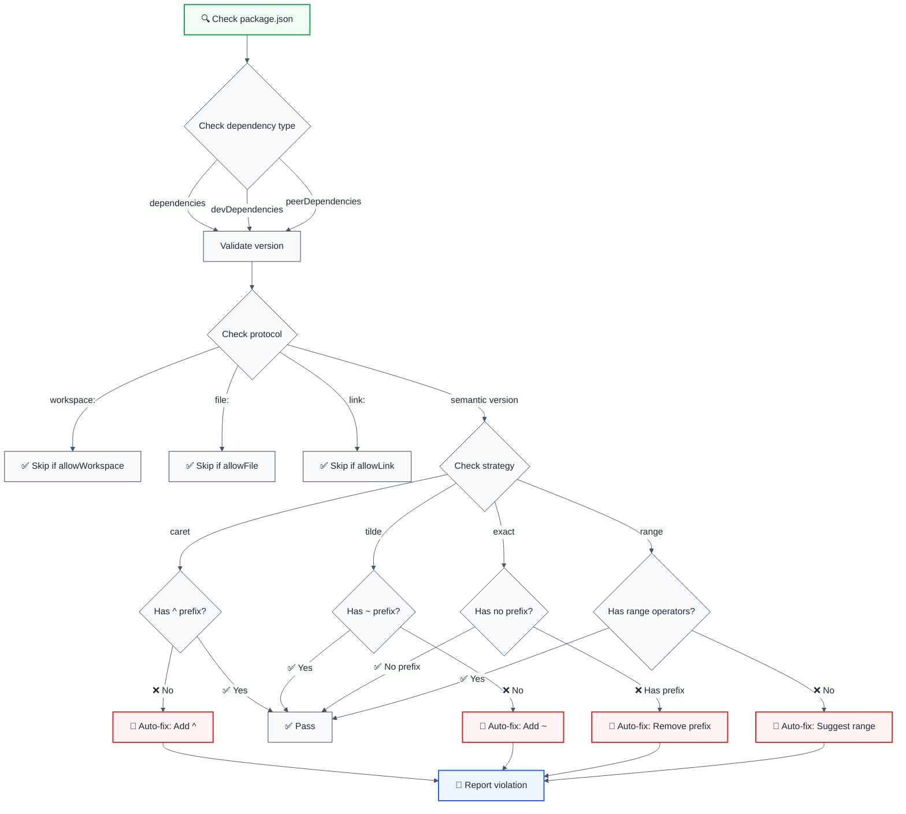

import { FalseNegativeCTA, WhenNotToUse } from "@/components/RuleComponents";

---
title: prefer-dependency-version-strategy
description: Enforce consistent version strategy (caret ^, tilde ~, exact, range, or any) for package.json dependencies. Pairs with a lockfile-alignment check to give complete dependency validation.
tags: ['quality', 'conventions', 'style']
category: quality
autofix: suggestions
---

> **Keywords:** dependency version, package.json, semantic versioning, caret, tilde, exact version, version strategy, ESLint rule, monorepo, dependency management, npm, yarn, auto-fix, LLM-optimized, code quality

Enforce consistent version strategy (caret ^, tilde ~, exact, range, or any) for package.json dependencies. Pairs with a lockfile-alignment check to give complete dependency validation.

Enforce consistent version strategy (caret `^`, tilde `~`, exact, range, or any) for `package.json` dependencies. Pairs with a lockfile-alignment check (e.g. `npm ci`, or this repo's [`scripts/check-version-alignment.ts`](../../../../scripts/check-version-alignment.ts) via `npm run check-versions`) so format consistency *and* lockfile parity are both enforced.

## Quick Summary

| Aspect         | Details                                                      |
| -------------- | ------------------------------------------------------------ |
| **Severity**   | Warning (best practice)                                      |
| **Auto-Fix**   | ✅ Yes (automatically adds/removes version prefixes)          |
| **Category**   | Development                                                  |
| **ESLint MCP** | ✅ Optimized for ESLint MCP integration                      |
| **Best For**   | Monorepos, teams standardizing dependency management          |
| **Strategies** | Caret (^), Tilde (~), Exact, Range, Any                    |

## Rule Details




### Why This Matters

| Issue                | Impact                                    | Solution                    |
| -------------------- | ----------------------------------------- | --------------------------- |
| 🔄 **Consistency**   | Mixed version strategies cause confusion  | Standardize on one strategy |
| 🔒 **Security**      | Exact versions miss security patches      | Use caret for flexibility   |
| ⚡ **Maintenance**   | Hard to update dependencies systematically | Consistent strategy enables automation |
| 📦 **Monorepo**      | Different packages use different strategies | Unified approach across packages |

## Configuration

| Option          | Type                                      | Default | Description                                                                 |
| --------------- | ----------------------------------------- | ------- | --------------------------------------------------------------------------- |
| `strategy`      | `'caret' \| 'tilde' \| 'exact' \| 'range' \| 'any'` | `'caret'` | Default version strategy to enforce for all packages                       |
| `allowWorkspace` | `boolean`                                 | `true`  | Allow `workspace:` protocol versions (monorepo support)                     |
| `allowFile`     | `boolean`                                 | `true`  | Allow `file:` protocol versions                                            |
| `allowLink`     | `boolean`                                 | `true`  | Allow `link:` protocol versions                                            |
| `overrides`     | `Record<string, VersionStrategy>`        | `{}`    | Package-specific strategy overrides. Key is package name, value is strategy |

### Strategy Options

| Strategy | Prefix | Description                                    | Example        |
| -------- | ------ | ---------------------------------------------- | -------------- |
| `caret`  | `^`    | Allows minor and patch updates (recommended)   | `^1.0.0`       |
| `tilde`  | `~`    | Allows only patch updates                      | `~1.0.0`       |
| `exact`  | none   | Requires exact version match                   | `1.0.0`        |
| `range`  | `>=`, `<`, `\|\|` | Allows range operators                      | `>=1.0.0 <2.0.0` |
| `any`    | any    | Allows any version format (disables rule)     | Any format     |

## Examples

### ❌ Incorrect

```json
{
  "dependencies": {
    "react": "18.2.0",           // Missing caret
    "lodash": "~4.17.21",        // Using tilde when caret expected
    "typescript": "^5.0.0"       // Correct
  }
}
```

### ✅ Correct

```json
{
  "dependencies": {
    "react": "^18.2.0",          // Caret prefix
    "lodash": "^4.17.21",        // Caret prefix
    "typescript": "^5.0.0"       // Caret prefix
  }
}
```

### Monorepo Support

```json
{
  "dependencies": {
    "@my-org/utils": "workspace:*",     // ✅ Allowed (workspace protocol)
    "@my-org/shared": "file:../shared", // ✅ Allowed (file protocol)
    "external-lib": "^1.0.0"           // ✅ Enforced strategy
  }
}
```

## Usage

### Basic Configuration

```javascript
// eslint.config.mjs
import conventions from 'eslint-plugin-conventions';

export default [
  {
    files: ['**/package.json'],
    plugins: {
      conventions,
    },
    rules: {
      'conventions/prefer-dependency-version-strategy': [
        'warn',
        {
          strategy: 'caret',
          allowWorkspace: true,
          allowFile: true,
          allowLink: true,
        },
      ],
    },
    languageOptions: {
      parser: await import('jsonc-eslint-parser'),
    },
  },
];
```

### Custom Strategy

```javascript
// Enforce exact versions (strict)
{
  'conventions/prefer-dependency-version-strategy': [
    'error',
    { strategy: 'exact' }
  ]
}

// Enforce tilde (patch updates only)
{
  'conventions/prefer-dependency-version-strategy': [
    'warn',
    { strategy: 'tilde' }
  ]
}
```

### Package-Specific Overrides

Override the default strategy for specific packages. This allows you to have strict versioning for critical dependencies while maintaining flexibility for others.

#### Basic Override Example

```javascript
{
  'conventions/prefer-dependency-version-strategy': [
    'warn',
    {
      strategy: 'caret', // Default: use caret for all packages
      overrides: {
        'react': 'exact',        // React must be exact version
        'react-dom': 'exact',    // React DOM must be exact version
        'lodash': 'tilde',       // Lodash uses tilde (patch updates only)
        'typescript': 'exact',   // TypeScript must be exact version
        '@types/node': 'caret',  // Type definitions can use caret
      }
    }
  ]
}
```

#### Real-World React Project Example

```javascript
{
  'conventions/prefer-dependency-version-strategy': [
    'warn',
    {
      strategy: 'caret',
      overrides: {
        // Core framework - exact versions for stability
        'react': 'exact',
        'react-dom': 'exact',
        'next': 'exact',
        
        // Build tools - exact versions
        'typescript': 'exact',
        'vite': 'exact',
        'esbuild': 'exact',
        
        // Utility libraries - tilde (patch updates only)
        'lodash': 'tilde',
        'date-fns': 'tilde',
        'ramda': 'tilde',
        
        // Type definitions - caret (flexible)
        '@types/react': 'caret',
        '@types/node': 'caret',
        '@types/lodash': 'caret',
      }
    }
  ]
}
```

#### Monorepo Example with Workspace Support

```javascript
{
  'conventions/prefer-dependency-version-strategy': [
    'warn',
    {
      strategy: 'caret',
      allowWorkspace: true, // Allow workspace: protocol
      overrides: {
        // Shared dependencies - exact versions
        'typescript': 'exact',
        '@types/node': 'exact',
        
        // Framework - exact
        'react': 'exact',
        
        // Utilities - tilde
        'lodash': 'tilde',
      }
    }
  ]
}
```

**Use Cases:**
- **Critical dependencies** (React, TypeScript, Next.js): Use `exact` to prevent breaking changes
- **Utility libraries** (lodash, date-fns): Use `tilde` for patch updates only
- **Type definitions** (@types/*): Use `caret` for flexibility
- **Most packages**: Use default `caret` strategy
- **Disable for specific packages**: Use `'any'` to allow any version format

## Pairs with a lockfile-alignment check

This rule enforces **version-specifier format**. It does **not** validate that the version in `package.json` actually matches what's resolved in the lockfile; that's a separate concern. Run a lockfile-alignment check alongside it for full coverage:

| Concern | Tool |
| :--- | :--- |
| Version-specifier format consistency (caret / tilde / exact) | This rule (`conventions/prefer-dependency-version-strategy`) |
| `package.json` version actually matches lockfile | `npm ci` (fails on drift), or this monorepo's [`scripts/check-version-alignment.ts`](../../../../scripts/check-version-alignment.ts) (`npm run check-versions`) |

The rule and the lockfile check are independent and run at different stages: the rule fires inside ESLint at edit/PR time; the alignment check runs in CI before publish.

## Auto-Fix Examples

### Example 1: With Package-Specific Overrides

**Configuration:**
```javascript
{
  strategy: 'caret', // Default for all packages
  overrides: {
    'react': 'exact',        // React must be exact
    'react-dom': 'exact',    // React DOM must be exact
    'lodash': 'tilde',       // Lodash uses tilde
    'typescript': 'exact',   // TypeScript must be exact
  }
}
```

**Before (Incorrect):**
```json
{
  "dependencies": {
    "react": "^18.2.0",           // ❌ Should be exact
    "react-dom": "^18.2.0",       // ❌ Should be exact
    "lodash": "^4.17.21",        // ❌ Should be tilde
    "typescript": "^5.0.0",      // ❌ Should be exact
    "express": "4.18.0",         // ❌ Missing caret (default)
    "axios": "1.6.0"             // ❌ Missing caret (default)
  }
}
```

**After (Auto-Fixed):**
```json
{
  "dependencies": {
    "react": "18.2.0",           // ✅ Exact (override)
    "react-dom": "18.2.0",       // ✅ Exact (override)
    "lodash": "~4.17.21",        // ✅ Tilde (override)
    "typescript": "5.0.0",       // ✅ Exact (override)
    "express": "^4.18.0",        // ✅ Caret (default)
    "axios": "^1.6.0"            // ✅ Caret (default)
  }
}
```

### Example 2: React Project with Strict Versioning

**Configuration:**
```javascript
{
  strategy: 'caret', // Default: flexible for most packages
  overrides: {
    // Core React dependencies - exact versions
    'react': 'exact',
    'react-dom': 'exact',
    'react-router-dom': 'exact',
    
    // Build tools - exact versions
    'typescript': 'exact',
    'vite': 'exact',
    
    // Utility libraries - tilde (patch updates only)
    'lodash': 'tilde',
    'date-fns': 'tilde',
    
    // Type definitions - caret (flexible)
    '@types/react': 'caret',
    '@types/node': 'caret',
  }
}
```

**Before:**
```json
{
  "dependencies": {
    "react": "^18.2.0",
    "react-dom": "^18.2.0",
    "react-router-dom": "^6.20.0",
    "typescript": "^5.3.0",
    "vite": "^5.0.0",
    "lodash": "^4.17.21",
    "date-fns": "^2.30.0",
    "@types/react": "18.2.0",
    "@types/node": "20.10.0"
  }
}
```

**After (Auto-Fixed):**
```json
{
  "dependencies": {
    "react": "18.2.0",              // ✅ Exact
    "react-dom": "18.2.0",          // ✅ Exact
    "react-router-dom": "6.20.0",    // ✅ Exact
    "typescript": "5.3.0",          // ✅ Exact
    "vite": "5.0.0",                // ✅ Exact
    "lodash": "~4.17.21",           // ✅ Tilde
    "date-fns": "~2.30.0",          // ✅ Tilde
    "@types/react": "^18.2.0",      // ✅ Caret (default)
    "@types/node": "^20.10.0"      // ✅ Caret (default)
  }
}
```

### Example 3: Monorepo with Mixed Strategies

**Configuration:**
```javascript
{
  strategy: 'caret', // Default
  allowWorkspace: true,
  overrides: {
    // Critical shared dependencies - exact
    'typescript': 'exact',
    '@types/node': 'exact',
    
    // Framework packages - exact
    'react': 'exact',
    'next': 'exact',
    
    // Utility packages - tilde
    'lodash': 'tilde',
    'ramda': 'tilde',
  }
}
```

**Before:**
```json
{
  "dependencies": {
    "@my-org/shared": "workspace:*",  // ✅ Allowed (workspace protocol)
    "typescript": "^5.0.0",           // ❌ Should be exact
    "@types/node": "^20.0.0",        // ❌ Should be exact
    "react": "^18.2.0",               // ❌ Should be exact
    "next": "^14.0.0",                // ❌ Should be exact
    "lodash": "^4.17.21",             // ❌ Should be tilde
    "ramda": "^0.29.0",               // ❌ Should be tilde
    "axios": "1.6.0",                 // ❌ Missing caret (default)
    "express": "4.18.0"               // ❌ Missing caret (default)
  }
}
```

**After (Auto-Fixed):**
```json
{
  "dependencies": {
    "@my-org/shared": "workspace:*",  // ✅ Allowed (workspace protocol)
    "typescript": "5.0.0",            // ✅ Exact (override)
    "@types/node": "20.0.0",         // ✅ Exact (override)
    "react": "18.2.0",                // ✅ Exact (override)
    "next": "14.0.0",                 // ✅ Exact (override)
    "lodash": "~4.17.21",             // ✅ Tilde (override)
    "ramda": "~0.29.0",               // ✅ Tilde (override)
    "axios": "^1.6.0",                // ✅ Caret (default)
    "express": "^4.18.0"              // ✅ Caret (default)
  }
}
```

### Example 4: Simple Configuration (No Overrides)

**Configuration:**
```javascript
{
  strategy: 'caret', // Default for all packages
}
```

**Before:**
```json
{
  "dependencies": {
    "typescript": "5.0.0",
    "lodash": "4.17.21",
    "express": "4.18.0"
  }
}
```

**After (Default caret strategy):**
```json
{
  "dependencies": {
    "typescript": "^5.0.0",
    "lodash": "^4.17.21",
    "express": "^4.18.0"
  }
}
```

### Example 5: Disable Rule for Specific Packages

**Configuration:**
```javascript
{
  strategy: 'caret',
  overrides: {
    'experimental-package': 'any',  // Allow any version format
    'legacy-package': 'any',        // Allow any version format
  }
}
```

**Result:**
- `experimental-package` and `legacy-package` can use any version format (exact, caret, tilde, range, etc.)
- All other packages must use caret (`^`) prefix

## Best Practices

| Practice                    | Reason                                    |
| --------------------------- | ----------------------------------------- |
| ✅ Use `caret` (default)   | Allows security patches and minor updates |
| ✅ Use `overrides` for critical deps | Pin React, TypeScript, etc. to exact versions |
| ✅ Allow workspace protocols | Essential for monorepo support            |
| ✅ Pair with a lockfile-alignment check (`npm ci` or `npm run check-versions`) | Complete dependency validation |
| ⚠️ Avoid `exact` for all packages | Misses security patches                  |
| ⚠️ Use `exact` only for critical deps | When version pinning is required |
| 💡 Use `tilde` for utilities | Patch updates only (lodash, date-fns) |

### Recommended Override Patterns

```javascript
{
  strategy: 'caret', // Default: flexible for most packages
  overrides: {
    // Critical framework dependencies - exact versions
    'react': 'exact',
    'react-dom': 'exact',
    'typescript': 'exact',
    
    // Utility libraries - tilde (patch updates only)
    'lodash': 'tilde',
    'date-fns': 'tilde',
    
    // Type definitions - caret (flexible)
    '@types/node': 'caret',
    '@types/react': 'caret',
  }
}
```

## Related

- [`scripts/check-version-alignment.ts`](../../../../scripts/check-version-alignment.ts) - repo-internal lockfile-alignment check (`npm run check-versions`)
- [`no-console-log`](./no-console-log.md) - Disallow `console.log` statements

## Resources

- [npm Semantic Versioning](https://docs.npmjs.com/cli/v10/configuring-npm/package-json#dependencies)
- [Semantic Versioning Specification](https://semver.org/)

## Version History

- **1.0.0** - Initial release with caret, tilde, exact, range, and any strategies
<WhenNotToUse />

<FalseNegativeCTA />

## Known False Negatives

The following patterns are **not detected** due to static analysis limitations:

### Dynamic Variable References

**Why**: Static analysis cannot trace values stored in variables or passed through function parameters.

```typescript
// ❌ NOT DETECTED - Value from variable
const value = externalSource();
processValue(value); // Variable origin not tracked
```

**Mitigation**: Implement runtime validation and review code manually. Consider using TypeScript branded types for validated inputs.

### Imported Values

**Why**: When values come from imports, the rule cannot analyze their origin or construction.

```typescript
// ❌ NOT DETECTED - Value from import
import { getValue } from './helpers';
processValue(getValue()); // Cross-file not tracked
```

**Mitigation**: Ensure imported values follow the same constraints. Use TypeScript for type safety.