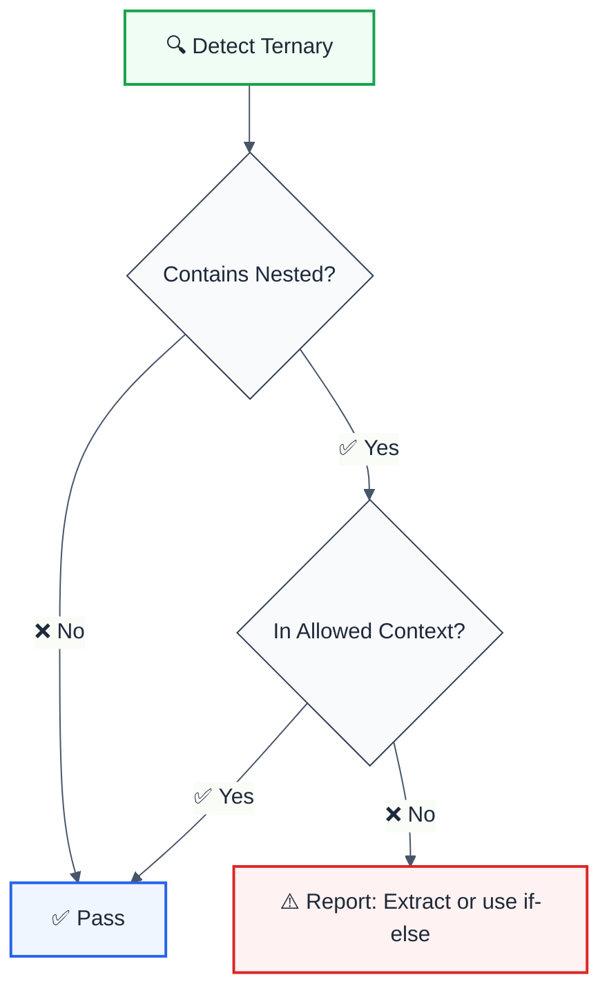

import { FalseNegativeCTA, WhenNotToUse, RuleBadges } from "@/components/RuleComponents";

<RuleBadges typeAware={false} typeAwareStatus="unaware" />

---
title: no-nested-ternary
description: Prevent nested ternary expressions for better readability
tags: ['quality', 'maintainability']
category: quality
autofix: suggestions
---

> **Keywords:** ternary, conditional, nested, readability, ESLint rule, code quality, refactoring, LLM-optimized

Prevent nested ternary expressions for better readability

Prevent nested ternary expressions for better readability. This rule is part of [`eslint-plugin-maintainability`](https://www.npmjs.com/package/eslint-plugin-maintainability) and provides LLM-optimized error messages with suggestions.

## Quick Summary

| Aspect         | Details                                                   |
| -------------- | --------------------------------------------------------- |
| **Severity**   | Warning (code quality)                                    |
| **Auto-Fix**   | 💡 Suggests fixes                                         |
| **Category**   | Quality |
| **ESLint MCP** | ✅ Optimized for ESLint MCP integration                   |
| **Best For**   | All projects prioritizing readability and maintainability |

## Rule Details




### Why This Matters

| Issue                  | Impact                | Solution               |
| ---------------------- | --------------------- | ---------------------- |
| 📖 **Readability**     | Hard to follow logic  | Use if-else or extract |
| 🐛 **Bug Risk**        | Easy to make mistakes | Simpler constructs     |
| 🔄 **Maintainability** | Difficult to modify   | Break into steps       |
| 👀 **Code Review**     | Harder to review      | Clearer structure      |

## Configuration

| Option  | Type       | Default | Description                             |
| ------- | ---------- | ------- | --------------------------------------- |
| `allow` | `string[]` | `[]`    | Contexts where nested ternaries allowed |

## Examples

### ❌ Incorrect

```typescript
// Nested ternary in consequent
const result = condition1 ? (condition2 ? value1 : value2) : value3;

// Nested ternary in alternate
const status = isActive ? 'active' : isPending ? 'pending' : 'inactive';

// Multiple levels of nesting
const color =
  size === 'large'
    ? 'red'
    : size === 'medium'
      ? 'blue'
      : size === 'small'
        ? 'green'
        : 'gray';
```

### ✅ Correct

```typescript
// Single ternary
const result = condition ? value1 : value2;

// Use if-else for complex logic
let status: string;
if (isActive) {
  status = 'active';
} else if (isPending) {
  status = 'pending';
} else {
  status = 'inactive';
}

// Extract to helper function
function getColor(size: string): string {
  if (size === 'large') return 'red';
  if (size === 'medium') return 'blue';
  if (size === 'small') return 'green';
  return 'gray';
}
const color = getColor(size);

// Use object lookup
const colorMap: Record<string, string> = {
  large: 'red',
  medium: 'blue',
  small: 'green',
};
const color = colorMap[size] ?? 'gray';

// Use switch for multiple conditions
function getStatusColor(status: string): string {
  switch (status) {
    case 'success':
      return 'green';
    case 'warning':
      return 'yellow';
    case 'error':
      return 'red';
    default:
      return 'gray';
  }
}
```

## Configuration Examples

### Basic Usage

```javascript
{
  rules: {
    'maintainability/no-nested-ternary': 'warn'
  }
}
```

### Strict Mode

```javascript
{
  rules: {
    'maintainability/no-nested-ternary': 'error'
  }
}
```

## Refactoring Patterns

### Pattern 1: Extract to Variable

```typescript
// ❌ Before
const message = user.isAdmin
  ? user.isActive
    ? 'Active Admin'
    : 'Inactive Admin'
  : 'Regular User';

// ✅ After
const adminStatus = user.isActive ? 'Active Admin' : 'Inactive Admin';
const message = user.isAdmin ? adminStatus : 'Regular User';
```

### Pattern 2: Extract to Function

```typescript
// ❌ Before
const discount = isPremium ? (totalAmount > 100 ? 0.2 : 0.1) : 0;

// ✅ After
function calculateDiscount(isPremium: boolean, totalAmount: number): number {
  if (!isPremium) return 0;
  return totalAmount > 100 ? 0.2 : 0.1;
}
const discount = calculateDiscount(isPremium, totalAmount);
```

### Pattern 3: Use Object Lookup

```typescript
// ❌ Before
const icon =
  status === 'success'
    ? '✓'
    : status === 'error'
      ? '✗'
      : status === 'warning'
        ? '⚠'
        : '•';

// ✅ After
const statusIcons: Record<string, string> = {
  success: '✓',
  error: '✗',
  warning: '⚠',
};
const icon = statusIcons[status] ?? '•';
```

### Pattern 4: Early Returns

```typescript
// ❌ Before
const getButtonClass = (variant, disabled) =>
  disabled
    ? 'btn-disabled'
    : variant === 'primary'
      ? 'btn-primary'
      : 'btn-secondary';

// ✅ After
function getButtonClass(variant: string, disabled: boolean): string {
  if (disabled) return 'btn-disabled';
  if (variant === 'primary') return 'btn-primary';
  return 'btn-secondary';
}
```

## When Not To Use

| Scenario                 | Recommendation                           |
| ------------------------ | ---------------------------------------- |
| 🎯 **Very simple cases** | Still discouraged but may be acceptable  |
| ⚛️ **JSX conditionals**  | Consider component extraction            |
| 📊 **Type narrowing**    | TypeScript may require specific patterns |

## Comparison with Alternatives

| Feature           | no-nested-ternary | ESLint built-in | unicorn    |
| ----------------- | ----------------- | --------------- | ---------- |
| **Deep nesting**  | ✅ All levels     | ✅ Yes          | ✅ Yes     |
| **JSX detection** | ✅ Yes            | ❌ No           | ⚠️ Limited |
| **LLM-Optimized** | ✅ Yes            | ❌ No           | ❌ No      |
| **ESLint MCP**    | ✅ Optimized      | ❌ No           | ❌ No      |
| **Suggestions**   | ✅ Yes            | ❌ No           | ⚠️ Limited |

## Related Rules

- [`cognitive-complexity`](./cognitive-complexity.md) - Overall code complexity
- [`no-lonely-if`](./no-lonely-if.md) - Simplify if statements

## Further Reading

- **[ESLint no-nested-ternary](https://eslint.org/docs/latest/rules/no-nested-ternary)** - Built-in ESLint rule
- **[unicorn no-nested-ternary](https://github.com/sindresorhus/eslint-plugin-unicorn/blob/main/docs/rules/no-nested-ternary.md)** - Unicorn implementation
- **[Clean Code](https://www.amazon.com/Clean-Code-Handbook-Software-Craftsmanship/dp/0132350882)** - Code readability principles
- **[ESLint MCP Setup](https://eslint.org/docs/latest/use/mcp)** - Enable AI assistant integration

<WhenNotToUse />

<FalseNegativeCTA />

## Known False Negatives

The following patterns are **not detected** due to static analysis limitations:

### Dynamic Variable References

**Why**: Static analysis cannot trace values stored in variables or passed through function parameters.

```typescript
// ❌ NOT DETECTED - Value from variable
const value = externalSource();
processValue(value); // Variable origin not tracked
```

**Mitigation**: Implement runtime validation and review code manually. Consider using TypeScript branded types for validated inputs.

### Wrapped or Aliased Functions

**Why**: Custom wrapper functions or aliased methods are not recognized by the rule.

```typescript
// ❌ NOT DETECTED - Custom wrapper
function myWrapper(data) {
  return internalApi(data); // Wrapper not analyzed
}
myWrapper(unsafeInput);
```

**Mitigation**: Apply this rule's principles to wrapper function implementations. Avoid aliasing security-sensitive functions.

### Imported Values

**Why**: When values come from imports, the rule cannot analyze their origin or construction.

```typescript
// ❌ NOT DETECTED - Value from import
import { getValue } from './helpers';
processValue(getValue()); // Cross-file not tracked
```

**Mitigation**: Ensure imported values follow the same constraints. Use TypeScript for type safety.