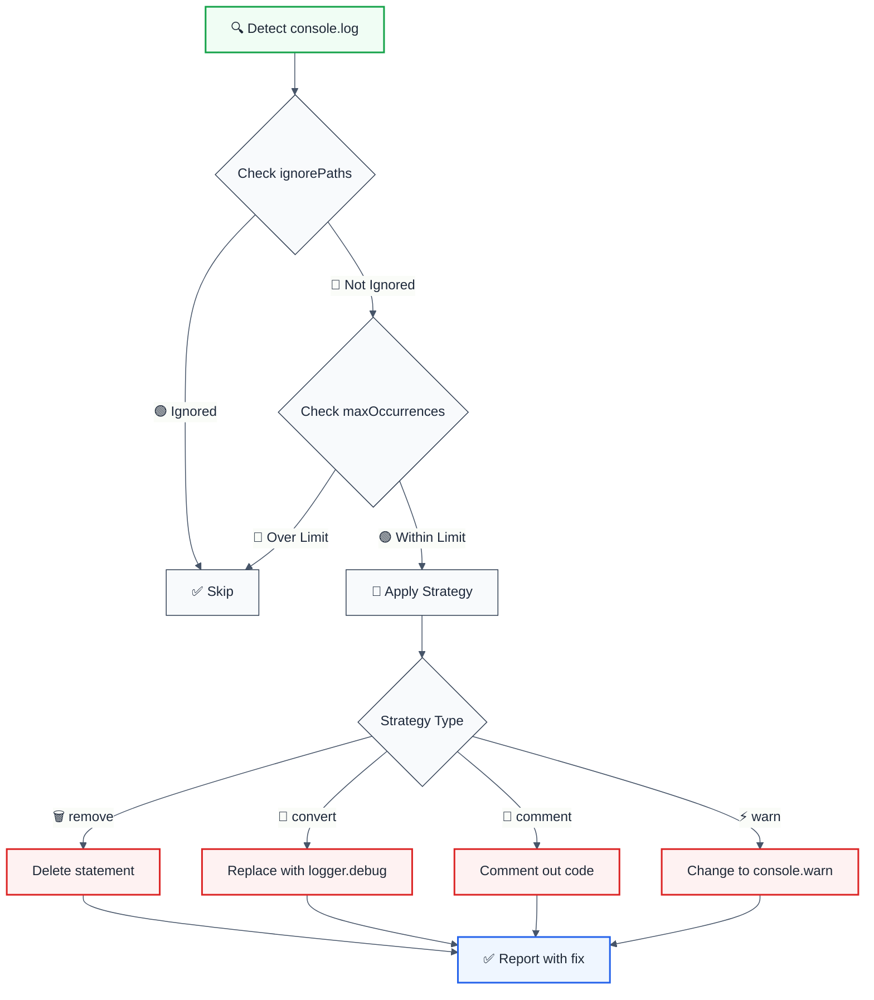
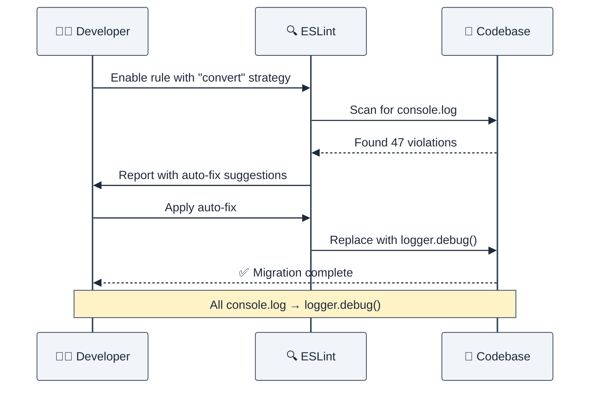

import { FalseNegativeCTA, WhenNotToUse } from "@/components/RuleComponents";

---
title: no-console-log
description: Disallow console.log with configurable remediation strategies and LLM-optimized output. This rule is part of eslint-plugin-operability and provides 4 auto-f
tags: ['quality', 'operability', 'production']
category: quality
autofix: suggestions
---

> **Keywords:** console.log, logging, ESLint rule, production logging, structured logging, logger migration, auto-fix, LLM-optimized, code quality, debugging, observability, Winston, Pino

Disallow console.log with configurable remediation strategies and LLM-optimized output. This rule is part of eslint-plugin-operability and provides 4 auto-f

Disallow `console.log` with configurable remediation strategies and LLM-optimized output. This rule is part of [`eslint-plugin-operability`](https://www.npmjs.com/package/eslint-plugin-operability) and provides 4 auto-fix strategies for migrating from console.log to proper logging.

## Quick Summary

| Aspect         | Details                                                        |
| -------------- | -------------------------------------------------------------- |
| **Severity**   | Warning (best practice)                                        |
| **Auto-Fix**   | ✅ Yes (4 strategies: remove, convert, comment, warn)          |
| **Category**   | Development                                                    |
| **ESLint MCP** | ✅ Optimized for ESLint MCP integration                        |
| **Best For**   | Production applications, teams migrating to structured logging |
| **Strategies** | Remove, Convert to logger, Comment out, Change to console.warn |

## Rule Details




### Why This Matters

| Issue                | Impact                                | Solution                    |
| -------------------- | ------------------------------------- | --------------------------- |
| 🔒 **Security**      | May leak sensitive data in production | Use structured logging      |
| 🐛 **Debugging**     | Clutters console, hard to filter      | Environment-aware logging   |
| ⚡ **Performance**   | Uncontrolled logging impacts speed    | Configurable log levels     |
| 📊 **Observability** | Cannot aggregate or analyze logs      | Centralized logging systems |

## Configuration

| Option             | Type                                           | Default       | Description                                                                     |
| ------------------ | ---------------------------------------------- | ------------- | ------------------------------------------------------------------------------- |
| `strategy`         | `'remove' \| 'convert' \| 'comment' \| 'warn'` | `'remove'`    | Remediation strategy                                                            |
| `ignorePaths`      | `string[]`                                     | `[]`          | Paths/patterns to ignore                                                        |
| `loggerName`       | `string`                                       | `'logger'`    | Logger object name (e.g., `'logger'`, `'winston'`)                              |
| `maxOccurrences`   | `number`                                       | `undefined`   | Max violations to report (0 = report all)                                       |
| `severityMap`      | `object`                                       | `{}`          | Map method names to logger methods (e.g., `{ log: 'info', debug: 'verbose' }`)  |
| `autoDetectLogger` | `boolean`                                      | `true`        | Auto-detect logger import in file                                               |
| `sourcePatterns`   | `string[]`                                     | `['console']` | Object names to match and replace (e.g., `['console', 'winston', 'oldLogger']`) |
| ~~`customLogger`~~ | `string`                                       | `'logger'`    | **Deprecated:** Use `loggerName` instead                                        |

### Strategy Comparison

| Strategy       | Behavior            | Use Case                    | Output                                     |
| -------------- | ------------------- | --------------------------- | ------------------------------------------ |
| 🗑️ **remove**  | Deletes statement   | Production cleanup          | `console.log("x")` → _(removed)_           |
| 🔄 **convert** | Replace with logger | Migration to proper logging | `console.log("x")` → `logger.debug("x")`   |
| 💬 **comment** | Comments out code   | Temporary debugging         | `console.log("x")` → `// console.log("x")` |
| ⚡ **warn**    | Change to warning   | Downgrade severity          | `console.log("x")` → `console.warn("x")`   |

## Examples

### ❌ Incorrect

```typescript
function processData(data: any) {
  console.log('Processing data:', data);
  return data.map((item) => item * 2);
}

class UserService {
  getUser(id: string) {
    console.log('Fetching user:', id);
    return this.db.users.find(id);
  }
}
```

### ✅ Correct

```typescript
import { logger } from './logger';

function processData(data: any) {
  logger.debug('Processing data:', { data });
  return data.map((item) => item * 2);
}

class UserService {
  getUser(id: string) {
    this.logger.debug('Fetching user', { userId: id });
    return this.db.users.find(id);
  }
}
```

## Configuration Examples

### Basic Usage (Default Strategy)

```javascript
// eslint.config.mjs
export default [
  {
    rules: {
      'operability/no-console-log': 'error',
    },
  },
];
```

**Output Format:**

```
⚠️ console.log | src/app.ts:42 | Strategy: remove
```

### Strategy: Remove (Production Cleanup)

```javascript
{
  rules: {
    'operability/no-console-log': ['error', {
      strategy: 'remove'
    }]
  }
}
```

```typescript
// Before
function calculate() {
  console.log('Calculating...');
  return 42;
}

// After (auto-fixed)
function calculate() {
  return 42;
}
```

### Strategy: Convert (Logger Migration)

```javascript
{
  rules: {
    'operability/no-console-log': ['error', {
      strategy: 'convert',
      loggerName: 'logger',      // Replace 'console' with 'logger'
      loggerMethod: 'info'        // Replace '.log()' with '.info()'
    }]
  }
}
```

```typescript
// Before
console.log('User logged in', userId);

// After (auto-fixed)
logger.info('User logged in', userId);
```

**With Custom Logger (e.g., Winston):**

```javascript
{
  rules: {
    'operability/no-console-log': ['error', {
      strategy: 'convert',
      loggerName: 'winston',
      severityMap: {
        'log': 'info',      // console.log → winston.info
        'debug': 'debug',   // console.debug → winston.debug
        'error': 'error',   // console.error → winston.error
        'warn': 'warn'      // console.warn → winston.warn
      }
    }]
  }
}
```

```typescript
// Before
console.log('Processing request');
console.debug('Debug details');
console.error('Something failed');

// After (auto-fixed)
winston.info('Processing request');
winston.debug('Debug details');
winston.error('Something failed');
```

### Strategy: Comment (Temporary Disable)

```javascript
{
  rules: {
    'operability/no-console-log': ['error', {
      strategy: 'comment'
    }]
  }
}
```

```typescript
// Before
console.log('Debug info', data);

// After (auto-fixed)
// console.log("Debug info", data);
```

### Strategy: Warn (Downgrade Severity)

```javascript
{
  rules: {
    'operability/no-console-log': ['error', {
      strategy: 'warn'
    }]
  }
}
```

```typescript
// Before
console.log('Important notice');

// After (auto-fixed)
console.warn('Important notice');
```

### Ignore Specific Paths

```javascript
{
  rules: {
    'operability/no-console-log': ['error', {
      strategy: 'remove',
      ignorePaths: [
        'test',           // Ignore test directories
        'scripts',        // Ignore scripts directory
        '*.test.ts',      // Ignore test files
        'src/debug.ts'    // Ignore specific file
      ]
    }]
  }
}
```

### Limit Reported Violations

```javascript
{
  rules: {
    'operability/no-console-log': ['error', {
      maxOccurrences: 10  // Only report first 10 violations
    }]
  }
}
```

### Replace Multiple Logging Objects (Legacy Projects)

Perfect for migrating legacy projects with mixed logging approaches:

```javascript
{
  rules: {
    'operability/no-console-log': ['error', {
      strategy: 'convert',
      loggerName: 'logger',                          // Target logger
      sourcePatterns: ['console', 'winston', 'oldLogger'],  // Replace all these
      severityMap: {
        log: 'info',
        debug: 'debug',
        error: 'error',
        warn: 'warn'
      }
    }]
  }
}
```

```typescript
// Before (mixed legacy logging)
console.log('User action');
winston.info('Database query');
oldLogger.debug('Cache hit');

// After (auto-fixed to unified logger)
logger.info('User action');
logger.info('Database query');
logger.debug('Cache hit');
```

**Safety:** Uses exact string matching - won't accidentally match `consoleUI` or `winstonConfig`.

### Custom Severity Mapping

Map specific console methods to different logger methods:

```javascript
{
  rules: {
    'operability/no-console-log': ['error', {
      strategy: 'convert',
      loggerName: 'logger',
      loggerMethod: 'info',       // Default for unmapped methods
      severityMap: {
        'log': 'info',             // console.log → logger.info
        'debug': 'verbose',        // console.debug → logger.verbose
        'error': 'error',          // console.error → logger.error
        'warn': 'warn'             // console.warn → logger.warn
      }
    }]
  }
}
```

**Result:**

```typescript
// Before
console.log('Info message');
console.debug('Debug message');
console.error('Error message');

// After (auto-fixed)
logger.info('Info message');
logger.verbose('Debug message');
logger.error('Error message');
```

### Auto-Detect Logger

```javascript
{
  rules: {
    'operability/no-console-log': ['error', {
      strategy: 'convert',
      autoDetectLogger: true,     // Auto-detect 'logger', 'log', etc. in imports
      loggerName: 'winston',      // Fallback if no logger detected
      loggerMethod: 'info'        // Method to use
    }]
  }
}
```

**Auto-detection example:**

```typescript
// If you have this import
import { myLogger } from './utils';

// console.log will be converted to
myLogger.info(...)  // Auto-detected 'myLogger' (contains 'log')
```

### Team-Specific Configurations

```javascript
// Development environment
{
  rules: {
    'operability/no-console-log': ['warn', {
      strategy: 'comment',
      ignorePaths: ['test', 'scripts']
    }]
  }
}

// Production environment
{
  rules: {
    'operability/no-console-log': ['error', {
      strategy: 'convert',
      customLogger: 'logger',
      maxOccurrences: 0  // Report all violations
    }]
  }
}
```

## Type-Safe Configuration (ESLint 9+ & 8)

### ESLint 9+ (Flat Config)

```typescript
import operability from 'eslint-plugin-operability';
import type { NoConsoleLogOptions } from 'eslint-plugin-operability/types';

const config: NoConsoleLogOptions = {
  strategy: 'remove',
  ignorePaths: ['src/logger/**', 'src/debug/**'],
  loggerName: 'logger',
  autoDetectLogger: true,
};

export default [
  {
    plugins: { operability },
    rules: {
      'operability/no-console-log': ['warn', config],
    },
  },
];
```

### ESLint 8 (Legacy Config with JSDoc Types)

```javascript
/** @type {import('eslint-plugin-operability/types').NoConsoleLogOptions} */
const config = {
  strategy: 'remove',
  ignorePaths: ['src/logger/**', 'src/debug/**'],
  loggerName: 'logger',
  autoDetectLogger: true,
};

module.exports = {
  plugins: ['operability'],
  rules: {
    'operability/no-console-log': ['warn', config],
  },
};
```

For more examples and patterns, see the [package README](../../README.md).

## LLM-Optimized Output

The rule provides minimal, actionable messages optimized for both humans and LLMs:

```
⚠️ console.log | src/services/auth.ts:127 | Strategy: convert
```

### Output Format Breakdown

| Component                  | Purpose    | Example                 |
| -------------------------- | ---------- | ----------------------- |
| `⚠️ console.log`           | Issue type | Clear identification    |
| `src/services/auth.ts:127` | Location   | File path + line number |
| `Strategy: convert`        | Action     | Remediation method      |

### Multi-Strategy Suggestions

When a violation is detected, all strategies are available as suggestions:

```
⚠️ console.log | src/app.ts:42 | Strategy: remove

Suggestions:
  🗑️ Remove console.log statement
  🔄 Convert to logger.debug()
  💬 Comment out console.log
  ⚡ Replace with console.warn()
```

## Migration Patterns

### From console.log to Structured Logging




### Step-by-Step Migration

| Phase               | Configuration          | Goal                     |
| ------------------- | ---------------------- | ------------------------ |
| **1. Discovery**    | `strategy: 'comment'`  | Identify all occurrences |
| **2. Setup Logger** | Import logging library | Add infrastructure       |
| **3. Convert**      | `strategy: 'convert'`  | Auto-migrate code        |
| **4. Cleanup**      | `strategy: 'remove'`   | Remove debugging logs    |

## Advanced Usage

### Monorepo Configuration

```javascript
// apps/web/eslint.config.mjs
{
  rules: {
    'operability/no-console-log': ['error', {
      strategy: 'remove',
      ignorePaths: ['test']
    }]
  }
}

// apps/api/eslint.config.mjs
{
  rules: {
    'operability/no-console-log': ['error', {
      strategy: 'convert',
      customLogger: 'winston',
      ignorePaths: ['scripts', 'migrations']
    }]
  }
}
```

### CI/CD Integration

```yaml

- name: Lint with auto-fix
  run: |
    npm run lint -- --fix
    git diff --exit-code || echo "Console.log violations auto-fixed"
```

## When Not To Use

| Scenario         | Recommendation                   |
| ---------------- | -------------------------------- |
| 🧪 Prototyping   | Disable or use `warn` severity   |
| 📚 Tutorials     | Add to `ignorePaths`             |
| 🔧 Build Scripts | Use `ignorePaths: ['scripts']`   |
| 🧪 Test Files    | Use `ignorePaths: ['*.test.ts']` |

## Comparison with Other Solutions

| Feature             | quality/no-console-log | eslint-plugin-no-console | eslint built-in |
| ------------------- | ------------------------ | ------------------------ | --------------- |
| ✅ Auto-fix         | ✅ 4 strategies          | ❌ No                    | ❌ No           |
| 🎯 Suggestions      | ✅ All strategies        | ❌ No                    | ❌ No           |
| 📁 ignorePaths      | ✅ Pattern matching      | ❌ No                    | ⚠️ Limited      |
| 🤖 LLM-optimized    | ✅ Yes                   | ❌ No                    | ❌ No           |
| 🔄 Logger migration | ✅ Configurable          | ❌ No                    | ❌ No           |

## Error Message Format

The rule provides **LLM-optimized error messages** (Compact 2-line format) with actionable security guidance:

```text
⚠️ [CWE-532](https://cwe.mitre.org/data/definitions/532.html) OWASP:A09 CVSS:5.3 | Log Information Exposure detected | MEDIUM [GDPR,HIPAA,PCI-DSS,SOC2]
   Fix: Review and apply the recommended fix | https://owasp.org/Top10/A09_2021/
```

### Message Components

| Component | Purpose | Example |
| :--- | :--- | :--- |
| **Risk Standards** | Security benchmarks | [CWE-532](https://cwe.mitre.org/data/definitions/532.html) [OWASP:A09](https://owasp.org/Top10/A09_2021-Injection/) [CVSS:5.3](https://nvd.nist.gov/vuln-metrics/cvss/v3-calculator?vector=AV%3AN%2FAC%3AL%2FPR%3AN%2FUI%3AN%2FS%3AU%2FC%3AH%2FI%3AH%2FA%3AH) |
| **Issue Description** | Specific vulnerability | `Log Information Exposure detected` |
| **Severity & Compliance** | Impact assessment | `MEDIUM [GDPR,HIPAA,PCI-DSS,SOC2]` |
| **Fix Instruction** | Actionable remediation | `Follow the remediation steps below` |
| **Technical Truth** | Official reference | [OWASP Top 10](https://owasp.org/Top10/A09_2021-Injection/) |

## When Not To Use

| Scenario          | Recommendation                                   |
| ----------------- | ------------------------------------------------ |
| **Prototyping**   | Disable or use `warn` severity                   |
| **Tutorials**     | Add to `ignorePaths`                             |
| **Build Scripts** | Use `ignorePaths: ['scripts']`                   |
| **Test Files**    | Use `ignorePaths: ['*.test.ts']`                 |
| **Debugging**     | Use `strategy: 'comment'` to temporarily disable |

## Comparison with Alternatives

| Feature              | no-console-log        | eslint-plugin-no-console | ESLint built-in no-console |
| -------------------- | --------------------- | ------------------------ | -------------------------- |
| **Auto-Fix**         | ✅ Yes (4 strategies) | ❌ No                    | ❌ No                      |
| **Logger Migration** | ✅ Configurable       | ❌ No                    | ❌ No                      |
| **ignorePaths**      | ✅ Pattern matching   | ❌ No                    | ⚠️ Limited                 |
| **LLM-Optimized**    | ✅ Yes                | ❌ No                    | ❌ No                      |
| **ESLint MCP**       | ✅ Optimized          | ❌ No                    | ❌ No                      |
| **Strategy Options** | ✅ 4 strategies       | ❌ No                    | ❌ No                      |

## Further Reading

- **[ESLint Rules Documentation](https://eslint.org/docs/latest/rules/)** - Complete ESLint rules reference
- **[Best Practices for Logging in Node.js](https://blog.logrocket.com/best-practices-logging-node-js/)** - Production logging guide
- **[Structured Logging with Winston](https://github.com/winstonjs/winston)** - Popular Node.js logging library
- **[MDN: Console API](https://developer.mozilla.org/en-US/docs/Web/API/Console)** - Console API reference
- **[ESLint MCP Setup](https://eslint.org/docs/latest/use/mcp)** - Enable AI assistant integration

## Related Rules

- [`no-sql-injection`](./no-sql-injection.md) - Prevents SQL injection vulnerabilities
- [`detect-non-literal-fs-filename`](./detect-non-literal-fs-filename.md) - Prevents path traversal
<WhenNotToUse />

<FalseNegativeCTA />

## Known False Negatives

The following patterns are **not detected** due to static analysis limitations:

### Dynamic Variable References

**Why**: Static analysis cannot trace values stored in variables or passed through function parameters.

```typescript
// ❌ NOT DETECTED - Value from variable
const value = externalSource();
processValue(value); // Variable origin not tracked
```

**Mitigation**: Implement runtime validation and review code manually. Consider using TypeScript branded types for validated inputs.

### Wrapped or Aliased Functions

**Why**: Custom wrapper functions or aliased methods are not recognized by the rule.

```typescript
// ❌ NOT DETECTED - Custom wrapper
function myWrapper(data) {
  return internalApi(data); // Wrapper not analyzed
}
myWrapper(unsafeInput);
```

**Mitigation**: Apply this rule's principles to wrapper function implementations. Avoid aliasing security-sensitive functions.

### Imported Values

**Why**: When values come from imports, the rule cannot analyze their origin or construction.

```typescript
// ❌ NOT DETECTED - Value from import
import { getValue } from './helpers';
processValue(getValue()); // Cross-file not tracked
```

**Mitigation**: Ensure imported values follow the same constraints. Use TypeScript for type safety.