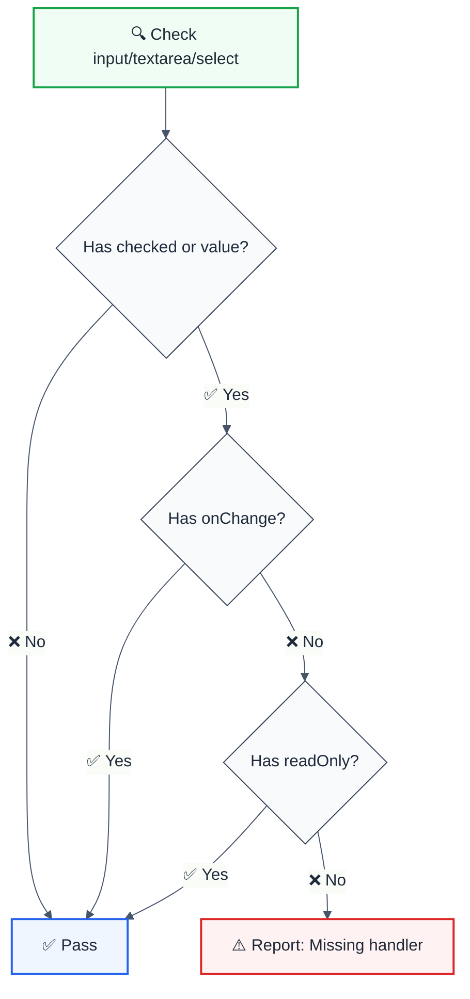

import { FalseNegativeCTA, WhenNotToUse, RuleBadges } from "@/components/RuleComponents";

<RuleBadges typeAware={false} typeAwareStatus="unaware" />

> **Keywords:** React, controlled input, checkbox, radio, onChange, readOnly, form handling, ESLint rule, LLM-optimized

Ensures controlled inputs with `checked` or `value` props have an `onChange` handler or `readOnly` attribute. This rule is part of [`eslint-plugin-react-features`](https://www.npmjs.com/package/eslint-plugin-react-features) and provides LLM-optimized error messages.

## Quick Summary

| Aspect         | Details                                                              |
| -------------- | -------------------------------------------------------------------- |
| **Severity**   | Warning (React best practice)                                        |
| **Auto-Fix**   | ❌ No (requires handler implementation)                              |
| **Category**   | React                                                                |
| **ESLint MCP** | ✅ Optimized for ESLint MCP integration                              |
| **Best For**   | React form handling, controlled components                           |

## Rule Details




### Why This Matters

| Issue                   | Impact                          | Solution                       |
| ----------------------- | ------------------------------- | ------------------------------ |
| 🚫 **Uncontrolled**     | User can't interact with input  | Add onChange handler           |
| ⚠️ **React Warning**    | Console warnings in development | Properly handle controlled state |
| 🐛 **Silent Failures**  | Form doesn't work as expected   | Use readOnly for display-only  |
| 📋 **State Sync**       | State and UI out of sync        | Implement proper handlers      |

## Examples

### ❌ Incorrect

```jsx
// Missing onChange - user can't toggle checkbox
<input type="checkbox" checked={isChecked} />

// Missing onChange - user can't type
<input type="text" value={name} />

// Missing handler on textarea
<textarea value={description} />

// Select without handler
<select value={selectedOption}>
  <option value="a">A</option>
</select>
```

### ✅ Correct

```jsx
// With onChange handler
<input 
  type="checkbox" 
  checked={isChecked} 
  onChange={(e) => setIsChecked(e.target.checked)} 
/>

// With onChange for text input
<input 
  type="text" 
  value={name} 
  onChange={(e) => setName(e.target.value)} 
/>

// With readOnly for display-only
<input type="text" value={displayValue} readOnly />

// Properly controlled textarea
<textarea 
  value={description} 
  onChange={(e) => setDescription(e.target.value)} 
/>

// Using onInput as alternative
<input 
  type="text" 
  value={search} 
  onInput={(e) => setSearch(e.target.value)} 
/>
```

## Configuration

```javascript
{
  rules: {
    'react-features/checked-requires-onchange-or-readonly': 'error'
  }
}
```

## When to Use readOnly

| Scenario                       | Use `readOnly` | Use `onChange`  |
| ------------------------------ | -------------- | --------------- |
| Display calculated values      | ✅             | ❌              |
| Show server-provided data      | ✅             | ❌              |
| User-editable forms            | ❌             | ✅              |
| Toggle checkboxes              | ❌             | ✅              |

## Related Rules

- [`jsx-no-bind`](./jsx-no-bind.md) - Prevent binding in JSX props
- [`no-direct-mutation-state`](./no-direct-mutation-state.md) - Prevent direct state mutation

## Further Reading

- **[Controlled Components](https://react.dev/reference/react-dom/components/input#controlling-an-input-with-a-state-variable)** - React documentation
- **[Forms in React](https://react.dev/learn/responding-to-events)** - React forms guide
- **[ESLint MCP Setup](https://eslint.org/docs/latest/use/mcp)** - Enable AI assistant integration
<WhenNotToUse />

<FalseNegativeCTA />

## Known False Negatives

The following patterns are **not detected** due to static analysis limitations:

### Dynamic Variable References

**Why**: Static analysis cannot trace values stored in variables or passed through function parameters.

```typescript
// ❌ NOT DETECTED - Prop from variable
const propValue = computedValue;
<Component prop={propValue} /> // Computation not analyzed
```

**Mitigation**: Implement runtime validation and review code manually. Consider using TypeScript branded types for validated inputs.

### Cross-Module Data Flow

**Why**: ESLint rules analyze one file at a time. Values imported from other modules cannot be traced.

```typescript
// ❌ NOT DETECTED - Value from import
import { getValue } from './helpers';
processValue(getValue()); // Cross-file not tracked
```

**Mitigation**: Apply the same rule to imported modules. Use module boundaries and explicit exports.