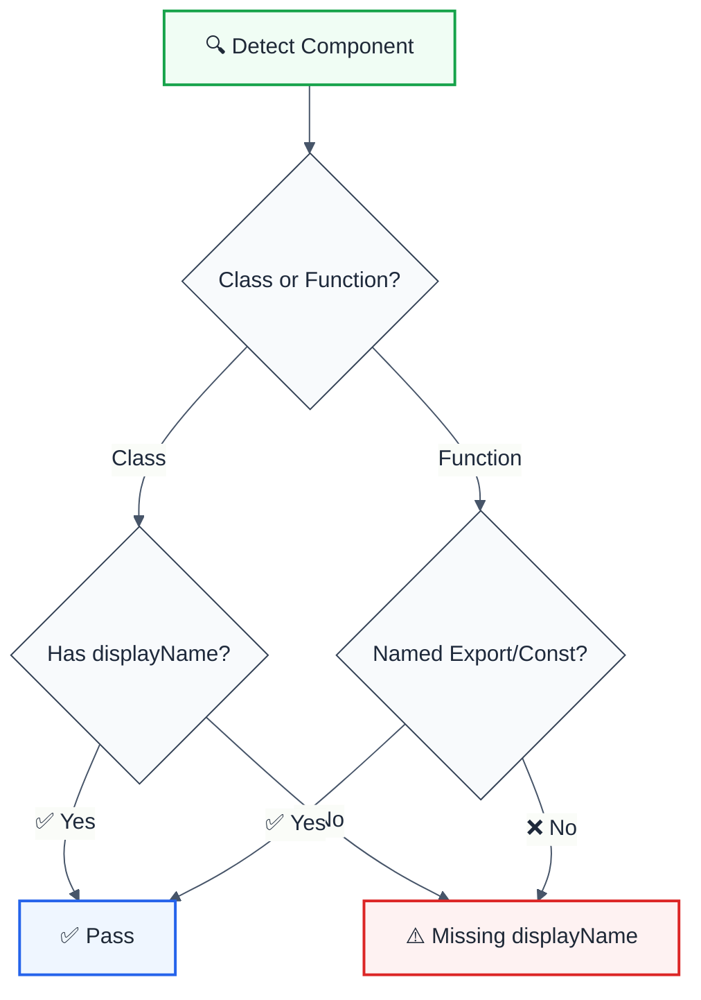

import { FalseNegativeCTA, WhenNotToUse, RuleBadges } from "@/components/RuleComponents";

<RuleBadges typeAware={false} typeAwareStatus="unaware" />

---
title: display-name
description: display-name rule
tags: ['quality', 'react']
category: quality
autofix: suggestions
---

display-name rule

> **Keywords:** React, displayName, component, debugging, DevTools, ESLint rule, naming, LLM-optimized

Enforce component display names for better debugging experience. This rule is part of [`eslint-plugin-react-features`](https://www.npmjs.com/package/eslint-plugin-react-features) and provides LLM-optimized error messages.

## Quick Summary

| Aspect         | Details                                                              |
| -------------- | -------------------------------------------------------------------- |
| **Severity**   | Warning (development)                                                |
| **Auto-Fix**   | ❌ No (requires manual naming)                                       |
| **Category**   | React                                                                |
| **ESLint MCP** | ✅ Optimized for ESLint MCP integration                              |
| **Best For**   | React projects, debugging with React DevTools                        |

## Rule Details




### Why This Matters

| Issue                     | Impact                          | Solution                  |
| ------------------------- | ------------------------------- | ------------------------- |
| 🔍 **React DevTools**     | Anonymous components show as `<Unknown>` | Add displayName   |
| 🐛 **Error Stack Traces** | Hard to identify component      | Named components          |
| 📊 **Performance Tools**  | Can't identify slow components  | Clear naming              |
| 🧪 **Testing**            | Selectors may fail              | Consistent names          |

## Configuration

This rule has no configuration options.

## Examples

### ❌ Incorrect

```tsx
// Anonymous arrow function
const MyComponent = () => {
  return <div>Hello</div>;
};

// Anonymous function expression
const AnotherComponent = function() {
  return <div>World</div>;
};

// Class without displayName
class UserCard extends React.Component {
  render() {
    return <div>{this.props.name}</div>;
  }
}

// HOC without displayName
const withAuth = (WrappedComponent) => {
  return (props) => <WrappedComponent {...props} />;  // ❌ No name
};
```

### ✅ Correct

```tsx
MyComponent
```

## Configuration Examples

### Basic Usage

```javascript
{
  rules: {
    'react-features/display-name': 'warn'
  }
}
```

### Strict Mode

```javascript
{
  rules: {
    'react-features/display-name': 'error'
  }
}
```

## Common Patterns

### Higher-Order Components

```tsx
function withLogger(WrappedComponent) {
  const WithLogger = (props) => {
    console.log('Rendering:', WrappedComponent.displayName);
    return <WrappedComponent {...props} />;
  };
  
  // Set displayName for debugging
  WithLogger.displayName = `withLogger(${
    WrappedComponent.displayName || 
    WrappedComponent.name || 
    'Component'
  })`;
  
  return WithLogger;
}
```

### React.forwardRef

```tsx
const TextInput = React.forwardRef<HTMLInputElement, InputProps>(
  (props, ref) => <input ref={ref} {...props} />
);
TextInput.displayName = 'TextInput';
```

### React.memo

```tsx
const ExpensiveList = React.memo(({ items }) => {
  return items.map(item => <Item key={item.id} {...item} />);
});
ExpensiveList.displayName = 'ExpensiveList';
```

### Context Components

```tsx
const ThemeContext = React.createContext(defaultTheme);

const ThemeProvider = ({ children, theme }) => {
  return (
    <ThemeContext.Provider value={theme}>
      {children}
    </ThemeContext.Provider>
  );
};
ThemeProvider.displayName = 'ThemeProvider';
```

## When Not To Use

| Scenario                    | Recommendation                              |
| --------------------------- | ------------------------------------------- |
| 🚀 **Production builds**    | displayName is stripped in prod anyway      |
| 🧪 **Test utilities**       | May not need debugging names                |
| 📦 **Tiny components**      | Named exports may be sufficient             |

## Comparison with Alternatives

| Feature              | display-name        | eslint-plugin-react | React DevTools     |
| -------------------- | ------------------- | ------------------- | ------------------ |
| **Class components** | ✅ Yes              | ✅ Yes              | ✅ Shows name      |
| **Function components** | ✅ Yes           | ✅ Yes              | ⚠️ May be Anonymous |
| **HOCs**             | ✅ Enforces naming  | ⚠️ Limited          | ❌ Shows wrapper   |
| **LLM-Optimized**    | ✅ Yes              | ❌ No               | ❌ No              |
| **ESLint MCP**       | ✅ Optimized        | ❌ No               | ❌ No              |

## Related Rules

- [`jsx-key`](./jsx-key.md) - Enforce keys in lists
- [`react-class-to-hooks`](./react-class-to-hooks.md) - Migrate to hooks

## Further Reading

- **[React displayName](https://react.dev/reference/react/Component#static-displayname)** - Official React docs
- **[React DevTools](https://react.dev/learn/react-developer-tools)** - Debugging tools
- **[eslint-plugin-react display-name](https://github.com/jsx-eslint/eslint-plugin-react/blob/master/docs/rules/display-name.md)** - React plugin docs
- **[ESLint MCP Setup](https://eslint.org/docs/latest/use/mcp)** - Enable AI assistant integration
<WhenNotToUse />

<FalseNegativeCTA />

## Known False Negatives

The following patterns are **not detected** due to static analysis limitations:

### Dynamic Variable References

**Why**: Static analysis cannot trace values stored in variables or passed through function parameters.

```typescript
// ❌ NOT DETECTED - Prop from variable
const propValue = computedValue;
<Component prop={propValue} /> // Computation not analyzed
```

**Mitigation**: Implement runtime validation and review code manually. Consider using TypeScript branded types for validated inputs.

### Imported Values

**Why**: When values come from imports, the rule cannot analyze their origin or construction.

```typescript
// ❌ NOT DETECTED - Value from import
import { getValue } from './helpers';
processValue(getValue()); // Cross-file not tracked
```

**Mitigation**: Ensure imported values follow the same constraints. Use TypeScript for type safety.